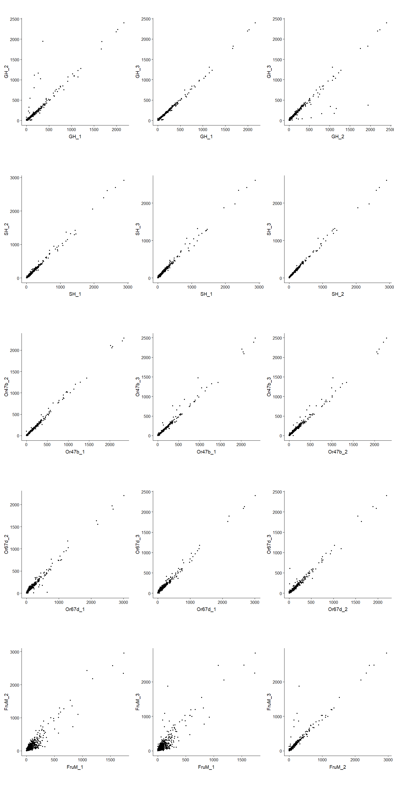

```{r setup, include=FALSE}
knitr::opts_chunk$set(echo = TRUE)
#knitr::opts_knit$set(root.dir = '/proj/cdjones_lab/csoeder/VolkanLab_BehaviorGenetics/')
#knitr::opts_knit$set(root.dir = '/Users/csoeder/Research/VolkanLab_BehaviorGenetics/')
knitr::opts_knit$set(root.dir=peaDubDee)

library("ggbio")
library("biomaRt")
#library("org.Dm.eg.db")
#devtools::install_github("haleyjeppson/ggmosaic")
#library("ggmosaic")

library("yaml")
library("readr")
library("tidyverse")
#library("ggnewscale")
#library("scales")
library("DESeq2")
library("apeglm")
library("magrittr")
library("gt")
library("GGally")
library("UpSetR")
library("VennDiagram")
library("Gviz")
library("pheatmap")
library("gridExtra")
# http://www.sthda.com/english/wiki/gviz-visualize-genomic-data
# https://www.bioconductor.org/packages/devel/bioc/vignettes/Gviz/inst/doc/Gviz.html
library("rtracklayer")

#library(devtools)
#install_github("jokergoo/ComplexHeatmap")
library("ComplexHeatmap")
library("circlize")
library("patchwork")
library("png")


```


```{r include=FALSE}

human_readable_croncher <- function(num_in) {
	dig <- 3
	num_out <- formatC(num_in, digits=dig, format='g') %>% as.numeric() %>% sitools::f2si()
	return(num_out)
}

bam_summary_loader <- function(filename, aligner="mapsplice", reference='dm6'){
	
	tmp.df <- read_delim(filename, "\t", escape_double = FALSE, col_names = FALSE, trim_ws = TRUE)
	names(tmp.df) <- c("sample","measure","value")
	
	tmp.df$sample <- as.factor(tmp.df$sample)
	tmp.df$measure <- as.factor(tmp.df$measure)
	tmp.df$aligner <- as.factor(aligner)
	tmp.df$reference <- as.factor(reference)
	
	return(tmp.df)
	
}

fig_cnt <- 0
tbl_cnt <- 0


marty <- useDataset("dmelanogaster_gene_ensembl",  useMart("ensembl",  host = "useast.ensembl.org") )
G_list <- getBM(attributes= c("flybase_gene_id", "external_gene_name"), mart= marty) 
```


```{r echo=FALSE, include=FALSE, message=FALSE}


#tbl_cnt <- tbl_cnt + 1
#thing.gt <- asdfasdfasdf
#thing.gt
#write(thing.gt %>%  as_raw_html(), paste("results/tables/tbl",tbl_cnt,"_thing.html", sep=""))


```

```{r echo=FALSE, include=FALSE, message=FALSE}


# fig_cnt <- fig_cnt + 1
# thing.gg <- asdfasdfasd
# thing.gg
# png(height =  500, width = 800, filename = paste("results/figures/fig",fig_cnt,"_ong.png", sep=""))
# thing.gg
# dev.off()
# 

```


# Introduction

words words


# Materials, Methods, Data, Software

```{r include=FALSE}

trammel <- read_yaml("config.yaml")

```
generic overview words

## Reference Genomes


```{r include=FALSE, echo = FALSE, message=FALSE}
refGenomes_summary_df <- read_delim("summaries/reference_genomes.summary", 
    "\t", escape_double = FALSE, col_names = FALSE, 
    trim_ws = TRUE)

names(refGenomes_summary_df) <- c("refGenome","measure","value")

```

The dm6.13 reference genome was used for read alignment:
```{r echo=FALSE, message=FALSE, warning=FALSE}

tbl_cnt <- tbl_cnt + 1

refGenomes_summary.gt <- refGenomes_summary_df  %>% mutate(measure=gsub("_"," ",measure)) %>% spread(refGenome, value)   %>% gt() %>% tab_header(title=paste("Table ",tbl_cnt, ". Size and Consolidation of Reference Genomes", sep = ""), subtitle="Drosophila Melanogaster") %>%   fmt_number(columns = vars(dm6main),suffixing = TRUE, decimals=0) %>% cols_label(measure = " ", dm6main = " ")
	
refGenomes_summary.gt

write(refGenomes_summary.gt %>%  as_raw_html(), paste("results/tables/tbl",tbl_cnt,"_refGenomeSummary.html", sep=""))

```


## Reference Annotations

The dm6 feference annotations were used to define gene locii for differential expression analysis:

```{r echo=FALSE, message=FALSE, warning=FALSE }

ref_ann.stats <- read_delim("summaries/reference_annotations.summary", "\t", escape_double = FALSE, col_names = FALSE, trim_ws = TRUE)
names(ref_ann.stats) <- c("annot", "measure", "type", "value")

tbl_cnt <- tbl_cnt + 1
ref_ann.stats.gt <- ref_ann.stats %>%  filter(type == 'total' | type == 'avg') %>% unite("measure", c("type", "measure"), sep = " ") %>% spread(measure, value) %>% gt() %>% tab_header(title=paste("Table ",tbl_cnt, ". Reference Annotations and their Sizes", sep = ""), subtitle= md("&nbsp;") ) %>% fmt_number(columns = c("avg size", "total count", "total size"), decimals = 1, drop_trailing_zeros = T, suffixing = T ) %>% tab_spanner(label = "size (bp)", columns = c("avg size", "total size")) %>% cols_label(`avg size` = "average", `total size` = "total")

ref_ann.stats.gt

write(ref_ann.stats.gt %>%  as_raw_html(), paste("results/tables/tbl",tbl_cnt,"_refAnnotationSummary.html", sep=""))

```

In addition to the genome as a whole, the gene Fruitless was given particular attention. 

```{r echo=FALSE, message=FALSE, warning=FALSE }
all.gtf <- rtracklayer::import.gff("/proj/cdjones_lab/Genomics_Data_Commons/annotations/drosophila_melanogaster/dmel-all-r6.13.gtf")
all.gtf.gr <- as(all.gtf,"GRanges")

fru.model.gtf <- all.gtf.gr[all.gtf.gr@elementMetadata$gene_symbol == "fru"]
fru.model.exons.gtf <- fru.model.gtf[fru.model.gtf$type == "exon"]
fru.model.exons.lookdown <- fru.model.exons.gtf$score %>% as.data.frame
names(fru.model.exons.lookdown) <- c("dummy")
fru.model.exons.lookdown$start <- fru.model.exons.gtf@ranges@start
fru.model.exons.lookdown$stop <- fru.model.exons.gtf@ranges@width + fru.model.exons.lookdown$start

fru.bed <- rtracklayer::import.bed("utils/annotations/fru_ex.bed")
fru.exon.lookup <- fru.bed$name %>% as.data.frame()
names(fru.exon.lookup) <- c("name")
fru.exon.lookup$start <- fru.bed@ranges@start -1
fru.exon.lookup$stop <- fru.bed@ranges@width + fru.bed@ranges@start

fru.model.exons.gtf$exon_name <- left_join(fru.model.exons.lookdown, fru.exon.lookup, by=c("start"="start", "stop"="stop"))$name


options(ucscChromosomeNames = FALSE)


#grtrack <- GeneRegionTrack(fru.model.exons.df %>% mutate(exon = case_when( (start > 18426909 & end <18433040) ~ "",TRUE~as.character(exon))), name = "Fruitless", exonAnnotation = "exon", transcriptAnnotation = "symbol", fontcolor.exon = "black")#genome = gen,chromosome = chr, name = "Gene Model", )

fru.model.exons.df <- fru.model.exons.gtf %>% as.data.frame() %>% select(c("seqnames", "start", "end", "width", "strand", "type", "transcript_id", "transcript_symbol", exon_name)) %>% mutate(chromosome = seqnames, feature = type, gene = "fru", transcript = transcript_id, symbol=transcript_symbol, exon = exon_name) %>% select(-c("type","transcript_symbol","transcript_id", "seqnames"))

fru.model.exons.df.tmp <- fru.model.exons.df %>% separate(col=exon, into=c("dummy","exon")) %>% select(-c("dummy"))%>% mutate(exon = case_when( (start > 18426909 & end <18440000) ~ " ",TRUE~as.character(exon))) 

fruModel.exonLabels.grt <- GeneRegionTrack(fru.model.exons.df.tmp , name = "Fruitless", exonAnnotation = "exon", transcriptAnnotation = "symbol", fontcolor.exon = "blue", fontface.exon = 'bold', fontsize.exon =7, )

fruModel.exonLabels.zoom.grt <- GeneRegionTrack(fru.model.exons.df %>% separate(col=exon, into=c("dummy","exon")) %>% select(-c("dummy")) %>% filter(symbol %in% c("fru-RA", "fru-RD", "fru-RI", "fru-RM") ), name = "Fruitless", exonAnnotation = "exon", transcriptAnnotation = "symbol", fontcolor.exon = "blue", fontface.exon = 'bold', fontsize.exon =7, )

fruAxis.trk <- GenomeAxisTrack()

#fru_model_label_exons.gr <- ggplot() + geom_alignment(fru.model.exons.gtf, aes(type=model, fill =exon_name, color=exon_name))

#fru_model_label_exons.zoom.gr <- fru_model_label_exons.gr + xlim(c(18425338,18436500))

##fru.tks <- tracks(fru_model_label_exons.gr,fru_model_label_exons.gr.zoom)

##ggplot(fru.model.exons.gtf) + geom_alignment(aes(type=model, fill = exon_name)) + geom_segment(y=20, yend=20, x=18425338+1000, xend = 18436500 - 1000, color="blue")

```


```{r echo=FALSE, message=FALSE, warning=FALSE}
fig_cnt <- fig_cnt + 1

fruModel.exonLabels.ht <- HighlightTrack(trackList=list(fruModel.exonLabels.grt), start=c(18426909), width=18440000-18426909, chromosome="3R")

plotTracks(list(fruModel.exonLabels.ht, fruAxis.trk ), main = paste("Figure ",fig_cnt, ". Fruitless gene model: exons and transcripts", sep = ""), cex.main=0.9)

#fru_model_label_exons.gg<-fru_model_label_exons.gr + labs(x = "3R coordinate", title=paste("Figure ",fig_cnt, ". Fru gene model", sep = "")) + theme_bw()
#fru_model_label_exons.gg

png(height =  500, width = 800, filename = paste("results/figures/fig",fig_cnt,"_fruGeneModel.png", sep=""))
plotTracks(list(fruModel.exonLabels.ht, fruAxis.trk ), main = paste("Figure ",fig_cnt, ". Fruitless gene model: exons and transcripts", sep = ""), cex.main=0.9)
dev.off()
```


```{r echo=FALSE, message=FALSE, warning=FALSE}
#fig_cnt <- fig_cnt + 1

#fru_model_label_exons.zoom.gg<-fru_model_label_exons.zoom.gr + labs(x = "3R coordinate", title=paste("Figure ",fig_cnt, ". Fru gene model (detail)", sep = "")) + theme_bw()


#fru_model_label_exons.zoom.gg

fruModel.exonLabels.zoom.ht <- HighlightTrack(trackList=list(fruModel.exonLabels.zoom.grt), start=c(18426909), width=18440000-18426909, chromosome="3R")

plotTracks(list(fruModel.exonLabels.zoom.ht, fruAxis.trk), from = 18426909, to = 18440000, main = paste("Figure ",fig_cnt, "a. Fruitless gene model: exons and transcripts (detail)" ), cex.main=0.9)


png(height =  500, width = 800, filename = paste("results/figures/fig",fig_cnt,"a_fruGeneModelZoom.png", sep=""))
plotTracks(list(fruModel.exonLabels.zoom.grt, fruAxis.trk), from = 18426909, to = 18440000, main = paste("Figure ",fig_cnt, "a. Fruitless gene model: exons and transcripts (detail)" ), cex.main=0.9)
#fru_model_label_exons.zoom.gg
dev.off()
```

In order to focus on exon usage in Fru, the GTF entry was selected and decomposed into individual records per exon:

```{r echo=FALSE, message=FALSE, warning=FALSE}


tbl_cnt <- tbl_cnt + 1

fruExons.gt<- fru.exon.lookup %>% gt() %>% cols_label(name=" ") %>% tab_header(title=paste("Table ",tbl_cnt, ". Fru exons by Name", sep = ""), subtitle= "(chromosome 3R)")

fruExons.gt

write(fruExons.gt %>%  as_raw_html(), paste("results/tables/tbl",tbl_cnt,"_fruExons.html", sep=""))
```

```
cat /proj/cdjones_lab/Genomics_Data_Commons/annotations/drosophila_melanogaster/dmel-all-r6.13.gtf | grep -i fru | grep exon | cut -f 1-5 | sort | uniq | awk  '{print$0"\t0\t-\t.\tgene_id "}'| sed -e 's/exon/gene/g' | sed -e 's/$/"/g'|awk -F'\t' 'NR>0{$0=$0"exon_"23-NR} 1' | sed -e 's/$/";/g' > fru.test.gtf.exon
cat /proj/cdjones_lab/Genomics_Data_Commons/annotations/drosophila_melanogaster/dmel-all-r6.13.gtf | grep -i fru | grep exon | cut -f 1-5 | sort | uniq | awk  '{print$0"\t0\t-\t.\tgene_id "}'|  sed -e 's/$/"/g'|awk -F'\t' 'NR>0{$0=$0"exon_"23-NR} 1' | sed -e 's/$/";/g' > fru.test.gtf.gene
cat fru.test.gtf.exon fru.test.gtf.gene | bedtools sort > utils/annotations/fru_ex.gtf


cat fru.test.gtf.exon | cut -f 1,4,5,7,9 | tr -d '"' | tr -d ";" | sed -e 's/gene_id //g' | awk '{print$1,$2,$3,$5,0,$4}' | tr " " "\t" > utils/annotations/fru_ex.bed.tmp

cat utils/annotations/fru_ex.bed.tmp | tr "_" "\t" | awk '{print$1,$2,$3,$4"_"$5,$6,$7}' | tr " " "\t" > utils/annotations/fru_ex.bed
```

This gave the "fru_exons" annotation, to use for by-exon read counting. A further annotation, "fru_junct", was constructed by removing all of each exon except for splice junctions, ie, the 1bp boundaries of each exon which isn't a transcription start or stop site:


```{r echo=FALSE, message=FALSE, warning=FALSE}

fruEdges.gtf <- rtracklayer::import.gff("utils/annotations/fru_exonEdges.gtf")
fruEdges.gtf.gr <- as(fruEdges.gtf,"GRanges")


fruEdges.df <- fruEdges.gtf %>% as.data.frame() %>% filter(type == "exon") %>% select(c("seqnames", "start", "end", "width", "strand", "type", "transcript_id", "gene_id")) %>% separate(col= transcript_id, into=c("dummy", "symbol")) %>% mutate(chromosome=seqnames,feature = type, gene=gene_id, transcript = gene_id, exon = "NA") %>% select(-c("type","gene_id", "dummy", "seqnames"))  %>% select(c("chromosome", "start", "end", "width", "strand", "feature", "gene", "exon", "transcript", "symbol"))


#fruEdges.df %<>% mutate(chromosome=seqnames, feature = "feature", gene = gene_symbol, exon = exon_name, transcript=transcript_id, symbol = transcript_symbol) %>% select(c("chromosome", "start", "end", "width", "strand", "feature", "gene", "exon", "transcript", "symbol"))


fruModel.squisht.grt <- GeneRegionTrack(fru.model.exons.df.tmp , name = "Fruitless Gene Model", collapseTranscripts = "meta" )
fruModel.squisht.ht <- HighlightTrack(trackList=list(fruModel.squisht.grt), start=c(18426909), width=18440000-18426909, chromosome="3R")

fruModel.squisht.grt <- GeneRegionTrack(fru.model.exons.df.tmp , name = "Gene", collapseTranscripts = "meta" )
fruModel.squisht.ht <- HighlightTrack(trackList=list(fruModel.squisht.grt), start=c(18426909), width=18440000-18426909, chromosome="3R")

fruEdges.grt <- GeneRegionTrack(fruEdges.df , name = "Exon Junctions", transcriptAnnotation = "symbol", fontcolor.transcript = "red", fontface.transcript = 'bold', fontsize.transcript =7, )

fruModel.squisht.zoom.grt <- GeneRegionTrack(fru.model.exons.df.tmp %>% filter(symbol %in% c("fru-RA", "fru-RD", "fru-RI", "fru-RM")) , name = "Fruitless" )
fruModel.squisht.zoom.ht <- HighlightTrack(trackList=list(fruModel.squisht.zoom.grt), start=c(18426909), width=18440000-18426909, chromosome="3R")

```


```{r echo=FALSE, message=FALSE, warning=FALSE}
fig_cnt <- fig_cnt + 1

plotTracks(list(fruModel.squisht.ht,fruEdges.grt,fruAxis.trk), main = paste("Figure ",fig_cnt, ". Fruitless gene model: junctions", sep = ""), cex.main=0.9)

png(height =  500, width = 800, filename = paste("results/figures/fig",fig_cnt,"_fruitlessJunctions.png", sep=""))

plotTracks(list(fruModel.squisht.ht,fruEdges.grt,fruAxis.trk), main = paste("Figure ",fig_cnt, ". Fruitless gene model: junctions", sep = ""), cex.main=0.9)

dev.off()
```

```{r echo=FALSE, message=FALSE, warning=FALSE}
#fig_cnt <- fig_cnt + 1
plotTracks(list(fruModel.squisht.zoom.ht,fruEdges.grt,fruAxis.trk), from = 18426909, to = 18440000, main = paste("Figure ",fig_cnt, "a. Fruitless gene model: junctions (detail)" ), cex.main=0.9)


png(height =  500, width = 800, filename = paste("results/figures/fig",fig_cnt,"_fruitlessJunctions_detail.png", sep=""))


plotTracks(list(fruModel.squisht.zoom.ht,fruEdges.grt,fruAxis.trk), from = 18426909, to = 18440000, main = paste("Figure ",fig_cnt, "a. Fruitless gene model: introns (detail)" ), cex.main=0.9)

dev.off()
```


```
cat utils/annotations/fru_ex.gtf  | grep -w gene > utils/annotations/fru_exonEdges.gtf
cat utils/annotations/fru_ex.gtf  | grep -w gene | cut -f 1,2 > utils/annotations/fru_exonEdges.gtf.front
paste <( cat utils/annotations/fru_ex.gtf  | grep -w gene | cut -f 6- ) <( cat utils/annotations/fru_ex.gtf  | grep -w gene | cut -f 9 | sed -e 's/gene_id/~transcript_id/g' )  | sed -e 's/\t~/ /g' > utils/annotations/fru_exonEdges.gtf.back

paste utils/annotations/fru_exonEdges.gtf.front <(cat utils/annotations/fru_ex.gtf  | grep -w gene | awk '{print "exon\t"$4"\t"$4}') utils/annotations/fru_exonEdges.gtf.back >>  utils/annotations/fru_exonEdges.gtf

paste utils/annotations/fru_exonEdges.gtf.front <(cat utils/annotations/fru_ex.gtf  | grep -w gene | awk '{print "exon\t"$5"\t"$5}') utils/annotations/fru_exonEdges.gtf.back  >>  utils/annotations/fru_exonEdges.gtf

cp utils/annotations/fru_exonEdges.gtf utils/annotations/fru_exonJunctions.gtf 

cat utils/annotations/fru_introns.gtf | grep -w "exon" | awk '{print"chr"$0}' | cut -f 1,4,5 | sort | uniq > introns.bed
cat utils/annotations/fru_exonEdges.gtf | grep -w "exon" | cut -f 1,4,5 | sort | uniq > edges.bed
bedtools intersect -v -a <( cat edges.bed | awk '{print"chr"$0}' ) -b introns.bed > TSS_startStop.bed

bedtools subtract -a utils/annotations/fru_exonEdges.gtf -b  <( cat TSS_startStop.bed | cut -f 2- -d r  ) > utils/annotations/fru_exonJunctions.gtf#.tmp 

#cat utils/annotations/fru_exonJunctions.gtf.tmp | grep -v transcript_id | sed -e 's/exon_/exon_\t/g' | sed -e 's/";/\t";/g' | awk '{print $1"\t"$2"\t"$3"\t"$4"\t"$5"\t"$6"\t"$7"\t"$8"\t"$9"\t"$10""$11""$12}'> utils/annotations/fru_exonJunctions.wrongStrand.gtf

#cat utils/annotations/fru_exonJunctions.gtf.tmp | grep transcript_id | sed -e 's/exon_/exon_\t/g' | sed -e 's/";/\t";/g' |awk '{print $1"\t"$2"\t"$3"\t"$4"\t"$5"\t"$6"\t"$7"\t"$8"\t"$9"\t"$10""$11""$12,$13,$14""$15""$16}' >> utils/annotations/fru_exonJunctions.wrongStrand.gtf

#cat utils/annotations/fru_exonJunctions.wrongStrand.gtf | sed -e 's/exon_/exon~/g' |sed -e 's/intron~20/intron_1/g' | sed -e 's/intron~19/intron_2/g' |  sed -e 's/intron~18/intron_3/g' | sed -e 's/intron~17/intron_4/g' | sed -e 's/intron~16/intron_5/g' |   sed -e 's/intron~15/intron_6/g' |  sed -e 's/intron~14/intron_7/g' | sed -e 's/intron~13/intron_8/g' |  sed -e 's/intron~12/intron_9/g' | sed -e 's/intron~11/intron_10/g' | sed -e 's/intron~10/intron_11/g' |  sed -e 's/intron~9/intron_12/g' |  sed -e 's/intron~8/intron_13/g' |  sed -e 's/intron~7/intron_14/g' |  sed -e 's/intron~6/intron_15/g' |  sed -e 's/intron~5/intron_16/g' |  sed -e 's/intron~4/intron_17/g' |  sed -e 's/intron~3/intron_18/g' |  sed -e 's/intron~2/intron_19/g' |  sed -e 's/intron~1/intron_20/g' > utils/annotations/fru_exonJunctions.gtf


```


Because a splice site represents two semi-independent exons but one intron, another annotation, "fru_intron", was constructed consisting of the introns in Fruitless. The same 1-bp subintervals were used as in "fru_junct", but in this case they were organized by the intron they bounded rather than by the exon:


```{r echo=FALSE, message=FALSE, warning=FALSE}


fruIntrons.gtf <- rtracklayer::import.gff("utils/annotations/fru_introns.gtf")
fruIntrons.gtf.gr <- as(fruIntrons.gtf,"GRanges")


fruIntrons.df <- fruIntrons.gtf %>% as.data.frame() %>% filter(type == "exon") %>% select(c("seqnames", "start", "end", "width", "strand", "type", "transcript_id", "gene_id")) %>% separate(col= transcript_id, into=c("dummy", "symbol")) %>% mutate(chromosome=seqnames,feature = type, gene=gene_id, transcript = gene_id, exon = "NA") %>% select(-c("type","gene_id", "dummy", "seqnames"))  %>% select(c("chromosome", "start", "end", "width", "strand", "feature", "gene", "exon", "transcript", "symbol"))


#fruModel.squisht.grt <- GeneRegionTrack(fru.model.exons.df.tmp , name = "Fruitless", collapseTranscripts = "meta" )
#fruModel.squisht.ht <- HighlightTrack(trackList=list(fruModel.squisht.grt), start=c(18426909), width=18433040-18426909, chromosome="3R")


fruIntrons.grt <- GeneRegionTrack(fruIntrons.df , name = "Intron Junctions", exonAnnotation = "exon", transcriptAnnotation = "transcript", fontcolor.transcript = "red", fontface.transcript = 'bold', fontsize.transcript =7 )


```


```{r echo=FALSE, message=FALSE, warning=FALSE}
fig_cnt <- fig_cnt + 1

plotTracks(list(fruModel.squisht.ht,fruIntrons.grt,fruAxis.trk), main = paste("Figure ",fig_cnt, ". Fruitless gene model: introns", sep = ""), cex.main=0.9)

#fru_model_label_exons.gg<-fru_model_label_exons.gr + labs(x = "3R coordinate", title=paste("Figure ",fig_cnt, ". Fru gene model", sep = "")) + theme_bw()
#fru_model_label_exons.gg

png(height =  500, width = 800, filename = paste("results/figures/fig",fig_cnt,"_fruitlessIntrons.png", sep=""))


plotTracks(list(fruModel.squisht.ht,fruIntrons.grt,fruAxis.trk), main = paste("Figure ",fig_cnt, ". Fruitless gene model: introns", sep = ""), cex.main=0.9)

dev.off()
```

```{r echo=FALSE, message=FALSE, warning=FALSE}
#fig_cnt <- fig_cnt + 1
plotTracks(list(fruModel.squisht.zoom.ht,fruIntrons.grt,fruAxis.trk), from = 18426909, to = 18440000, main = paste("Figure ",fig_cnt, "a. Fruitless gene model: introns (detail)" ), cex.main=0.9)


png(height =  500, width = 800, filename = paste("results/figures/fig",fig_cnt,"_fruitlessIntrons_detail.png", sep=""))


plotTracks(list(fruModel.squisht.zoom.ht,fruIntrons.grt,fruAxis.trk), from = 18426909, to = 18440000, main = paste("Figure ",fig_cnt, "a. Fruitless gene model: introns (detail)" ), cex.main=0.9)

dev.off()
```

```
rm -f coords.all
for transcript in $(cat /proj/cdjones_lab/Genomics_Data_Commons/annotations/drosophila_melanogaster/dmel-all-r6.13.gtf | grep -i fru | grep -w transcript_id | cut -f 6 -d '"' | sort | uniq); do 
	echo $transcript;

	cat /proj/cdjones_lab/Genomics_Data_Commons/annotations/drosophila_melanogaster/dmel-all-r6.13.gtf | grep -i fru | grep -w transcript_id | grep -w "$transcript" | grep -w exon | cut -f 4,5 > coords.tmp

	head -n 1 coords.tmp | cut -f 2 | awk '{print "0\t"$0}' >> coords.all
	tail -n 1 coords.tmp | cut -f 2 | awk '{print $0"\t0"}' >> coords.all

	paste   <(cut -f 2 coords.tmp |tail -n +2 ) <(cut -f 1 coords.tmp | head -n -1 ) >> coords.all

done

cat coords.all | sort | uniq | grep -v -w 0 |awk -F'\t' 'NR>0{$0=$0"\tintron_"NR} 1'> coords.unq


cat coords.unq  | awk '{print"3R\tFlybase\tgene\t"$1"\t"$2"\t.\t-\t.\tgene_id ~"$3"~;"}' | tr '~' '"' | awk '{print$1"\t"$2"\texon\t"$4"\t"$4"\t"$6"\t"$7"\t"$8"\t"$9" "$10" transcript_id "$10}' > coords.unq.3prime
cat coords.unq  | awk '{print"3R\tFlybase\tgene\t"$1"\t"$2"\t.\t-\t.\tgene_id ~"$3"~;"}' | tr '~' '"' | awk '{print$1"\t"$2"\texon\t"$5"\t"$5"\t"$6"\t"$7"\t"$8"\t"$9" "$10" transcript_id "$10}' > coords.unq.5prime

cat <(cat coords.unq | grep -v -w 0 | awk '{print"3R\tFlybase\tgene\t"$1"\t"$2"\t.\t-\t.\tgene_id ~"$3"~;"}' | tr '~' '"' ) coords.unq.3prime coords.unq.5prime | sort -k 4 > utils/annotations/fru_introns.gtf.tmp


cat utils/annotations/fru_introns.gtf.tmp | sed -e 's/intron_/intron~/g' |sed -e 's/intron~20/intron_1/g' | sed -e 's/intron~19/intron_2/g' |  sed -e 's/intron~18/intron_3/g' | sed -e 's/intron~17/intron_4/g' | sed -e 's/intron~16/intron_5/g' |   sed -e 's/intron~15/intron_6/g' |  sed -e 's/intron~14/intron_7/g' | sed -e 's/intron~13/intron_8/g' |  sed -e 's/intron~12/intron_9/g' | sed -e 's/intron~11/intron_10/g' | sed -e 's/intron~10/intron_11/g' |  sed -e 's/intron~9/intron_12/g' |  sed -e 's/intron~8/intron_13/g' |  sed -e 's/intron~7/intron_14/g' |  sed -e 's/intron~6/intron_15/g' |  sed -e 's/intron~5/intron_16/g' |  sed -e 's/intron~4/intron_17/g' |  sed -e 's/intron~3/intron_18/g' |  sed -e 's/intron~2/intron_19/g' |  sed -e 's/intron~1/intron_20/g' > utils/annotations/fru_introns.gtf


```
(pull these into an annotation-builder rule?)

fru_junct and fru_intron annotations were used with the *_SplicedOnly aligments (section ~~)


## Gene Lists
In addition to the full annotations, subsets containing prespecified genes of interest will also be used.

```{r echo=FALSE, warning=FALSE, message=FALSE }

geneLists.stats <- read_delim("summaries/geneLists.stats", "\t", escape_double = FALSE, col_names = FALSE, trim_ws = TRUE)

names(geneLists.stats) <- c("query", "annot", "measure", "type", "value")
geneLists.stats$query <- as.factor(geneLists.stats$query)
geneLists.stats$annot <- as.factor(geneLists.stats$annot)
geneLists.stats$measure <- as.factor(geneLists.stats$measure)
geneLists.stats$type <- as.factor(geneLists.stats$type)

geneList.tbl <-  geneLists.stats %>% filter(measure == "count") %>% unite(measure, type, measure, sep=" ") %>% select(c(query,measure,value)) 

geneList.tbl <- rbind(geneList.tbl, inner_join(geneLists.stats %>% filter(measure=="count" & type=="annotated"), ref_ann.stats %>% filter(measure=="count" & type=="total"), by=c("annot" = "annot"), suffix=c("", ".ann")) %>% mutate(measure = "percent of annotations", value=value/value.ann) %>% select(query, measure, value))

geneList.tbl <- rbind( geneList.tbl, geneLists.stats %>%  filter(measure == "size") %>% filter(type == "total" | type == "avg") %>% unite(measure, type, measure, sep=" ") %>% select(query, measure, value)) 

geneList.tbl <- rbind(geneList.tbl, geneLists.stats %>% filter(measure=="size" & type == "total") %>%  mutate(value = value/(refGenomes_summary_df %>% filter(measure=="number_bases") %>% select(value) %>% as.numeric() ) ) %>%  unite(measure, type, measure, sep=" ") %>% select(-c(annot)) %>% mutate(measure = "percent genome size") )


geneList.tbl <- rbind( geneList.tbl, inner_join(geneLists.stats %>% filter(measure=="size" & type == "total"), ref_ann.stats %>% filter(measure=="size" & type == "total"), by = c("annot" = "annot")) %>% mutate(value=value.x/value.y, measure = "percent annotation size") %>% select(query, measure, value) ) %>% mutate(measure=factor(measure, levels = c("total count","annotated count","percent of annotations","total size","avg size","percent genome size","percent annotation size")))


```

Here are those subsets and their sizes:

```{r echo=FALSE, message=FALSE, warning=FALSE}

tbl_cnt <- tbl_cnt + 1

geneList.gt<- geneList.tbl %>% spread(query, value) %>% gt() %>% fmt_number(columns=seq(2,8), rows=str_detect(measure, "size"), decimals=1, suffixing=T) %>% fmt_number(columns=seq(2,8), rows=str_detect(measure, "count"), decimals=0, suffixing=T)  %>% fmt_percent(columns=seq(2,8), rows=str_detect(measure, "percent"), decimals=1) %>% tab_header(title=paste("Table ",tbl_cnt, ". Predefined Subsets of Gene Annotation", sep = ""), subtitle= md("&nbsp;"))

geneList.gt

write(geneList.gt %>%  as_raw_html(), paste("results/tables/tbl",tbl_cnt,"_geneListSummary.html", sep=""))
```


### Ionotropic

A list of ionotropic receptors supplied by Corbin via Flybase & George et al 2019  (email 28 May 2019). This contained 335 entries, some with mutiple genes, some not unique. Once merged & uniqued : 246
Annotation symbols (CGxxxxx) converted to FlyBase gene games (FBgnxxxx) using flybase ID converter (http://flybase.org/convert/id) 

239 converted cleanly; 5 had duplicate conversions and were corrected by hand:
```
CG11430 is FBgn0041585, not FBgn0050323
CG43368 is FBgn0263111, not FBgn0041188
CG8885 is FBgn0262467, not FBgn0081377
CG9090 is FBgn0034497, not FBgn0082745
CG9126 is FBgn0045073, not FBgn0053180
```

Two were corrected to be consistent with the dm6_genes annotation:
```
CG9907 (para), is listed as FBgn0264255 not FBgn0285944
CG42345 (straw) is listed as FBgn0259247 (laccase2)
```

### Derived from GO terms

```
Sub Pull out by particular GO terms?
o Nervous system development - http://flybase.org/cgi-bin/cvreport.pl?rel=is_a&id=GO:0007399 
o Mating - http://flybase.org/cgi-bin/cvreport.pl?rel=is_a&id=GO:0007618
o Histone modification - http://flybase.org/cgi-bin/cvreport.pl?rel=is_a&id=GO:0016570 
o Dna-binding transcription factor - http://flybase.org/cgi-bin/cvreport.pl?id=GO%3A0003700 
o Synaptic signaling - http://flybase.org/cgi-bin/cvreport.pl?rel=is_a&id=GO:0099536 
o Synapse organization - http://flybase.org/cgi-bin/cvreport.pl?id=GO%3A0050808
```
(Bryson, email 24 July 2019)


```
o Ion Channel Activity - http://flybase.org/cgi-bin/cvreport.pl?rel=is_a&id=GO:0005216

```
(Bryson, email 12 May 2020)


melanogaster-specific genes with these GO terms were retrieved using the FlyBase QueryBuilder. 


Nervous System Development:
```
nrd, FBgn0002967, no annotated gene model
l(2)23Ab, FBgn0014978, same
aloof, FBgn0020609, same
Imp, FBgn0285926, is FBgn0262735
```

Mating:
```
Only three, but all good
```

synapse signalling
```
1 gene
```

Histone modification, DNA trans factor act, synapse org
```
MT
```


Ion Channel Activity
```
251, all good
```


### Bryson's Lists

Interest:
(email, 29 Oct 2019)
```
Neverland: annotated as FBgn0259697, not FBgn0287185 
```
Priority:
(email, 5 Nov 2019; 7 Nov 2019)

## Sequenced Reads

```{r echo=FALSE, message=FALSE, warning=FALSE  }
data_sets.df <- plyr::ldply(trammel$data_sets, data.frame)
data_sets.df$name <- as.factor(data_sets.df$name)
data_sets.df$day<- as.factor(data_sets.df$day)
#data_sets.df$experimental <- gsub("_", "-", data_sets.df$experimental)
data_sets.df$subgroups<- as.factor(data_sets.df$subgroups)
data_sets.df$rep<- as.factor(data_sets.df$rep)
data_sets.df$housing<- as.factor(data_sets.df$housing)
data_sets.df$genotype<- as.factor(data_sets.df$genotype)
data_sets.df$tissue<- as.factor(data_sets.df$tissue)

#data_sets.df.sparse <- data_sets.df %>% filter(subgroups=='all') %>% select(-c(subgroups,path,readsfile1,readsfile2,paired, SRA)) %>% distinct() 

data_sets.df.sparse <- data_sets.df %>% group_by(name) %>%  mutate(genotype = paste0(as.character(genotype), collapse = "," )) %>% filter(subgroups=='all')  %>% separate_rows(genotype)  %>% select(-c(subgroups,path,readsfile1,readsfile2,paired, SRA)) %>% distinct() 

data_sets.df.sparse.collapse <- data_sets.df.sparse %>% group_by(name) %>%  mutate(genotype = paste0(as.character(genotype), collapse = "," ))  %>% distinct()
data_sets.df.sparse.collapse$genotype <- as.factor(data_sets.df.sparse.collapse$genotype)

experimental_replicates.tbl  <- data_sets.df.sparse.collapse %>% group_by(genotype, housing, day, tissue) %>% summarise(replicate_count=n())

```

The sequenced reads covered three replicates each of $`r ncol(experimental_replicates.tbl) `$ experimental conditions. The conditions included varying genotype, housing, and age (all RNA was collected from antenna tissue).

```{r echo=FALSE, message=FALSE, warning=FALSE}
tbl_cnt <- tbl_cnt + 1

experimental_replicates.gt<- experimental_replicates.tbl %>% ungroup() %>% filter(replicate_count >0) %>% gt() %>% cols_label(replicate_count = "# replicates", day = "age (days)") %>% tab_header(title=paste("Table ",tbl_cnt, ". Experimental Conditions and Replicates", sep = ""), subtitle= md("&nbsp"))

experimental_replicates.gt


write(experimental_replicates.gt %>%  as_raw_html(), paste("results/tables/tbl",tbl_cnt,"_experimentalReplicates.html", sep=""))

```

These samples will allow direct comparison between wild-type flies reared under group and isolated conditions, as well as comparisons between group-raised wild-type flies and two kinds of mutants (67d and 47b1) at day 7:

```{r echo=FALSE, message=FALSE, warning=FALSE}


experimental_treatments.housingMutant.gt<-inner_join(data_sets.df %>% filter(subgroups == "hausWtVsMut") %>% select(name), data_sets.df.sparse.collapse, by=c("name"="name")) %>% group_by(genotype, housing, day, tissue) %>% summarise(replicate_count=n()) %>% ungroup()  %>% spread(key=housing, value = replicate_count, fill = 0) %>% filter(group+isolated>0) %>%  gt() %>% cols_move_to_start(c("day", "tissue"))  %>%  tab_spanner(columns = c("group", "isolated"), label = "variable") %>%  tab_spanner(columns = c("day", "tissue"), label = md(" ")) %>% tab_header(title=paste("Table ",tbl_cnt, "a. Genotype & Housing Comparison", sep = ""), subtitle= md("(replicate count)"))


inner_join(data_sets.df %>% filter(subgroups == "hausWtVsMut") %>% select(name), data_sets.df.sparse.collapse, by=c("name"="name")) %>% group_by(genotype, housing, day, tissue) %>% summarise(replicate_count=n()) %>% ungroup()  %>% spread(key=housing, value = replicate_count, fill = 0) %>% filter(group+isolated>0) %>%  gt() %>% cols_move_to_start(c("day", "tissue"))  %>%  tab_spanner(columns = c("group", "isolated"), label = "variable") %>%  tab_spanner(columns = c("day", "tissue"), label = md(" ")) %>% tab_header(title=paste("Table ",tbl_cnt, "a. Genotype & Housing Comparison", sep = ""), subtitle= md("(replicate count)"))


experimental_treatments.housingMutant.gt


write(experimental_treatments.housingMutant.gt %>%  as_raw_html(), paste("results/tables/supp/tbl",tbl_cnt,"a_experimentalReplicates.html", sep=""))

```

These samples also allow for direct comparison between mutant genotypes (47b1, 88a, and 47b2/88a ) at day 5, and for a comparison between the same genotype (47b1 mutant) at two developmental stages:

```{r echo=FALSE, message=FALSE, warning=FALSE }


experimental_treatments.genoTime.gt<- inner_join(data_sets.df %>% filter(subgroups %in% c("47b_on_88a","2_days_difference","hausWtVsMut")) %>% filter(genotype != "wt") %>% select(name), data_sets.df.sparse.collapse, by=c("name"="name")) %>% unique() %>%  group_by( housing, tissue,day, genotype) %>% summarise(replicate_count=n()) %>% ungroup()  %>% spread(key=genotype, value = replicate_count, fill = 0)  %>% filter(`47b1`+`47b2,88a`+`88a`+`67d`+FruLexaFru440 > 0 ) %>%  gt() %>%  tab_spanner(columns = c("47b1", "47b2,88a", "88a", "FruLexaFru440", "67d"), label = "mutant genotypes") %>%  tab_spanner(columns = c("housing", "tissue"), label = " ") %>% tab_header(title=paste("Table ",tbl_cnt, "b. Genotype & Time Comparison", sep = ""), subtitle= md("(replicate count)"))

experimental_treatments.genoTime.gt

write(experimental_treatments.genoTime.gt %>%  as_raw_html(), paste("results/tables/supp/tbl",tbl_cnt,"b_experimentalReplicates.html", sep=""))

```

Moreover, samples taken at the same timepoint in different genotypes allow the effect of one mutation (88a) to be studied in two different genomic backgrounds (with and without the 47b2 mutation).

In addition to the novel reads, RNA-Seq from drosophila melanogaster antennae were downloaded from NCBI (PRJNA388757; @Shiao2015), one annotated as male and the other as female. These will be compared to the unpublished samples to try to confirm the sex of the flies they came from. This analysis was computationally problematic and ultimately inconclusive, and has been deactivated in this version.

Reads from CantonS flies, with and without mutations in the amos genes were downloaded from NCBI (PRJNA532415 ; @Mohapatra2019 ). Unlike our samples, which are from day 5 or 7, these are described as "3-5 days old" in the paper. "each sample consisted of 300-400 antennae from approximately equal numbers of males and females". By contrast, our samples, though refered to as "wild type" or "wt", are in fact white-eyed mutatnts. Another difference is that the reads on NCBI are those which have already been mapped to the reference genome (thus some of the filtering pipeline is redundant).

```{r echo=FALSE, message=FALSE, warning=FALSE }


#data_sets.df.sparse.collapse %>% filter(!is.na(cw) & !is.na(normie))


experimental_treatments.cantonAmos.gt <- inner_join(data_sets.df %>% filter(subgroups == "cantonAmosWt") %>% select(name), data_sets.df.sparse.collapse, by=c("name"="name")) %>% group_by(normie, cw) %>% summarise(replicate_count=n())%>% ungroup() %>% spread(key=cw, value=replicate_count, fill=0) %>% mutate(normie = case_when(normie=="regular"~"garden variety", normie=="mutant"~"amos mutant",T~"")) %>%  gt() %>% cols_label(w = "white eyes", C = "CantonS") %>% tab_header(title=paste("Table ",tbl_cnt, "c. CantonS +/- amos mutation contrast", sep = ""), subtitle= md("&nbsp"))

experimental_treatments.cantonAmos.gt

write(experimental_treatments.cantonAmos.gt %>%  as_raw_html(), paste("results/tables/supp/tbl",tbl_cnt,"c_experimentalReplicates_cantonAmos.html", sep=""))

```


```{r echo=FALSE, message=FALSE, warning=FALSE }


#data_sets.df.sparse.collapse %>% filter(!is.na(cw) & !is.na(normie))


experimental_treatments.rotund.gt <- inner_join(data_sets.df %>% filter(subgroups == "rotund") %>% select(name), data_sets.df.sparse.collapse, by=c("name"="name")) %>% group_by(genotype, day) %>% summarise(replicate_count=n()) %>% ungroup() %>% spread(key=genotype, value=replicate_count, fill=0)%>%  gt() %>% cols_move(columns = c("rn"), after = "wt,rn") %>%  tab_spanner(columns = c("wt", "wt,rn","rn"), label = "genotype") %>% cols_label(day="age") %>%  tab_header(title=paste("Table ",tbl_cnt, "d. wildtype +/- rotund time series", sep = ""), subtitle= md("&nbsp")) 

experimental_treatments.rotund.gt

write(experimental_treatments.rotund.gt %>%  as_raw_html(), paste("results/tables/supp/tbl",tbl_cnt,"d_experimentalReplicates_rotund.html", sep=""))

```


### Pre-Processing

These reads were preprocessed with FASTP [@Chen2018] for quality control and analytics. 


```{r echo=FALSE, warning=FALSE, message=FALSE}
fastp_summary <- read_delim("summaries/sequenced_reads.dat", "\t", escape_double = FALSE, col_names = FALSE, trim_ws = TRUE)
names(fastp_summary ) <- c("name","type","measure","value")
fastp_summary$name <- as.factor(fastp_summary$name)
fastp_summary$type <- as.factor(fastp_summary$type)
fastp_summary$measure <- as.factor(fastp_summary$measure)
```


```{r echo=FALSE, include=FALSE, warning=FALSE}
filtration_stats <- inner_join(fastp_summary %>%  filter(type=="prefiltered" | type == 'postfiltered'), data_sets.df.sparse.collapse, by=c("name"="name"))
filtration_stats$type <- factor(filtration_stats$type, levels=c("prefiltered", "postfiltered"))
```


Starting FASTQ files contained a total of  $`r sum( filtration_stats %>% filter(type =='prefiltered') %>%  filter(measure=='total_reads') %>% select(value) ) %>% human_readable_croncher() `$ reads; after QC, this dropped to $`r sum( filtration_stats %>% filter(type =='postfiltered') %>%  filter(measure=='total_reads') %>% select(value) ) %>% human_readable_croncher() `$. 


```{r echo=FALSE, warning=FALSE, message=FALSE }
pre_post_counts <- filtration_stats %>% filter(measure=='total_reads') %>%  group_by(type)  %>%  summarise(minimum = min(value), average=mean(value) , maximum = max(value)) 

retention_percent <- filtration_stats %>% filter(measure=='total_reads') %>% select(c(name,type,value)) %>%  spread(type,value) %>% mutate(retention=100*postfiltered/prefiltered) %>%  summarise(type='percent retention', minimum = min(retention), average=mean(retention) , maximum = max(retention))
```

```{r echo=FALSE, warning=FALSE, message=FALSE}

tbl_cnt <- tbl_cnt + 1

read_retention_rate.gt <- rbind(pre_post_counts, retention_percent)  %>% gt() %>% tab_header(title=paste("Table ",tbl_cnt, ". Read Retention Rate during Preprocessing", sep = ""), subtitle= md("&nbsp;")) %>%  fmt_number(columns = vars(minimum, average,maximum),suffixing = TRUE, decimals=0) %>% cols_label(type=" ")

read_retention_rate.gt

write(read_retention_rate.gt %>%  as_raw_html(), paste("results/tables/tbl",tbl_cnt,"_readRetentionRate.html", sep=""))

```

```{r echo=FALSE, message=FALSE, warning=FALSE}
fig_cnt <- fig_cnt + 1

readQual.gg <- ggplot(filtration_stats %>% filter(measure == "q30_rate")) + geom_line(aes(group=name, x=type,y=100*value)) +  geom_point(aes(x=type, y = 100*value, color=genotype, shape=housing, group=rep)) + labs(title = paste("Figure ",fig_cnt, ". Percent of Reads with a mean QUAL > 30", sep = ""), y="Percent QUAL > 30", x="") + theme_bw() #+ geom_text(data= . %>% filter(type=="postfiltered") %>% filter(value<0.97), aes(type,100*value,label=name))

readQual.gg
png(height =  500, width = 800, filename = paste("results/figures/fig",fig_cnt,"_readQualityThruProcessing.png", sep=""))
readQual.gg
dev.off()


```


Duplicate reads were also detected

```{r echo=FALSE, message=FALSE, warning=FALSE}
dupe_stats <- inner_join(fastp_summary %>% filter(type=='duplication' & measure =='rate') %>%  mutate(percent=value*100) %>% select(c(name,percent)), data_sets.df.sparse.collapse, by=c("name"="name"))
```

```{r echo=FALSE, message=FALSE, warning=FALSE}
tbl_cnt <- tbl_cnt + 1

duplicationStats.gt <- dupe_stats %>%  summarise(minimum = min(percent), average=mean(percent), median=median(percent) , maximum = max(percent)) %>% gt() %>% tab_header(title=paste("Table ",tbl_cnt, ". Percentage Duplication", sep = ""), subtitle="FASTP estimate") %>% fmt_number(columns=vars(minimum,median,average,maximum), decimals=1, ) #kable(caption="Percentage Duplication",digits=1)

duplicationStats.gt

write(duplicationStats.gt %>%  as_raw_html(), paste("results/tables/tbl",tbl_cnt,"_duplicationStats.html", sep=""))

```

```{r echo=FALSE, message=FALSE, warning=FALSE}
fig_cnt <- fig_cnt + 1

dupeStats.gg <- ggplot(dupe_stats) + geom_histogram(aes(x=percent, fill=genotype), bins=15) + labs(title=paste("Figure ",fig_cnt, ". Duplication Histogram (FASTP estimate)", sep = ""), x="Read Duplication Rate (percent)", y="Number Samples") + theme_bw()

dupeStats.gg
png(height =  500, width = 800, filename = paste("results/figures/fig",fig_cnt,"_readDuplicationRate.png", sep=""))
dupeStats.gg
dev.off()


```


## Mapped Reads

Reads were mapped to the reference genome using MapSplice2 [@Wang2010]. Because MapSplice is written in python2, the code was downloaded and automatically refactored using the 2to3 python utility so that it would run in the python3 snakemake environment:
https://docs.python.org/2/library/2to3.html

### Raw Mapsplice


```{r echo=FALSE, message=FALSE, warning=FALSE}

vs_dm6.mapspliceRaw <- read_delim("summaries/alignments.vs_dm6main.mapspliceRaw.summary", "\t", escape_double = FALSE, col_names = FALSE, trim_ws = TRUE)
names(vs_dm6.mapspliceRaw)<- c("ref_genome","aligner","sample","measure","value")

vs_dm6.mapspliceRaw <- vs_dm6.mapspliceRaw %>% mutate(ref_genome = as.factor(ref_genome), aligner = as.factor(aligner), sample = as.factor(sample), ref_genome = as.factor(ref_genome))

all_alignments <- rbind(vs_dm6.mapspliceRaw)#, vs_dm6.bwaUniq)

vs_dm6.mapspliceRaw.meta <- inner_join(vs_dm6.mapspliceRaw, data_sets.df.sparse.collapse, by = c("sample"="name")) 


vs_dm6.mapspliceRaw.meta <- rbind(vs_dm6.mapspliceRaw.meta,filtration_stats %>% filter(type == "postfiltered" & measure== "total_reads" ) %>% mutate(ref_genome="dm6main", aligner = "unmapped", sample=name) %>% select(c("ref_genome","aligner","sample","measure","value","rep","day" ,"genotype","housing","tissue","cw","normie" )))

#all_alignments.meta <- inner_join(all_alignments, data_sets.df.sparse.collapse, by = c("sample"="name"))

vs_dm6.mapspliceRaw.meta.stats <- vs_dm6.mapspliceRaw.meta %>% filter(measure %in% c("total_reads","total_mapped_count","properly_paired_count", "duplicate_reads")) %>% select(-c("ref_genome", "tissue", "aligner")) %>% spread(key="measure", value="value") %>% mutate(total_mapped_count = 2*total_mapped_count) %>% mutate(percent_mapped=total_mapped_count/total_reads, percent_proper = properly_paired_count/total_reads, percent_duplicate = duplicate_reads/total_mapped_count)

```

Of the  $`r sum( vs_dm6.mapspliceRaw.meta.stats %>% select(total_reads) ) %>% human_readable_croncher() `$ reads, MapSplice was able to align  $`r (sum( vs_dm6.mapspliceRaw.meta.stats %>% select(total_mapped_count) )) %>% human_readable_croncher() `$ of them, for an overall mapping rate of  $`r 100*sum( vs_dm6.mapspliceRaw.meta.stats %>% select(total_mapped_count) )/ sum( vs_dm6.mapspliceRaw.meta.stats %>% select(total_reads) ) `$ %.

Individual mapping rates were generally more than 98%.


```{r echo=FALSE, message=FALSE, warning=FALSE}

tbl_cnt <- tbl_cnt + 1

percentMapping.raw.gt <- vs_dm6.mapspliceRaw.meta.stats  %>% select(percent_mapped) %>% mutate(mack = max(.$percent_mapped),min = min(.$percent_mapped), avg = mean(.$percent_mapped), med = median(.$percent_mapped)) %>% select(-c(percent_mapped)) %>% unique() %>% gt() %>% tab_header(title=paste("Table ",tbl_cnt, ". Percent of Reads Mapping", sep = ""), subtitle="raw mapsplice output") %>% fmt_percent(columns=vars(mack,min,avg,med), decimals=1, ) %>% cols_label(min="minimum", mack="maximum", avg="mean", med="median") %>% cols_label(min="minimum", mack="maximum", avg="mean", med="median") %>% cols_move(columns = c("min"), after="med")

percentMapping.raw.gt

write(percentMapping.raw.gt %>%  as_raw_html(), paste("results/tables/tbl",tbl_cnt,"_percentMappingRaw.html", sep=""))

```

```{r echo=FALSE, message=FALSE, warning=FALSE}

tbl_cnt <- tbl_cnt + 1

percentMappingIndv.raw.gt <- vs_dm6.mapspliceRaw.meta.stats %>% select(-c("duplicate_reads", "properly_paired_count", "percent_duplicate", "percent_proper", "sample"))  %>% group_by(housing, genotype) %>% gt()  %>% tab_header(title=paste("Table ",tbl_cnt, ". Individual Mapping Rates", sep = ""), subtitle="raw mapsplice output") %>% fmt_percent(columns=vars(percent_mapped), decimals=1, ) %>% fmt_number(columns = c("total_mapped_count", "total_reads"), decimals = 1, suffixing = T) %>% cols_label(total_mapped_count="reads mapped", total_reads="total reads", percent_mapped = "percent mapped")  %>% cols_move(columns = c("total_mapped_count"), after="total_reads")

percentMappingIndv.raw.gt

write(percentMappingIndv.raw.gt %>%  as_raw_html(), paste("results/tables/tbl",tbl_cnt,"_percentMappingRawIndv.html", sep=""))

```


```{r echo=FALSE, message=FALSE, warning=FALSE}

tbl_cnt <- tbl_cnt + 1

percentDupe.raw.gt <- vs_dm6.mapspliceRaw.meta.stats  %>% select(percent_duplicate) %>% mutate(mack = max(.$percent_duplicate),min = min(.$percent_duplicate), avg = mean(.$percent_duplicate), med = median(.$percent_duplicate)) %>% select(-c(percent_duplicate)) %>% unique() %>% gt() %>% tab_header(title=paste("Table ",tbl_cnt, ". Percent of Duplicate Reads", sep = ""), subtitle="raw mapsplice output") %>% fmt_percent(columns=vars(mack,min,avg,med), decimals=1, ) %>% cols_label(min="minimum", mack="maximum", avg="mean", med="median") %>% cols_label(min="minimum", mack="maximum", avg="mean", med="median") %>% cols_move(columns = c("min"), after="med")

percentDupe.raw.gt

write(percentDupe.raw.gt %>%  as_raw_html(), paste("results/tables/tbl",tbl_cnt,"_percentDuplicateRawMpSplc.html", sep=""))

```

```{r echo=FALSE, message=FALSE, warning=FALSE}
fig_cnt <- fig_cnt + 1

dupeStats.gg <- ggplot(vs_dm6.mapspliceRaw.meta.stats %>% mutate(percent = 100*percent_duplicate)) + geom_histogram(aes(x=percent, fill=genotype), bins=15) + labs(title=paste("Figure ",fig_cnt, ". Duplication Histogram (Raw Mapsplice Alignment)", sep = ""), x="Read Duplication Rate (percent)", y="Number Samples") + theme_bw()

dupeStats.gg
png(height =  500, width = 800, filename = paste("results/figures/fig",fig_cnt,"_readDuplicationRate.png", sep=""))
dupeStats.gg
dev.off()


```

Although Samtools marks duplicates at a higher rate than FASTP, the estimates are correlated; in particular, both agree that FruLexa/Fru440 day 7 replicate 1 is a highly duplicated outlier. The NCBI reads are anomalous.

```{r echo=FALSE, message=FALSE, warning=FALSE}

fig_cnt <- fig_cnt + 1


dupeStatsCompare.gg <- ggplot(inner_join(dupe_stats %>% mutate(day=as.factor(case_when(is.na(day)~"N/A", TRUE ~ as.character(day)))), vs_dm6.mapspliceRaw.meta.stats %>%  select(c("sample", "percent_duplicate")), by=c("name"="sample"))) + geom_point(aes(x=percent, y=100*percent_duplicate, color=genotype, shape = day)) + labs(title=paste("Figure ",fig_cnt, ". Comparison of Duplication Rate Estimates", sep = ""), x="FASTP estimate (percent)", y="MarkDup estimate (percent)") + theme_bw()

dupeStatsCompare.gg
png(height =  500, width = 800, filename = paste("results/figures/fig",fig_cnt,"_DupeRateExtCompare.png", sep=""))
dupeStatsCompare.gg

dev.off()

```

Genome-wide depth of coverage is not very meaningful here, in the case of RNA-Seq. Breadth of coverage (the fraction of the genome which is covered by at least one read) is, but the ideal case is not 100% coverage like in a DNA-Seq; rather, we'd expect breadth to approximate the fraction of the genome which is under active transcription. Another complication is whether the reads which fall on splice junctions are treated as covering the intronic region or not (this corresponds to the distinction between the percent of the genome which is a transcribed locus vs the percent which is a transcribed exon).

```{r echo=FALSE, message=FALSE, warning=FALSE}

fig_cnt <- fig_cnt + 1

breadthStats.raw.gg <- ggplot( vs_dm6.mapspliceRaw.meta %>% mutate(day=as.factor(case_when(is.na(day)~"N/A", TRUE ~ as.character(day)))) %>% filter(measure %in% c("total_reads", "total_mapped_count", "spanned_breadth", "split_breadth") & aligner == "mapspliceRaw") %>%  spread(key = measure, value = value) %>%  gather(spanned_breadth, split_breadth, key = "type", value = "breadth") %>% mutate(type=case_when(type == "spanned_breadth" ~ "locus", type =="split_breadth" ~"exon")) %>% mutate(type = as.factor(type)) %>% mutate(type = relevel(type, ref="locus")) )  + geom_point(aes(x=total_mapped_count, y=100*breadth, color=genotype, shape = day))  + facet_grid(type~., scales='free_y') + labs(title=paste("Figure ",fig_cnt, ". Breadth of Coverage of Raw Mapsplice Alignment\nCompared to Read Count", sep = ""), x="Number Reads Sequenced", y="Percent of Genome Covered") + theme_bw()

breadthStats.raw.gg
png(height =  500, width = 800, filename = paste("results/figures/fig",fig_cnt,"_breadthStatsRaw.png", sep=""))
breadthStats.raw.gg

dev.off()

```

There appears to be a slight dependence of breadth upon sequencing depth (ie, the number of reads sequenced), meaning that sequencing depth of these samples is not so great that the breadth covered is saturated. The breadth of the CantonS flies is unusually low for their depth of mapping. 

```{r echo=FALSE, message=FALSE, warning=FALSE}

sexChrBrd <- as.data.frame(c())
for (samp in data_sets.df.sparse.collapse$name){
	
	df.tmp <- read_delim(paste("mapped_reads/mapspliceRaw/",samp, "/", samp, ".vs_dm6main.mapspliceRaw.sort.bam.span.genomcov", sep=""), "\t", escape_double = FALSE, col_names = FALSE, trim_ws = TRUE)
	df.tmp$sample <- samp

	sexChrBrd <- rbind(sexChrBrd, df.tmp)
	
}

names(sexChrBrd) <- c("chrom", "cov", "val", "tot", "frac", "sample")
sexChrBrd.aug <- inner_join(sexChrBrd %>%  filter(chrom %in% c("chrX", "chrY") ) %>%  filter(cov==1) %>% select(c("chrom","frac","sample")), vs_dm6.mapspliceRaw.meta %>% filter(measure %in% c("total_reads", "total_mapped_count") & aligner=="mapspliceRaw") %>%  spread(key = measure, value = value) %>%  select(-c("ref_genome", "tissue")), by = c("sample"="sample")) %>%  mutate(rep=as.factor(case_when(is.na(rep)~"N/A", TRUE ~ as.character(rep))))


```

We can also compare the breadth of coverage on the X and Y chromosomes to confirm that the flies sampled are all the same sex. The only outlier is the group-housed wildtype replicate 1, which is also anomalous genome-wide. The two samples from [@Shiao2015] (not shown) agree well on the X chromosome, which is not unexpected, and the female-annotated sample has lower coverage on the Y, as expected. However, the difference between the NCBI controls is well within the variation of the new sequences, so this doesn't work as a decisive diagnostic. 

```{r echo=FALSE, message=FALSE, warning=FALSE}

fig_cnt <- fig_cnt + 1

sexChrBrd.gg <- ggplot(sexChrBrd.aug) + geom_point(aes(x = total_mapped_count, y = 100*frac, color = genotype, shape = rep)) + facet_grid(chrom~., scales = "free_y")+ labs(title=paste("Figure ",fig_cnt, ". Fraction of Sex Chromosome Covered\nin Raw Mapsplice Alignments Compared to Read Count", sep = ""), x="Number Reads Mapped", y="Percent of Chromosome Covered") + theme_bw()

sexChrBrd.gg
png(height =  500, width = 800, filename = paste("results/figures/fig",fig_cnt,"_sexChromCoverage.png", sep=""))
sexChrBrd.gg

dev.off()

```

### Filtered Multimap

From the raw MapSplice output, three filtered alignments were produced. The first, mapspliceMulti, has had duplicates marked and removed, and has been filtered to require proper pairing and a minimum mapping quality (SAM flags "-q 20 -F 0x0200 -F 0x04 -f 0x0002"; markdup flags "-rS"). Thus, mapspliceMulti is a filtered alignment that retains all locii for multimapped reads. 


```{r echo=FALSE, message=FALSE, warning=FALSE}

vs_dm6.mapspliceMulti <- read_delim("summaries/alignments.vs_dm6main.mapspliceMulti.summary", "\t", escape_double = FALSE, col_names = FALSE, trim_ws = TRUE)
names(vs_dm6.mapspliceMulti)<- c("ref_genome","aligner","sample","measure","value")

vs_dm6.mapspliceMulti <- vs_dm6.mapspliceMulti %>% mutate(ref_genome = as.factor(ref_genome), aligner = as.factor(aligner), sample = as.factor(sample), ref_genome = as.factor(ref_genome))

all_alignments <- rbind(all_alignments, vs_dm6.mapspliceMulti)#, vs_dm6.bwaUniq)

vs_dm6.mapspliceMulti.meta <- inner_join(vs_dm6.mapspliceMulti, data_sets.df.sparse.collapse, by = c("sample"="name")) 

#all_alignments.meta <- inner_join(all_alignments, data_sets.df.sparse.collapse, by = c("sample"="name"))


vs_dm6.mapspliceMulti.meta.stats <- inner_join(vs_dm6.mapspliceRaw.meta %>% select(c(sample, measure, value)) %>% spread(key="measure", value="value"), vs_dm6.mapspliceMulti.meta %>% spread(key="measure", value="value"), by=c("sample"="sample"), suffix=c(".raw",".multi")) %>%  mutate( mapped_retention = total_mapped_count.multi/total_mapped_count.raw, spanned_breadth_retention = spanned_breadth.multi/spanned_breadth.raw, split_breadth_retention = split_breadth.multi/split_breadth.raw) %>% select(c(sample, ref_genome, aligner, rep, day, genotype, housing, tissue, mapped_retention, spanned_breadth_retention, split_breadth_retention))

```

The filtration process removed a total $`r (sum( vs_dm6.mapspliceRaw.meta.stats %>% select(total_mapped_count) )/ - sum( vs_dm6.mapspliceMulti %>% filter(measure == "total_mapped_count") %>% select(value) ) ) %>% human_readable_croncher() `$ of $`r sum( vs_dm6.mapspliceRaw.meta.stats %>% select(total_reads) ) %>% human_readable_croncher() `$ mapped reads, an overall mapped retention rate of $`r 100*sum( vs_dm6.mapspliceMulti %>% filter(measure == "total_mapped_count") %>% select(value) )/sum( vs_dm6.mapspliceRaw.meta.stats %>% select(total_mapped_count )) `$ %. 

```{r echo=FALSE, message=FALSE, warning=FALSE}

tbl_cnt <- tbl_cnt + 1

readRetentionRate.multi.gt <-  vs_dm6.mapspliceMulti.meta.stats  %>% select(c( mapped_retention)) %>% gather(key = key, value=value) %>% group_by(key) %>% summarise(mack = max(value), avg = mean(value), med = median(value), minn = min(value))%>% mutate(key=gsub("_"," ",key)) %>% gt() %>% tab_header(title=paste("Table ",tbl_cnt, ". Sample Read Retention Rate", sep = ""), subtitle="percent of reads retained when filtering raw alignment") %>% fmt_percent(columns=vars(mack,minn,avg,med), decimals=1, ) %>% cols_label(minn="minimum", mack="maximum", avg="mean", med="median", key = " ") %>% cols_move(columns = c("minn"), after="med")

readRetentionRate.multi.gt

write(readRetentionRate.multi.gt %>%  as_raw_html(), paste("results/tables/tbl",tbl_cnt,"_readRetentionMulti.html", sep=""))

```


```{r echo=FALSE, message=FALSE, warning=FALSE}
tbl_cnt <- tbl_cnt + 1

breadthRetentionRate.multi.gt <-  vs_dm6.mapspliceMulti.meta.stats  %>% select(c(spanned_breadth_retention, split_breadth_retention)) %>% gather(key = key, value=value) %>% group_by(key) %>% summarise(mack = max(value), avg = mean(value), med = median(value), minn = min(value))%>% mutate(key=gsub("_"," ",key)) %>% gt() %>% tab_header(title=paste("Table ",tbl_cnt, ". Sample Coverage Retention Rate", sep = ""), subtitle="percent of coverage retained when filtering raw alignment") %>% fmt_percent(columns=vars(mack,minn,avg,med), decimals=1, ) %>% cols_label(minn="minimum", mack="maximum", avg="mean", med="median", key = " ") %>% cols_move(columns = c("minn"), after="med")

breadthRetentionRate.multi.gt

write(breadthRetentionRate.multi.gt %>%  as_raw_html(), paste("results/tables/tbl",tbl_cnt,"_covRetentionMulti.html", sep=""))

```

Although filtration removed some ($`r 100*(sum( vs_dm6.mapspliceRaw.meta %>% filter(measure=="nonunique_reads") %>% select(value) ) -  sum( vs_dm6.mapspliceMulti.meta %>% filter(measure=="nonunique_reads") %>% select(value) ) ) /sum( vs_dm6.mapspliceRaw.meta %>% filter(measure=="nonunique_reads") %>% select(value) )  `$ %) of the multimapping reads, $`r sum( vs_dm6.mapspliceMulti.meta %>% filter(measure=="nonunique_reads") %>% select(value) )  %>% human_readable_croncher() `$ remain ambiguously mapped. A given read mapped, on average, to $`r vs_dm6.mapspliceMulti.meta %>% filter(measure=="avg_mapping_multiplicity") %>% summarize(avg=mean(value)) %>% select(avg)  `$ locations
These will be kept as-is in mapspliceMulti, but will be further filtered in other alignments.

```{r echo=FALSE, message=FALSE, warning=FALSE}
mapping_uniqness.multi <- inner_join(vs_dm6.mapspliceRaw.meta %>% select(c(sample, measure, value)) %>% spread(key="measure", value="value"),  vs_dm6.mapspliceMulti.meta %>% spread(key="measure", value="value"), by=c("sample"="sample"), suffix=c(".raw",".multi"))%>% select(c(rep, day, genotype, housing, avg_mapping_multiplicity.raw,avg_mapping_multiplicity.multi,nonunique_reads.raw, nonunique_reads.multi, total_mapped_count.raw, total_mapped_count.multi, uniquely_mapped.raw,uniquely_mapped.multi))%>% mutate(uniq_frac.raw = 0.5*uniquely_mapped.raw/total_mapped_count.raw, uniq_frac.multi = 0.5*uniquely_mapped.multi/total_mapped_count.multi ) %>% select(c(genotype, housing, day, rep, uniq_frac.raw, uniq_frac.multi, avg_mapping_multiplicity.raw,avg_mapping_multiplicity.multi)) %>% group_by(genotype,housing,day)

tbl_cnt <- tbl_cnt + 1

mapping_uniqness.multi.gt <- mapping_uniqness.multi %>% gt() %>% tab_header(title=paste("Table ",tbl_cnt, ". Mapping Uniqueness & Multiplicity", sep = ""), subtitle="effect of filtering on multimapping reads") %>% fmt_percent(columns=vars(uniq_frac.raw,uniq_frac.multi), decimals=1, ) %>% fmt_number(columns = vars(avg_mapping_multiplicity.raw,avg_mapping_multiplicity.multi), decimals = 2) %>% cols_label(uniq_frac.raw = "raw", uniq_frac.multi = "multi", avg_mapping_multiplicity.raw = "raw", avg_mapping_multiplicity.multi = "multi", ) %>%  tab_spanner(label = "average per-read mapping multiplicity", columns = vars(avg_mapping_multiplicity.raw,avg_mapping_multiplicity.multi)) %>%  tab_spanner(label = "percent of reads uniquely mapping", columns = vars(uniq_frac.raw,uniq_frac.multi))

mapping_uniqness.multi.gt

write(mapping_uniqness.multi.gt %>%  as_raw_html(), paste("results/tables/tbl",tbl_cnt,"_mappingUniqMulti.html", sep=""))

```


### Downsampled Multimapped

mapspliceRando is a downsampled alignment constructed by selecting at random a single location for each multimapped read, then merging the unambiguously located reads with mapspliceUniq. 

```{r echo=FALSE, message=FALSE, warning=FALSE}

vs_dm6.mapspliceRando <- read_delim("summaries/alignments.vs_dm6main.mapspliceRando.summary", "\t", escape_double = FALSE, col_names = FALSE, trim_ws = TRUE)
names(vs_dm6.mapspliceRando)<- c("ref_genome","aligner","sample","measure","value")

vs_dm6.mapspliceRando <- vs_dm6.mapspliceRando %>% mutate(ref_genome = as.factor(ref_genome), aligner = as.factor(aligner), sample = as.factor(sample), ref_genome = as.factor(ref_genome))

all_alignments <- rbind(all_alignments, vs_dm6.mapspliceRando)#, vs_dm6.bwaUniq)

vs_dm6.mapspliceRando.meta <- inner_join(vs_dm6.mapspliceRando, data_sets.df.sparse.collapse, by = c("sample"="name")) 

#all_alignments.meta <- inner_join(all_alignments, data_sets.df.sparse.collapse, by = c("sample"="name"))


vs_dm6.mapspliceRando.meta.stats <- inner_join(vs_dm6.mapspliceMulti.meta %>% select(c(sample, measure, value)) %>% spread(key="measure", value="value"), vs_dm6.mapspliceRando.meta %>% spread(key="measure", value="value"), by=c("sample"="sample"), suffix=c(".multi",".rando")) %>%  mutate(mapped_retention = total_mapped_count.rando/total_mapped_count.multi, spanned_breadth_retention = spanned_breadth.rando/spanned_breadth.multi, split_breadth_retention = split_breadth.rando/split_breadth.multi) %>% select(c(sample, ref_genome, aligner, rep, day, genotype, housing, tissue,  mapped_retention, spanned_breadth_retention, split_breadth_retention))


```

```{r echo=FALSE, message=FALSE, warning=FALSE}

tbl_cnt <- tbl_cnt + 1

readRetentionRate.rando.gt <-  vs_dm6.mapspliceRando.meta.stats  %>% select(c( mapped_retention, spanned_breadth_retention, split_breadth_retention)) %>% gather(key = key, value=value) %>% group_by(key) %>% summarise(mack = max(value), avg = mean(value), med = median(value), minn = min(value))%>% mutate(key=gsub("_"," ",key)) %>% gt() %>% tab_header(title=paste("Table ",tbl_cnt, ". Downsampling Retention Rate", sep = ""), subtitle="percent of alignment retained when multimappers are downsampled") %>% fmt_percent(columns=vars(mack,minn,avg,med), decimals=1, ) %>% cols_label(minn="minimum", mack="maximum", avg="mean", med="median", key = " ") %>% cols_move(columns = c("minn"), after="med")

readRetentionRate.rando.gt

write(readRetentionRate.rando.gt %>%  as_raw_html(), paste("results/tables/tbl",tbl_cnt,"_retentionRando.html", sep=""))

```

### Uniquely Mapped

mapspliceUniq is derived from mapspliceMulti by further filtering out the multimapped reads and keeping only those which map uniquely. 

```{r echo=FALSE, message=FALSE, warning=FALSE}

vs_dm6.mapspliceUniq <- read_delim("summaries/alignments.vs_dm6main.mapspliceUniq.summary", "\t", escape_double = FALSE, col_names = FALSE, trim_ws = TRUE)
names(vs_dm6.mapspliceUniq)<- c("ref_genome","aligner","sample","measure","value")

vs_dm6.mapspliceUniq <- vs_dm6.mapspliceUniq %>% mutate(ref_genome = as.factor(ref_genome), aligner = as.factor(aligner), sample = as.factor(sample), ref_genome = as.factor(ref_genome))

all_alignments <- rbind(all_alignments, vs_dm6.mapspliceUniq)#, vs_dm6.bwaUniq)

vs_dm6.mapspliceUniq.meta <- inner_join(vs_dm6.mapspliceUniq, data_sets.df.sparse.collapse, by = c("sample"="name")) 

#all_alignments.meta <- inner_join(all_alignments, data_sets.df.sparse.collapse, by = c("sample"="name"))


vs_dm6.mapspliceUniq.meta.stats <- inner_join(vs_dm6.mapspliceMulti.meta %>% select(c(sample, measure, value)) %>% spread(key="measure", value="value"), vs_dm6.mapspliceUniq.meta %>% spread(key="measure", value="value"), by=c("sample"="sample"), suffix=c(".multi",".uniq")) %>%  mutate(mapped_retention = total_mapped_count.uniq/total_mapped_count.multi, spanned_breadth_retention = spanned_breadth.uniq/spanned_breadth.multi, split_breadth_retention = split_breadth.uniq/split_breadth.multi) %>% select(c(sample, ref_genome, aligner, rep, day, genotype, housing, tissue,  mapped_retention, spanned_breadth_retention, split_breadth_retention))


```

```{r echo=FALSE, message=FALSE, warning=FALSE}

tbl_cnt <- tbl_cnt + 1

readRetentionRate.uniq.gt <-  vs_dm6.mapspliceUniq.meta.stats  %>% select(c( mapped_retention, spanned_breadth_retention, split_breadth_retention)) %>% gather(key = key, value=value) %>% group_by(key) %>% summarise(mack = max(value), avg = mean(value), med = median(value), minn = min(value))%>% mutate(key=gsub("_"," ",key)) %>% gt() %>% tab_header(title=paste("Table ",tbl_cnt, ". Uniquely Mapped Retention Rate", sep = ""), subtitle="percent of alignment retained when multimappers are excluded") %>% fmt_percent(columns=vars(mack,minn,avg,med), decimals=1, ) %>% cols_label(minn="minimum", mack="maximum", avg="mean", med="median", key = " ") %>% cols_move(columns = c("minn"), after="med")

readRetentionRate.uniq.gt

write(readRetentionRate.uniq.gt %>%  as_raw_html(), paste("results/tables/tbl",tbl_cnt,"_retentionUniq.html", sep=""))

```

### Spliced-Only

For each of Multi, Rando, and Uniq, a _SpliceOnly alignment was constructed by first filtering to only include spliced reads ( awk '($6 ~ /N/)' ), then reducing the reads to 1 bp on either side of the splice site. These are used with the fru_junct and fru_intron annotations .

### Alignment Process Overview

Here are the number of reads per sample, from the intial sequencing to the most heavily filtered alignment:

```{r echo=FALSE, message=FALSE, warning=FALSE}

read_count_progression <- rbind(

	vs_dm6.mapspliceRaw.meta %>% filter(measure %in% c("total_reads","total_mapped_count")) %>% mutate(measure=case_when(measure == "total_reads" ~ "sequenced", measure == "total_mapped_count" ~ "raw")), vs_dm6.mapspliceRando.meta %>% filter(measure == "total_mapped_count") %>% mutate(measure="rando") , vs_dm6.mapspliceUniq.meta %>% filter(measure == "total_mapped_count") %>% mutate(measure="uniq"),vs_dm6.mapspliceMulti.meta %>% filter(measure == "total_mapped_count") %>% mutate(measure="multi") ) 

read_count_progression$measure <- factor(read_count_progression$measure, levels = c("sequenced", "raw", "multi", "rando", "uniq") ) 

fig_cnt <- fig_cnt + 1

read_count_progression.gg <- ggplot(read_count_progression, aes(x= measure, y = value, color = genotype, group = sample)) + geom_line() + geom_point(aes(shape=day)) + labs(title=paste("Figure ",fig_cnt, ". Read-count Dropout During Alignment Process", sep = ""), x="alignment stage", y="# reads (log10)") + scale_y_log10()+ theme_bw()

read_count_progression.gg

png(height =  500, width = 800, filename = paste("results/figures/fig",fig_cnt,"_readDropoutDuringAlignment.png", sep=""))
read_count_progression.gg
dev.off()

```


The coverage dropout during the alignment filtration can be similarly tracked:

```{r echo=FALSE, message=FALSE, warning=FALSE}

breadth_progression <- all_alignments %>% filter(measure %in% c("spanned_breadth","split_breadth")) %>% mutate(measure = as.factor(case_when(measure == "spanned_breadth" ~ "spanning",measure == "split_breadth" ~ "split")), aligner = as.factor(case_when(aligner == "mapspliceRaw" ~ "raw",aligner == "mapspliceMulti" ~ "multi",aligner == "mapspliceRando" ~ "rando",aligner == "mapspliceUniq" ~ "uniq"))) 

breadth_progression$aligner <- factor(breadth_progression$aligner, levels = c("sequenced", "raw", "multi", "rando", "uniq") ) 

breadth_progression <- inner_join(breadth_progression, data_sets.df.sparse.collapse, by = c("sample"="name"))

fig_cnt <- fig_cnt + 1

breadth_progression.gg <- ggplot(breadth_progression, aes(x= aligner, y = 100*value, color = genotype, group = sample)) + geom_line() + geom_point(aes(shape=day)) +facet_grid(measure~., scales = "free_y") + labs(title=paste("Figure ",fig_cnt, ". Coverage Loss During Alignment Process", sep = ""), x="alignment stage", y="% genome covered") + theme_bw()

breadth_progression.gg

png(height =  500, width = 800, filename = paste("results/figures/fig",fig_cnt,"_coverageDropoutDuringAlignment.png", sep=""))
breadth_progression.gg
dev.off()

```

```{r echo=FALSE, message=FALSE, warning=FALSE}
#sexChrBrd.raw <- sexChrBrd
#sexChrBrd.raw$aligner <- as.factor("raw")

sexChrBrd.raw <- as.data.frame(c())
for (samp in data_sets.df.sparse.collapse$name){
	
	df.tmp <- read_delim(paste("mapped_reads/mapspliceRaw/",samp, "/", samp, ".vs_dm6main.mapspliceRaw.sort.bam.split.genomcov", sep=""), "\t", escape_double = FALSE, col_names = FALSE, trim_ws = TRUE)
	df.tmp$sample <- samp

	sexChrBrd.raw <- rbind(sexChrBrd.raw, df.tmp)
	
}
names(sexChrBrd.raw) <- c("chrom", "cov", "val", "tot", "frac", "sample")
sexChrBrd.raw$aligner <- as.factor("raw")


sexChrBrd.multi <- as.data.frame(c())
for (samp in data_sets.df.sparse.collapse$name){
	
	df.tmp <- read_delim(paste("mapped_reads/mapspliceMulti/",samp, "/", samp, ".vs_dm6main.mapspliceMulti.sort.bam.split.genomcov", sep=""), "\t", escape_double = FALSE, col_names = FALSE, trim_ws = TRUE)
	df.tmp$sample <- samp

	sexChrBrd.multi <- rbind(sexChrBrd.multi, df.tmp)
	
}
names(sexChrBrd.multi) <- c("chrom", "cov", "val", "tot", "frac", "sample")
sexChrBrd.multi$aligner <- as.factor("multi")

sexChrBrd.rando <- as.data.frame(c())
# for (samp in data_sets.df.sparse.collapse$name){
# 	
# 	df.tmp <- read_delim(paste("mapped_reads/mapspliceRando/",samp, "/", samp, ".vs_dm6main.mapspliceRando.sort.bam.split.genomcov", sep=""), "\t", escape_double = FALSE, col_names = FALSE, trim_ws = TRUE)
# 	df.tmp$sample <- samp
# 
# 	sexChrBrd.rando <- rbind(sexChrBrd.rando, df.tmp)
# 	
# }
# names(sexChrBrd.rando) <- c("chrom", "cov", "val", "tot", "frac", "sample")
# sexChrBrd.rando$aligner <- as.factor("rando")


sexChrBrd.uniq <- as.data.frame(c())
for (samp in data_sets.df.sparse.collapse$name){
	
	df.tmp <- read_delim(paste("mapped_reads/mapspliceUniq/",samp, "/", samp, ".vs_dm6main.mapspliceUniq.sort.bam.split.genomcov", sep=""), "\t", escape_double = FALSE, col_names = FALSE, trim_ws = TRUE)
	df.tmp$sample <- samp

	sexChrBrd.uniq <- rbind(sexChrBrd.uniq, df.tmp)
	
}
names(sexChrBrd.uniq) <- c("chrom", "cov", "val", "tot", "frac", "sample")
sexChrBrd.uniq$aligner <- as.factor("uniq")


sexChrBrd.process <- rbind(sexChrBrd.raw,sexChrBrd.multi,sexChrBrd.rando,sexChrBrd.uniq) %>% filter(chrom %in% c("chrX","chrY") & cov == 1)%>% select(c("chrom","frac","sample","aligner"))

sexChrBrd.process.aug <- inner_join(sexChrBrd.process,data_sets.df.sparse.collapse, by=c("sample"="name") )

```
When restricted to the sex chromosomes, the NCBI controls were almost indistinguishable, with the difference between them much smaller than the difference between experimental samples. So, accounting for multimapping reads also doesn't make this a useful diagnostic:

```{r echo=FALSE, message=FALSE, warning=FALSE}

fig_cnt <- fig_cnt + 1

sexChrBrd.process.gg <- ggplot(sexChrBrd.process.aug) + geom_line(data = . %>% filter(!(genotype %in% c("XX","XY"))),aes(x=aligner, y= 100*frac, group = sample), alpha=0.5, color="black") + geom_line(data = . %>% filter(genotype %in% c("XX","XY")),aes(x=aligner, y= frac, group = sample, color=genotype))  + facet_grid(chrom~., scales = "free_y") + labs(title=paste("Figure ",fig_cnt, ". Fraction of Sex Chromosome Covered, by alignment strategy", sep = ""), x="Alignment Strategy", y="Percent of Chromosome Covered") + theme_bw()

sexChrBrd.process.gg
png(height =  500, width = 800, filename = paste("results/figures/fig",fig_cnt,"_sexChromCoverage_process.png", sep=""))
sexChrBrd.process.gg
dev.off()

```


## Assigning Reads to Annotated Features

Mapped reads were assigned and counted using the featureCounts function from the SubRead package. [@Liao2014]. In particular, the reads were assigned to exons in the dm6_genes GTF annotation, and these were counted towards the genes containing the exons. The two ends of paired reads were counted as separate fragments. To be counted, both ends of the paired reads must map, and map to the same chromosome. Any multimapped reads are counted at all of their mapped locations. (Command line options: "-t exon -g gene_id -M  -J -p -B -C" ). 

By default, a read overlapping multiple genes is considered ambiguous and not counted. This makes sense when the feature being counted is a gene, but becomes problematic when counting by exon, since:

* reads which span splice junctions necessarily overlap multiple features, and thus aren't counted
* exons which are small compared to read size will have few or no reads unspliced
* some exons are completely contained within other exons, and are precluded from having reads assigned.

Thus, some counts (filenames containing "MpBCO") have reads assigned to all overlapping features, instead of none (filenames containing "MpBC"). featureCounts offers a third option, to assign 1/nth of a read to each of n features it overlaps; however, DESeq2 requires integer counts so this is not appropriate here.  


```{r echo=FALSE, message=FALSE, warning=FALSE}

vs_dm6.dm6genes.multi.count.stats <- read_delim("summaries/all.vs_dm6main.dm6_genes.mapspliceMulti.MpBC.counts.stat", "\t", escape_double = FALSE, col_names = TRUE, trim_ws = TRUE) %>%  gather(key = "sample", value = "value", -one_of("Status")) 
vs_dm6.dm6genes.multi.count.stats$aligner <- as.factor("multi")

vs_dm6.dm6genes.rando.count.stats <- read_delim("summaries/all.vs_dm6main.dm6_genes.mapspliceRando.MpBC.counts.stat", "\t", escape_double = FALSE, col_names = TRUE, trim_ws = TRUE) %>%  gather(key = "sample", value = "value", -one_of("Status"))
vs_dm6.dm6genes.rando.count.stats$aligner <- as.factor("rando")

vs_dm6.dm6genes.uniq.count.stats <- read_delim("summaries/all.vs_dm6main.dm6_genes.mapspliceUniq.MpBC.counts.stat", "\t", escape_double = FALSE, col_names = TRUE, trim_ws = TRUE) %>%  gather(key = "sample", value = "value", -one_of("Status"))
vs_dm6.dm6genes.uniq.count.stats$aligner<- as.factor("uniq")

vs_dm6.dm6genes.count.stats <- rbind(vs_dm6.dm6genes.multi.count.stats, vs_dm6.dm6genes.rando.count.stats, vs_dm6.dm6genes.uniq.count.stats)

vs_dm6.dm6genes.count.stats$Status <- as.factor(vs_dm6.dm6genes.count.stats$Status)
vs_dm6.dm6genes.count.stats$sample <- as.factor(vs_dm6.dm6genes.count.stats$sample)
vs_dm6.dm6genes.count.stats$group <- as.factor("all")
vs_dm6.dm6genes.count.stats$ref_genome <- as.factor("dm6main")
vs_dm6.dm6genes.count.stats$annotation <- as.factor("dm6_genes")

vs_dm6.dm6genes.count.stats.meta <- inner_join(vs_dm6.dm6genes.count.stats %>% mutate(assigned=value) %>% select(-c(value)), read_count_progression %>%  mutate(total=value) %>% select(-c("value","aligner")), by=c("sample" = "sample", "aligner" = "measure", "ref_genome" = "ref_genome")) %>% mutate(percent_reads = assigned/total)

```

```{r echo=FALSE, message=FALSE, warning=FALSE}

tbl_cnt <- tbl_cnt + 1
#gross hack to avoid the rotund mutants
readAssignmentRate.gt <-  vs_dm6.dm6genes.count.stats.meta %>% filter(Status == "Assigned") %>% filter(day != 1) %>%  select(c( aligner,  rep, day, genotype, housing, percent_reads)) %>% spread(aligner, percent_reads) %>% group_by(genotype,housing,day) %>% arrange(day) %>% gt() %>% tab_header(title=paste("Table ",tbl_cnt, ". Percentage of Reads Assignable to Features in dm6_genes", sep = ""), subtitle="fraction of the reads which can be unambiguously counted under different alignment strategies")%>% fmt_percent(columns=vars(multi, rando, uniq), decimals=1, )  %>% tab_spanner(columns = vars(multi, rando, uniq), label = "mapping strategy")

readAssignmentRate.gt

write(readAssignmentRate.gt %>%  as_raw_html(), paste("results/tables/tbl",tbl_cnt,"_readAssignmentRate.html", sep=""))

```


```{r echo=FALSE, message=FALSE, warning=FALSE}
tbl_cnt <- tbl_cnt + 1

readUnassignmentRate.gt <- vs_dm6.dm6genes.count.stats.meta %>% filter(Status != "Assigned") %>% group_by(Status, aligner) %>%  summarise( avg = mean(percent_reads)) %>%  spread(key = aligner, value = avg) %>% ungroup() %>% mutate(Status = case_when(Status == "Unassigned_NoFeatures" ~ "No Overlap", Status =="Unassigned_Ambiguity" ~"Ambiguous")) %>% gt() %>% tab_header(title=paste("Table ",tbl_cnt, ". Averaged Percentage of Reads Not Assignable to Features in dm6_genes", sep = ""), subtitle="average fraction of mapped reads which were unassigned") %>% fmt_percent(columns=vars(multi, rando, uniq), decimals=1, )  %>% tab_spanner(columns = vars(multi, rando, uniq), label = "mapping strategy") %>% cols_label(Status = " ")

readUnassignmentRate.gt

write(readUnassignmentRate.gt %>%  as_raw_html(), paste("results/tables/tbl",tbl_cnt,"_readAssignmentRate.html", sep=""))

```

The values for "multi" are inflated because each appearance of a multi-mapped read is counted, whereas the denominator is the actual read count (FIX THIS)


```{r echo=FALSE, message=FALSE, warning=FALSE}
counts.vs_dm6main.dm6_genes.multi <- read_delim("counts/all.vs_dm6main.dm6_genes.mapspliceMulti.MpBC.counts", "\t", escape_double = FALSE, trim_ws = TRUE) 
counts.vs_dm6main.dm6_genes.multi.gath <- counts.vs_dm6main.dm6_genes.multi %>% select(-c(Chr, Start, End, Strand, Length)) %>% gather(key = "sample", value = "count", -one_of("Geneid"))

counts.vs_dm6main.dm6_genes.rando <- read_delim("counts/all.vs_dm6main.dm6_genes.mapspliceRando.MpBC.counts", "\t", escape_double = FALSE, trim_ws = TRUE)
counts.vs_dm6main.dm6_genes.rando.gath <- counts.vs_dm6main.dm6_genes.rando %>% select(-c(Chr, Start, End, Strand, Length)) %>% gather(key = "sample", value = "count", -one_of("Geneid"))

counts.vs_dm6main.dm6_genes.uniq <- read_delim("counts/all.vs_dm6main.dm6_genes.mapspliceUniq.MpBC.counts", "\t", escape_double = FALSE, trim_ws = TRUE)
counts.vs_dm6main.dm6_genes.uniq.gath <- counts.vs_dm6main.dm6_genes.uniq %>% select(-c(Chr, Start, End, Strand, Length)) %>% gather(key = "sample", value = "count", -one_of("Geneid"))


counts.vs_dm6main.dm6_genes <- inner_join(inner_join(counts.vs_dm6main.dm6_genes.multi.gath%>% rename(count="multi"),counts.vs_dm6main.dm6_genes.rando.gath%>% rename(count="rando"),by = c("Geneid"="Geneid","sample"="sample")),counts.vs_dm6main.dm6_genes.uniq.gath%>% rename(count="uniq"),by = c("Geneid"="Geneid","sample"="sample"))


```


```{r echo=FALSE, message=FALSE, warning=FALSE}

fig_cnt <- fig_cnt + 1

read_count_hist.gg <- ggplot(counts.vs_dm6main.dm6_genes %>% gather(multi:uniq, key = "aligner", value = "count") %>% mutate(aligner=as.factor(aligner)) ) + geom_freqpoly(bins=50,aes(x=count,color=aligner, group = interaction(sample, aligner)), alpha=0.5) + scale_x_log10() + scale_y_log10() + labs(title=paste("Figure ",fig_cnt, ". Per-Gene Read Count Histogram (by aligner and sample)", sep = ""), x="# reads per gene", y="# genes") + theme_bw()

read_count_hist.gg

png(height =  500, width = 800, filename = paste("results/figures/fig",fig_cnt,"_readCountHistogram.png", sep=""))
read_count_hist.gg
dev.off()

```

One average, a gene had $`r counts.vs_dm6main.dm6_genes %>% gather(multi:uniq, key = "aligner", value = "count") %>% summarize(avg=mean(count)) %>% select(avg) `$ reads assigned to it, but most genes had relatively fewer, with more than a quarter having no reads assigned at all, almost half having fewer than 10 reads, and almost two thirds having fewer than 100. 


```{r echo=FALSE, message=FALSE, warning=FALSE}

genes_by_count_cat <- counts.vs_dm6main.dm6_genes %>% gather(multi:uniq, key = "aligner", value = "count") %>% mutate(aligner=as.factor(aligner), zed = count==0, one = count ==1, lessThan10 = count<10, lessThan100 = count<100) %>% group_by(sample, aligner) %>% summarise(zed_frac = sum(zed)/n(),one_frac = sum(one)/n(),ten_frac = sum(lessThan10)/n(),hundo_frac = sum(lessThan100)/n()) %>% ungroup() %>% group_by(aligner) %>% summarise(zed_frac = mean(zed_frac),one_frac =mean(one_frac), ten_frac = mean(ten_frac),hundo_frac = mean(hundo_frac) )


tbl_cnt <- tbl_cnt + 1

genes_by_count_cat.gt <- genes_by_count_cat %>% gt() %>% tab_header(title=paste("Table ",tbl_cnt, ". Averaged Percentage of Genes by Threshold Read Counts", sep = ""), subtitle="average fraction of genes with low number of reads") %>% fmt_percent(columns=vars(zed_frac, ten_frac, hundo_frac), decimals=1, )%>% tab_spanner(columns = vars(zed_frac, ten_frac, hundo_frac), label = "read count threshold") %>% cols_label( zed_frac="< 1", ten_frac="< 10", hundo_frac="< 100") %>% cols_hide(columns = vars(one_frac))

genes_by_count_cat.gt

write(genes_by_count_cat.gt %>%  as_raw_html(), paste("results/tables/tbl",tbl_cnt,"_genesByReadCountThresh.html", sep=""))

```


```{r echo=FALSE, message=FALSE, warning=FALSE}


#https://github.com/ggobi/ggally/issues/250
# log10_diagonal <- function(data, mapping, ...) {
#   ggally_densityDiag(data, mapping, ...) + scale_x_log10()
# }
# log10_points <- function(data, mapping, ...) {
#   ggally_points(data, mapping, ...) + scale_x_log10() + scale_y_log10()
# }
# log10_cor <- function(data, mapping, ...) {
#   # preprocess the data for the correlation calculations
#   data[[deparse(mapping$x)]] <- log10(data[[deparse(mapping$x)]])
#   data[[deparse(mapping$y)]] <- log10(data[[deparse(mapping$y)]])
#   
#   ggally_cor(data, mapping, ...) + # grids will not match. hide them
#     theme(
#       panel.grid.major = element_blank(), 
#       panel.border = element_rect(color = "black", fill = NA)
#     )
# }

fig_cnt <- fig_cnt + 1

align_strat_corr.gg <- ggpairs(counts.vs_dm6main.dm6_genes %>% sample_frac(0.1), columns = c("multi", "rando", "uniq"), aes(group=sample))  + labs(title=paste("Figure ",fig_cnt, ". Correlations between Read Count Assigned to Gene\nAcross Alignment Strategy (downsampled to 10%)", sep = "")) + theme(axis.text.x = element_text(angle = 45)) + theme_bw()

align_strat_corr.gg

png(height =  500, width = 800, filename = paste("results/figures/fig",fig_cnt,"_readCountStrategyCorrelation.png", sep=""))
align_strat_corr.gg
dev.off()


```


```{r echo=FALSE, message=FALSE, warning=FALSE}

counts.vs_dm6main.dm6_genes.diff <- counts.vs_dm6main.dm6_genes %>% mutate(Geneid = as.factor(Geneid), m2r = multi-rando, m2u = multi-uniq, r2u = rando-uniq, m2r_per = m2r/multi, m2u_per = m2u/multi, r2u_per = r2u/rando) 
```

The three mapping strategies generally agreed well; for $`r counts.vs_dm6main.dm6_genes.diff %>% group_by(Geneid) %>% summarise(sum1=sum(m2r),sum2=sum(m2u),sum3=sum(r2u)) %>% ungroup() %>% mutate(some = (sum1 + sum2 + sum3)==0) %>% summarise(zed = 100*sum(some)/n()) %>% select(zed)  `$ % of genes, the same number of reads were assigned by all three strategies in all samples. (Restricted to genes with at least one nonzero count, the proportion was $`r counts.vs_dm6main.dm6_genes.diff %>% filter(multi+rando+uniq>0) %>% group_by(Geneid) %>% summarise(sum1=sum(m2r),sum2=sum(m2u),sum3=sum(r2u)) %>% ungroup() %>% mutate(some = (sum1 + sum2 + sum3)==0) %>% summarise(zed = 100*sum(some)/n()) %>% select(zed)`$ % )

By construction, the read count assigned to a gene is supposed to decrease across strategy: multi >= rando >= uniq.
It's not clear why but for a very small number of cases ($`r counts.vs_dm6main.dm6_genes.diff %>% mutate(anom = m2r < 0) %>% summarize(some = sum(anom)) %>% select(some) `$; $`r counts.vs_dm6main.dm6_genes.diff %>% mutate(anom = m2r < 0) %>% summarize(frack = 100*sum(anom)/n()) %>% select(frack) `$ %), rando > multi. 


```{r echo=FALSE, message=FALSE, warning=FALSE}

counts.vs_dm6main.dm6_genes.diff.pct.gath <-counts.vs_dm6main.dm6_genes.diff %>% filter((multi!=rando | rando!=uniq)) %>% select(-c(multi,uniq,rando,m2r,r2u,m2u)) %>% gather(m2r_per:r2u_per, key = "comparison", value = "value") %>% mutate(percent=value*100, comparison = as.factor(case_when(comparison == "m2r_per" ~ "multi to rando", comparison == "r2u_per" ~ "rando to uniq", comparison == "m2u_per" ~ "multi to uniq"))) %>% mutate(comparison = factor(comparison, levels=c("multi to rando","rando to uniq","multi to uniq"))) %>% filter(percent>=0)

fig_cnt <- fig_cnt + 1

percentDiffAcrossStrat.gg <- ggplot(counts.vs_dm6main.dm6_genes.diff.pct.gath) + geom_freqpoly(aes(x=percent, group=sample)) + facet_grid(.~comparison) + labs(title=paste("Figure ",fig_cnt, ". Percent Loss in Assigned Read Count\nBetween Mapping Strategies (Discrepancies Only)", sep = ""), x="percentage of count lost", y="# genes") + theme_bw()

percentDiffAcrossStrat.gg

png(height =  500, width = 800, filename = paste("results/figures/fig",fig_cnt,"_percentCountDiffAcrossStrategy.png", sep=""))
percentDiffAcrossStrat.gg
dev.off()

```

### Fruitless by exon

To study Fru on an exon-by-exon case, the existing GTF annotation was subsetted to isoforms of only this gene, and reformatted such that each exon was an individual feature to be counted. featureCounts was then run as usual on this new annotation. With many genes to study on a per-exon basis, the featureCounts -f flag might be more useful.  


```{r echo=FALSE, message=FALSE, warning=FALSE}

vs_dm6.fruExon.multi.count.stats.all <- read_delim("summaries/all.vs_dm6main.fru_exons.mapspliceMulti.MpBCO.counts.stat", "\t", escape_double = FALSE, col_names = TRUE, trim_ws = TRUE) %>%  gather(key = "sample", value = "value", -one_of("Status"))
vs_dm6.fruExon.multi.count.stats.all$aligner <- as.factor("multi")
vs_dm6.fruExon.multi.count.stats.all$ambig <- as.factor("all")


vs_dm6.fruExon.rando.count.stats.all <- read_delim("summaries/all.vs_dm6main.fru_exons.mapspliceRando.MpBCO.counts.stat", "\t", escape_double = FALSE, col_names = TRUE, trim_ws = TRUE) %>%  gather(key = "sample", value = "value", -one_of("Status"))
vs_dm6.fruExon.rando.count.stats.all$aligner <- as.factor("rando")
vs_dm6.fruExon.rando.count.stats.all$ambig <- as.factor("all")

vs_dm6.fruExon.uniq.count.stats.all <- read_delim("summaries/all.vs_dm6main.fru_exons.mapspliceUniq.MpBCO.counts.stat", "\t", escape_double = FALSE, col_names = TRUE, trim_ws = TRUE) %>%  gather(key = "sample", value = "value", -one_of("Status"))
vs_dm6.fruExon.uniq.count.stats.all$aligner<- as.factor("uniq")
vs_dm6.fruExon.uniq.count.stats.all$ambig <- as.factor("all")

vs_dm6.fruExon.multi.count.stats.none <- read_delim("summaries/all.vs_dm6main.fru_exons.mapspliceMulti.MpBC.counts.stat", "\t", escape_double = FALSE, col_names = TRUE, trim_ws = TRUE) %>%  gather(key = "sample", value = "value", -one_of("Status"))
vs_dm6.fruExon.multi.count.stats.none$aligner <- as.factor("multi")
vs_dm6.fruExon.multi.count.stats.none$ambig <- as.factor("none")

vs_dm6.fruExon.rando.count.stats.none <- read_delim("summaries/all.vs_dm6main.fru_exons.mapspliceRando.MpBC.counts.stat", "\t", escape_double = FALSE, col_names = TRUE, trim_ws = TRUE) %>%  gather(key = "sample", value = "value", -one_of("Status"))
vs_dm6.fruExon.rando.count.stats.none$aligner <- as.factor("rando")
vs_dm6.fruExon.rando.count.stats.none$ambig <- as.factor("none")

vs_dm6.fruExon.uniq.count.stats.none <- read_delim("summaries/all.vs_dm6main.fru_exons.mapspliceUniq.MpBC.counts.stat", "\t", escape_double = FALSE, col_names = TRUE, trim_ws = TRUE) %>%  gather(key = "sample", value = "value", -one_of("Status"))
vs_dm6.fruExon.uniq.count.stats.none$aligner<- as.factor("uniq")
vs_dm6.fruExon.uniq.count.stats.none$ambig <- as.factor("none")


vs_dm6.fruExon.count.stats <- rbind(vs_dm6.fruExon.multi.count.stats.all, vs_dm6.fruExon.rando.count.stats.all, vs_dm6.fruExon.uniq.count.stats.all, vs_dm6.fruExon.multi.count.stats.none, vs_dm6.fruExon.rando.count.stats.none, vs_dm6.fruExon.uniq.count.stats.none)

vs_dm6.fruExon.count.stats$Status <- as.factor(vs_dm6.fruExon.count.stats$Status)
vs_dm6.fruExon.count.stats$sample <- as.factor(vs_dm6.fruExon.count.stats$sample)
vs_dm6.fruExon.count.stats$group <- as.factor("all")
vs_dm6.fruExon.count.stats$ref_genome <- as.factor("dm6main")
vs_dm6.fruExon.count.stats$annotation <- as.factor("fru_exons")

vs_dm6.fruExon.count.stats.meta <- inner_join(vs_dm6.fruExon.count.stats %>% mutate(assigned=value), read_count_progression %>%  mutate(total=value), by=c("sample" = "sample", "aligner" = "measure", "ref_genome" = "ref_genome")) %>% mutate(percent_reads = assigned/total)

```

(Counts are so small compared to total that percentages aren't informative here)

```{r echo=FALSE, message=FALSE, warning=FALSE}

tbl_cnt <- tbl_cnt + 1

readAssignmentCount.Fru.gt <-  vs_dm6.fruExon.count.stats.meta %>% filter(Status == "Assigned") %>% filter(day != 1) %>%  select(c( aligner, ambig, rep, day, genotype, housing, value.x)) %>% unite(aligner, ambig, sep = "_", col = countType) %>% spread(countType, value.x) %>% group_by(genotype,housing,day) %>% arrange(day) %>% gt() %>% tab_header(title=paste("Table ",tbl_cnt, ". Number of Reads Assignable to Features in fru_exons", sep = ""), subtitle="number of the reads which can be counted by alignment/assignment strategy") %>% tab_spanner(columns = ends_with("all"), label = "all") %>% tab_spanner(columns = ends_with("none"), label = "none") %>% cols_label( multi_all = "multi",rando_all = "rando",uniq_all = "uniq",multi_none = "multi",rando_none = "rando",uniq_none = "uniq", rep = " ")

readAssignmentCount.Fru.gt

write(readAssignmentCount.Fru.gt %>%  as_raw_html(), paste("results/tables/tbl",tbl_cnt,"_readAssignmentCount_FruExon.html", sep=""))

```


```{r echo=FALSE, message=FALSE, warning=FALSE}
counts.vs_dm6main.fru_exons.multi <- read_delim("counts/all.vs_dm6main.fru_exons.mapspliceMulti.MpBCO.counts", "\t", escape_double = FALSE, trim_ws = TRUE) 
counts.vs_dm6main.fru_exons.multi.gath <- counts.vs_dm6main.fru_exons.multi %>% select(-c(Chr, Start, End, Strand, Length)) %>% gather(key = "sample", value = "count", -one_of("Geneid"))

counts.vs_dm6main.fru_exons.rando <- read_delim("counts/all.vs_dm6main.fru_exons.mapspliceRando.MpBCO.counts", "\t", escape_double = FALSE, trim_ws = TRUE)
counts.vs_dm6main.fru_exons.rando.gath <- counts.vs_dm6main.fru_exons.rando %>% select(-c(Chr, Start, End, Strand, Length)) %>% gather(key = "sample", value = "count", -one_of("Geneid"))

counts.vs_dm6main.fru_exons.uniq <- read_delim("counts/all.vs_dm6main.fru_exons.mapspliceUniq.MpBCO.counts", "\t", escape_double = FALSE, trim_ws = TRUE)
counts.vs_dm6main.fru_exons.uniq.gath <- counts.vs_dm6main.fru_exons.uniq %>% select(-c(Chr, Start, End, Strand, Length)) %>% gather(key = "sample", value = "count", -one_of("Geneid"))


counts.vs_dm6main.fru_exons <- inner_join(inner_join(counts.vs_dm6main.fru_exons.multi.gath%>% rename(count="multi"),counts.vs_dm6main.fru_exons.rando.gath%>% rename(count="rando"),by = c("Geneid"="Geneid","sample"="sample")),counts.vs_dm6main.fru_exons.uniq.gath%>% rename(count="uniq"),by = c("Geneid"="Geneid","sample"="sample"))

```


One average, a exon had $`r counts.vs_dm6main.fru_exons %>% gather(multi:uniq, key = "aligner", value = "count") %>% summarize(avg=mean(count)) %>% select(avg) `$ reads assigned to it, but most exons had relatively fewer, with almost a quarter having no reads assigned at all, more than a third having fewer than 10 reads, and almost two thirds having fewer than 50. These figures are for the "All" assignment strategy, and are necessarily lower for the "None".


```{r echo=FALSE, message=FALSE, warning=FALSE}

genes_by_count_cat.fru <- counts.vs_dm6main.fru_exons %>% gather(multi:uniq, key = "aligner", value = "count") %>% mutate(aligner=as.factor(aligner), zed = count==0, one = count ==1, lessThan10 = count<10, lessThan50 = count<50) %>% group_by(sample, aligner) %>% summarise(zed_frac = sum(zed)/n(),one_frac = sum(one)/n(),ten_frac = sum(lessThan10)/n(),fifty_frac = sum(lessThan50)/n()) %>% ungroup() %>% group_by(aligner) %>% summarise(zed_frac = mean(zed_frac),one_frac =mean(one_frac), ten_frac = mean(ten_frac),fifty_frac = mean(fifty_frac) )


tbl_cnt <- tbl_cnt + 1

genes_by_count_cat.fru.gt <- genes_by_count_cat.fru %>% gt() %>% tab_header(title=paste("Table ",tbl_cnt, ". Averaged Percentage of Exons by Threshold Read Counts (Fruitless)", sep = ""), subtitle="average fraction of genes with low number of reads") %>% fmt_percent(columns=vars(zed_frac, ten_frac, fifty_frac), decimals=1, )%>% tab_spanner(columns = vars(zed_frac, ten_frac, fifty_frac), label = "read count threshold") %>% cols_label( zed_frac="< 1", ten_frac="< 10", fifty_frac="< 50") %>% cols_hide(columns = vars(one_frac))

genes_by_count_cat.fru.gt

write(genes_by_count_cat.fru.gt %>%  as_raw_html(), paste("results/tables/tbl",tbl_cnt,"_genesByReadCountThresh_Fruitless.html", sep=""))

```

There is VERY little difference between alignment strategies when it comes to read count here. total overplot in count histogram; no point in showing other comparisons...

```{r echo=FALSE, message=FALSE, warning=FALSE}

fig_cnt <- fig_cnt + 1

read_count_hist.fru.gg <- ggplot(counts.vs_dm6main.fru_exons %>% gather(multi:uniq, key = "aligner", value = "count") %>% mutate(aligner=as.factor(aligner)) ) + geom_freqpoly(bins=16,aes(x=count,color=aligner, group = interaction(sample, aligner)))  + labs(title=paste("Figure ",fig_cnt, ". Per-Exon Read Count Histogram (by aligner and sample) for Fruitless", sep = ""), x="# reads per gene", y="# genes") + theme_bw()

read_count_hist.fru.gg

png(height =  500, width = 800, filename = paste("results/figures/fig",fig_cnt,"_readCountHistogram_fruitlessExons.png", sep=""))
read_count_hist.fru.gg
dev.off()

```

### Fruitless by splice junction

The fru_junct annotation is only counted under the "All" assignment strategy, since the reads being counted are spliced and thus necessarily overlap multiple exons. As well, the "SpliceOnly" version of each alignment will be used (ie, only spliced reads and only the 1bp subintervals which correspond to splice junctions)

```{r echo=FALSE, message=FALSE, warning=FALSE,}

vs_dm6.fruJunc.multi.count.stats <- read_delim("summaries/all.vs_dm6main.fru_junct.mapspliceMulti_SpliceOnly.MpBCO.counts.stat", "\t", escape_double = FALSE, col_names = TRUE, trim_ws = TRUE) %>%  gather(key = "sample", value = "value", -one_of("Status"))
vs_dm6.fruJunc.multi.count.stats$aligner <- as.factor("multi")

vs_dm6.fruJunc.rando.count.stats <- read_delim("summaries/all.vs_dm6main.fru_junct.mapspliceRando_SpliceOnly.MpBCO.counts.stat", "\t", escape_double = FALSE, col_names = TRUE, trim_ws = TRUE) %>%  gather(key = "sample", value = "value", -one_of("Status"))
vs_dm6.fruJunc.rando.count.stats$aligner <- as.factor("rando")

vs_dm6.fruJunc.uniq.count.stats <- read_delim("summaries/all.vs_dm6main.fru_junct.mapspliceUniq_SpliceOnly.MpBCO.counts.stat", "\t", escape_double = FALSE, col_names = TRUE, trim_ws = TRUE) %>%  gather(key = "sample", value = "value", -one_of("Status"))
vs_dm6.fruJunc.uniq.count.stats$aligner<- as.factor("uniq")

vs_dm6.fruJunc.count.stats <- rbind(vs_dm6.fruJunc.multi.count.stats, vs_dm6.fruJunc.rando.count.stats, vs_dm6.fruJunc.uniq.count.stats)
vs_dm6.fruJunc.count.stats$ambig <- as.factor("all")

vs_dm6.fruJunc.count.stats$Status <- as.factor(vs_dm6.fruJunc.count.stats$Status)
vs_dm6.fruJunc.count.stats$sample <- as.factor(vs_dm6.fruJunc.count.stats$sample)
vs_dm6.fruJunc.count.stats$group <- as.factor("all")
vs_dm6.fruJunc.count.stats$ref_genome <- as.factor("dm6main")
vs_dm6.fruJunc.count.stats$annotation <- as.factor("fru_junct")

vs_dm6.fruJunc.count.stats.meta <- inner_join(vs_dm6.fruJunc.count.stats %>% mutate(assigned=value), read_count_progression %>%  mutate(total=value), by=c("sample" = "sample", "aligner" = "measure", "ref_genome" = "ref_genome")) %>% mutate(percent_reads = assigned/total)

```


```{r echo=FALSE, message=FALSE, warning=FALSE}

tbl_cnt <- tbl_cnt + 1

readAssignmentCount.FruJunct.gt <-  vs_dm6.fruJunc.count.stats.meta %>% filter(Status == "Assigned")%>% filter(day != 1)  %>%  select(c( aligner, ambig, rep, day, genotype, housing, value.x)) %>% unite(aligner, ambig, sep = "_", col = countType) %>% spread(countType, value.x) %>% group_by(genotype,housing,day) %>% arrange(day) %>% gt() %>% tab_header(title=paste("Table ",tbl_cnt, ". Number of Reads Assignable to Features in fru_junct", sep = ""), subtitle="number of the reads which can be counted by alignment/assignment strategy") %>% tab_spanner(columns = ends_with("all"), label = "all")  %>% cols_label( multi_all = "multi",rando_all = "rando",uniq_all = "uniq", rep = " ")

readAssignmentCount.FruJunct.gt

write(readAssignmentCount.FruJunct.gt %>%  as_raw_html(), paste("results/tables/tbl",tbl_cnt,"_readAssignmentCount_FruJunct.html", sep=""))

```


### Fruitless by intron

The fru_intron annotation is counted under the "All" assignment strategy, using the "SpliceOnly" alignments. Because the same reads are being counted against the same intervals, the number of reads countable are identical to those in fru_junct

```{r echo=FALSE, message=FALSE, warning=FALSE}

vs_dm6.fruIntron.multi.count.stats <- read_delim("summaries/all.vs_dm6main.fru_intron.mapspliceMulti_SpliceOnly.MpBCO.counts.stat", "\t", escape_double = FALSE, col_names = TRUE, trim_ws = TRUE) %>%  gather(key = "sample", value = "value", -one_of("Status"))
vs_dm6.fruIntron.multi.count.stats$aligner <- as.factor("multi")

vs_dm6.fruIntron.rando.count.stats <- read_delim("summaries/all.vs_dm6main.fru_intron.mapspliceRando_SpliceOnly.MpBCO.counts.stat", "\t", escape_double = FALSE, col_names = TRUE, trim_ws = TRUE) %>%  gather(key = "sample", value = "value", -one_of("Status"))
vs_dm6.fruIntron.rando.count.stats$aligner <- as.factor("rando")

vs_dm6.fruIntron.uniq.count.stats <- read_delim("summaries/all.vs_dm6main.fru_intron.mapspliceUniq_SpliceOnly.MpBCO.counts.stat", "\t", escape_double = FALSE, col_names = TRUE, trim_ws = TRUE) %>%  gather(key = "sample", value = "value", -one_of("Status"))
vs_dm6.fruIntron.uniq.count.stats$aligner<- as.factor("uniq")

vs_dm6.fruIntron.count.stats <- rbind(vs_dm6.fruIntron.multi.count.stats, vs_dm6.fruIntron.rando.count.stats, vs_dm6.fruIntron.uniq.count.stats)
vs_dm6.fruIntron.count.stats$ambig <- as.factor("all")

vs_dm6.fruIntron.count.stats$Status <- as.factor(vs_dm6.fruIntron.count.stats$Status)
vs_dm6.fruIntron.count.stats$sample <- as.factor(vs_dm6.fruIntron.count.stats$sample)
vs_dm6.fruIntron.count.stats$group <- as.factor("all")
vs_dm6.fruIntron.count.stats$ref_genome <- as.factor("dm6main")
vs_dm6.fruIntron.count.stats$annotation <- as.factor("fru_intron")

vs_dm6.fruIntron.count.stats.meta <- inner_join(vs_dm6.fruIntron.count.stats %>% mutate(assigned=value), read_count_progression %>%  mutate(total=value), by=c("sample" = "sample", "aligner" = "measure", "ref_genome" = "ref_genome")) %>% mutate(percent_reads = assigned/total)

```


```{r echo=FALSE, message=FALSE, warning=FALSE}

tbl_cnt <- tbl_cnt + 1

readAssignmentCount.FruIntron.gt <-  vs_dm6.fruIntron.count.stats.meta %>% filter(Status == "Assigned")%>% filter(day != 1)  %>%  select(c( aligner, ambig, rep, day, genotype, housing, value.x)) %>% unite(aligner, ambig, sep = "_", col = countType) %>% spread(countType, value.x) %>% group_by(genotype,housing,day) %>% arrange(day) %>% gt() %>% tab_header(title=paste("Table ",tbl_cnt, ". Number of Reads Assignable to Features in fru_intron", sep = ""), subtitle="number of the reads which can be counted by alignment/assignment strategy") %>% tab_spanner(columns = ends_with("all"), label = "all")  %>% cols_label( multi_all = "multi",rando_all = "rando",uniq_all = "uniq", rep = " ")

readAssignmentCount.FruIntron.gt

write(readAssignmentCount.FruIntron.gt %>%  as_raw_html(), paste("results/tables/tbl",tbl_cnt,"_readAssignmentCount_FruIntron.html", sep=""))

```


### Ambiguous Assignment Strategy Comparison

The whole gene annotation and the Fruitless exons are currently having readcounts assigned with slightly different strategies. When all genes are considered, ambiguously assigned reads (those which overlap multiple features) are simply discarded; we will call this the "None" strategy. When the exons of Fru are considered, ambiguously assigned reads count towards the tally of every exon they overylap we'll call this "all").

There is a big difference between these strategies at the exon level; how well do they agree on the enitre dm6_genes annotation?

```{r echo=FALSE, message=FALSE, warning=FALSE}
counts.vs_dm6main.dm6_genes.multi.all <- read_delim("counts/all.vs_dm6main.dm6_genes.mapspliceMulti.MpBCO.counts", "\t", escape_double = FALSE, trim_ws = TRUE) 
counts.vs_dm6main.dm6_genes.multi.all.gath <- counts.vs_dm6main.dm6_genes.multi.all %>% select(-c(Chr, Start, End, Strand, Length)) %>% gather(key = "sample", value = "count", -one_of("Geneid"))

counts.vs_dm6main.dm6_genes.rando.all <- read_delim("counts/all.vs_dm6main.dm6_genes.mapspliceRando.MpBCO.counts", "\t", escape_double = FALSE, trim_ws = TRUE)
counts.vs_dm6main.dm6_genes.rando.all.gath <- counts.vs_dm6main.dm6_genes.rando.all %>% select(-c(Chr, Start, End, Strand, Length)) %>% gather(key = "sample", value = "count", -one_of("Geneid"))

counts.vs_dm6main.dm6_genes.uniq.all <- read_delim("counts/all.vs_dm6main.dm6_genes.mapspliceUniq.MpBCO.counts", "\t", escape_double = FALSE, trim_ws = TRUE)
counts.vs_dm6main.dm6_genes.uniq.all.gath <- counts.vs_dm6main.dm6_genes.uniq.all %>% select(-c(Chr, Start, End, Strand, Length)) %>% gather(key = "sample", value = "count", -one_of("Geneid"))


counts.vs_dm6main.dm6_genes.all <- inner_join(inner_join(counts.vs_dm6main.dm6_genes.multi.all.gath%>% rename(count="multi"),counts.vs_dm6main.dm6_genes.rando.all.gath%>% rename(count="rando"),by = c("Geneid"="Geneid","sample"="sample")),counts.vs_dm6main.dm6_genes.uniq.all.gath%>% rename(count="uniq"),by = c("Geneid"="Geneid","sample"="sample"))


counts.vs_dm6main.dm6_genes.all_vs_none <- inner_join(inner_join(counts.vs_dm6main.dm6_genes, data_sets.df.sparse.collapse %>% filter(genotype =="wt") %>% select(c("name","rep","housing")), by = c("sample"="name")),inner_join(counts.vs_dm6main.dm6_genes.all, data_sets.df.sparse.collapse %>% filter(genotype =="wt") %>% select(c("name")), by = c("sample"="name")),by=c("Geneid"="Geneid", "sample"="sample"), suffix = c(".none", ".all")) %>% gather(multi.none, rando.none, uniq.none, multi.all, rando.all, uniq.all, key="type", value="count") %>% separate(type, into=c("aligner", "ambig")) %>% spread(key=ambig, value=count)

counts.vs_dm6main.dm6_genes.all_vs_none$diff <- counts.vs_dm6main.dm6_genes.all_vs_none$all - counts.vs_dm6main.dm6_genes.all_vs_none$none


fig_cnt <- fig_cnt + 1

counts.vs_dm6main.dm6_genes.all_vs_none.gg <- ggplot(counts.vs_dm6main.dm6_genes.all_vs_none ) + geom_point(aes(x=none, y=all, color=housing, shape=rep)) + facet_grid(.~aligner) + theme_bw() + labs(title = paste("Fig ",fig_cnt,". Comparison of Assignment Strategies for Ambiguous Reads" , sep = "" ), x = "Per-Gene Read Count ('None')", y = "Per-Gene Read Count ('All')")


counts.vs_dm6main.dm6_genes.all_vs_none.gg

png(height =  500, width = 800, filename = paste("results/figures/fig",fig_cnt,"_ambiguousAssignmentStrategyComparison.png", sep=""))
counts.vs_dm6main.dm6_genes.all_vs_none.gg
dev.off()


#ggplot(counts.vs_dm6main.dm6_genes.all_vs_none) + geom_freqpoly(aes(x=diff, y=..density.., color=housing))+ facet_grid(.~aligner) + theme_bw()

summary(counts.vs_dm6main.dm6_genes.all_vs_none$diff)

```


## Expression

```{r echo=FALSE, message=FALSE, warning=FALSE}

all_vs_dm6main_dm6_genes_mapspliceMulti_MpBC <- read_delim("expression/all.vs_dm6main.dm6_genes.mapspliceMulti.MpBC.rpkm","\t", escape_double = FALSE, trim_ws = TRUE)
all_vs_dm6main_dm6_genes_mapspliceMulti_MpBC$counting <- as.factor("MpBC")
all_vs_dm6main_dm6_genes_mapspliceMulti_MpBC$aligner <- as.factor("multi")

all_vs_dm6main_dm6_genes_mapspliceRando_MpBC <- read_delim("expression/all.vs_dm6main.dm6_genes.mapspliceRando.MpBC.rpkm","\t", escape_double = FALSE, trim_ws = TRUE)
all_vs_dm6main_dm6_genes_mapspliceRando_MpBC$counting <- as.factor("MpBC")
all_vs_dm6main_dm6_genes_mapspliceRando_MpBC$aligner <- as.factor("rando")

all_vs_dm6main_dm6_genes_mapspliceUniq_MpBC <- read_delim("expression/all.vs_dm6main.dm6_genes.mapspliceUniq.MpBC.rpkm","\t", escape_double = FALSE, trim_ws = TRUE)
all_vs_dm6main_dm6_genes_mapspliceUniq_MpBC$counting <- as.factor("MpBC")
all_vs_dm6main_dm6_genes_mapspliceUniq_MpBC$aligner <- as.factor("uniq")


rpkm_vs_dm6main_dm6_genes <- rbind(all_vs_dm6main_dm6_genes_mapspliceMulti_MpBC, all_vs_dm6main_dm6_genes_mapspliceRando_MpBC, all_vs_dm6main_dm6_genes_mapspliceUniq_MpBC)

rpkm_vs_dm6main_dm6_genes <- inner_join( rpkm_vs_dm6main_dm6_genes, G_list, by=c("Geneid"="flybase_gene_id"))


rpkm_vs_dm6main_dm6_genes.smol <- rpkm_vs_dm6main_dm6_genes %>% filter(Geneid %in% c("FBgn0036080","FBgn0026385","FBgn0004652","FBgn0038203","FBgn0003270","FBgn0003996","FBgn0003275","FBgn0015316"))

#67d	:	FBgn0036080
#47b	:	FBgn0026385   
#Fru	:	FBgn0004652  
#Or88a	:	FBgn0038203

#RpII18	:	FBgn0003275
#Trypsin 29F	:	FBgn0015316

#amos	:	FBgn0003270
#w	:	FBgn0003996

rpkm_vs_dm6main_dm6_genes.smol.gath <- rpkm_vs_dm6main_dm6_genes.smol %>% gather(-c(Geneid, external_gene_name, aligner), key = "sample", value = "expr") 

rpkm_vs_dm6main_dm6_genes.smol.gath <- inner_join(rpkm_vs_dm6main_dm6_genes.smol.gath, data_sets.df.sparse.collapse , by=c("sample"="name") ) %>% mutate(expr = as.numeric(expr))


```


Using the per-gene read counts, the per-alignment total mapped counts, and the gene lengths, the gene expression was calculated as reads per kilobase per million mapped (RPKM). In particular, these can confirm that the knock-outs are not being expressed. This appears to be the case in the 47b and 67d mutants. The Fru440FruLexa mutants do not show any obvious reduction in expression of Fruitless (not knockouts - is expression expected though?) CantonS appears similar to wt in all cases. CatnonS-Amos mutants have very low expression of OR47b, OR67d, and OR88a but have typical expression values for fru and control genes.For context, a positive control (RNA polymerase) and a negative control (trypsin) have also been included. 


```{r echo=FALSE, message=FALSE, warning=FALSE}

fig_cnt <- fig_cnt + 1

keyGeneExpression.gg <- ggplot(rpkm_vs_dm6main_dm6_genes.smol.gath %>% group_by(genotype)) + geom_point(aes(x= genotype, y=expr, color=genotype, shape = rep)) + facet_grid(aligner~external_gene_name) + scale_y_log10() + theme_bw() + labs(title = paste("Fig ",fig_cnt,". Expression Levels for Key Genes, by Genotype", sep = "" ), x = "genotype", y = "expression (RPKM)")+ theme(axis.text.x = element_text(angle = 90, vjust =0.5 ))


keyGeneExpression.gg

png(height =  500, width = 800, filename = paste("results/figures/fig",fig_cnt,"_keyGeneExpression.png", sep=""))
keyGeneExpression.gg
dev.off()


```

```{r echo=FALSE, message=FALSE, warning=FALSE, eval=F}


keyGeneExpression.smol.gg <- ggplot(rpkm_vs_dm6main_dm6_genes.smol.gath %>% filter(aligner=="multi" & day==7 ) %>% mutate(condition=case_when(genotype!="wt"~as.character(genotype), genotype=="wt"~paste("wt",housing, sep=": "))) %>% mutate(condition=as.factor(condition))) + geom_point(aes(x= condition, y=expr, color=genotype, shape = rep)) + facet_wrap(~external_gene_name) + scale_y_log10() + theme_bw() + labs(title = paste("Fig ",fig_cnt,"a. Expression Levels for Key Genes, by Genotype", sep = "" ),subtitle = "Subset of Key Genes", x = "experimental condition", y = "expression (RPKM)")+ theme(axis.text.x = element_text(angle = 90, vjust =0.5 ))


png(height =  500, width = 800, filename = paste("results/figures/supp/suppfig",fig_cnt,"a_keyGeneExpression_smol.png", sep=""))
keyGeneExpression.smol.gg
dev.off()

```


```{r echo=FALSE, message=FALSE, warning=FALSE}


keyGeneExpression.smol.gg <- ggplot(rpkm_vs_dm6main_dm6_genes.smol.gath %>% filter(aligner == "multi") %>%  group_by(genotype)) + geom_point(aes(x= genotype, y=expr, color=genotype, shape = rep)) + facet_wrap(.~external_gene_name) + scale_y_log10() + theme_bw() + labs(title = paste("Fig ",fig_cnt,"b. Expression Levels for Key Genes, by Genotype", sep = "" ),subtitle="simplified - multi only", x = "genotype", y = "expression (RPKM)")+ theme(axis.text.x = element_text(angle = 90, vjust =0 ))


keyGeneExpression.smol.gg

png(height =  500, width = 800, filename = paste("results/figures/fig",fig_cnt,"a_keyGeneExpression_smol.png", sep=""))
keyGeneExpression.smol.gg
dev.off()


#keyGeneExpression.smol.gg <- ggplot(rpkm_vs_dm6main_dm6_genes.smol.gath %>% filter(aligner=="multi" & day==7 ) %>% mutate(condition=case_when(genotype!="wt"~as.character(genotype), genotype=="wt"~paste("wt",housing, sep=": "))) %>% mutate(condition=as.factor(condition))) + geom_point(aes(x= condition, y=expr, color=genotype, shape = rep)) + facet_wrap(.~external_gene_name) + scale_y_log10() + theme_bw() + labs(title = paste("Fig ",fig_cnt,"a. Expression Levels for Key Genes, by Genotype", sep = "" ),subtitle = "Subset", x = "experimental condition", y = "expression (RPKM)")+ theme(axis.text.x = element_text(angle = 90, vjust =0.5 ))

#png(height =  500, width = 800, filename = paste("results/figures/supp/suppfig",fig_cnt,"a_keyGeneExpression_smol.png", sep=""))
#keyGeneExpression.smol.gg
#dev.off()

```


### Focus on Fruitless

```{r echo=FALSE, message=FALSE, warning=FALSE}

fru.mapspliceMulti.7D_67DMUT_1.bg <- import.bedGraph("summaries/coverage/fru.mapspliceMulti.7D_67DMUT_1.dm6main.bedgraph")
fru.mapspliceMulti.7D_67DMUT_1.bg$rep <- as.factor(1)

fru.mapspliceMulti.7D_67DMUT_2.bg <- import.bedGraph("summaries/coverage/fru.mapspliceMulti.7D_67DMUT_2.dm6main.bedgraph")
fru.mapspliceMulti.7D_67DMUT_2.bg$rep <- as.factor(2)

fru.mapspliceMulti.7D_67DMUT_3.bg <- import.bedGraph("summaries/coverage/fru.mapspliceMulti.7D_67DMUT_3.dm6main.bedgraph")
fru.mapspliceMulti.7D_67DMUT_3.bg$rep <- as.factor(3)

fru.mapspliceMulti.7D_67DMUT.bg <- c(fru.mapspliceMulti.7D_67DMUT_1.bg,fru.mapspliceMulti.7D_67DMUT_2.bg,fru.mapspliceMulti.7D_67DMUT_3.bg)

fru.mapspliceMulti.7D_67DMUT.bg$housing <- "group"
fru.mapspliceMulti.7D_67DMUT.bg$genotype <- "67d"

fru.mapspliceMulti.7D_GROUPHOUSE_1.bg <- import.bedGraph("summaries/coverage/fru.mapspliceMulti.7D_GROUPHOUSE_1.dm6main.bedgraph")
fru.mapspliceMulti.7D_GROUPHOUSE_1.bg$rep <- as.factor(1)

fru.mapspliceMulti.7D_GROUPHOUSE_2.bg <- import.bedGraph("summaries/coverage/fru.mapspliceMulti.7D_GROUPHOUSE_2.dm6main.bedgraph")
fru.mapspliceMulti.7D_GROUPHOUSE_2.bg$rep <- as.factor(2)

fru.mapspliceMulti.7D_GROUPHOUSE_3.bg <- import.bedGraph("summaries/coverage/fru.mapspliceMulti.7D_GROUPHOUSE_3.dm6main.bedgraph")
fru.mapspliceMulti.7D_GROUPHOUSE_3.bg$rep <- as.factor(3)

fru.mapspliceMulti.7D_GROUPHOUSE.bg <- c(fru.mapspliceMulti.7D_GROUPHOUSE_1.bg,fru.mapspliceMulti.7D_GROUPHOUSE_2.bg,fru.mapspliceMulti.7D_GROUPHOUSE_3.bg)

fru.mapspliceMulti.7D_GROUPHOUSE.bg$housing <- "group"
fru.mapspliceMulti.7D_GROUPHOUSE.bg$genotype <- "wt"

fru.mapspliceMulti.7D_47B1MUT_1.bg <- import.bedGraph("summaries/coverage/fru.mapspliceMulti.7D_47B1MUT_1.dm6main.bedgraph")
fru.mapspliceMulti.7D_47B1MUT_1.bg$rep <- as.factor(1)

fru.mapspliceMulti.7D_47B1MUT_2.bg <- import.bedGraph("summaries/coverage/fru.mapspliceMulti.7D_47B1MUT_2.dm6main.bedgraph")
fru.mapspliceMulti.7D_47B1MUT_2.bg$rep <- as.factor(2)

fru.mapspliceMulti.7D_47B1MUT_3.bg <- import.bedGraph("summaries/coverage/fru.mapspliceMulti.7D_47B1MUT_3.dm6main.bedgraph")
fru.mapspliceMulti.7D_47B1MUT_3.bg$rep <- as.factor(3)

fru.mapspliceMulti.7D_47B1MUT.bg <- c(fru.mapspliceMulti.7D_47B1MUT_1.bg,fru.mapspliceMulti.7D_47B1MUT_2.bg,fru.mapspliceMulti.7D_47B1MUT_3.bg)

fru.mapspliceMulti.7D_47B1MUT.bg$housing <- "group"
fru.mapspliceMulti.7D_47B1MUT.bg$genotype <- "47b1"

#autoplot(fru.mapspliceMulti.7D_GROUPHOUSE.bg) + geom_line(aes(x=start+width,y=score,group=rep, color=rep))

fru.mapspliceMulti.7D_GROUPHOUSE.df <- fru.mapspliceMulti.7D_GROUPHOUSE.bg %>% as.data.frame()
fru.mapspliceMulti.7D_GROUPHOUSE.df$seqnames <- "3R"


fru.mapspliceMulti.7D_ISOLATED_1.bg <- import.bedGraph("summaries/coverage/fru.mapspliceMulti.7D_ISOLATED_1.dm6main.bedgraph")
fru.mapspliceMulti.7D_ISOLATED_1.bg$rep <- as.factor(1)

fru.mapspliceMulti.7D_ISOLATED_2.bg <- import.bedGraph("summaries/coverage/fru.mapspliceMulti.7D_ISOLATED_2.dm6main.bedgraph")
fru.mapspliceMulti.7D_ISOLATED_2.bg$rep <- as.factor(2)

fru.mapspliceMulti.7D_ISOLATED_3.bg <- import.bedGraph("summaries/coverage/fru.mapspliceMulti.7D_ISOLATED_3.dm6main.bedgraph")
fru.mapspliceMulti.7D_ISOLATED_3.bg$rep <- as.factor(3)

fru.mapspliceMulti.7D_ISOLATED.bg <- c(fru.mapspliceMulti.7D_ISOLATED_1.bg,fru.mapspliceMulti.7D_ISOLATED_2.bg,fru.mapspliceMulti.7D_ISOLATED_3.bg)

fru.mapspliceMulti.7D_ISOLATED.bg$housing <- "group"
fru.mapspliceMulti.7D_ISOLATED.bg$genotype <- "wt"


#autoplot(fru.mapspliceMulti.7D_ISOLATED.bg) + geom_line(aes(x=start+width,y=score,group=rep, color=rep))

fru.mapspliceMulti.7D_ISOLATED.df <- fru.mapspliceMulti.7D_ISOLATED.bg %>% as.data.frame()
fru.mapspliceMulti.7D_ISOLATED.df$seqnames <- "3R"


```

```{r echo=FALSE, message=FALSE, warning=FALSE}
fig_cnt <- fig_cnt + 1

#fruModel.squisht.grt <- GeneRegionTrack(fru.model.exons.df.tmp , name = "Gene", collapseTranscripts = "meta" )


max_dpth<-10*ceiling(max(fru.mapspliceMulti.7D_67DMUT_1.bg$score,fru.mapspliceMulti.7D_67DMUT_2.bg$score,fru.mapspliceMulti.7D_67DMUT_3.bg$score,fru.mapspliceMulti.7D_GROUPHOUSE_1.bg$score,fru.mapspliceMulti.7D_GROUPHOUSE_2.bg$score,fru.mapspliceMulti.7D_GROUPHOUSE_3.bg$score, fru.mapspliceMulti.7D_47B1MUT_1.bg$score,fru.mapspliceMulti.7D_47B1MUT_2.bg$score,fru.mapspliceMulti.7D_47B1MUT_3.bg$score,fru.mapspliceMulti.7D_ISOLATED_1.bg$score,fru.mapspliceMulti.7D_ISOLATED_2.bg$score,fru.mapspliceMulti.7D_ISOLATED_3.bg$score)/10.)


sixtySevenD.datatrack.1 <- DataTrack(data = fru.mapspliceMulti.7D_67DMUT_1.bg$score, start = fru.mapspliceMulti.7D_67DMUT_1.bg@ranges@start, end = (fru.mapspliceMulti.7D_67DMUT_1.bg@ranges@start + fru.mapspliceMulti.7D_67DMUT_1.bg@ranges@width), chromosome = rep("3R",length(fru.mapspliceMulti.7D_67DMUT_1.bg)),genome="dm6", name = "67d", type=c("l"), groups=factor(1,levels=c(1,2,3)),legend = FALSE, ylim = c(0,max_dpth))

sixtySevenD.datatrack.2 <- DataTrack(data = fru.mapspliceMulti.7D_67DMUT_2.bg$score, start = fru.mapspliceMulti.7D_67DMUT_2.bg@ranges@start, end = (fru.mapspliceMulti.7D_67DMUT_2.bg@ranges@start + fru.mapspliceMulti.7D_67DMUT_2.bg@ranges@width),chromosome = rep("3R",length(fru.mapspliceMulti.7D_67DMUT_2.bg)),genome="dm6", name = "67d", type=c("l"), groups=factor(2,levels=c(1,2,3)),legend = FALSE, ylim = c(0,max_dpth))

sixtySevenD.datatrack.3 <- DataTrack(data = fru.mapspliceMulti.7D_67DMUT_3.bg$score, start = fru.mapspliceMulti.7D_67DMUT_3.bg@ranges@start, end = (fru.mapspliceMulti.7D_67DMUT_3.bg@ranges@start + fru.mapspliceMulti.7D_67DMUT_3.bg@ranges@width), chromosome = rep("3R",length(fru.mapspliceMulti.7D_67DMUT_3.bg)),genome="dm6", name = "67d", type=c("l"), groups=factor(3,levels=c(1,2,3)),legend = FALSE, ylim = c(0,max_dpth))

sixtySevenD.ot <- OverlayTrack(trackList=list(sixtySevenD.datatrack.1, sixtySevenD.datatrack.2,sixtySevenD.datatrack.3))


fotieSevenb1.datatrack.1 <- DataTrack(data = fru.mapspliceMulti.7D_47B1MUT_1.bg$score, start = fru.mapspliceMulti.7D_47B1MUT_1.bg@ranges@start, end = (fru.mapspliceMulti.7D_47B1MUT_1.bg@ranges@start + fru.mapspliceMulti.7D_47B1MUT_1.bg@ranges@width), chromosome = rep("3R",length(fru.mapspliceMulti.7D_47B1MUT_1.bg)),genome="dm6", name = "47b1", type=c("l"), groups=factor(1,levels=c(1,2,3)),legend = FALSE, ylim = c(0,max_dpth))

fotieSevenb1.datatrack.2 <- DataTrack(data = fru.mapspliceMulti.7D_47B1MUT_2.bg$score, start = fru.mapspliceMulti.7D_47B1MUT_2.bg@ranges@start, end = (fru.mapspliceMulti.7D_47B1MUT_2.bg@ranges@start + fru.mapspliceMulti.7D_47B1MUT_2.bg@ranges@width),chromosome = rep("3R",length(fru.mapspliceMulti.7D_47B1MUT_2.bg)),genome="dm6", name = "47b1", type=c("l"), groups=factor(2,levels=c(1,2,3)),legend = FALSE, ylim = c(0,max_dpth))

fotieSevenb1.datatrack.3 <- DataTrack(data = fru.mapspliceMulti.7D_47B1MUT_3.bg$score, start = fru.mapspliceMulti.7D_47B1MUT_3.bg@ranges@start, end = (fru.mapspliceMulti.7D_47B1MUT_3.bg@ranges@start + fru.mapspliceMulti.7D_47B1MUT_3.bg@ranges@width), chromosome = rep("3R",length(fru.mapspliceMulti.7D_47B1MUT_3.bg)),genome="dm6", name = "47b1", type=c("l"), groups=factor(3,levels=c(1,2,3)),legend = FALSE, ylim = c(0,max_dpth))

fotieSevenb1.ot <- OverlayTrack(trackList=list(fotieSevenb1.datatrack.1, fotieSevenb1.datatrack.2,fotieSevenb1.datatrack.3))


wt_isolated.datatrack.1 <- DataTrack(data = fru.mapspliceMulti.7D_ISOLATED_1.bg$score, start = fru.mapspliceMulti.7D_ISOLATED_1.bg@ranges@start, end = (fru.mapspliceMulti.7D_ISOLATED_1.bg@ranges@start + fru.mapspliceMulti.7D_ISOLATED_1.bg@ranges@width), chromosome = rep("3R",length(fru.mapspliceMulti.7D_ISOLATED_1.bg)),genome="dm6", name = "wt-Single", type=c("l"), groups=factor(1,levels=c(1,2,3)),legend = FALSE, ylim = c(0,max_dpth))

wt_isolated.datatrack.2 <- DataTrack(data = fru.mapspliceMulti.7D_ISOLATED_2.bg$score, start = fru.mapspliceMulti.7D_ISOLATED_2.bg@ranges@start, end = (fru.mapspliceMulti.7D_ISOLATED_2.bg@ranges@start + fru.mapspliceMulti.7D_ISOLATED_2.bg@ranges@width),chromosome = rep("3R",length(fru.mapspliceMulti.7D_ISOLATED_2.bg)),genome="dm6", name = "wt-Single", type=c("l"), groups=factor(2,levels=c(1,2,3)),legend = FALSE, ylim = c(0,max_dpth))

wt_isolated.datatrack.3 <- DataTrack(data = fru.mapspliceMulti.7D_ISOLATED_3.bg$score, start = fru.mapspliceMulti.7D_ISOLATED_3.bg@ranges@start, end = (fru.mapspliceMulti.7D_ISOLATED_3.bg@ranges@start + fru.mapspliceMulti.7D_ISOLATED_3.bg@ranges@width), chromosome = rep("3R",length(fru.mapspliceMulti.7D_ISOLATED_3.bg)),genome="dm6", name = "wt-Single", type=c("l"), groups=factor(3,levels=c(1,2,3)),legend = FALSE, ylim = c(0,max_dpth))

wt_isolated.ot <- OverlayTrack(trackList=list(wt_isolated.datatrack.1, wt_isolated.datatrack.2,wt_isolated.datatrack.3))


wt_group.datatrack.1 <- DataTrack(data = fru.mapspliceMulti.7D_GROUPHOUSE_1.bg$score, start = fru.mapspliceMulti.7D_GROUPHOUSE_1.bg@ranges@start, end = (fru.mapspliceMulti.7D_GROUPHOUSE_1.bg@ranges@start + fru.mapspliceMulti.7D_GROUPHOUSE_1.bg@ranges@width), chromosome = rep("3R",length(fru.mapspliceMulti.7D_GROUPHOUSE_1.bg)),genome="dm6", name = "wt-Group", type=c("l"), groups=factor(1,levels=c(1,2,3)),legend = TRUE, ylim = c(0,max_dpth))

wt_group.datatrack.2 <- DataTrack(data = fru.mapspliceMulti.7D_GROUPHOUSE_2.bg$score, start = fru.mapspliceMulti.7D_GROUPHOUSE_2.bg@ranges@start, end = (fru.mapspliceMulti.7D_GROUPHOUSE_2.bg@ranges@start + fru.mapspliceMulti.7D_GROUPHOUSE_2.bg@ranges@width),chromosome = rep("3R",length(fru.mapspliceMulti.7D_GROUPHOUSE_2.bg)),genome="dm6", name = "wt-Group", type=c("l"), groups=factor(2,levels=c(1,2,3)),legend = TRUE, ylim = c(0,max_dpth))

wt_group.datatrack.3 <- DataTrack(data = fru.mapspliceMulti.7D_GROUPHOUSE_3.bg$score, start = fru.mapspliceMulti.7D_GROUPHOUSE_3.bg@ranges@start, end = (fru.mapspliceMulti.7D_GROUPHOUSE_3.bg@ranges@start + fru.mapspliceMulti.7D_GROUPHOUSE_3.bg@ranges@width), chromosome = rep("3R",length(fru.mapspliceMulti.7D_GROUPHOUSE_3.bg)),genome="dm6", name = "wt-Group", type=c("l"), groups=factor(3,levels=c(1,2,3)),legend = TRUE, ylim = c(0,max_dpth))

wt_group.ot <- OverlayTrack(trackList=list(wt_group.datatrack.1, wt_group.datatrack.2, wt_group.datatrack.3))

plotTracks(list(sixtySevenD.ot, fotieSevenb1.ot, wt_isolated.ot, wt_group.ot, fruModel.squisht.grt), main = paste("Figure ",fig_cnt, ". Focus on Fruitless:\nGene-Scale Depth of Coverage (by treatment and replicate)", sep = ""), cex.main=0.9,from = 18413579, to = 18546928)

png(height =  500, width = 800, filename = paste("results/figures/fig",fig_cnt,"_fruitlessExpression.png", sep=""))
# 
plotTracks(list(sixtySevenD.ot, fotieSevenb1.ot, wt_isolated.ot, wt_group.ot, fruModel.squisht.grt), main = paste("Figure ",fig_cnt, ". Focus on Fruitless:\nGene-Scale Depth of Coverage (by treatment and replicate)", sep = ""), cex.main=0.9,from = 18413579, to = 18546928)


dev.off()

# 
# 
# 
# 
# 
# 
# 
# 
# 
# 
# wt_isolated.datatrack <- DataTrack(data = fru.mapspliceMulti.7D_ISOLATED.bg$score, start = fru.mapspliceMulti.7D_ISOLATED.bg@ranges@start, end = (fru.mapspliceMulti.7D_ISOLATED.bg@ranges@start + fru.mapspliceMulti.7D_ISOLATED.bg@ranges@width), chromosome = fru.mapspliceMulti.7D_ISOLATED.df$seqnames,genome="dm6", name = "wt-Single", type=c("l"), groups=as.vector(list(as.factor(fru.mapspliceMulti.7D_ISOLATED.df$rep))),legend = TRUE)
# 
# #plotTracks(dtrack,  main = paste("Figure ",fig_cnt, ". Fruitless gene model: junctions", sep = ""), cex.main=0.9)
# 
# 
# 
# wt_group.datatrack <- DataTrack(data = fru.mapspliceMulti.7D_GROUPHOUSE.bg$score, start = fru.mapspliceMulti.7D_GROUPHOUSE.bg@ranges@start, end = (fru.mapspliceMulti.7D_GROUPHOUSE.bg@ranges@start + fru.mapspliceMulti.7D_GROUPHOUSE.bg@ranges@width), chromosome = fru.mapspliceMulti.7D_GROUPHOUSE.df$seqnames,genome="dm6", name = "wt-Group", type=c("l"), groups=as.vector(list(as.factor(fru.mapspliceMulti.7D_GROUPHOUSE.df$rep))),legend = TRUE)
# 
# 
# 
# 
# plotTracks(list(wt_group.datatrack, wt_isolated.datatrack, fruModel.squisht.grt), main = paste("Figure ",fig_cnt, ". Fruitless gene model: junctions", sep = ""), cex.main=0.9,from = 18413579, to = 18546928)
# 
# 
# 
# 
# 
# 
# 
# 
# 
# png(height =  500, width = 800, filename = paste("results/figures/fig",fig_cnt,"_fruitlessJunctions.png", sep=""))
# 
# plotTracks(list(fruModel.squisht.ht,fruEdges.grt,fruAxis.trk), main = paste("Figure ",fig_cnt, ". Fruitless gene model: junctions", sep = ""), cex.main=0.9)
# 
# dev.off()
```


## Differential Expression Analysis. 

DESeq2 [@Love2014] was used to detect changes in expression from read-count data, following the official vignette as a guide (http://bioconductor.org/packages/devel/bioc/vignettes/DESeq2/inst/doc/DESeq2.html ; see also http://master.bioconductor.org/packages/release/workflows/vignettes/rnaseqGene/inst/doc/rnaseqGene.html). 

DESeq2 builds a statistical model in which the read counts are normalized and then fit to explanatory variables ("factors"). Each value a factor may take on is called a "level". For example, genotype is a factor, whereas the 47b mutation is a level of the genotype factor. The model fit to the counts may contain one or more factors. 

Single-factor models (wildTypeHousing, grpWtVs47b, grpWtVs67d, grpWtVsFru, grpWtVsMut) were built by specifying the axis of comparison (eg, housing) and subsetting samples to the relevant contrast (eg, wt group reps 1,2,3 and wt isolated reps 1,2,3). 

Current results mostly come from a two-factor model in which both housing and genotype are considered simultaneously (hausWtVsMut).

```{r echo=FALSE, message=FALSE, warning=FALSE}

contrast_meta.df <- plyr::ldply(trammel$contrasts, data.frame)
tbl_cnt <- tbl_cnt + 1

de_contrast_summary.gt <- contrast_meta.df %>% filter(vars != "rep") %>% select(-c( filt)) %>% unite(ref_lev,c(vars, ref), sep = ": ") %>% group_by(name, design) %>% summarise(ruf = paste0(ref_lev, collapse=", ")) %>% ungroup() %>% gt() %>% tab_header(title=paste("Table ",tbl_cnt, ". Differential Expression Contrasts", sep = ""), subtitle="with model and reference levels")  %>% cols_label( name=" ", design="fit model", ruf="reference levels") 

de_contrast_summary.gt

write(de_contrast_summary.gt %>%  as_raw_html(), paste("results/tables/tbl",tbl_cnt,"_differentialExpression_contrastSummary.html", sep=""))

```


```{r echo=FALSE, message=FALSE, warning=FALSE}

contrast_samples.df <- inner_join(data_sets.df %>% mutate(sample=name) %>% dplyr::select(sample, subgroups) %>% filter(subgroups != "all"),contrast_meta.df %>% mutate(contrast=name) %>% dplyr::select(contrast,filt),by=c("subgroups"="filt")) %>% mutate(present=1) %>% dplyr::select(-c(subgroups)) %>% unique() %>% spread(key=contrast, value=present, fill=0 ) 

contrast_samples.mat <- contrast_samples.df %>% dplyr::select(-c(sample)) %>% as.matrix()
rownames(contrast_samples.mat) <- contrast_samples.df$sample

colors = structure(c("white","black"), names = c(0, 1))

column_ha = columnAnnotation(foo = anno_text(colnames(t(contrast_samples.mat)), gp = gpar(fontsize = 6), rot = 90))


contrast_samples.hm <- Heatmap(t(contrast_samples.mat),clustering_method_rows = "single",clustering_method_columns = "single",show_column_dend = FALSE,show_row_dend = FALSE, col=colors, show_heatmap_legend = FALSE,bottom_annotation = column_ha, show_column_names = FALSE,rect_gp = gpar(col = "grey", lwd = 2), row_title = "contrast", column_title="sample")


fig_cnt <- fig_cnt + 1

draw(contrast_samples.hm, column_title=paste("Figure ",fig_cnt,". RNASeq Samples Used in DESeq2 Contrast", sep="")) 


png(height =  500, width = 800, filename = paste("results/figures/fig",fig_cnt,"_contrastSamples.png", sep=""))
draw(contrast_samples.hm, column_title=paste("Figure ",fig_cnt,". RNASeq Samples Used in DESeq2 Contrast")) 
dev.off()


```


For each factor and level, DESeq2 returns two key pieces of information: an effect size and an adjusted p-value. 

The effect size is reported as the base-2 logarithm of fold-change in expression between the reference level and some alternate level. Thus, if the 47b contrast for some gene G has a log2FoldChange of 1, it means that the 47b mutants express G at 2^1 = 2 times

as much as the wildtype flies. A log2FoldChange of -1 means that the 47b mutants express G at 2^-1 = 0.5 times as much as the wildtype flies. No change at all would be a foldchange of 1, and a log2 fold change of 0. 

The p-value gives the odds that an effect size as large would be observed if there were no change in expression, just random noise. Since a p-value is estimated for each gene in the annotation, a correction for multiple comparisons (Benjamini-Hochberg) is applied.

DESeq2 reports the normalized mean counts for each level; an expression level was derived from it by scaling by feature length. (More on interpretation & use of the "baseMean": https://support.bioconductor.org/p/75244; https://support.bioconductor.org/p/63567/; https://www.biostars.org/p/219093/; https://www.biostars.org/p/248486/)

Counts filtered to remove genes with less than 10 reads combined across all samples. Effect-size shrinkage is currently done using apeglm; other shrinkage estimators have not yet been explored. 


### Differential Exon Use

For a number of reasons, extimating changes in transcript or exon usage is more challenging than estimating coarse-scaled gene expression. Some of approaches here have been to modify the reads/annotations and then analyze within a standard DESeq2 framework. Two approaches outside this schema were also explored

#### The edgeHog

The Fru annotation was divided up into intervals corresponding to exons. The intervals were then subdivided further at exon boundaries, eg if two exons A and B share a 5' edge but B is longer, the interval would be divided into two adjacent intervals, AB and B. Each interval then corresponds to an element of the power set of transcripts, that is, the interval AB corresponds to the set of transcripts which include the AB interval. An interval only has one set of transcript associated, but a set of transcripts can have multiple intervals associated. For example, the set of all transcripts would be associated with the intervals of all constitutive exons.

The intervals were partitioned according to the set of transcripts associated. A new annotation of "isoids" is generated by stitching together the intervals in each partition, and the reads counted. The isoid counts for Fru were provided to DESeq; presumably differences in gene-level expression will be rolled into the size factor estimation and leave behind differences coming from exon use.

For each transcript, the p-value was collected from each isoid associated with the transcript and converted to Z-scores. Stouffer's test was applied to estimate a significance value for an overall change in relative transcript use. 

#### DEXSeq

To compare these results to an established tool, DEXSeq (@Anders2012) was used. DEXSeq repurposes the DESeq2 statistical methods but modifies the underlying annotation (in a way that doesn't necessarily respect the exon naming/grouping I've used) and counts them in a somewhat idiosyncratic way:

```
The central data structure for our method is a table that, in the simplest case,
contains for each exon of each gene the number of reads in each sample
that overlap with the exon. Special attention is needed, however, if an exons
boundary is not the same in all transcripts. In such cases, we cut the exon
in two or more parts (Fig. 1). We use the term counting bin to refer to
exons or parts of exons derived in this manner. Note that a read that overlaps
with several counting bins of the same gene is counted for each of these.
```
(@Anders2012)


The suggested featureCounts implementation was used: 
https://github.com/vivekbhr/Subread_to_DEXSeq

In order for the dexseq_prepare_annotation.py script to run correctly, it had to be modified in order to account for transcriptional edge cases (eg, the polycistronic pre-mod(mdg4)-* )


```{python include=T, eval=F}

for f in HTSeq.GFF_Reader( gtf_file ):
   if f.type != "exon":
      continue
   f.attr['gene_id'] = f.iv.chrom + '_' + f.attr['gene_id'].replace( ":", "_" ) + f.iv.strand # THIS WORKS
   #f.attr['gene_id'] = f.attr['gene_id'].replace( ":", "_" ) # THIS DOESN'T
   exons[f.iv] += ( f.attr['gene_id'], f.attr['transcript_id'] )

```

(source: https://stat.ethz.ch/pipermail/bioconductor/2012-June/046494.html )

In order to estimate differential exon usage, DEXSeq fits the (size & dispersion-corrected) counts with two models, one containing an interaction term and then other not, and compares the two:

```
Having the dispersion estimates and the size factors, we can now test for differential exon usage.
For each gene, DEXSeq fits a generalized linear model with the formula
~sample + exon + condition:exon
and compare it to the smaller model (the null model)
~ sample + exon
```
( Official vignette: https://bioconductor.org/packages/devel/bioc/vignettes/DEXSeq/inst/doc/DEXSeq.html )

Models using more than one explanatory variable are possible but more involved & haven't been explored yet


```{r echo=FALSE, message=FALSE, warning=FALSE}

xcontrast_meta.df <- plyr::ldply(trammel$xcontrasts, data.frame)
tbl_cnt <- tbl_cnt + 1

deu_xcontrast_summary.gt <- xcontrast_meta.df %>% filter(vars != "rep") %>% dplyr::select(-c( design)) %>% unite(ref_lev,c(vars, ref), sep = ": ") %>% group_by(name, filt) %>% summarise(ruf = paste0(ref_lev, collapse=", ")) %>% ungroup() %>% gt() %>% tab_header(title=paste("Table ",tbl_cnt, ". Differential Exon Use Contrasts", sep = ""), subtitle="all modeled as '~ sample + exon + condition:exon' ")  %>% cols_label( name=" ", filt="sample subset", ruf="reference levels") 

deu_xcontrast_summary.gt

write(deu_xcontrast_summary.gt %>%  as_raw_html(), paste("results/tables/tbl",tbl_cnt,"_differentialExonUse_contrastSummary.html", sep=""))

```


## Gene Ontology Enrichment


Gene Ontology Enrichment was studied using topGO. 
https://bioconductor.org/packages/release/bioc/vignettes/topGO/inst/doc/topGO.pdf

For each set of DESeq data studied, the genes and their expression differences were subsetted by factor and level. Two tests were used: Fisher's Exact, which uses counts from a discrete subset of genes (here, those with adjusted p < 0.01), and Kolmogorov-Smirnov, which uses the p-values as a quantitative score. The "classic" algorithm was used, and the top 50 nodes were collected and saved for each GO type: Molecular Function, Biological Component, Cellular Process. 

topGO appears to still be plagued by an intermittent error, "There are no adj nodes for node: GO:xxxxxxx Error in switch", for which there is not yet a clear solution or explanation. (eg, https://support.bioconductor.org/p/116048/; https://support.bioconductor.org/p/103640/; https://www.biostars.org/p/311104/ )

From experience, I can prevent it by masking ~30 genes. Some of these are significantly differentially expressed, however!

```
    flybase_gene_id external_gene_name
1       FBgn0261268               Cul3
33      FBgn0032470             CG5142
45      FBgn0031450                Hrs
84      FBgn0051999            CG31999
88      FBgn0011828                Pxn
108     FBgn0014388                sty
142     FBgn0038358             CG4525
152     FBgn0016075                vkg
164     FBgn0050046            CG30046
169     FBgn0028573                prc
180     FBgn0033710            CG17739
184     FBgn0261800              LanB1
204     FBgn0005695                gcl
229     FBgn0020269               mspo
233     FBgn0039257                tnc
242     FBgn0262733             Src64B
296     FBgn0263930              dally
343     FBgn0040206                krz
363     FBgn0026562              SPARC
378     FBgn0041604                dlp
411     FBgn0004907         14-3-3zeta
442     FBgn0032252                loh
448     FBgn0035049               Mmp1
477     FBgn0050203            CG30203
482     FBgn0026721        fat-spondin
487     FBgn0003969                vap
505     FBgn0004390            RasGAP1
531     FBgn0031850                Tsp

```

Additionally, BioMart does not appear to have descriptions listed for some GO IDs; these currently need to be looked up on a case-by-case basis at http://geneontology.org/


Multiple comparison adjustment isn't done (see topGO vignette section 6.2)

Currently applied to the simultaneous model only. 

# Results

Earlier results were based upon the 1-factor models; these results are largely hidden in the */supp/ folders

## Wildtype: Group-housed vs. Isolated

In the first contrast, wildtype flies with group-housed and isolated life histories are compared (experimental design: ~ housing ). Group-housing was used as a reference level; fold changes are reported relative to it. 

```{r echo=FALSE, message=FALSE, warning=FALSE, include=F}

wildTypeHousing.de.multi <- read_delim("diff_expr/wildTypeHousing/wildTypeHousing.vs_dm6main.dm6_genes.mapspliceMulti.MpBC.de", "\t", escape_double = FALSE, trim_ws = TRUE)
wildTypeHousing.de.multi$aligner <- as.factor("multi")

wildTypeHousing.de.rando <- read_delim("diff_expr/wildTypeHousing/wildTypeHousing.vs_dm6main.dm6_genes.mapspliceRando.MpBC.de", "\t", escape_double = FALSE, trim_ws = TRUE)
wildTypeHousing.de.rando$aligner <- as.factor("rando")

wildTypeHousing.de.uniq <- read_delim("diff_expr/wildTypeHousing/wildTypeHousing.vs_dm6main.dm6_genes.mapspliceUniq.MpBC.de", "\t", escape_double = FALSE, trim_ws = TRUE)
wildTypeHousing.de.uniq$aligner <- as.factor("uniq")

wildTypeHousing.de <- rbind(wildTypeHousing.de.multi, wildTypeHousing.de.rando, wildTypeHousing.de.uniq)


wildTypeHousing.testedCount <- rbind(nrow(wildTypeHousing.de.multi), nrow(wildTypeHousing.de.rando), nrow(wildTypeHousing.de.uniq)) %>% as.data.frame()
wildTypeHousing.testedCount <- cbind(wildTypeHousing.testedCount , c("multi","rando","uniq"))
names(wildTypeHousing.testedCount) <- c("tested", "aligner")
wildTypeHousing.testedCount$annot <- "dm6_genes"

wildTypeHousing.testedCount<- inner_join(wildTypeHousing.testedCount, ref_ann.stats %>% filter(measure=="count" & type =="total"), by =c("annot"="annot")) %>% mutate(perc = tested/value, total = value) %>% select(annot, total, aligner, tested, perc) 

```

After filtering to remove genes with too few reads for analysis, about  $`r  human_readable_croncher((wildTypeHousing.testedCount %>% summarise(m = mean(tested) ) %>% as.numeric())[1]) `$ of $`r human_readable_croncher((wildTypeHousing.testedCount %>% select(total) %>% head(n=1) %>% as.numeric())) `$ annotated genes ($`r (wildTypeHousing.testedCount %>% summarise(p = 100*mean(perc) ) %>% as.numeric())[1] `$ %) remain available for testing:

```{r echo=FALSE, message=FALSE, warning=FALSE, include=F}

tbl_cnt <- tbl_cnt + 1

wildTypeHousing.testedCount.gt <- wildTypeHousing.testedCount %>% select(c(aligner, tested, perc)) %>% gt() %>%  tab_header(title=paste("Table ",tbl_cnt, ". Number Genes with Sufficient Read Count for Differential Expression Analysis", sep = ""), subtitle=paste("from ",(wildTypeHousing.testedCount %>% select(total) %>% head(n=1) %>% as.numeric())," annotations in dm6_genes"))  %>% fmt_percent(columns=vars(perc), decimals=1, ) %>% fmt_number(columns=vars(tested), decimals=1, suffixing = T) %>% cols_label( aligner=" ", perc="percent")

#wildTypeHousing.testedCount.gt

write(wildTypeHousing.testedCount.gt %>%  as_raw_html(), paste("results/tables/supp/supptbl",tbl_cnt,"_wildTypeHousing_testedCount.html", sep=""))

```


```{r include = FALSE}
# """
# " The text, condition treated vs untreated, tells you that the estimates are of the logarithmic fold change log2(treated/untreated).
# 
# "
# Note that we could have specified the coefficient or contrast we want to build a results table for, using either of the following equivalent commands:
# 
# res <- results(dds, name="condition_treated_vs_untreated")
# res <- results(dds, contrast=c("condition","treated","untreated"))
# eg, housing_isolated_vs_group
# """
```


### preshrunk comparison across alignment strategies

The differential expression data were examined before shrinkage. The most discrepancy appeared between the mapspliceUniq alignement and the two which included multimappers, and in genes with small effect sizes. 


```{r echo=FALSE, message=FALSE, warning=FALSE, include=F}

fig_cnt <- fig_cnt + 1

wildTypeHousing.lfcCorr.fresh.gg <- ggpairs(wildTypeHousing.de %>% select(c(geneid, log2FoldChange.fresh, aligner)) %>% spread(key = aligner, value=log2FoldChange.fresh ) %>% select(-c(geneid)) ) + labs(title=paste("Figure ",fig_cnt, ". Agreement on (unshrunk) Effect Size (log2 fold change)\nBetween Alignment Strategies (isolated vs group-housed wildtypes)", sep = "")) + theme_bw()

#wildTypeHousing.lfcCorr.fresh.gg

png(height =  500, width = 800, filename = paste("results/figures/supp/suppfig",fig_cnt,"_wtHousing_unShrunkLFC_corr.png", sep=""))
wildTypeHousing.lfcCorr.fresh.gg
dev.off()

```

### effect size: preshrunk vs shrunk

The shrinkage step attempts to correct for the large apparent effect sizes in genes with small read counts. As expected, the shrinkage narrows the distribution around zero.

```{r echo=FALSE, message=FALSE, warning=FALSE, include=F}

wildTypeHousing.de.shronk <- wildTypeHousing.de %>% select(c(log2FoldChange.fresh,lfcSE.fresh,log2FoldChange.shrunk,lfcSE.shrunk, aligner)) %>% gather(key=key, value=value, -one_of("aligner")) %>% separate(key, into = c("param","proc")) %>% mutate(param = as.factor(param), proc = as.factor(proc))
wildTypeHousing.de.shronk$proc <- relevel(wildTypeHousing.de.shronk$proc, ref = "shrunk")
wildTypeHousing.de.shronk$param <- relevel(wildTypeHousing.de.shronk$param, ref = "log2FoldChange")

fig_cnt <- fig_cnt + 1

wildtypeHousing.shrinkage.gg <- ggplot(wildTypeHousing.de.shronk ) + geom_freqpoly(aes(x=value, color=aligner, linetype = proc)) + facet_grid(aligner~param, scales = "free_x") + scale_y_log10() + labs(title=paste("Figure ",fig_cnt, ". Log2 Fold Change and Standard Error\n(isolated vs group-housed wildtypes)", sep = ""), x="(unitless)", y="# genes") + theme_bw()

#wildtypeHousing.shrinkage.gg

png(height =  500, width = 800, filename = paste("results/figures/supp/suppfig",fig_cnt,"_diffExp_wtHousing_shrinkage.png", sep=""))
wildtypeHousing.shrinkage.gg
dev.off()

```

### shrunk comparison across alignment strategies

The shrunk effect sizes agree well between alignment strategies; the "cloud" around unshrunk data at low effect size has disappeared.

```{r echo=FALSE, message=FALSE, warning=FALSE, include=F}

fig_cnt <- fig_cnt + 1

wildTypeHousing.lfcCorr.shrunk.gg <- ggpairs(wildTypeHousing.de %>% select(c(geneid, log2FoldChange.shrunk, aligner)) %>% spread(key = aligner, value=log2FoldChange.shrunk ) %>% select(-c(geneid)) ) + labs(title=paste("Figure ",fig_cnt, ". Agreement on (shrunk) Effect Size (log2 fold change)\nBetween Alignment Strategies (isolated vs group-housed wildtypes)", sep = "")) + theme_bw()

#wildTypeHousing.lfcCorr.shrunk.gg

png(height =  500, width = 800, filename = paste("results/figures/supp/suppfig",fig_cnt,"_wtHousing_shrunkLFC_corr.png", sep=""))
wildTypeHousing.lfcCorr.shrunk.gg
dev.off()

```

??what's up with the outliers??

The alignment strategies also agree well when it comes to significance (shrinkage doesn't impact significance so this is the same before and after.)

```{r echo=FALSE, message=FALSE, warning=FALSE, include=F}

fig_cnt <- fig_cnt + 1

wildTypeHousing.pp.shrunk.gg <- ggpairs(wildTypeHousing.de %>% mutate(sig = -log10(padj.shrunk)) %>% select(c(geneid, sig, aligner)) %>% spread(key = aligner, value=sig ) %>% select(-c(geneid)) ) + labs(title=paste("Figure ",fig_cnt, ". Agreement on (shrunk) Significance (-log10 adjusted p)\nBetween Alignment Strategies (isolated vs group-housed wildtypes)", sep = "")) + theme_bw()

#wildTypeHousing.pp.shrunk.gg

png(height =  500, width = 800, filename = paste("results/figures/supp/suppfig",fig_cnt,"_wtHousing_shrunkAdjustedSig_corr.png", sep=""))
wildTypeHousing.pp.shrunk.gg
dev.off()

```

### differential expression overview


```{r echo=FALSE, message=FALSE, warning=FALSE, include=F}

wildTypeHousing.de.renamed <- left_join(wildTypeHousing.de,G_list, by = c("geneid"="flybase_gene_id")) # %>% mutate(expression = baseMean.shrunk/transcript_length)

write.table(wildTypeHousing.de.renamed %>% filter(aligner == "multi") %>% select(external_gene_name, everything()) %>% select(-c(aligner)), "results/tables/supp/wildTypeHousing.multi.DESeq2.reformatted.tsv", sep = "\t", col.names = TRUE, row.names = FALSE)

write.table(wildTypeHousing.de.renamed %>% filter(aligner == "uniq") %>% select(external_gene_name, everything()) %>% select(-c(aligner)), "results/tables/supp/wildTypeHousing.uniq.DESeq2.reformatted.tsv", sep = "\t", col.names = TRUE, row.names = FALSE)

write.table(wildTypeHousing.de.renamed %>% filter(aligner == "multi") %>% select(external_gene_name, everything()) %>% select(-c(aligner)), "results/tables/supp/wildTypeHousing.rando.DESeq2.reformatted.tsv", sep = "\t", col.names = TRUE, row.names = FALSE)


wildTypeHousing.de.renamed.sig <- wildTypeHousing.de.renamed %>% filter(padj.shrunk <0.01)
```

Here is a volcano plot for the three alignment strategies, with significance on the horizontal axis and log2 fold change on the vertical. Significant (padj<0.01) differences are highlighted in red. Dashed blue guidelines mark a log2 fold change of +/-1 (ie, a difference in expression of a factor of 2). Genes with negative log2 fold changes are downregulated relative to the group-housed condition; positive fold changes are upregulated. 

```{r echo=FALSE, message=FALSE, warning=FALSE, include=F}
fig_cnt <- fig_cnt + 1

wildTypeHousing.volcano.gg <- ggplot(wildTypeHousing.de.renamed)+ geom_hline(yintercept = 1, color = "blue", linetype="dotted" )+ geom_hline(yintercept = -1, color = "blue", linetype="dotted" ) + geom_point(data = . %>% filter(padj.shrunk > 0.01), aes(x=-log10(padj.shrunk), y = log2FoldChange.shrunk), color="black", alpha=0.25, shape=1)  + geom_point(data = . %>% filter(padj.shrunk < 0.01), aes(x=-log10(padj.shrunk), y = log2FoldChange.shrunk), color="red", alpha=1, shape=16) + facet_grid(.~aligner) + labs(title=paste("Figure ",fig_cnt, ". Volcano Plot: Fold Change vs. Significance\n(between isolated and group-housed wildtypes)", sep = ""), x = "significance (pp)", y = "log2FoldChange (shrunk)") + theme_bw()

wildTypeHousing.volcano.gg

png(height =  500, width = 800, filename = paste("results/figures/fig",fig_cnt,"_wtHousing_shrunkVolcano.png", sep=""))
wildTypeHousing.volcano.gg
dev.off()


```

```{r echo=FALSE, message=FALSE, warning=FALSE, eval=FALSE}
fig_cnt <- fig_cnt + 1

wildTypeHousing.lfcHist.gg <- ggplot(wildTypeHousing.de.renamed %>% select(aligner, padj.shrunk, log2FoldChange.shrunk)) + geom_freqpoly(aes(x = log2FoldChange.shrunk, y = ..density..), color="black") + geom_freqpoly(data = . %>% filter(padj.shrunk < 0.01),aes(x = log2FoldChange.shrunk, y = ..density..), color="red") +geom_vline(xintercept = -1, color = "blue", linetype="dotted" ) +geom_vline(xintercept = 1, color = "blue", linetype="dotted" )+ facet_grid(aligner~.)  + labs(title=paste("Figure ",fig_cnt, ". histogram of fold change\nwithsignificant(padj<0.01) changes highlighted in red\n(between isolated and group-housed wildtypes)", sep = ""), x = "log2FoldChange (shrunk)", y = "density") + theme_bw()

wildTypeHousing.lfcHist.gg

png(height =  500, width = 800, filename = paste("results/figures/fig",fig_cnt,"_wtHousing_shrunkFChist.png", sep=""))
wildTypeHousing.lfcHist.gg
dev.off()


```

```{r echo=FALSE, message=FALSE, warning=FALSE, include=F}

wildTypeHousing.de.renamed.chonksters <- wildTypeHousing.de.renamed %>% filter(padj.shrunk < 0.01 & abs(log2FoldChange.shrunk)>1 )%>% mutate(present = "yes", maggie = abs(log2FoldChange.shrunk) -log10(padj.shrunk))  %>% select(aligner, external_gene_name, maggie, present) 


```

From the volcano plots, we can pull out genes with large (ie, a fold change greater than 2 or less than 1/2), significant (ie, padj < 0.01) changes. There were  $`r  wildTypeHousing.de.renamed.chonksters %>% select(external_gene_name) %>% unique() %>% nrow() `$ such genes, mostly shared across alignment strategy:

```{r echo=FALSE, message=FALSE, warning=FALSE, include=F}

tbl_cnt <- tbl_cnt + 1

	wildTypeHousing.chonky.gt <-inner_join(wildTypeHousing.de.renamed.chonksters %>% group_by(external_gene_name) %>% summarise(maggie = max(maggie)) %>% arrange(-maggie) %>% select(external_gene_name), wildTypeHousing.de.renamed.chonksters %>% select(-c(maggie))%>% spread(key = aligner, value =present, fill = "no"), by = c("external_gene_name"="external_gene_name")) %>% gt()%>%  tab_header(title=paste("Table ",tbl_cnt, ". Genes with Large ( 2< fold change), Significant (padj < 0.01) Changes", sep = ""), subtitle="between isolated and group-housed wildtypes") %>% cols_label(external_gene_name = " ")

wildTypeHousing.chonky.gt

write(wildTypeHousing.chonky.gt %>%  as_raw_html(), paste("results/tables/tbl",tbl_cnt,"_wildTypeHousing_chonky.html", sep=""))

```

### In relation to gene lists


```{r echo=FALSE, message=FALSE, warning=FALSE,include=FALSE}

sigThresh <- 0.005
fcThresh <- 0.5

gene_queries.df <- plyr::ldply(trammel$gene_queries, data.frame)

#	eventually base this on the config.yaml
bryson_priority <- read_delim((gene_queries.df %>% filter(name=="brysonPriority"))$list_path %>% as.character(), "\t", escape_double = FALSE, trim_ws = TRUE)

bryson_priority$list <- as.factor("brysonPriority")

wildTypeHousing.de.renamed.brysonPriority.list <- left_join(bryson_priority ,wildTypeHousing.de.renamed, by =c("header"="geneid")) %>% select(-c(redundant))

wildTypeHousing.de.renamed.brysonPriority.list.miss <- inner_join( wildTypeHousing.de.renamed.brysonPriority.list %>%  group_by(list, aligner) %>%  summarise(pres = sum(!is.na(baseMean.shrunk)), miss = sum(is.na(baseMean.shrunk))), 	geneLists.stats %>%  filter(measure == "count" & type == "annotated") %>% select(c(query,value)), by = c("list"="query"))  %>% mutate(perc_miss = miss/value, total = value) %>% select(c(list,aligner, pres,total,perc_miss))

```


```{r echo=FALSE, message=FALSE, warning=FALSE,include=FALSE}


tbl_cnt <- tbl_cnt + 1

wildTypeHousing.de.renamed.brysonPriority.list.miss.gt <- wildTypeHousing.de.renamed.brysonPriority.list.miss %>% group_by(list)%>% gt()%>%  tab_header(title=paste("Table ",tbl_cnt, ". Genes of Greatest Interest: Appearence in Differential Expression Data", sep = ""), subtitle=paste("between isolated and group-housed wildtypes")) %>% fmt_number(columns=vars(pres,total), decimals=0, suffixing = T) %>% fmt_percent(columns=vars(perc_miss), decimals=1, ) %>% cols_label(aligner=" ", pres="data available", total="# in list", perc_miss = "percent missing")

wildTypeHousing.de.renamed.brysonPriority.list.miss.gt

write(wildTypeHousing.de.renamed.brysonPriority.list.miss.gt %>%  as_raw_html(), paste("results/tables/tbl",tbl_cnt,"_wildTypeHousing_brysonPriorityListMissing.html", sep=""))
```


```{r echo=FALSE, message=FALSE, warning=FALSE, include=F}
wildTypeHousing.de.renamed.brysonPriority.list.gg <- ggplot(wildTypeHousing.de.renamed %>% filter(!is.na(padj.shrunk)))+ geom_hline(yintercept = fcThresh, color = "blue", linetype="dotted" )+ geom_hline(yintercept = -fcThresh, color = "blue", linetype="dotted" ) + geom_point( aes(x=-log10(padj.shrunk), y = log2FoldChange.shrunk, alpha = as.factor(padj.shrunk < sigThresh),shape = as.factor(padj.shrunk < sigThresh)), color="black") + scale_alpha_discrete(range=c(0.25,1), name = "padj < 0.005") + scale_shape_manual(values=c(1,16), name = "padj < 0.005") + geom_point(data=wildTypeHousing.de.renamed.brysonPriority.list,  aes(x=-log10(padj.shrunk), y = log2FoldChange.shrunk, alpha = as.factor(padj.shrunk < sigThresh),shape = as.factor(padj.shrunk < sigThresh)), color="red") + geom_text( data = wildTypeHousing.de.renamed.brysonPriority.list %>% filter(padj.shrunk < sigThresh & abs(log2FoldChange.shrunk) > fcThresh),  aes(x=-log10(padj.shrunk), y = log2FoldChange.shrunk, label=external_gene_name), color="red", size=5, check_overlap =TRUE, hjust = 0, nudge_x = 0.05) + facet_grid(.~aligner) + labs(title=paste("Figure ",fig_cnt, ". Volcano Plot: Fold Change vs. Significance\n(between isolated and group-housed wildtypes)\nGenes of Greatest Interest; abs(lfc)<0.5 & adjusted p < 0.005 highlighted", sep = ""), x = "significance (pp)", y = "log2FoldChange (shrunk)") + theme_bw()

#fig_cnt <- fig_cnt + 1
#wildTypeHousing.de.renamed.brysonPriority.list.gg

png(height =  500, width = 800, filename = paste("results/figures/supp/suppfig",fig_cnt,"_wtHousing_shrunkVolcano_brysonPriorityList.png", sep=""))
wildTypeHousing.de.renamed.brysonPriority.list.gg
dev.off()

```


```{r echo=FALSE, message=FALSE, warning=FALSE, include=F}


wildTypeHousing.de.renamed.brysonPriority.list.sig.gg <- ggplot(wildTypeHousing.de.renamed %>% filter(!is.na(padj.shrunk))) + geom_freqpoly(aes(x=-log10(padj.shrunk), y=..density..), color="black", ) +geom_freqpoly(data=wildTypeHousing.de.renamed.brysonPriority.list,aes(x=-log10(padj.shrunk), y=..density..), color="red", )+ geom_vline(xintercept = -log10(sigThresh), color = "blue", linetype="dotted" ) + facet_grid(.~aligner) + labs(title=paste("Figure ",fig_cnt, ". p-value Distribution: Distribution of Fold-Change Significance\nin General and in Genes of Greatest inTerest\n(between isolated and group-housed wildtypes)\nadjusted p < 0.005 threshold marked", sep = ""), x = "significance (pp)", y = "density") + theme_bw()

#fig_cnt <- fig_cnt + 1
#wildTypeHousing.de.renamed.brysonPriority.list.sig.gg

png(height =  500, width = 800, filename = paste("results/figures/supp/suppfig",fig_cnt,"_wtHousing_pDist_brysonPriorityList.png", sep=""))
wildTypeHousing.de.renamed.brysonPriority.list.sig.gg
dev.off()

```


```{r echo=FALSE, message=FALSE, warning=FALSE, include=F}


#	eventually base this on the config.yaml

gene_lists.main.df <- as.data.frame(c())

	for (lst_nm in filter(gene_queries.df, name!="spuds turkle")$name){
		
		lust = as.character(filter(gene_queries.df,name==lst_nm)$list_path	)
		gene_lists.main.df.tmp <- read_delim(lust, "\t", escape_double = FALSE, trim_ws = TRUE) %>% as.data.frame()
		gene_lists.main.df.tmp$list <- as.factor(lst_nm)
		gene_lists.main.df <- rbind(gene_lists.main.df, gene_lists.main.df.tmp)
	}


wildTypeHousing.de.renamed.main.list <- inner_join(gene_lists.main.df ,wildTypeHousing.de.renamed, by =c("header"="geneid")) %>% select(-c(redundant))

wildTypeHousing.de.renamed.main.list.miss <- inner_join( wildTypeHousing.de.renamed.main.list %>%  group_by(list, aligner) %>%  summarise(pres = sum(!is.na(baseMean.shrunk))), geneLists.stats %>%  filter(measure == "count" & type == "annotated") %>% select(c(query,value)), by = c("list"="query")) %>% mutate( total = value, miss = total-pres, perc_miss = miss/total) %>% select(c(list,aligner, pres,total,perc_miss))

```


```{r echo=FALSE, message=FALSE, warning=FALSE, include=F}

fig_cnt <- fig_cnt + 1

wildTypeHousing.de.renamed.main.list.gg <- ggplot(wildTypeHousing.de.renamed %>% filter(!is.na(padj.shrunk)))+ geom_hline(yintercept = fcThresh, color = "blue", linetype="dotted" )+ geom_hline(yintercept = -fcThresh, color = "blue", linetype="dotted" ) + geom_point( aes(x=-log10(padj.shrunk), y = log2FoldChange.shrunk, alpha = as.factor(padj.shrunk < sigThresh),shape = as.factor(padj.shrunk < sigThresh)), color="black") + scale_alpha_discrete(range=c(0.25,1), name = "padj < 0.005") + scale_shape_manual(values=c(1,16), name = "padj < 0.005") + geom_point(data=wildTypeHousing.de.renamed.main.list,  aes(x=-log10(padj.shrunk), y = log2FoldChange.shrunk, alpha = as.factor(padj.shrunk < sigThresh),shape = as.factor(padj.shrunk < sigThresh), color=list) ) + geom_text( data = wildTypeHousing.de.renamed.main.list %>% filter(padj.shrunk < sigThresh & abs(log2FoldChange.shrunk) > fcThresh),  aes(x=-log10(padj.shrunk), y = log2FoldChange.shrunk, label=external_gene_name, color=list), size=3.5, check_overlap =TRUE, hjust = 0, nudge_x = 0.05) + facet_grid(.~aligner) + labs(title=paste("Figure ",fig_cnt, ". Volcano Plot: Fold Change vs. Significance with Gene Lists\n(between isolated and group-housed wildtypes)\n abs(lfc)<0.5 & adjusted p < 0.005 highlighted", sep = ""), x = "significance (pp)", y = "log2FoldChange (shrunk)") + theme_bw()

wildTypeHousing.de.renamed.main.list.gg

png(height =  500, width = 800, filename = paste("results/figures/fig",fig_cnt,"_wtHousing_shrunkVolcano_mainList.png", sep=""))
wildTypeHousing.de.renamed.main.list.gg
dev.off()

```


```{r echo=FALSE, message=FALSE, warning=FALSE, include=F}
fig_cnt <- fig_cnt + 1

wildTypeHousing.de.renamed.main.list.sig.gg <- ggplot(wildTypeHousing.de.renamed %>% filter(!is.na(padj.shrunk))) + geom_freqpoly(aes(x=-log10(padj.shrunk), y=..density..), color="black", ) +geom_freqpoly(data=wildTypeHousing.de.renamed.main.list,aes(x=-log10(padj.shrunk), y=..density.., color=list))+ geom_vline(xintercept = -log10(sigThresh), color = "blue", linetype="dotted" ) + facet_grid(.~aligner) + labs(title=paste("Figure ",fig_cnt, ". p-value Distribution: Distribution of Fold-Change Significance\nin General and in Genes of Greatest inTerest\n(between isolated and group-housed wildtypes)\nadjusted p < 0.005 highlighted", sep = ""), x = "significance (pp)", y = "density") + theme_bw()

wildTypeHousing.de.renamed.main.list.sig.gg

png(height =  500, width = 800, filename = paste("results/figures/fig",fig_cnt,"_wtHousing_pDist_mainList.png", sep=""))
wildTypeHousing.de.renamed.main.list.sig.gg
dev.off()
```

### Genes with top 10 most significant changes

Ordered in decreasing significance, the alignemnt strategies agree on the top 10 most significant changes:

```{r echo=FALSE, message=FALSE, warning=FALSE, include=F}
#wildTypeHousing.de.renamed.sigRank <- wildTypeHousing.de.renamed.sig %>% arrange(-padj.shrunk)%>% group_by(aligner)  %>% mutate(rank = rank(padj.shrunk, ties.method = "last")) %>% filter(rank<11) %>% select(c(geneid, baseMean.shrunk, log2FoldChange.shrunk,padj.shrunk,aligner, external_gene_name, rank)) %>% gather(key = key, value = value, -one_of("rank", "aligner")) %>% unite(aligner, key, col = "nu_key", sep="_") %>% spread(key=nu_key, value=value) %>% mutate_at(vars(-one_of("multi_external_gene_name","multi_geneid","uniq_external_gene_name","uniq_geneid","rando_external_gene_name","rando_geneid")), funs(as.numeric(.)))
wildTypeHousing.de.renamed.sigRank <- wildTypeHousing.de.renamed.sig %>% arrange(-padj.shrunk)%>% group_by(aligner)  %>% mutate(rank = rank(padj.shrunk, ties.method = "last")) %>% filter(rank<11) %>% select(c(geneid, expression.shrunk, log2FoldChange.shrunk,padj.shrunk,aligner, external_gene_name, rank)) %>% gather(key = key, value = value, -one_of("rank", "aligner")) %>% unite(aligner, key, col = "nu_key", sep="_") %>% spread(key=nu_key, value=value) %>% mutate_at(vars(-one_of("multi_external_gene_name","multi_geneid","uniq_external_gene_name","uniq_geneid","rando_external_gene_name","rando_geneid")), funs(as.numeric(.)))


wildTypeHousing.de.renamed.sigRank.gt <- wildTypeHousing.de.renamed.sigRank %>% gt()%>%  tab_header(title=paste("Table ",tbl_cnt, ". Top Ten Most Significantly (padj<0.01) Differentially Expressed Genes", sep = ""), subtitle=paste("between isolated and group-housed wildtypes")) %>% fmt_scientific(columns=vars(multi_padj.shrunk,rando_padj.shrunk,uniq_padj.shrunk), decimals=2) %>% fmt_number(columns=vars(multi_log2FoldChange.shrunk,uniq_log2FoldChange.shrunk,rando_log2FoldChange.shrunk), decimals=3) %>% fmt_number(columns=vars(multi_expression.shrunk,uniq_expression.shrunk,rando_expression.shrunk), decimals=2) %>% tab_spanner(label = "multi", columns = vars(multi_external_gene_name, multi_geneid,multi_expression.shrunk, multi_padj.shrunk, multi_log2FoldChange.shrunk)) %>% tab_spanner(label = "rando", columns = vars(rando_external_gene_name, rando_geneid, rando_expression.shrunk, rando_padj.shrunk, rando_log2FoldChange.shrunk)) %>% tab_spanner(label = "uniq", columns = vars(uniq_external_gene_name, uniq_geneid, uniq_expression.shrunk, uniq_padj.shrunk, uniq_log2FoldChange.shrunk)) %>% cols_label(multi_expression.shrunk="expression",multi_external_gene_name="name", multi_geneid="FB ID",multi_log2FoldChange.shrunk="log2 FoldChange",multi_padj.shrunk="adjusted p",)%>% cols_label(rando_expression.shrunk="expression",rando_external_gene_name="name", rando_geneid="FB ID",rando_log2FoldChange.shrunk="log2 FoldChange",rando_padj.shrunk="adjusted p",) %>% cols_label(uniq_expression.shrunk="expression",uniq_external_gene_name="name", uniq_geneid="FB ID", uniq_log2FoldChange.shrunk="log2 FoldChange",uniq_padj.shrunk="adjusted p",) %>% cols_move(columns = c("multi_expression.shrunk"), after = c("multi_geneid"))%>% cols_move(columns = c("rando_expression.shrunk"), after = c("rando_geneid"))%>% cols_move(columns = c("uniq_expression.shrunk"), after = c("uniq_geneid"))

tbl_cnt <- tbl_cnt + 1
wildTypeHousing.de.renamed.sigRank.gt %>% cols_hide(c("multi_geneid","rando_geneid","uniq_geneid"))

write(wildTypeHousing.de.renamed.sigRank.gt %>%  as_raw_html(), paste("results/tables/tbl",tbl_cnt,"_wildTypeHousing_top10MostSig.html", sep=""))

```

### Top 10 genes with biggest (significant) effect sizes 

The alignment strategies agree on the top 10 largest fold changes (though not completely on their order):

```{r echo=FALSE, message=FALSE, warning=FALSE, include=F}

wildTypeHousing.de.renamed.lfcRank <- wildTypeHousing.de.renamed.sig %>% arrange(-abs(log2FoldChange.shrunk))%>% group_by(aligner)  %>% mutate(rank = rank(-abs(log2FoldChange.shrunk), ties.method = "first"))  %>% filter(rank<11) %>% select(c(geneid,expression.shrunk, log2FoldChange.shrunk,padj.shrunk,aligner, external_gene_name, rank))  %>% gather(key = key, value = value, -one_of("rank", "aligner")) %>% unite(aligner, key, col = "nu_key", sep="_")%>% spread(key=nu_key, value=value)  %>%   mutate_at(vars(-one_of("multi_external_gene_name","multi_geneid","uniq_external_gene_name","uniq_geneid","rando_external_gene_name","rando_geneid")), funs(as.numeric(.)))


wildTypeHousing.de.renamed.lfcRank.gt <- 
	wildTypeHousing.de.renamed.lfcRank %>% gt() %>%  tab_header(title=paste("Table ",tbl_cnt, ". Top Ten Largest Magnitude Fold Changes which were Significant (padj < 0.01)", sep = ""), subtitle=paste("between isolated and group-housed wildtypes"))%>% fmt_scientific(columns=vars(multi_padj.shrunk,rando_padj.shrunk,uniq_padj.shrunk), decimals=2) %>% fmt_number(columns=vars(multi_log2FoldChange.shrunk,uniq_log2FoldChange.shrunk,rando_log2FoldChange.shrunk), decimals=3) %>% fmt_number(columns=vars(multi_expression.shrunk,uniq_expression.shrunk,rando_expression.shrunk), decimals=2) %>% tab_spanner(label = "multi", columns = vars(multi_external_gene_name, multi_geneid,multi_expression.shrunk, multi_padj.shrunk, multi_log2FoldChange.shrunk)) %>% tab_spanner(label = "rando", columns = vars(rando_external_gene_name, rando_geneid, rando_expression.shrunk, rando_padj.shrunk, rando_log2FoldChange.shrunk)) %>% tab_spanner(label = "uniq", columns = vars(uniq_external_gene_name, uniq_geneid, uniq_expression.shrunk, uniq_padj.shrunk, uniq_log2FoldChange.shrunk)) %>% cols_label(multi_expression.shrunk="expression",multi_external_gene_name="name", multi_geneid="FB ID",multi_log2FoldChange.shrunk="log2 FoldChange",multi_padj.shrunk="adjusted p",)%>% cols_label(rando_expression.shrunk="expression",rando_external_gene_name="name", rando_geneid="FB ID",rando_log2FoldChange.shrunk="log2 FoldChange",rando_padj.shrunk="adjusted p",) %>% cols_label(uniq_expression.shrunk="expression",uniq_external_gene_name="name", uniq_geneid="FB ID", uniq_log2FoldChange.shrunk="log2 FoldChange",uniq_padj.shrunk="adjusted p",) %>% cols_move(columns = c("multi_expression.shrunk"), after = c("multi_geneid"))%>% cols_move(columns = c("rando_expression.shrunk"), after = c("rando_geneid"))%>% cols_move(columns = c("uniq_expression.shrunk"), after = c("uniq_geneid"))


tbl_cnt <- tbl_cnt + 1
wildTypeHousing.de.renamed.lfcRank.gt %>% cols_hide(c("multi_geneid","rando_geneid","uniq_geneid"))

write(wildTypeHousing.de.renamed.lfcRank.gt %>%  as_raw_html(), paste("results/tables/tbl",tbl_cnt,"_wildTypeHousing_top10lfc_andSig.html", sep=""))

```

### Top 10 highest expressed genes with significant change

The "multi" and "rando" alignment strategies agree completely on the top 10 most expressed genes with significant changes. The "uniq" strategy differs in rank order and includes Gs2 and Msp300 instead of Calr and bun:

```{r echo=FALSE, message=FALSE, warning=FALSE, include=F}

wildTypeHousing.de.renamed.expRank <- wildTypeHousing.de.renamed.sig %>% arrange(-expression.shrunk)%>% group_by(aligner)  %>% mutate(rank = rank(-expression.shrunk, ties.method = "first"))  %>% filter(rank<11) %>% select(c(geneid, expression.shrunk, log2FoldChange.shrunk,padj.shrunk,aligner, external_gene_name, rank))  %>% gather(key = key, value = value, -one_of("rank", "aligner")) %>% unite(aligner, key, col = "nu_key", sep="_")%>% spread(key=nu_key, value=value)  %>%   mutate_at(vars(-one_of("multi_external_gene_name","multi_geneid","uniq_external_gene_name","uniq_geneid","rando_external_gene_name","rando_geneid")), funs(as.numeric(.)))


wildTypeHousing.de.renamed.expRank.gt <- wildTypeHousing.de.renamed.expRank %>% gt() %>%  tab_header(title=paste("Table ",tbl_cnt, ". Top Ten Highest Expressed Genes with Significant (padj < 0.01) Expression Difference", sep = ""), subtitle=paste("between isolated and group-housed wildtypes"))%>% fmt_scientific(columns=vars(multi_padj.shrunk,rando_padj.shrunk,uniq_padj.shrunk), decimals=2) %>% fmt_number(columns=vars(multi_log2FoldChange.shrunk,uniq_log2FoldChange.shrunk,rando_log2FoldChange.shrunk), decimals=3) %>% fmt_number(columns=vars(multi_expression.shrunk,uniq_expression.shrunk,rando_expression.shrunk), decimals=2) %>% tab_spanner(label = "multi", columns = vars(multi_external_gene_name, multi_geneid,multi_expression.shrunk, multi_padj.shrunk, multi_log2FoldChange.shrunk)) %>% tab_spanner(label = "rando", columns = vars(rando_external_gene_name, rando_geneid, rando_expression.shrunk, rando_padj.shrunk, rando_log2FoldChange.shrunk)) %>% tab_spanner(label = "uniq", columns = vars(uniq_external_gene_name, uniq_geneid, uniq_expression.shrunk, uniq_padj.shrunk, uniq_log2FoldChange.shrunk)) %>% cols_label(multi_expression.shrunk="expression",multi_external_gene_name="name", multi_geneid="FB ID",multi_log2FoldChange.shrunk="log2 FoldChange",multi_padj.shrunk="adjusted p",)%>% cols_label(rando_expression.shrunk="expression",rando_external_gene_name="name", rando_geneid="FB ID",rando_log2FoldChange.shrunk="log2 FoldChange",rando_padj.shrunk="adjusted p",) %>% cols_label(uniq_expression.shrunk="expression",uniq_external_gene_name="name", uniq_geneid="FB ID", uniq_log2FoldChange.shrunk="log2 FoldChange",uniq_padj.shrunk="adjusted p",) %>% cols_move(columns = c("multi_expression.shrunk"), after = c("multi_geneid"))%>% cols_move(columns = c("rando_expression.shrunk"), after = c("rando_geneid"))%>% cols_move(columns = c("uniq_expression.shrunk"), after = c("uniq_geneid"))

tbl_cnt <- tbl_cnt + 1
wildTypeHousing.de.renamed.expRank.gt %>% cols_hide(c("multi_geneid","rando_geneid","uniq_geneid"))

write(wildTypeHousing.de.renamed.expRank.gt %>%  as_raw_html(), paste("results/tables/tbl",tbl_cnt,"_wildTypeHousing_top10exp_andSig.html", sep=""))

```


### rank-correllation between alignment strategies

```{r echo=FALSE, message=FALSE, warning=FALSE, include=F }
wildTypeHousing.de.renamed.rankt <- wildTypeHousing.de.renamed.sig %>% arrange(-abs(log2FoldChange.shrunk))%>% group_by(aligner)  %>% mutate(lfc_rank = rank(-abs(log2FoldChange.shrunk), ties.method = "first"),sig_rank = rank(-abs(padj.shrunk), ties.method = "first"))
wildTypeHousing.de.renamed.rankt.sprud <- wildTypeHousing.de.renamed.rankt %>% select(c("geneid","aligner", "lfc_rank")) %>% spread(key=aligner, value=lfc_rank)

wildTypeHousing.de.renamed.sig.sprud <- wildTypeHousing.de.renamed.sig %>% select(c("geneid", "log2FoldChange.shrunk", "aligner")) %>% spread(key = aligner, value = log2FoldChange.shrunk)

#cor.test(x=wildTypeHousing.de.renamed.sig.sprud$multi, y=wildTypeHousing.de.renamed.sig.sprud$uniq, method = 'spearman')

library("naniar")
ggplot(wildTypeHousing.de.renamed.rankt.sprud, aes(x=multi, y = rando)) + geom_miss_point()

#ggplot(wildTypeHousing.de.renamed.sig.sprud) + geom_point(aes(x=multi, y=rando), color="blue") + geom_point(aes(x=multi, y=rando), color="red")

#ggpairs(wildTypeHousing.de.renamed.rankt %>% select(c("geneid", "lfc_rank", "aligner")) %>% spread(key = aligner, value = lfc_rank), columns = c("multi","rando","uniq"))

```


## Group Housed: Wildtype vs Mutants

### wt vs OR47b
```{r echo=FALSE, message=FALSE, warning=FALSE, include=F}

grpWtVs47b.de.multi <- read_delim("diff_expr/grpWtVs47b/grpWtVs47b.vs_dm6main.dm6_genes.mapspliceMulti.MpBC.de", "\t", escape_double = FALSE, trim_ws = TRUE)
grpWtVs47b.de.multi$aligner <- as.factor("multi")

grpWtVs47b.de.rando <- read_delim("diff_expr/grpWtVs47b/grpWtVs47b.vs_dm6main.dm6_genes.mapspliceRando.MpBC.de", "\t", escape_double = FALSE, trim_ws = TRUE)
grpWtVs47b.de.rando$aligner <- as.factor("rando")

grpWtVs47b.de.uniq <- read_delim("diff_expr/grpWtVs47b/grpWtVs47b.vs_dm6main.dm6_genes.mapspliceUniq.MpBC.de", "\t", escape_double = FALSE, trim_ws = TRUE)
grpWtVs47b.de.uniq$aligner <- as.factor("uniq")

grpWtVs47b.de <- rbind(grpWtVs47b.de.multi, grpWtVs47b.de.rando, grpWtVs47b.de.uniq)


grpWtVs47b.testedCount <- rbind(nrow(grpWtVs47b.de.multi), nrow(grpWtVs47b.de.rando), nrow(grpWtVs47b.de.uniq)) %>% as.data.frame()
grpWtVs47b.testedCount <- cbind(grpWtVs47b.testedCount , c("multi","rando","uniq"))
names(grpWtVs47b.testedCount) <- c("tested", "aligner")
grpWtVs47b.testedCount$annot <- "dm6_genes"

grpWtVs47b.testedCount<- inner_join(grpWtVs47b.testedCount, ref_ann.stats %>% filter(measure=="count" & type =="total"), by =c("annot"="annot")) %>% mutate(perc = tested/value, total = value) %>% select(annot, total, aligner, tested, perc) 

```

After filtering to remove genes with too few reads for analysis, about  $`r  human_readable_croncher((grpWtVs47b.testedCount %>% summarise(m = mean(tested) ) %>% as.numeric())[1]) `$ of $`r human_readable_croncher((grpWtVs47b.testedCount %>% select(total) %>% head(n=1) %>% as.numeric())) `$ annotated genes ($`r (grpWtVs47b.testedCount %>% summarise(p = 100*mean(perc) ) %>% as.numeric())[1] `$ %) remain available for testing:

```{r echo=FALSE, message=FALSE, warning=FALSE, include=F}

tbl_cnt <- tbl_cnt + 1

grpWtVs47b.testedCount.gt <- grpWtVs47b.testedCount %>% select(c(aligner, tested, perc)) %>% gt() %>%  tab_header(title=paste("Table ",tbl_cnt, ". Number Genes with Sufficient Read Count for Differential Expression Analysis (group wt vs 47b mutant)", sep = ""), subtitle=paste("from ",(wildTypeHousing.testedCount %>% select(total) %>% head(n=1) %>% as.numeric())," annotations in dm6_genes"))  %>% fmt_percent(columns=vars(perc), decimals=1, ) %>% fmt_number(columns=vars(tested), decimals=1, suffixing = T) %>% cols_label( aligner=" ", perc="percent")

#grpWtVs47b.testedCount.gt

write(grpWtVs47b.testedCount.gt %>%  as_raw_html(), paste("results/tables/supp/supptbl",tbl_cnt,"_grpWtVs47b_testedCount.html", sep=""))

```


#### preshrunk comparison across alignment strategies


```{r echo=FALSE, message=FALSE, warning=FALSE, include=F}

fig_cnt <- fig_cnt + 1

grpWtVs47b.lfcCorr.fresh.gg <- ggpairs(grpWtVs47b.de %>% select(c(geneid, log2FoldChange.fresh, aligner)) %>% spread(key = aligner, value=log2FoldChange.fresh ) %>% select(-c(geneid)) ) + labs(title=paste("Figure ",fig_cnt, ". Agreement on (unshrunk) Effect Size (log2 fold change)\nBetween Alignment Strategies (group-housed wildtypes vs 47b mutants)", sep = "")) + theme_bw()

#grpWtVs47b.lfcCorr.fresh.gg

png(height =  500, width = 800, filename = paste("results/figures/supp/suppfig",fig_cnt,"_grpWtVs47b_unShrunkLFC_corr.png", sep=""))
grpWtVs47b.lfcCorr.fresh.gg
dev.off()

```


```{r echo=FALSE, message=FALSE, warning=FALSE, include=F}

fig_cnt <- fig_cnt + 1

grpWtVs47b.pp.shrunk.gg <- ggpairs(grpWtVs47b.de %>% mutate(sig = -log10(padj.shrunk)) %>% select(c(geneid, sig, aligner)) %>% spread(key = aligner, value=sig ) %>% select(-c(geneid)) ) + labs(title=paste("Figure ",fig_cnt, ". Agreement on (shrunk) Significance (-log10 adjusted p)\nBetween Alignment Strategies (group-housed wildtypes vs 47b mutants)", sep = "")) + theme_bw()

#grpWtVs47b.pp.shrunk.gg

png(height =  500, width = 800, filename = paste("results/figures/supp/suppfig",fig_cnt,"_grpWtVs47b_shrunkAdjustedSig_corr.png", sep=""))
grpWtVs47b.pp.shrunk.gg
dev.off()

```


#### differential expression overview

```{r echo=FALSE, message=FALSE, warning=FALSE, include=F}

grpWtVs47b.de.renamed <- left_join(grpWtVs47b.de,G_list, by = c("geneid"="flybase_gene_id")) 

write.table(grpWtVs47b.de.renamed %>% filter(aligner == "multi") %>% select(external_gene_name, everything()) %>% select(-c(aligner)), "results/tables/supp/grpWtVs47b.multi.DESeq2.reformatted.tsv", sep = "\t", col.names = TRUE, row.names = FALSE)

write.table(grpWtVs47b.de.renamed %>% filter(aligner == "uniq") %>% select(external_gene_name, everything()) %>% select(-c(aligner)), "results/tables/supp/grpWtVs47b.uniq.DESeq2.reformatted.tsv", sep = "\t", col.names = TRUE, row.names = FALSE)

write.table(grpWtVs47b.de.renamed %>% filter(aligner == "multi") %>% select(external_gene_name, everything()) %>% select(-c(aligner)), "results/tables/supp/grpWtVs47b.rando.DESeq2.reformatted.tsv", sep = "\t", col.names = TRUE, row.names = FALSE)


grpWtVs47b.de.renamed.sig <- grpWtVs47b.de.renamed %>% filter(padj.shrunk <0.01)
```


Here is a volcano plot for the three alignment strategies, with significance on the horizontal axis and log2 fold change on the vertical. Significant (padj<0.01) differences are highlighted in red. Dashed blue guidelines mark a log2 fold change of +/-1 (ie, a difference in expression of a factor of 2). Genes with negative log2 fold changes are downregulated relative to the group-housed condition; positive fold changes are upregulated. 

```{r echo=FALSE, message=FALSE, warning=FALSE, include=F}

fig_cnt <- fig_cnt + 1


grpWtVs47b.volcano.gg <- ggplot(grpWtVs47b.de.renamed)+ geom_hline(yintercept = 1, color = "blue", linetype="dotted" )+ geom_hline(yintercept = -1, color = "blue", linetype="dotted" ) + geom_point(data = . %>% filter(padj.shrunk > 0.01), aes(x=-log10(padj.shrunk), y = log2FoldChange.shrunk), color="black", alpha=0.25, shape=1)  + geom_point(data = . %>% filter(padj.shrunk < 0.01), aes(x=-log10(padj.shrunk), y = log2FoldChange.shrunk), color="red", alpha=1, shape=16) + facet_grid(.~aligner) + labs(title=paste("Figure ",fig_cnt, ". Volcano Plot: Fold Change vs. Significance\n(between group-housed wildtypes and 47b mutants)", sep = ""), x = "significance (pp)", y = "log2FoldChange (shrunk)") + theme_bw()
grpWtVs47b.volcano.gg

png(height =  500, width = 800, filename = paste("results/figures/fig",fig_cnt,"_grpWtVs47b_shrunkVolcano.png", sep=""))
grpWtVs47b.volcano.gg
dev.off()


```

Some of the effect sizes and p values are outrageous!!


```{r echo=FALSE, message=FALSE, warning=FALSE, include=F}

grpWtVs47b.de.renamed.chonksters <- grpWtVs47b.de.renamed %>% filter(padj.shrunk < 0.01 & abs(log2FoldChange.shrunk)>1 )%>% mutate(present = "yes", maggie = abs(log2FoldChange.shrunk) -log10(padj.shrunk))  %>% select(aligner, external_gene_name, maggie, present) 

```


```{r echo=FALSE, message=FALSE, warning=FALSE , include=F}

grpWtVs47b_chonkFile <- "results/tables/supp/grpWtVs47b_chonky.html"
#tbl_cnt <- tbl_cnt + 1

grpWtVs47b.chonky.gt <-inner_join(grpWtVs47b.de.renamed.chonksters %>% group_by(external_gene_name) %>% summarise(maggie = max(maggie)) %>% arrange(-maggie) %>% select(external_gene_name), grpWtVs47b.de.renamed.chonksters %>% select(-c(maggie))%>% spread(key = aligner, value =present, fill = "no"), by = c("external_gene_name"="external_gene_name")) %>% gt() %>%  tab_header(title=paste("Table ",tbl_cnt, ". Genes with Large ( 2< fold change), Significant (padj < 0.01) Changes", sep = ""), subtitle="between group-housed wildtypes and 47b mutants") %>% cols_label(external_gene_name = " ")

#grpWtVs47b.chonky.gt

write(grpWtVs47b.chonky.gt %>%  as_raw_html(), grpWtVs47b_chonkFile)

```


From the volcano plots, we can pull out genes with large (ie, a fold change greater than 2 or less than 1/2), significant (ie, padj < 0.01) changes. There were  $`r  grpWtVs47b.de.renamed.chonksters %>% select(external_gene_name) %>% unique() %>% nrow() `$ such genes, mostly shared across alignment strategy: (see supplementary tables folder, $`r grpWtVs47b_chonkFile `$)

#### Genes with top 10 most significant changes

Ordered in decreasing significance, the alignemnt strategies agree on the top 10 most significant changes:

```{r echo=FALSE, message=FALSE, warning=FALSE, include=F}

grpWtVs47b.de.renamed.sigRank <- grpWtVs47b.de.renamed.sig %>% arrange(-padj.shrunk)%>% group_by(aligner)  %>% mutate(rank = rank(padj.shrunk, ties.method = "last")) %>% filter(rank<11) %>% select(c(geneid, expression.shrunk, log2FoldChange.shrunk,padj.shrunk,aligner, external_gene_name, rank)) %>% gather(key = key, value = value, -one_of("rank", "aligner")) %>% unite(aligner, key, col = "nu_key", sep="_") %>% spread(key=nu_key, value=value) %>% mutate_at(vars(-one_of("multi_external_gene_name","multi_geneid","uniq_external_gene_name","uniq_geneid","rando_external_gene_name","rando_geneid")), funs(as.numeric(.)))


grpWtVs47b.de.renamed.sigRank.gt <- grpWtVs47b.de.renamed.sigRank %>% gt()%>%  tab_header(title=paste("Table ",tbl_cnt, ". Top Ten Most Significantly (padj<0.01) Differentially Expressed Genes", sep = ""), subtitle=paste("between group-housed wildtypes and 47b mutants")) %>% fmt_scientific(columns=vars(multi_padj.shrunk,rando_padj.shrunk,uniq_padj.shrunk), decimals=2) %>% fmt_number(columns=vars(multi_log2FoldChange.shrunk,uniq_log2FoldChange.shrunk,rando_log2FoldChange.shrunk), decimals=3) %>% fmt_number(columns=vars(multi_expression.shrunk,uniq_expression.shrunk,rando_expression.shrunk), decimals=2) %>% tab_spanner(label = "multi", columns = vars(multi_external_gene_name, multi_geneid,multi_expression.shrunk, multi_padj.shrunk, multi_log2FoldChange.shrunk)) %>% tab_spanner(label = "rando", columns = vars(rando_external_gene_name, rando_geneid, rando_expression.shrunk, rando_padj.shrunk, rando_log2FoldChange.shrunk)) %>% tab_spanner(label = "uniq", columns = vars(uniq_external_gene_name, uniq_geneid, uniq_expression.shrunk, uniq_padj.shrunk, uniq_log2FoldChange.shrunk)) %>% cols_label(multi_expression.shrunk="expression",multi_external_gene_name="name", multi_geneid="FB ID",multi_log2FoldChange.shrunk="log2 FoldChange",multi_padj.shrunk="adjusted p",)%>% cols_label(rando_expression.shrunk="expression",rando_external_gene_name="name", rando_geneid="FB ID",rando_log2FoldChange.shrunk="log2 FoldChange",rando_padj.shrunk="adjusted p",) %>% cols_label(uniq_expression.shrunk="expression",uniq_external_gene_name="name", uniq_geneid="FB ID", uniq_log2FoldChange.shrunk="log2 FoldChange",uniq_padj.shrunk="adjusted p",) %>% cols_move(columns = c("multi_expression.shrunk"), after = c("multi_geneid"))%>% cols_move(columns = c("rando_expression.shrunk"), after = c("rando_geneid"))%>% cols_move(columns = c("uniq_expression.shrunk"), after = c("uniq_geneid"))

tbl_cnt <- tbl_cnt + 1
grpWtVs47b.de.renamed.sigRank.gt %>% cols_hide(c("multi_geneid","rando_geneid","uniq_geneid"))

write(grpWtVs47b.de.renamed.sigRank.gt %>%  as_raw_html(), paste("results/tables/tbl",tbl_cnt,"_grpWtVs47b_top10MostSig.html", sep=""))

```

rando and uniq alignment strategies agree very well; in multi, the gene "Unc-115a" has moved from off the chart to the #1 spot, bumping off "Ugt86Dd".

#### Top 10 genes with biggest (significant) effect sizes 

The alignment strategies agree well for the top 4, and disagree on order and content lower:

```{r echo=FALSE, message=FALSE, warning=FALSE, include=F}

grpWtVs47b.de.renamed.lfcRank <- grpWtVs47b.de.renamed.sig %>% arrange(-abs(log2FoldChange.shrunk))%>% group_by(aligner)  %>% mutate(rank = rank(-abs(log2FoldChange.shrunk), ties.method = "first"))  %>% filter(rank<11) %>% select(c(geneid,expression.shrunk, log2FoldChange.shrunk,padj.shrunk,aligner, external_gene_name, rank))  %>% gather(key = key, value = value, -one_of("rank", "aligner")) %>% unite(aligner, key, col = "nu_key", sep="_")%>% spread(key=nu_key, value=value)  %>%   mutate_at(vars(-one_of("multi_external_gene_name","multi_geneid","uniq_external_gene_name","uniq_geneid","rando_external_gene_name","rando_geneid")), funs(as.numeric(.)))


grpWtVs47b.de.renamed.lfcRank.gt <- grpWtVs47b.de.renamed.lfcRank %>% gt() %>%  tab_header(title=paste("Table ",tbl_cnt, ". Top Ten Largest Magnitude Fold Changes which were Significant (padj < 0.01)", sep = ""), subtitle=paste("between group-housed wildtypes and 47b mutants"))%>% fmt_scientific(columns=vars(multi_padj.shrunk,rando_padj.shrunk,uniq_padj.shrunk), decimals=2) %>% fmt_number(columns=vars(multi_log2FoldChange.shrunk,uniq_log2FoldChange.shrunk,rando_log2FoldChange.shrunk), decimals=3) %>% fmt_number(columns=vars(multi_expression.shrunk,uniq_expression.shrunk,rando_expression.shrunk), decimals=2) %>% tab_spanner(label = "multi", columns = vars(multi_external_gene_name, multi_geneid,multi_expression.shrunk, multi_padj.shrunk, multi_log2FoldChange.shrunk)) %>% tab_spanner(label = "rando", columns = vars(rando_external_gene_name, rando_geneid, rando_expression.shrunk, rando_padj.shrunk, rando_log2FoldChange.shrunk)) %>% tab_spanner(label = "uniq", columns = vars(uniq_external_gene_name, uniq_geneid, uniq_expression.shrunk, uniq_padj.shrunk, uniq_log2FoldChange.shrunk)) %>% cols_label(multi_expression.shrunk="expression",multi_external_gene_name="name", multi_geneid="FB ID",multi_log2FoldChange.shrunk="log2 FoldChange",multi_padj.shrunk="adjusted p",)%>% cols_label(rando_expression.shrunk="expression",rando_external_gene_name="name", rando_geneid="FB ID",rando_log2FoldChange.shrunk="log2 FoldChange",rando_padj.shrunk="adjusted p",) %>% cols_label(uniq_expression.shrunk="expression",uniq_external_gene_name="name", uniq_geneid="FB ID", uniq_log2FoldChange.shrunk="log2 FoldChange",uniq_padj.shrunk="adjusted p",) %>% cols_move(columns = c("multi_expression.shrunk"), after = c("multi_geneid"))%>% cols_move(columns = c("rando_expression.shrunk"), after = c("rando_geneid"))%>% cols_move(columns = c("uniq_expression.shrunk"), after = c("uniq_geneid"))


tbl_cnt <- tbl_cnt + 1
grpWtVs47b.de.renamed.lfcRank.gt %>% cols_hide(c("multi_geneid","rando_geneid","uniq_geneid"))

write(grpWtVs47b.de.renamed.lfcRank.gt %>%  as_raw_html(), paste("results/tables/tbl",tbl_cnt,"_grpWtVs47b_top10lfc_andSig.html", sep=""))

```


#### Top 10 highest expressed genes with significant change

The three alignment strategies agree well on the top 10 highest expressed genes with significant change:

```{r echo=FALSE, message=FALSE, warning=FALSE, include=F}

grpWtVs47b.de.renamed.expRank <- grpWtVs47b.de.renamed.sig %>% arrange(-expression.shrunk)%>% group_by(aligner)  %>% mutate(rank = rank(-expression.shrunk, ties.method = "first"))  %>% filter(rank<11) %>% select(c(geneid, expression.shrunk, log2FoldChange.shrunk,padj.shrunk,aligner, external_gene_name, rank))  %>% gather(key = key, value = value, -one_of("rank", "aligner")) %>% unite(aligner, key, col = "nu_key", sep="_")%>% spread(key=nu_key, value=value)  %>%   mutate_at(vars(-one_of("multi_external_gene_name","multi_geneid","uniq_external_gene_name","uniq_geneid","rando_external_gene_name","rando_geneid")), funs(as.numeric(.)))


grpWtVs47b.de.renamed.expRank.gt <- grpWtVs47b.de.renamed.expRank %>% gt() %>%  tab_header(title=paste("Table ",tbl_cnt, ". Top Ten Highest Expressed Genes with Significant (padj < 0.01) Expression Difference", sep = ""), subtitle=paste("between group-housed wildtypes and 47b mutants"))%>% fmt_scientific(columns=vars(multi_padj.shrunk,rando_padj.shrunk,uniq_padj.shrunk), decimals=2) %>% fmt_number(columns=vars(multi_log2FoldChange.shrunk,uniq_log2FoldChange.shrunk,rando_log2FoldChange.shrunk), decimals=3) %>% fmt_number(columns=vars(multi_expression.shrunk,uniq_expression.shrunk,rando_expression.shrunk), decimals=2) %>% tab_spanner(label = "multi", columns = vars(multi_external_gene_name, multi_geneid,multi_expression.shrunk, multi_padj.shrunk, multi_log2FoldChange.shrunk)) %>% tab_spanner(label = "rando", columns = vars(rando_external_gene_name, rando_geneid, rando_expression.shrunk, rando_padj.shrunk, rando_log2FoldChange.shrunk)) %>% tab_spanner(label = "uniq", columns = vars(uniq_external_gene_name, uniq_geneid, uniq_expression.shrunk, uniq_padj.shrunk, uniq_log2FoldChange.shrunk)) %>% cols_label(multi_expression.shrunk="expression",multi_external_gene_name="name", multi_geneid="FB ID",multi_log2FoldChange.shrunk="log2 FoldChange",multi_padj.shrunk="adjusted p",)%>% cols_label(rando_expression.shrunk="expression",rando_external_gene_name="name", rando_geneid="FB ID",rando_log2FoldChange.shrunk="log2 FoldChange",rando_padj.shrunk="adjusted p",) %>% cols_label(uniq_expression.shrunk="expression",uniq_external_gene_name="name", uniq_geneid="FB ID", uniq_log2FoldChange.shrunk="log2 FoldChange",uniq_padj.shrunk="adjusted p",) %>% cols_move(columns = c("multi_expression.shrunk"), after = c("multi_geneid"))%>% cols_move(columns = c("rando_expression.shrunk"), after = c("rando_geneid"))%>% cols_move(columns = c("uniq_expression.shrunk"), after = c("uniq_geneid"))

tbl_cnt <- tbl_cnt + 1
grpWtVs47b.de.renamed.expRank.gt %>% cols_hide(c("multi_geneid","rando_geneid","uniq_geneid"))

write(grpWtVs47b.de.renamed.expRank.gt %>%  as_raw_html(), paste("results/tables/tbl",tbl_cnt,"_grpWtVs47b_top10exp_andSig.html", sep=""))

```


### wt vs 67d


```{r echo=FALSE, message=FALSE, warning=FALSE, include=F}

grpWtVs67d.de.multi <- read_delim("diff_expr/grpWtVs67d/grpWtVs67d.vs_dm6main.dm6_genes.mapspliceMulti.MpBC.de", "\t", escape_double = FALSE, trim_ws = TRUE)
grpWtVs67d.de.multi$aligner <- as.factor("multi")

grpWtVs67d.de.rando <- read_delim("diff_expr/grpWtVs67d/grpWtVs67d.vs_dm6main.dm6_genes.mapspliceRando.MpBC.de", "\t", escape_double = FALSE, trim_ws = TRUE)
grpWtVs67d.de.rando$aligner <- as.factor("rando")

grpWtVs67d.de.uniq <- read_delim("diff_expr/grpWtVs67d/grpWtVs67d.vs_dm6main.dm6_genes.mapspliceUniq.MpBC.de", "\t", escape_double = FALSE, trim_ws = TRUE)
grpWtVs67d.de.uniq$aligner <- as.factor("uniq")

grpWtVs67d.de <- rbind(grpWtVs67d.de.multi, grpWtVs67d.de.rando, grpWtVs67d.de.uniq)


grpWtVs67d.testedCount <- rbind(nrow(grpWtVs67d.de.multi), nrow(grpWtVs67d.de.rando), nrow(grpWtVs67d.de.uniq)) %>% as.data.frame()
grpWtVs67d.testedCount <- cbind(grpWtVs67d.testedCount , c("multi","rando","uniq"))
names(grpWtVs67d.testedCount) <- c("tested", "aligner")
grpWtVs67d.testedCount$annot <- "dm6_genes"

grpWtVs67d.testedCount<- inner_join(grpWtVs67d.testedCount, ref_ann.stats %>% filter(measure=="count" & type =="total"), by =c("annot"="annot")) %>% mutate(perc = tested/value, total = value) %>% select(annot, total, aligner, tested, perc) 

```


After filtering to remove genes with too few reads for analysis, about  $`r  human_readable_croncher((grpWtVs67d.testedCount %>% summarise(m = mean(tested) ) %>% as.numeric())[1]) `$ of $`r human_readable_croncher((grpWtVs67d.testedCount %>% select(total) %>% head(n=1) %>% as.numeric())) `$ annotated genes ($`r (grpWtVs67d.testedCount %>% summarise(p = 100*mean(perc) ) %>% as.numeric())[1] `$ %) remain available for testing:


```{r echo=FALSE, message=FALSE, warning=FALSE, include=F}

tbl_cnt <- tbl_cnt + 1

grpWtVs67d.testedCount.gt <- grpWtVs67d.testedCount %>% select(c(aligner, tested, perc)) %>% gt() %>%  tab_header(title=paste("Table ",tbl_cnt, ". Number Genes with Sufficient Read Count for Differential Expression Analysis (group wt vs 67d mutant)", sep = ""), subtitle=paste("from ",(wildTypeHousing.testedCount %>% select(total) %>% head(n=1) %>% as.numeric())," annotations in dm6_genes"))  %>% fmt_percent(columns=vars(perc), decimals=1, ) %>% fmt_number(columns=vars(tested), decimals=1, suffixing = T) %>% cols_label( aligner=" ", perc="percent")

#grpWtVs67d.testedCount.gt

write(grpWtVs67d.testedCount.gt %>%  as_raw_html(), paste("results/tables/supp/supptbl",tbl_cnt,"_grpWtVs67d_testedCount.html", sep=""))

```

#### preshrunk comparison across alignment strategies

```{r echo=FALSE, message=FALSE, warning=FALSE, include=F}

fig_cnt <- fig_cnt + 1

grpWtVs67d.lfcCorr.fresh.gg <- ggpairs(grpWtVs67d.de %>% select(c(geneid, log2FoldChange.fresh, aligner)) %>% spread(key = aligner, value=log2FoldChange.fresh ) %>% select(-c(geneid)) ) + labs(title=paste("Figure ",fig_cnt, ". Agreement on (unshrunk) Effect Size (log2 fold change)\nBetween Alignment Strategies (group-housed wildtypes vs 67d mutants)", sep = "")) + theme_bw()

#grpWtVs67d.lfcCorr.fresh.gg

png(height =  500, width = 800, filename = paste("results/figures/supp/suppfig",fig_cnt,"_grpWtVs67d_unShrunkLFC_corr.png", sep=""))
grpWtVs67d.lfcCorr.fresh.gg
dev.off()

```

```{r echo=FALSE, message=FALSE, warning=FALSE, include=F}

fig_cnt <- fig_cnt + 1

grpWtVs67d.pp.shrunk.gg <- ggpairs(grpWtVs67d.de %>% mutate(sig = -log10(padj.shrunk)) %>% select(c(geneid, sig, aligner)) %>% spread(key = aligner, value=sig ) %>% select(-c(geneid)) ) + labs(title=paste("Figure ",fig_cnt, ". Agreement on (shrunk) Significance (-log10 adjusted p)\nBetween Alignment Strategies (group-housed wildtypes vs 67d mutants)", sep = "")) + theme_bw()

#grpWtVs67d.pp.shrunk.gg

png(height =  500, width = 800, filename = paste("results/figures/supp/suppfig",fig_cnt,"_grpWtVs67d_shrunkAdjustedSig_corr.png", sep=""))
grpWtVs67d.pp.shrunk.gg
dev.off()

```


#### differential expression overview

```{r echo=FALSE, message=FALSE, warning=FALSE, include=F}

grpWtVs67d.de.renamed <- left_join(grpWtVs67d.de,G_list, by = c("geneid"="flybase_gene_id")) 

write.table(grpWtVs67d.de.renamed %>% filter(aligner == "multi") %>% select(external_gene_name, everything()) %>% select(-c(aligner)), "results/tables/supp/grpWtVs67d.multi.DESeq2.reformatted.tsv", sep = "\t", col.names = TRUE, row.names = FALSE)

write.table(grpWtVs67d.de.renamed %>% filter(aligner == "uniq") %>% select(external_gene_name, everything()) %>% select(-c(aligner)), "results/tables/supp/grpWtVs67d.uniq.DESeq2.reformatted.tsv", sep = "\t", col.names = TRUE, row.names = FALSE)

write.table(grpWtVs67d.de.renamed %>% filter(aligner == "multi") %>% select(external_gene_name, everything()) %>% select(-c(aligner)), "results/tables/supp/grpWtVs67d.rando.DESeq2.reformatted.tsv", sep = "\t", col.names = TRUE, row.names = FALSE)


grpWtVs67d.de.renamed.sig <- grpWtVs67d.de.renamed %>% filter(padj.shrunk <0.01)
```

Here is a volcano plot for the three alignment strategies, with significance on the horizontal axis and log2 fold change on the vertical. Significant (padj<0.01) differences are highlighted in red. Dashed blue guidelines mark a log2 fold change of +/-1 (ie, a difference in expression of a factor of 2). Genes with negative log2 fold changes are downregulated relative to the group-housed condition; positive fold changes are upregulated. 


```{r echo=FALSE, message=FALSE, warning=FALSE, include=F}
fig_cnt <- fig_cnt + 1

grpWtVs67d.volcano.gg <- ggplot(grpWtVs67d.de.renamed)+ geom_hline(yintercept = 1, color = "blue", linetype="dotted" )+ geom_hline(yintercept = -1, color = "blue", linetype="dotted" ) + geom_point(data = . %>% filter(padj.shrunk > 0.01), aes(x=-log10(padj.shrunk), y = log2FoldChange.shrunk), color="black", alpha=0.25, shape=1)  + geom_point(data = . %>% filter(padj.shrunk < 0.01), aes(x=-log10(padj.shrunk), y = log2FoldChange.shrunk), color="red", alpha=1, shape=16) + facet_grid(.~aligner) + labs(title=paste("Figure ",fig_cnt, ". Volcano Plot: Fold Change vs. Significance\n(between group-housed wildtypes and 67d mutants)", sep = ""), x = "significance (pp)", y = "log2FoldChange (shrunk)") + theme_bw()

grpWtVs67d.volcano.gg

png(height =  500, width = 800, filename = paste("results/figures/fig",fig_cnt,"_grpWtVs67d_shrunkVolcano.png", sep=""))
grpWtVs67d.volcano.gg
dev.off()

```

```{r echo=FALSE, message=FALSE, warning=FALSE, include=F}

grpWtVs67d.de.renamed.chonksters <- grpWtVs67d.de.renamed %>% filter(padj.shrunk < 0.01 & abs(log2FoldChange.shrunk)>1 )%>% mutate(present = "yes", maggie = abs(log2FoldChange.shrunk) -log10(padj.shrunk))  %>% select(aligner, external_gene_name, maggie, present) 

```

```{r echo=FALSE, message=FALSE, warning=FALSE, include=F}

#tbl_cnt <- tbl_cnt + 1

grpWtVs67d.chonky.gt <-inner_join(grpWtVs67d.de.renamed.chonksters %>% group_by(external_gene_name) %>% summarise(maggie = max(maggie)) %>% arrange(-maggie) %>% select(external_gene_name), grpWtVs67d.de.renamed.chonksters %>% select(-c(maggie))%>% spread(key = aligner, value =present, fill = "no"), by = c("external_gene_name"="external_gene_name")) %>% gt() %>%  tab_header(title=paste("Table ",tbl_cnt, ". Genes with Large ( 2< fold change), Significant (padj < 0.01) Changes", sep = ""), subtitle="between group-housed wildtypes and 67d mutants") %>% cols_label(external_gene_name = " ")

#grpWtVs67d.chonky.gt

grpWtVs67d.chonky.gt.fileName <- "results/tables/supp/grpWtVs67d_chonky.html"
write(grpWtVs67d.chonky.gt %>%  as_raw_html(),grpWtVs67d.chonky.gt.fileName )

```

From the volcano plots, we can pull out genes with large (ie, a fold change greater than 2 or less than 1/2), significant (ie, padj < 0.01) changes. There were  $`r  grpWtVs67d.de.renamed.chonksters %>% select(external_gene_name) %>% unique() %>% nrow() `$ such genes, mostly shared across alignment strategy: (see tables folder, $`r grpWtVs67d.chonky.gt.fileName `$ )

#### Genes with top 10 most significant changes

Ordered in decreasing significance, the alignemnt strategies agree on the top 4 most significant changes, but disagree on the order & content after that.

```{r echo=FALSE, message=FALSE, warning=FALSE, include=F}

grpWtVs67d.de.renamed.sigRank <- grpWtVs67d.de.renamed.sig %>% arrange(-padj.shrunk)%>% group_by(aligner)  %>% mutate(rank = rank(padj.shrunk, ties.method = "last")) %>% filter(rank<11) %>% select(c(geneid, expression.shrunk, log2FoldChange.shrunk,padj.shrunk,aligner, external_gene_name, rank)) %>% gather(key = key, value = value, -one_of("rank", "aligner")) %>% unite(aligner, key, col = "nu_key", sep="_") %>% spread(key=nu_key, value=value) %>% mutate_at(vars(-one_of("multi_external_gene_name","multi_geneid","uniq_external_gene_name","uniq_geneid","rando_external_gene_name","rando_geneid")), funs(as.numeric(.)))


grpWtVs67d.de.renamed.sigRank.gt <- grpWtVs67d.de.renamed.sigRank %>% gt()%>%  tab_header(title=paste("Table ",tbl_cnt, ". Top Ten Most Significantly (padj<0.01) Differentially Expressed Genes", sep = ""), subtitle=paste("between group-housed wildtypes and 67d mutants")) %>% fmt_scientific(columns=vars(multi_padj.shrunk,rando_padj.shrunk,uniq_padj.shrunk), decimals=2) %>% fmt_number(columns=vars(multi_log2FoldChange.shrunk,uniq_log2FoldChange.shrunk,rando_log2FoldChange.shrunk), decimals=3) %>% fmt_number(columns=vars(multi_expression.shrunk,uniq_expression.shrunk,rando_expression.shrunk), decimals=2) %>% tab_spanner(label = "multi", columns = vars(multi_external_gene_name, multi_geneid,multi_expression.shrunk, multi_padj.shrunk, multi_log2FoldChange.shrunk)) %>% tab_spanner(label = "rando", columns = vars(rando_external_gene_name, rando_geneid, rando_expression.shrunk, rando_padj.shrunk, rando_log2FoldChange.shrunk)) %>% tab_spanner(label = "uniq", columns = vars(uniq_external_gene_name, uniq_geneid, uniq_expression.shrunk, uniq_padj.shrunk, uniq_log2FoldChange.shrunk)) %>% cols_label(multi_expression.shrunk="expression",multi_external_gene_name="name", multi_geneid="FB ID",multi_log2FoldChange.shrunk="log2 FoldChange",multi_padj.shrunk="adjusted p",)%>% cols_label(rando_expression.shrunk="expression",rando_external_gene_name="name", rando_geneid="FB ID",rando_log2FoldChange.shrunk="log2 FoldChange",rando_padj.shrunk="adjusted p",) %>% cols_label(uniq_expression.shrunk="expression",uniq_external_gene_name="name", uniq_geneid="FB ID", uniq_log2FoldChange.shrunk="log2 FoldChange",uniq_padj.shrunk="adjusted p",) %>% cols_move(columns = c("multi_expression.shrunk"), after = c("multi_geneid"))%>% cols_move(columns = c("rando_expression.shrunk"), after = c("rando_geneid"))%>% cols_move(columns = c("uniq_expression.shrunk"), after = c("uniq_geneid"))

tbl_cnt <- tbl_cnt + 1
grpWtVs67d.de.renamed.sigRank.gt %>% cols_hide(c("multi_geneid","rando_geneid","uniq_geneid"))

write(grpWtVs67d.de.renamed.sigRank.gt %>%  as_raw_html(), paste("results/tables/tbl",tbl_cnt,"_grpWtVs67d_top10MostSig.html", sep=""))

```


#### Top 10 genes with biggest (significant) effect sizes 

The alignment strategies agree relatively well on the genes with the top 10 largest (significant) fold changes (though not on their order):

```{r echo=FALSE, message=FALSE, warning=FALSE, include=F}

grpWtVs67d.de.renamed.lfcRank <- grpWtVs67d.de.renamed.sig %>% arrange(-abs(log2FoldChange.shrunk))%>% group_by(aligner)  %>% mutate(rank = rank(-abs(log2FoldChange.shrunk), ties.method = "first"))  %>% filter(rank<11) %>% select(c(geneid,expression.shrunk, log2FoldChange.shrunk,padj.shrunk,aligner, external_gene_name, rank))  %>% gather(key = key, value = value, -one_of("rank", "aligner")) %>% unite(aligner, key, col = "nu_key", sep="_")%>% spread(key=nu_key, value=value)  %>%   mutate_at(vars(-one_of("multi_external_gene_name","multi_geneid","uniq_external_gene_name","uniq_geneid","rando_external_gene_name","rando_geneid")), funs(as.numeric(.)))


grpWtVs67d.de.renamed.lfcRank.gt <- grpWtVs67d.de.renamed.lfcRank %>% gt() %>%  tab_header(title=paste("Table ",tbl_cnt, ". Top Ten Largest Magnitude Fold Changes which were Significant (padj < 0.01)", sep = ""), subtitle=paste("between group-housed wildtypes and 47b mutants"))%>% fmt_scientific(columns=vars(multi_padj.shrunk,rando_padj.shrunk,uniq_padj.shrunk), decimals=2) %>% fmt_number(columns=vars(multi_log2FoldChange.shrunk,uniq_log2FoldChange.shrunk,rando_log2FoldChange.shrunk), decimals=3) %>% fmt_number(columns=vars(multi_expression.shrunk,uniq_expression.shrunk,rando_expression.shrunk), decimals=2) %>% tab_spanner(label = "multi", columns = vars(multi_external_gene_name, multi_geneid,multi_expression.shrunk, multi_padj.shrunk, multi_log2FoldChange.shrunk)) %>% tab_spanner(label = "rando", columns = vars(rando_external_gene_name, rando_geneid, rando_expression.shrunk, rando_padj.shrunk, rando_log2FoldChange.shrunk)) %>% tab_spanner(label = "uniq", columns = vars(uniq_external_gene_name, uniq_geneid, uniq_expression.shrunk, uniq_padj.shrunk, uniq_log2FoldChange.shrunk)) %>% cols_label(multi_expression.shrunk="expression",multi_external_gene_name="name", multi_geneid="FB ID",multi_log2FoldChange.shrunk="log2 FoldChange",multi_padj.shrunk="adjusted p",)%>% cols_label(rando_expression.shrunk="expression",rando_external_gene_name="name", rando_geneid="FB ID",rando_log2FoldChange.shrunk="log2 FoldChange",rando_padj.shrunk="adjusted p",) %>% cols_label(uniq_expression.shrunk="expression",uniq_external_gene_name="name", uniq_geneid="FB ID", uniq_log2FoldChange.shrunk="log2 FoldChange",uniq_padj.shrunk="adjusted p",) %>% cols_move(columns = c("multi_expression.shrunk"), after = c("multi_geneid"))%>% cols_move(columns = c("rando_expression.shrunk"), after = c("rando_geneid"))%>% cols_move(columns = c("uniq_expression.shrunk"), after = c("uniq_geneid"))


tbl_cnt <- tbl_cnt + 1
grpWtVs67d.de.renamed.lfcRank.gt %>% cols_hide(c("multi_geneid","rando_geneid","uniq_geneid"))

write(grpWtVs67d.de.renamed.lfcRank.gt %>%  as_raw_html(), paste("results/tables/tbl",tbl_cnt,"_grpWtVs67d_top10lfc_andSig.html", sep=""))

```


#### Top 10 highest expressed genes with significant change


The alignment strategies agree well on the top 10 highest expressed genes with significant changes (though not on their order):

```{r echo=FALSE, message=FALSE, warning=FALSE, include=F}

grpWtVs67d.de.renamed.expRank <- grpWtVs67d.de.renamed.sig %>% arrange(-expression.shrunk)%>% group_by(aligner)  %>% mutate(rank = rank(-expression.shrunk, ties.method = "first"))  %>% filter(rank<11) %>% select(c(geneid, expression.shrunk, log2FoldChange.shrunk,padj.shrunk,aligner, external_gene_name, rank))  %>% gather(key = key, value = value, -one_of("rank", "aligner")) %>% unite(aligner, key, col = "nu_key", sep="_")%>% spread(key=nu_key, value=value)  %>%   mutate_at(vars(-one_of("multi_external_gene_name","multi_geneid","uniq_external_gene_name","uniq_geneid","rando_external_gene_name","rando_geneid")), funs(as.numeric(.)))


grpWtVs67d.de.renamed.expRank.gt <- grpWtVs67d.de.renamed.expRank %>% gt() %>%  tab_header(title=paste("Table ",tbl_cnt, ". Top Ten Highest Expressed Genes with Significant (padj < 0.01) Expression Difference", sep = ""), subtitle=paste("between group-housed wildtypes and 67d mutants"))%>% fmt_scientific(columns=vars(multi_padj.shrunk,rando_padj.shrunk,uniq_padj.shrunk), decimals=2) %>% fmt_number(columns=vars(multi_log2FoldChange.shrunk,uniq_log2FoldChange.shrunk,rando_log2FoldChange.shrunk), decimals=3) %>% fmt_number(columns=vars(multi_expression.shrunk,uniq_expression.shrunk,rando_expression.shrunk), decimals=2) %>% tab_spanner(label = "multi", columns = vars(multi_external_gene_name, multi_geneid,multi_expression.shrunk, multi_padj.shrunk, multi_log2FoldChange.shrunk)) %>% tab_spanner(label = "rando", columns = vars(rando_external_gene_name, rando_geneid, rando_expression.shrunk, rando_padj.shrunk, rando_log2FoldChange.shrunk)) %>% tab_spanner(label = "uniq", columns = vars(uniq_external_gene_name, uniq_geneid, uniq_expression.shrunk, uniq_padj.shrunk, uniq_log2FoldChange.shrunk)) %>% cols_label(multi_expression.shrunk="expression",multi_external_gene_name="name", multi_geneid="FB ID",multi_log2FoldChange.shrunk="log2 FoldChange",multi_padj.shrunk="adjusted p",)%>% cols_label(rando_expression.shrunk="expression",rando_external_gene_name="name", rando_geneid="FB ID",rando_log2FoldChange.shrunk="log2 FoldChange",rando_padj.shrunk="adjusted p",) %>% cols_label(uniq_expression.shrunk="expression",uniq_external_gene_name="name", uniq_geneid="FB ID", uniq_log2FoldChange.shrunk="log2 FoldChange",uniq_padj.shrunk="adjusted p",) %>% cols_move(columns = c("multi_expression.shrunk"), after = c("multi_geneid"))%>% cols_move(columns = c("rando_expression.shrunk"), after = c("rando_geneid"))%>% cols_move(columns = c("uniq_expression.shrunk"), after = c("uniq_geneid"))

tbl_cnt <- tbl_cnt + 1
grpWtVs67d.de.renamed.expRank.gt %>% cols_hide(c("multi_geneid","rando_geneid","uniq_geneid"))

write(grpWtVs67d.de.renamed.expRank.gt %>%  as_raw_html(), paste("results/tables/tbl",tbl_cnt,"_grpWtVs67d_top10exp_andSig.html", sep=""))

```


### wt vs FruLexaFru440

```{r echo=FALSE, message=FALSE, warning=FALSE, include=F}

grpWtVsFru.de.multi <- read_delim("diff_expr/grpWtVsFru/grpWtVsFru.vs_dm6main.dm6_genes.mapspliceMulti.MpBC.de", "\t", escape_double = FALSE, trim_ws = TRUE)
grpWtVsFru.de.multi$aligner <- as.factor("multi")

grpWtVsFru.de.rando <- read_delim("diff_expr/grpWtVsFru/grpWtVsFru.vs_dm6main.dm6_genes.mapspliceRando.MpBC.de", "\t", escape_double = FALSE, trim_ws = TRUE)
grpWtVsFru.de.rando$aligner <- as.factor("rando")

grpWtVsFru.de.uniq <- read_delim("diff_expr/grpWtVsFru/grpWtVsFru.vs_dm6main.dm6_genes.mapspliceUniq.MpBC.de", "\t", escape_double = FALSE, trim_ws = TRUE)
grpWtVsFru.de.uniq$aligner <- as.factor("uniq")

grpWtVsFru.de <- rbind(grpWtVsFru.de.multi, grpWtVsFru.de.rando, grpWtVsFru.de.uniq)


grpWtVsFru.testedCount <- rbind(nrow(grpWtVsFru.de.multi), nrow(grpWtVsFru.de.rando), nrow(grpWtVsFru.de.uniq)) %>% as.data.frame()
grpWtVsFru.testedCount <- cbind(grpWtVsFru.testedCount , c("multi","rando","uniq"))
names(grpWtVsFru.testedCount) <- c("tested", "aligner")
grpWtVsFru.testedCount$annot <- "dm6_genes"

grpWtVsFru.testedCount<- inner_join(grpWtVsFru.testedCount, ref_ann.stats %>% filter(measure=="count" & type =="total"), by =c("annot"="annot")) %>% mutate(perc = tested/value, total = value) %>% select(annot, total, aligner, tested, perc) 

```

After filtering to remove genes with too few reads for analysis, about  $`r  human_readable_croncher((grpWtVsFru.testedCount %>% summarise(m = mean(tested) ) %>% as.numeric())[1]) `$ of $`r human_readable_croncher((grpWtVsFru.testedCount %>% select(total) %>% head(n=1) %>% as.numeric())) `$ annotated genes ($`r (grpWtVsFru.testedCount %>% summarise(p = 100*mean(perc) ) %>% as.numeric())[1] `$ %) remain available for testing:


```{r echo=FALSE, message=FALSE, warning=FALSE, include=F}

tbl_cnt <- tbl_cnt + 1

grpWtVsFru.testedCount.gt <- grpWtVsFru.testedCount %>% select(c(aligner, tested, perc)) %>% gt() %>%  tab_header(title=paste("Table ",tbl_cnt, ". Number Genes with Sufficient Read Count for Differential Expression Analysis (group wt vs Fru mutant)", sep = ""), subtitle=paste("from ",(wildTypeHousing.testedCount %>% select(total) %>% head(n=1) %>% as.numeric())," annotations in dm6_genes"))  %>% fmt_percent(columns=vars(perc), decimals=1, ) %>% fmt_number(columns=vars(tested), decimals=1, suffixing = T) %>% cols_label( aligner=" ", perc="percent")

#grpWtVsFru.testedCount.gt

write(grpWtVsFru.testedCount.gt %>%  as_raw_html(), paste("results/tables/supp/supptbl",tbl_cnt,"_grpWtVsFru_testedCount.html", sep=""))

```


#### preshrunk comparison across alignment strategies

```{r echo=FALSE, message=FALSE, warning=FALSE, include=F}

fig_cnt <- fig_cnt + 1

grpWtVsFru.lfcCorr.fresh.gg <- ggpairs(grpWtVsFru.de %>% select(c(geneid, log2FoldChange.fresh, aligner)) %>% spread(key = aligner, value=log2FoldChange.fresh ) %>% select(-c(geneid)) ) + labs(title=paste("Figure ",fig_cnt, ". Agreement on (unshrunk) Effect Size (log2 fold change)\nBetween Alignment Strategies (group-housed wildtypes vs Fru mutants)", sep = "")) + theme_bw()

#grpWtVsFru.lfcCorr.fresh.gg

png(height =  500, width = 800, filename = paste("results/figures/supp/suppfig",fig_cnt,"_grpWtVsFru_unShrunkLFC_corr.png", sep=""))
grpWtVsFru.lfcCorr.fresh.gg
dev.off()

```


```{r echo=FALSE, message=FALSE, warning=FALSE, include=F}

fig_cnt <- fig_cnt + 1

grpWtVsFru.pp.shrunk.gg <- ggpairs(grpWtVsFru.de %>% mutate(sig = -log10(padj.shrunk)) %>% select(c(geneid, sig, aligner)) %>% spread(key = aligner, value=sig ) %>% select(-c(geneid)) ) + labs(title=paste("Figure ",fig_cnt, ". Agreement on (shrunk) Significance (-log10 adjusted p)\nBetween Alignment Strategies (group-housed wildtypes vs Fru mutants)", sep = "")) + theme_bw()

#grpWtVsFru.pp.shrunk.gg

png(height =  500, width = 800, filename = paste("results/figures/supp/suppfig",fig_cnt,"_grpWtVsFru_shrunkAdjustedSig_corr.png", sep=""))
grpWtVsFru.pp.shrunk.gg
dev.off()

```


#### differential expression overview

```{r echo=FALSE, message=FALSE, warning=FALSE, include=F}

grpWtVsFru.de.renamed <- left_join(grpWtVsFru.de,G_list, by = c("geneid"="flybase_gene_id")) 

write.table(grpWtVsFru.de.renamed %>% filter(aligner == "multi") %>% select(external_gene_name, everything()) %>% select(-c(aligner)), "results/tables/supp/grpWtVsFru.multi.DESeq2.reformatted.tsv", sep = "\t", col.names = TRUE, row.names = FALSE)

write.table(grpWtVsFru.de.renamed %>% filter(aligner == "uniq") %>% select(external_gene_name, everything()) %>% select(-c(aligner)), "results/tables/supp/grpWtVsFru.uniq.DESeq2.reformatted.tsv", sep = "\t", col.names = TRUE, row.names = FALSE)

write.table(grpWtVsFru.de.renamed %>% filter(aligner == "multi") %>% select(external_gene_name, everything()) %>% select(-c(aligner)), "results/tables/supp/grpWtVsFru.rando.DESeq2.reformatted.tsv", sep = "\t", col.names = TRUE, row.names = FALSE)


grpWtVsFru.de.renamed.sig <- grpWtVsFru.de.renamed %>% filter(padj.shrunk <0.01)
```

Here is a volcano plot for the three alignment strategies, with significance on the horizontal axis and log2 fold change on the vertical. Significant (padj<0.01) differences are highlighted in red. Dashed blue guidelines mark a log2 fold change of +/-1 (ie, a difference in expression of a factor of 2). Genes with negative log2 fold changes are downregulated relative to the group-housed condition; positive fold changes are upregulated. 

```{r echo=FALSE, message=FALSE, warning=FALSE, include=F}

fig_cnt <- fig_cnt + 1
grpWtVsFru.volcano.gg <- ggplot(grpWtVsFru.de.renamed)+ geom_hline(yintercept = 1, color = "blue", linetype="dotted" )+ geom_hline(yintercept = -1, color = "blue", linetype="dotted" ) + geom_point(data = . %>% filter(padj.shrunk > 0.01), aes(x=-log10(padj.shrunk), y = log2FoldChange.shrunk), color="black", alpha=0.25, shape=1)  + geom_point(data = . %>% filter(padj.shrunk < 0.01), aes(x=-log10(padj.shrunk), y = log2FoldChange.shrunk), color="red", alpha=1, shape=16) + facet_grid(.~aligner) + labs(title=paste("Figure ",fig_cnt, ". Volcano Plot: Fold Change vs. Significance\n(between group-housed wildtypes and 67d mutants)", sep = ""), x = "significance (pp)", y = "log2FoldChange (shrunk)") + theme_bw()


grpWtVsFru.volcano.gg

png(height =  500, width = 800, filename = paste("results/figures/fig",fig_cnt,"_grpWtVsFru_shrunkVolcano.png", sep=""))
grpWtVsFru.volcano.gg
dev.off()

```

```{r echo=FALSE, message=FALSE, warning=FALSE, include=F}

grpWtVsFru.de.renamed.chonksters <- grpWtVsFru.de.renamed %>% filter(padj.shrunk < 0.01 & abs(log2FoldChange.shrunk)>1 )%>% mutate(present = "yes", maggie = abs(log2FoldChange.shrunk) -log10(padj.shrunk))  %>% select(aligner, external_gene_name, maggie, present) 

```


```{r echo=FALSE, message=FALSE, warning=FALSE, include=F}

#tbl_cnt <- tbl_cnt + 1

grpWtVsFru.chonky.gt <-inner_join(grpWtVsFru.de.renamed.chonksters %>% group_by(external_gene_name) %>% summarise(maggie = max(maggie)) %>% arrange(-maggie) %>% select(external_gene_name), grpWtVsFru.de.renamed.chonksters %>% select(-c(maggie))%>% spread(key = aligner, value =present, fill = "no"), by = c("external_gene_name"="external_gene_name")) %>% gt() %>%  tab_header(title=paste("Table ",tbl_cnt, ". Genes with Large ( 2< fold change), Significant (padj < 0.01) Changes", sep = ""), subtitle="between group-housed wildtypes and Fru mutants") %>% cols_label(external_gene_name = " ")

#grpWtVsFru.chonky.gt
grpWtVsFru.chonky.gt.fileName <- "results/tables/supp/grpWtVsFru_chonky.html"
write(grpWtVsFru.chonky.gt %>%  as_raw_html(), grpWtVsFru.chonky.gt.fileName )

```


From the volcano plots, we can pull out genes with large (ie, a fold change greater than 2 or less than 1/2), significant (ie, padj < 0.01) changes. There were  $`r  grpWtVsFru.de.renamed.chonksters %>% select(external_gene_name) %>% unique() %>% nrow() `$ such genes, mostly shared across alignment strategy: (see tables folder, $`r grpWtVsFru.chonky.gt.fileName `$)


#### Genes with top 10 most significant changes

Ordered in decreasing significance, the alignment strategies agree very well on the top 10 most significant changes:

```{r echo=FALSE, message=FALSE, warning=FALSE, include=F}

grpWtVsFru.de.renamed.sigRank <- grpWtVsFru.de.renamed.sig %>% arrange(-padj.shrunk)%>% group_by(aligner)  %>% mutate(rank = rank(padj.shrunk, ties.method = "last")) %>% filter(rank<11) %>% select(c(geneid, expression.shrunk, log2FoldChange.shrunk,padj.shrunk,aligner, external_gene_name, rank)) %>% gather(key = key, value = value, -one_of("rank", "aligner")) %>% unite(aligner, key, col = "nu_key", sep="_") %>% spread(key=nu_key, value=value) %>% mutate_at(vars(-one_of("multi_external_gene_name","multi_geneid","uniq_external_gene_name","uniq_geneid","rando_external_gene_name","rando_geneid")), funs(as.numeric(.)))


grpWtVsFru.de.renamed.sigRank.gt <- grpWtVsFru.de.renamed.sigRank %>% gt()%>%  tab_header(title=paste("Table ",tbl_cnt, ". Top Ten Most Significantly (padj<0.01) Differentially Expressed Genes", sep = ""), subtitle=paste("between group-housed wildtypes and Fru mutants")) %>% fmt_scientific(columns=vars(multi_padj.shrunk,rando_padj.shrunk,uniq_padj.shrunk), decimals=2) %>% fmt_number(columns=vars(multi_log2FoldChange.shrunk,uniq_log2FoldChange.shrunk,rando_log2FoldChange.shrunk), decimals=3) %>% fmt_number(columns=vars(multi_expression.shrunk,uniq_expression.shrunk,rando_expression.shrunk), decimals=2) %>% tab_spanner(label = "multi", columns = vars(multi_external_gene_name, multi_geneid,multi_expression.shrunk, multi_padj.shrunk, multi_log2FoldChange.shrunk)) %>% tab_spanner(label = "rando", columns = vars(rando_external_gene_name, rando_geneid, rando_expression.shrunk, rando_padj.shrunk, rando_log2FoldChange.shrunk)) %>% tab_spanner(label = "uniq", columns = vars(uniq_external_gene_name, uniq_geneid, uniq_expression.shrunk, uniq_padj.shrunk, uniq_log2FoldChange.shrunk)) %>% cols_label(multi_expression.shrunk="expression",multi_external_gene_name="name", multi_geneid="FB ID",multi_log2FoldChange.shrunk="log2 FoldChange",multi_padj.shrunk="adjusted p",)%>% cols_label(rando_expression.shrunk="expression",rando_external_gene_name="name", rando_geneid="FB ID",rando_log2FoldChange.shrunk="log2 FoldChange",rando_padj.shrunk="adjusted p",) %>% cols_label(uniq_expression.shrunk="expression",uniq_external_gene_name="name", uniq_geneid="FB ID", uniq_log2FoldChange.shrunk="log2 FoldChange",uniq_padj.shrunk="adjusted p",) %>% cols_move(columns = c("multi_expression.shrunk"), after = c("multi_geneid"))%>% cols_move(columns = c("rando_expression.shrunk"), after = c("rando_geneid"))%>% cols_move(columns = c("uniq_expression.shrunk"), after = c("uniq_geneid"))

tbl_cnt <- tbl_cnt + 1
grpWtVsFru.de.renamed.sigRank.gt %>% cols_hide(c("multi_geneid","rando_geneid","uniq_geneid"))

write(grpWtVsFru.de.renamed.sigRank.gt %>%  as_raw_html(), paste("results/tables/tbl",tbl_cnt,"_grpWtVsFru_top10MostSig.html", sep=""))

```


#### Top 10 genes with biggest (significant) effect sizes 

The alignment strategies agree on the genes with the top 5 largest fold changes, less so for the next 5:

```{r echo=FALSE, message=FALSE, warning=FALSE, include=F}

grpWtVsFru.de.renamed.lfcRank <- grpWtVsFru.de.renamed.sig %>% arrange(-abs(log2FoldChange.shrunk))%>% group_by(aligner)  %>% mutate(rank = rank(-abs(log2FoldChange.shrunk), ties.method = "first"))  %>% filter(rank<11) %>% select(c(geneid,expression.shrunk, log2FoldChange.shrunk,padj.shrunk,aligner, external_gene_name, rank))  %>% gather(key = key, value = value, -one_of("rank", "aligner")) %>% unite(aligner, key, col = "nu_key", sep="_")%>% spread(key=nu_key, value=value)  %>%   mutate_at(vars(-one_of("multi_external_gene_name","multi_geneid","uniq_external_gene_name","uniq_geneid","rando_external_gene_name","rando_geneid")), funs(as.numeric(.)))


grpWtVsFru.de.renamed.lfcRank.gt <- grpWtVsFru.de.renamed.lfcRank %>% gt() %>%  tab_header(title=paste("Table ",tbl_cnt, ". Top Ten Largest Magnitude Fold Changes which were Significant (padj < 0.01)", sep = ""), subtitle=paste("between group-housed wildtypes and Fru mutants"))%>% fmt_scientific(columns=vars(multi_padj.shrunk,rando_padj.shrunk,uniq_padj.shrunk), decimals=2) %>% fmt_number(columns=vars(multi_log2FoldChange.shrunk,uniq_log2FoldChange.shrunk,rando_log2FoldChange.shrunk), decimals=3) %>% fmt_number(columns=vars(multi_expression.shrunk,uniq_expression.shrunk,rando_expression.shrunk), decimals=2) %>% tab_spanner(label = "multi", columns = vars(multi_external_gene_name, multi_geneid,multi_expression.shrunk, multi_padj.shrunk, multi_log2FoldChange.shrunk)) %>% tab_spanner(label = "rando", columns = vars(rando_external_gene_name, rando_geneid, rando_expression.shrunk, rando_padj.shrunk, rando_log2FoldChange.shrunk)) %>% tab_spanner(label = "uniq", columns = vars(uniq_external_gene_name, uniq_geneid, uniq_expression.shrunk, uniq_padj.shrunk, uniq_log2FoldChange.shrunk)) %>% cols_label(multi_expression.shrunk="expression",multi_external_gene_name="name", multi_geneid="FB ID",multi_log2FoldChange.shrunk="log2 FoldChange",multi_padj.shrunk="adjusted p",)%>% cols_label(rando_expression.shrunk="expression",rando_external_gene_name="name", rando_geneid="FB ID",rando_log2FoldChange.shrunk="log2 FoldChange",rando_padj.shrunk="adjusted p",) %>% cols_label(uniq_expression.shrunk="expression",uniq_external_gene_name="name", uniq_geneid="FB ID", uniq_log2FoldChange.shrunk="log2 FoldChange",uniq_padj.shrunk="adjusted p",) %>% cols_move(columns = c("multi_expression.shrunk"), after = c("multi_geneid"))%>% cols_move(columns = c("rando_expression.shrunk"), after = c("rando_geneid"))%>% cols_move(columns = c("uniq_expression.shrunk"), after = c("uniq_geneid"))


tbl_cnt <- tbl_cnt + 1
grpWtVsFru.de.renamed.lfcRank.gt %>% cols_hide(c("multi_geneid","rando_geneid","uniq_geneid"))

write(grpWtVsFru.de.renamed.lfcRank.gt %>%  as_raw_html(), paste("results/tables/tbl",tbl_cnt,"_grpWtVsFru_top10lfc_andSig.html", sep=""))

```


#### Top 10 highest expressed genes with significant change


The alignment strategies agree on the top 10 highest expressed genes with significant changes. 

```{r echo=FALSE, message=FALSE, warning=FALSE, include=F}

grpWtVsFru.de.renamed.expRank <- grpWtVsFru.de.renamed.sig %>% arrange(-expression.shrunk)%>% group_by(aligner)  %>% mutate(rank = rank(-expression.shrunk, ties.method = "first"))  %>% filter(rank<11) %>% select(c(geneid, expression.shrunk, log2FoldChange.shrunk,padj.shrunk,aligner, external_gene_name, rank))  %>% gather(key = key, value = value, -one_of("rank", "aligner")) %>% unite(aligner, key, col = "nu_key", sep="_")%>% spread(key=nu_key, value=value)  %>%   mutate_at(vars(-one_of("multi_external_gene_name","multi_geneid","uniq_external_gene_name","uniq_geneid","rando_external_gene_name","rando_geneid")), funs(as.numeric(.)))


tbl_cnt <- tbl_cnt + 1
grpWtVsFru.de.renamed.expRank.gt <- grpWtVsFru.de.renamed.expRank %>% gt() %>%  tab_header(title=paste("Table ",tbl_cnt, ". Top Ten Highest Expressed Genes with Significant (padj < 0.01) Expression Difference", sep = ""), subtitle=paste("between group-housed wildtypes and Fru mutants"))%>% fmt_scientific(columns=vars(multi_padj.shrunk,rando_padj.shrunk,uniq_padj.shrunk), decimals=2) %>% fmt_number(columns=vars(multi_log2FoldChange.shrunk,uniq_log2FoldChange.shrunk,rando_log2FoldChange.shrunk), decimals=3) %>% fmt_number(columns=vars(multi_expression.shrunk,uniq_expression.shrunk,rando_expression.shrunk), decimals=2) %>% tab_spanner(label = "multi", columns = vars(multi_external_gene_name, multi_geneid,multi_expression.shrunk, multi_padj.shrunk, multi_log2FoldChange.shrunk)) %>% tab_spanner(label = "rando", columns = vars(rando_external_gene_name, rando_geneid, rando_expression.shrunk, rando_padj.shrunk, rando_log2FoldChange.shrunk)) %>% tab_spanner(label = "uniq", columns = vars(uniq_external_gene_name, uniq_geneid, uniq_expression.shrunk, uniq_padj.shrunk, uniq_log2FoldChange.shrunk)) %>% cols_label(multi_expression.shrunk="expression",multi_external_gene_name="name", multi_geneid="FB ID",multi_log2FoldChange.shrunk="log2 FoldChange",multi_padj.shrunk="adjusted p",)%>% cols_label(rando_expression.shrunk="expression",rando_external_gene_name="name", rando_geneid="FB ID",rando_log2FoldChange.shrunk="log2 FoldChange",rando_padj.shrunk="adjusted p",) %>% cols_label(uniq_expression.shrunk="expression",uniq_external_gene_name="name", uniq_geneid="FB ID", uniq_log2FoldChange.shrunk="log2 FoldChange",uniq_padj.shrunk="adjusted p",) %>% cols_move(columns = c("multi_expression.shrunk"), after = c("multi_geneid"))%>% cols_move(columns = c("rando_expression.shrunk"), after = c("rando_geneid"))%>% cols_move(columns = c("uniq_expression.shrunk"), after = c("uniq_geneid"))

grpWtVsFru.de.renamed.expRank.gt %>% cols_hide(c("multi_geneid","rando_geneid","uniq_geneid"))

write(grpWtVsFru.de.renamed.expRank.gt %>%  as_raw_html(), paste("results/tables/tbl",tbl_cnt,"_grpWtVsFru_top10exp_andSig.html", sep=""))

```


## Simultaneously Modeling Housing & Genotype. 


gives us eye-to-eye results for all treatments

These data are in the file "results/tables/supp/hausWtVsMut.allAligners.DESeq2.MpBC.reformatted.tsv"; columns are defined as follows:

```
external_gene_name :
	human-readable gene symbol

geneid :
	flybase gene ID

baseMean.(factor).(level) :
	the normalized mean read count for all samples in (level) of contrast (factor).
	Example: baseMean.genotype.wt is the normalized mean read count for wild types
	(of any housing status).

expression.(factor).(level) :
	expression level, calculated as baseMean.(factor).(level)/gene length in bp

baseMean.(factor).vs_(level).apeglm 
log2FoldChange.(factor).vs_(level).apeglm
lfcSE.(factor).vs_(level).apeglm
pvalue.(factor).vs_(level).apeglm
padj.(factor).vs_(level).apeglm
expression.(factor).vs_(level).apeglm :
	equivalent to the "shrunk" data in the single-factor contrast
	for (level) compared to reference
```


```{r echo=FALSE, message=FALSE, warning=FALSE} 
hausWtVsMut.dm6_genes.multi.MpBC.itemized <- read_delim("diff_expr/hausWtVsMut/hausWtVsMut.vs_dm6main.dm6_genes.mapspliceMulti.MpBC.itemized.de", "\t", escape_double = FALSE, trim_ws = TRUE)
hausWtVsMut.dm6_genes.multi.MpBC.itemized$aligner <- as.factor("multi")

hausWtVsMut.dm6_genes.rando.MpBC.itemized <- read_delim("diff_expr/hausWtVsMut/hausWtVsMut.vs_dm6main.dm6_genes.mapspliceRando.MpBC.itemized.de", "\t", escape_double = FALSE, trim_ws = TRUE)
hausWtVsMut.dm6_genes.rando.MpBC.itemized$aligner <- as.factor("rando")

hausWtVsMut.dm6_genes.uniq.MpBC.itemized <- read_delim("diff_expr/hausWtVsMut/hausWtVsMut.vs_dm6main.dm6_genes.mapspliceUniq.MpBC.itemized.de", "\t", escape_double = FALSE, trim_ws = TRUE)
hausWtVsMut.dm6_genes.uniq.MpBC.itemized$aligner <- as.factor("uniq")

hausWtVsMut.dm6_genes.MpBC.itemized <- rbind(hausWtVsMut.dm6_genes.multi.MpBC.itemized,hausWtVsMut.dm6_genes.rando.MpBC.itemized,hausWtVsMut.dm6_genes.uniq.MpBC.itemized)

hausWtVsMut_multi.go <- read_delim("gene_ont/hausWtVsMut/hausWtVsMut.vs_dm6main.dm6_genes.mapspliceMulti.MpBC.go", "\t", escape_double = FALSE, trim_ws = TRUE)
hausWtVsMut_rando.go <- read_delim("gene_ont/hausWtVsMut/hausWtVsMut.vs_dm6main.dm6_genes.mapspliceRando.MpBC.go", "\t", escape_double = FALSE, trim_ws = TRUE)
hausWtVsMut_uniq.go <- read_delim("gene_ont/hausWtVsMut/hausWtVsMut.vs_dm6main.dm6_genes.mapspliceUniq.MpBC.go", "\t", escape_double = FALSE, trim_ws = TRUE)

hausWtVsMut.go <- rbind(hausWtVsMut_multi.go %>% mutate(aligner=as.factor("multi")), hausWtVsMut_rando.go%>% mutate(aligner=as.factor("rando")), hausWtVsMut_uniq.go%>% mutate(aligner=as.factor("uniq")))

#hausWtVsMut.go <- rbind(hausWtVsMut_multi.go %>% mutate(aligner=as.factor("multi")))

```


```{r echo=FALSE, message=FALSE, warning=FALSE} 

write.table(inner_join(hausWtVsMut.dm6_genes.MpBC.itemized, G_list, by=c("geneid"="flybase_gene_id")) %>% select("external_gene_name", everything()), "results/tables/supp/hausWtVsMut.allAligners.DESeq2.MpBC.reformatted.tsv", sep = "\t", col.names = TRUE, row.names = FALSE)

```

-> do % of genes available for analysis

### compare wildTypeHousing results to housing results from hausWtVsMut

To examine consistency with single-factor models, the two-factor model results are subsetted to the housing comparison.

```{r echo=FALSE, message=FALSE, warning=FALSE} 
hausWtVsMut.dm6_genes.MpBC.itemized.wtHaus <-hausWtVsMut.dm6_genes.MpBC.itemized %>% select(c(geneid, ends_with("vs_isolated.apeglm"), aligner))

wildTypeHousing.de.shrnk <- wildTypeHousing.de %>% select(c(geneid, ends_with("shrunk"), aligner))

hausWtVsMut.dm6_genes.MpBC.itemized.wtHaus.compare <- inner_join(hausWtVsMut.dm6_genes.MpBC.itemized.wtHaus,wildTypeHousing.de.shrnk, by=c("geneid"="geneid", "aligner"="aligner") ) 

#ggplot(hausWtVsMut.dm6_genes.multi.MpBC.itemized.wtHaus.compare) + geom_point(aes(y=expression.housing.vs_isolated.apeglm, x = expression.shrunk))


```

Normalized mean read counts are different between the two models (which is not unexpected) but are correlated:

```{r echo=FALSE, message=FALSE, warning=FALSE}


fig_cnt <- fig_cnt + 1

numVariableCompare.baseMean.gg <- ggplot(hausWtVsMut.dm6_genes.MpBC.itemized.wtHaus.compare) + geom_point(aes(y=baseMean.housing.vs_isolated.apeglm, x = baseMean.shrunk, color=aligner))  + labs(title=paste("Figure ",fig_cnt, ". Scatterplot of per-gene normalized mean counts\nin full- vs. single-factor models\nfor group vs isolated housing treatment", sep = ""), x = "single-factor (~ housing) baseMean ", y = "two-factor (~ housing + genotype ) baseMean") + theme_bw()

numVariableCompare.baseMean.gg

png(height =  500, width = 800, filename = paste("results/figures/fig",fig_cnt,"_housing_oneVsTwoFactor_baseMean.png", sep=""))
numVariableCompare.baseMean.gg
dev.off()
```

Effect-size estimates from the two models either agree very well, or not at all. I have not had an opportunity to investigate this discrepancy. 

```{r echo=FALSE, message=FALSE, warning=FALSE}


fig_cnt <- fig_cnt + 1
numVariableCompare.l2fc.gg <- ggplot(hausWtVsMut.dm6_genes.MpBC.itemized.wtHaus.compare) + geom_point(aes(y=log2FoldChange.housing.vs_isolated.apeglm, x = log2FoldChange.shrunk, color=aligner))+ labs(title=paste("Figure ",fig_cnt, ". Scatterplot of per-gene expression difference\nin full- vs. single-factor models\nfor group vs isolated housing treatment", sep = ""), x = "single-factor (~ housing) log2FoldChange ", y = "two-factor (~ housing + genotype ) log2FoldChange") + theme_bw()

numVariableCompare.l2fc.gg

png(height =  500, width = 800, filename = paste("results/figures/fig",fig_cnt,"_housing_oneVsTwoFactor_l2fc.png", sep=""))
numVariableCompare.l2fc.gg
dev.off()


```

Significance of differenctial expression estimates agree well enough, I guess:

```{r echo=FALSE, message=FALSE, warning=FALSE}


fig_cnt <- fig_cnt + 1

numVariableCompare.sig.gg <- ggplot(hausWtVsMut.dm6_genes.MpBC.itemized.wtHaus.compare) + geom_point(aes(y=-log10(padj.housing.vs_isolated.apeglm), x = -log10(padj.shrunk), color=aligner))+ labs(title=paste("Figure ",fig_cnt, ". Scatterplot of per-gene DE significance\nin full- vs. single-factor models\nfor group vs isolated housing treatment", sep = ""), x = "single-factor (~ housing) significance (pp) ", y = "two-factor (~ housing + genotype ) significance (pp)") + theme_bw()

numVariableCompare.sig.gg

png(height =  500, width = 800, filename = paste("results/figures/fig",fig_cnt,"_housing_oneVsTwoFactor_l2fc.png", sep=""))

numVariableCompare.sig.gg

dev.off()

```


### compare RPKM to baseMean expression

```{r echo=FALSE, message=FALSE, warning=FALSE} 

avg_wt_bmExpr <- hausWtVsMut.dm6_genes.MpBC.itemized %>% select(c(geneid, aligner, expression.housing.group, expression.housing.isolated))
names(avg_wt_bmExpr) <- c("geneid", "aligner", "group", "isolated")
avg_wt_bmExpr %<>% gather(group, isolated, key= "housing", value = "baseMean_expr")

avg_wt_rpkm <- inner_join(rpkm_vs_dm6main_dm6_genes %>% gather(-c(Geneid, external_gene_name, aligner), key = "sample", value = "expr") %>% group_by(Geneid, sample, aligner) ,data_sets.df.sparse.collapse  %>% filter(genotype == "wt") , by=c("sample"="name")) %>% mutate(expr = as.numeric(expr))%>% group_by(Geneid, aligner, housing) %>% summarise(mean_RPKM = mean(expr))
#avg_wt_rpkm %<>% spread(housing, expression) 


avg_wt_expr.bm_vs_rpkm <- inner_join(avg_wt_rpkm,avg_wt_bmExpr, by=c("Geneid"="geneid", "aligner"="aligner", "housing"="housing"))


```

Two estimates of gene expression have been made: one is based upon normalized mean read count from DESeq2, and the other is an RPKM value calculated from the raw counts. Let's see how they agree 

```{r echo=FALSE, message=FALSE, warning=FALSE} 


fig_cnt <- fig_cnt + 1

rpkm_vs_bm_expr.gg<- ggplot(avg_wt_expr.bm_vs_rpkm) + geom_point(aes(x=baseMean_expr, y=mean_RPKM, color=aligner)) + facet_grid(.~housing) + labs(title=paste("Figure ",fig_cnt, ". Comparison of Expressionas Inferred by\nDirect Read Counting vs. DESeq2 Normalization", sep = ""), x = "expression (baseMean per bp)", y = "expression (average RPKM)") + theme_bw()

rpkm_vs_bm_expr.gg

png(height =  500, width = 800, filename = paste("results/figures/fig",fig_cnt,"_expressionEstimateComparison.png", sep=""))

rpkm_vs_bm_expr.gg

dev.off()

```

### Housing Contrast (Simultaneous model)

```{r echo=FALSE, message=FALSE, warning=FALSE}

wtHousing.simultaneous.de <- hausWtVsMut.dm6_genes.MpBC.itemized %>% select(geneid, aligner, contains(".housing."))

wtHousing.simultaneous.de %<>% inner_join(G_list, by=c("geneid"="flybase_gene_id"))

wtHousing.simultaneous.de.sig <- wtHousing.simultaneous.de %>% filter(padj.housing.vs_isolated.apeglm <0.01)


```

Here is a volcano plot for the three alignment strategies, with significance on the horizontal axis and log2 fold change on the vertical. Significant (padj<0.01) differences are highlighted in red. Dashed blue guidelines mark a log2 fold change of +/-1 (ie, a difference in expression of a factor of 2). Genes with negative log2 fold changes are downregulated relative to the group-housed condition; positive fold changes are upregulated. 

```{r echo=FALSE, message=FALSE, warning=FALSE}
fig_cnt <- fig_cnt + 1

wildTypeHousing.volcano.simultaneous.gg <- ggplot(wtHousing.simultaneous.de)+ geom_hline(yintercept = 1, color = "blue", linetype="dotted" )+ geom_hline(yintercept = -1, color = "blue", linetype="dotted" ) + geom_point(data = . %>% filter(padj.housing.vs_isolated.apeglm > 0.01), aes(x=-log10(padj.housing.vs_isolated.apeglm), y = log2FoldChange.housing.vs_isolated.apeglm), color="black", alpha=0.25, shape=1) + geom_point(data = . %>% filter(padj.housing.vs_isolated.apeglm < 0.01), aes(x=-log10(padj.housing.vs_isolated.apeglm), y = log2FoldChange.housing.vs_isolated.apeglm), color="red", alpha=1, shape=16) + facet_grid(.~aligner) + labs(title=paste("Figure ",fig_cnt, ". Volcano Plot: Fold Change vs. Significance\n(between isolated and group-housed wildtypes)\n(Simultaneous Model)", sep = ""), x = "significance (pp)", y = "log2FoldChange") + theme_bw()

wildTypeHousing.volcano.simultaneous.gg

png(height =  500, width = 800, filename = paste("results/figures/fig",fig_cnt,"_hausWtVsMut_housingVolcano.png", sep=""))
wildTypeHousing.volcano.simultaneous.gg
dev.off()


```

```{r echo=FALSE, message=FALSE, warning=FALSE}
fig_cnt <- fig_cnt + 1

wildTypeHousing.lfcHist.simultaneous.gg <- ggplot(wtHousing.simultaneous.de %>% select(aligner, padj.housing.vs_isolated.apeglm, log2FoldChange.housing.vs_isolated.apeglm)) + geom_freqpoly(aes(x = log2FoldChange.housing.vs_isolated.apeglm, y = ..density..), color="black") + geom_freqpoly(data = . %>% filter(padj.housing.vs_isolated.apeglm < 0.01),aes(x = log2FoldChange.housing.vs_isolated.apeglm, y = ..density..), color="red") +geom_vline(xintercept = -1, color = "blue", linetype="dotted" ) +geom_vline(xintercept = 1, color = "blue", linetype="dotted" )+ facet_grid(aligner~.)  + labs(title=paste("Figure ",fig_cnt, ". histogram of fold change\nwithsignificant(padj<0.01) changes highlighted in red\n(between isolated and group-housed wildtypes)\n(Simultaneous Model)", sep = ""), x = "log2FoldChange", y = "density") + theme_bw()

wildTypeHousing.lfcHist.simultaneous.gg

png(height =  500, width = 800, filename = paste("results/figures/fig",fig_cnt,"_hausWtVsMut_shrunkFChist.png", sep=""))
wildTypeHousing.lfcHist.simultaneous.gg
dev.off()


```

I'm concerned about the "tail" of genes with very small effect sizes but high significance....

They do not appear to be unusual in terms of read count or in terms of expression. Here background distributions are shown as violin plots, with anomalous points overplotted:

```{r echo=FALSE, message=FALSE, warning=FALSE}

fig_cnt <- fig_cnt + 1

wildTypeHousing.weirdNod.countXpr.gg <- ggplot(wtHousing.simultaneous.de %>% select(aligner, padj.housing.vs_isolated.apeglm, log2FoldChange.housing.vs_isolated.apeglm, baseMean.housing.vs_isolated.apeglm, expression.housing.vs_isolated.apeglm) %>% gather(key= "measure", value = "value", baseMean.housing.vs_isolated.apeglm, expression.housing.vs_isolated.apeglm) %>% separate(measure, sep=".housing", into=c("measure","null")) %>% select(-c(null)) ) + geom_violin(aes(x=aligner, y=value, fill=aligner)) + geom_jitter(data= . %>% filter(abs(log2FoldChange.housing.vs_isolated.apeglm)<0.1 & padj.housing.vs_isolated.apeglm<0.01), aes(x=aligner, y=value), height=0) + facet_grid(measure~., scales="free_y" ) + scale_y_log10() + labs(title=paste("Figure ",fig_cnt, ". High Significance, Low Effect Size Genes Do Not Have\nUnsual Read Counts or Expression Levels\n( isolated and group-housed contrast)\n(Simultaneous Model)", sep = ""), x = "aligner", y = " ") + theme_bw()

wildTypeHousing.weirdNod.countXpr.gg

png(height =  500, width = 800, filename = paste("results/figures/fig",fig_cnt,"_hausWtVsMut_weirdGenes_typicalExpression.png", sep=""))
wildTypeHousing.weirdNod.countXpr.gg
dev.off()


```

The gene content is not obviously skewed (eg, no tRNA genes, no rRNA genes, not overwhelmed with sketchy CGs....)

```{r echo=FALSE, message=FALSE, warning=FALSE}

wtHousing.simultaneous.weirdingNodules <- wtHousing.simultaneous.de %>% filter(abs(log2FoldChange.housing.vs_isolated.apeglm)<0.1 & padj.housing.vs_isolated.apeglm<0.01)  %>% select(c(external_gene_name, aligner)) %>% group_by(external_gene_name) %>% summarise(aligners = paste0(aligner, collapse = ","))


tbl_cnt <- tbl_cnt + 1
wtHousing.simultaneous.weirdingNodules.gt <- wtHousing.simultaneous.weirdingNodules %>% gt() %>%  tab_header(title=paste("Table ",tbl_cnt, ". Genes with Low Effect Size and High Significance Are Mainstream", sep = ""), subtitle=paste("isolated and group-housed contrast; Simultaneous Model)")) %>% cols_label(external_gene_name = "gene", aligners = "where anomalous")

wtHousing.simultaneous.weirdingNodules.gt

write(wtHousing.simultaneous.weirdingNodules.gt %>%  as_raw_html(), paste("results/tables/tbl",tbl_cnt,"_wtHousing_simultaneous_weirdingNodules.html", sep=""))

```


Here's what Mike Love has to say: (email, 13 July 2020):

```
So for one thing, the shrinkage tends to be more conservative than the p-value w/o shrinkage.
If you do svalue=TRUE you will get s-values that correspond to this conservativeness 
that you see on the y-axis

The other thing is that, you probably would also lose these genes if you used lfcThreshold=x,
for some x that's higher than 0. 

We talk about this in the DESeq2 paper, that rejection of LFC=0 doesn't necessarily mean
that that fold changes are practically meaningful, just that we have evidence that they are
not equal to 0. Typically with more samples we can reject nulls when LFC is quite close to 0...

```

Here's @Love2014:

```
Most approaches to testing for differential expression, including the
default approach of DESeq2,test against the null hypothesis of zero LFC.
However, if any biological processes are genuinely affected by the
difference in experimental treatment, this null hypothesis implies that
the gene under consideration is perfectly decoupled from these processes.
Due to the high interconnected- ness of cells regulatory networks, this
hypothesis is, in fact, implausible, and arguably wrong for many if not
most genes. Consequently, with sufficient sample size, even genes with a
very small but non-zero LFC will eventually be detected as differentially
expressed. A change should therefore be of sufficient magnitude to be
consid- ered biologically significant. For small-scale experiments,
statistical significance is often a much stricter requirement than
biological significance, thereby relieving the researcher from the 
need to decide on a threshold for biological significance.

For well-powered experiments, however, a statistical
test against the conventional null hypothesis of zero LFC may report 
genes with statistically significant changes that are so weak in 
effect strength that they could be consid- ered irrelevant or
distracting.
```


Of the $`r  wtHousing.simultaneous.de %>% filter(!is.na(padj.housing.vs_isolated.apeglm)) %>% select(external_gene_name) %>% unique() %>% nrow() `$ genes with significance scores available, $`r  wtHousing.simultaneous.de %>% filter(!is.na(padj.housing.vs_isolated.apeglm) & padj.housing.vs_isolated.apeglm <0.01 ) %>% select(external_gene_name) %>% unique() %>% nrow() `$ have an adjusted p < 0.01 ( $`r  (wtHousing.simultaneous.de %>% filter(!is.na(padj.housing.vs_isolated.apeglm) & padj.housing.vs_isolated.apeglm <0.01 ) %>% select(external_gene_name) %>% unique() %>% nrow())/(wtHousing.simultaneous.de %>% filter(!is.na(padj.housing.vs_isolated.apeglm)) %>% select(external_gene_name) %>% unique() %>% nrow())*100 `$ %)


```{r echo=FALSE, message=FALSE, warning=FALSE}

wildTypeHousing.de.simultaneous.chonksters <- wtHousing.simultaneous.de %>% filter(padj.housing.vs_isolated.apeglm < 0.01 & abs(log2FoldChange.housing.vs_isolated.apeglm)>1 )%>% mutate(present = "yes", maggie = abs(log2FoldChange.housing.vs_isolated.apeglm) -log10(padj.housing.vs_isolated.apeglm))  %>% select(aligner, external_gene_name, maggie, present) 


```

From the volcano plots, we can pull out genes with large (ie, a fold change greater than 2 or less than 1/2), significant (ie, padj < 0.01) changes. There were  $`r  wildTypeHousing.de.simultaneous.chonksters %>% select(external_gene_name) %>% unique() %>% nrow() `$ such genes, mostly shared across alignment strategy:

```{r echo=FALSE, message=FALSE, warning=FALSE}

tbl_cnt <- tbl_cnt + 1

wildTypeHousing.simul.chonky.gt <-inner_join(wildTypeHousing.de.simultaneous.chonksters %>% group_by(external_gene_name) %>% summarise(maggie = max(maggie)) %>% arrange(-maggie) %>% select(external_gene_name), wildTypeHousing.de.simultaneous.chonksters %>% select(-c(maggie))%>% spread(key = aligner, value =present, fill = "no"), by = c("external_gene_name"="external_gene_name")) %>% gt()%>%  tab_header(title=paste("Table ",tbl_cnt, ". Genes with Large ( 2< fold change), Significant (padj < 0.01) Changes", sep = ""), subtitle="between isolated and group-housed wildtypes, simultaneous model") %>% cols_label(external_gene_name = " ")

wildTypeHousing.simul.chonky.gt

write(wildTypeHousing.chonky.gt %>%  as_raw_html(), paste("results/tables/tbl",tbl_cnt,"_hausWtVsMut_housing_chonky.html", sep=""))

```

#### Top Tens
Genes with top 10 most significant changes

Ordered in decreasing significance, the alignemnt strategies agree on the top 10 most significant changes:

```{r echo=FALSE, message=FALSE, warning=FALSE}

wtHousing.simultaneous.de.sig <- wtHousing.simultaneous.de %>% filter(padj.housing.vs_isolated.apeglm < 0.01)

wildTypeHousing.de.simultaneous.sigRank <- wtHousing.simultaneous.de.sig %>% arrange(-padj.housing.vs_isolated.apeglm)%>% group_by(aligner)  %>% mutate(rank = rank(padj.housing.vs_isolated.apeglm, ties.method = "last")) %>% filter(rank<11) %>% select(c(geneid, expression.housing.vs_isolated.apeglm, log2FoldChange.housing.vs_isolated.apeglm,padj.housing.vs_isolated.apeglm ,aligner, external_gene_name, rank)) %>% gather(key = key, value = value, -one_of("rank", "aligner")) %>% unite(aligner, key, col = "nu_key", sep="_") %>% spread(key=nu_key, value=value) %>% mutate_at(vars(-one_of("multi_external_gene_name","multi_geneid","uniq_external_gene_name","uniq_geneid","rando_external_gene_name","rando_geneid")), funs(as.numeric(.)))

tbl_cnt <- tbl_cnt + 1

wildTypeHousing.de.simultaneous.sigRank.gt <- wildTypeHousing.de.simultaneous.sigRank %>% gt()%>%  tab_header(title=paste("Table ",tbl_cnt, ". Top Ten Most Significantly (padj<0.01) Differentially Expressed Genes", sep = ""), subtitle=paste("between isolated and group-housed wildtypes; simultaneous model")) %>% fmt_scientific(columns=vars(multi_padj.housing.vs_isolated.apeglm,rando_padj.housing.vs_isolated.apeglm,uniq_padj.housing.vs_isolated.apeglm), decimals=2) %>% fmt_number(columns=vars(multi_log2FoldChange.housing.vs_isolated.apeglm,uniq_log2FoldChange.housing.vs_isolated.apeglm,rando_log2FoldChange.housing.vs_isolated.apeglm), decimals=3) %>% fmt_number(columns=vars(multi_expression.housing.vs_isolated.apeglm, uniq_expression.housing.vs_isolated.apeglm, rando_expression.housing.vs_isolated.apeglm), decimals=2) %>% tab_spanner(label = "multi", columns = vars(multi_external_gene_name, multi_geneid,multi_expression.housing.vs_isolated.apeglm, multi_padj.housing.vs_isolated.apeglm, multi_log2FoldChange.housing.vs_isolated.apeglm)) %>% tab_spanner(label = "rando", columns = vars(rando_external_gene_name, rando_geneid, rando_expression.housing.vs_isolated.apeglm, rando_padj.housing.vs_isolated.apeglm, rando_log2FoldChange.housing.vs_isolated.apeglm)) %>% tab_spanner(label = "uniq", columns = vars(uniq_external_gene_name, uniq_geneid, uniq_expression.housing.vs_isolated.apeglm, uniq_padj.housing.vs_isolated.apeglm, uniq_log2FoldChange.housing.vs_isolated.apeglm)) %>% cols_label(multi_expression.housing.vs_isolated.apeglm="expression",multi_external_gene_name="name", multi_geneid="FB ID",multi_log2FoldChange.housing.vs_isolated.apeglm="log2 FoldChange",multi_padj.housing.vs_isolated.apeglm="adjusted p",)%>% cols_label(rando_expression.housing.vs_isolated.apeglm="expression",rando_external_gene_name="name", rando_geneid="FB ID",rando_log2FoldChange.housing.vs_isolated.apeglm="log2 FoldChange",rando_padj.housing.vs_isolated.apeglm ="adjusted p",) %>% cols_label(uniq_expression.housing.vs_isolated.apeglm="expression",uniq_external_gene_name="name", uniq_geneid="FB ID", uniq_log2FoldChange.housing.vs_isolated.apeglm="log2 FoldChange",uniq_padj.housing.vs_isolated.apeglm="adjusted p",) %>% cols_move(columns = c("multi_expression.housing.vs_isolated.apeglm"), after = c("multi_geneid"))%>% cols_move(columns = c("rando_expression.housing.vs_isolated.apeglm"), after = c("rando_geneid"))%>% cols_move(columns = c("uniq_expression.housing.vs_isolated.apeglm"), after = c("uniq_geneid"))

wildTypeHousing.de.simultaneous.sigRank.gt %>% cols_hide(c("multi_geneid","rando_geneid","uniq_geneid"))

write(wildTypeHousing.de.simultaneous.sigRank.gt %>%  as_raw_html(), paste("results/tables/tbl",tbl_cnt,"_hausWtVsMut_housing_top10MostSig.html", sep=""))

```

Top 10 genes with biggest (significant) effect sizes 

```{r echo=FALSE, message=FALSE, warning=FALSE}

wildTypeHousing.de.simultaneous.lfcRank <- wtHousing.simultaneous.de.sig  %>% arrange(-abs(log2FoldChange.housing.vs_isolated.apeglm))%>% group_by(aligner)  %>% mutate(rank = rank(-abs(log2FoldChange.housing.vs_isolated.apeglm), ties.method = "first"))  %>% filter(rank<11) %>% select(c(geneid,expression.housing.vs_isolated.apeglm, log2FoldChange.housing.vs_isolated.apeglm,padj.housing.vs_isolated.apeglm,aligner, external_gene_name, rank))  %>% gather(key = key, value = value, -one_of("rank", "aligner")) %>% unite(aligner, key, col = "nu_key", sep="_")%>% spread(key=nu_key, value=value)  %>%   mutate_at(vars(-one_of("multi_external_gene_name","multi_geneid","uniq_external_gene_name","uniq_geneid","rando_external_gene_name","rando_geneid")), funs(as.numeric(.)))

tbl_cnt <- tbl_cnt + 1

wildTypeHousing.de.simultaneous.lfcRank.gt <- wildTypeHousing.de.simultaneous.lfcRank %>% gt() %>%  tab_header(title=paste("Table ",tbl_cnt, ". Top Ten Largest Magnitude Fold Changes which were Significant (padj < 0.01)", sep = ""), subtitle=paste("between isolated and group-housed wildtypes; simultaneous model"))%>% fmt_scientific(columns=vars(multi_padj.housing.vs_isolated.apeglm,rando_padj.housing.vs_isolated.apeglm,uniq_padj.housing.vs_isolated.apeglm), decimals=2) %>% fmt_number(columns=vars(multi_log2FoldChange.housing.vs_isolated.apeglm,uniq_log2FoldChange.housing.vs_isolated.apeglm,rando_log2FoldChange.housing.vs_isolated.apeglm), decimals=3) %>% fmt_number(columns=vars(multi_expression.housing.vs_isolated.apeglm,uniq_expression.housing.vs_isolated.apeglm,rando_expression.housing.vs_isolated.apeglm), decimals=2) %>% tab_spanner(label = "multi", columns = vars(multi_external_gene_name, multi_geneid,multi_expression.housing.vs_isolated.apeglm, multi_padj.housing.vs_isolated.apeglm, multi_log2FoldChange.housing.vs_isolated.apeglm)) %>% tab_spanner(label = "rando", columns = vars(rando_external_gene_name, rando_geneid, rando_expression.housing.vs_isolated.apeglm, rando_padj.housing.vs_isolated.apeglm, rando_log2FoldChange.housing.vs_isolated.apeglm)) %>% tab_spanner(label = "uniq", columns = vars(uniq_external_gene_name, uniq_geneid, uniq_expression.housing.vs_isolated.apeglm, uniq_padj.housing.vs_isolated.apeglm, uniq_log2FoldChange.housing.vs_isolated.apeglm)) %>% cols_label(multi_expression.housing.vs_isolated.apeglm="expression",multi_external_gene_name="name", multi_geneid="FB ID",multi_log2FoldChange.housing.vs_isolated.apeglm="log2 FoldChange",multi_padj.housing.vs_isolated.apeglm="adjusted p",)%>% cols_label(rando_expression.housing.vs_isolated.apeglm="expression",rando_external_gene_name="name", rando_geneid="FB ID",rando_log2FoldChange.housing.vs_isolated.apeglm="log2 FoldChange",rando_padj.housing.vs_isolated.apeglm="adjusted p",) %>% cols_label(uniq_expression.housing.vs_isolated.apeglm="expression",uniq_external_gene_name="name", uniq_geneid="FB ID", uniq_log2FoldChange.housing.vs_isolated.apeglm="log2 FoldChange",uniq_padj.housing.vs_isolated.apeglm="adjusted p",) %>% cols_move(columns = c("multi_expression.housing.vs_isolated.apeglm"), after = c("multi_geneid"))%>% cols_move(columns = c("rando_expression.housing.vs_isolated.apeglm"), after = c("rando_geneid"))%>% cols_move(columns = c("uniq_expression.housing.vs_isolated.apeglm"), after = c("uniq_geneid"))

wildTypeHousing.de.simultaneous.lfcRank.gt %>% cols_hide(c("multi_geneid","rando_geneid","uniq_geneid"))

write(wildTypeHousing.de.simultaneous.lfcRank.gt %>%  as_raw_html(), paste("results/tables/tbl",tbl_cnt,"_hausWtVsMut_housing_top10lfc_andSig.html", sep=""))

```

Top 10 highest expressed genes with significant change

```{r echo=FALSE, message=FALSE, warning=FALSE}
wildTypeHousing.de.simultaneous.expRank <- wtHousing.simultaneous.de.sig %>% arrange(-expression.housing.vs_isolated.apeglm)%>% group_by(aligner)  %>% mutate(rank = rank(-expression.housing.vs_isolated.apeglm, ties.method = "first"))  %>% filter(rank<11) %>% select(c(geneid, expression.housing.vs_isolated.apeglm, log2FoldChange.housing.vs_isolated.apeglm,padj.housing.vs_isolated.apeglm,aligner, external_gene_name, rank))  %>% gather(key = key, value = value, -one_of("rank", "aligner")) %>% unite(aligner, key, col = "nu_key", sep="_")%>% spread(key=nu_key, value=value)  %>%   mutate_at(vars(-one_of("multi_external_gene_name","multi_geneid","uniq_external_gene_name","uniq_geneid","rando_external_gene_name","rando_geneid")), funs(as.numeric(.)))

tbl_cnt <- tbl_cnt + 1

wildTypeHousing.de.simultaneous.expRank.gt <- wildTypeHousing.de.simultaneous.expRank %>% gt() %>%  tab_header(title=paste("Table ",tbl_cnt, ". Top Ten Highest Expressed Genes with Significant (padj < 0.01) Expression Difference", sep = ""), subtitle=paste("between isolated and group-housed wildtypes; simultaneous model"))%>% fmt_scientific(columns=vars(multi_padj.housing.vs_isolated.apeglm,rando_padj.housing.vs_isolated.apeglm,uniq_padj.housing.vs_isolated.apeglm), decimals=2) %>% fmt_number(columns=vars(multi_log2FoldChange.housing.vs_isolated.apeglm,uniq_log2FoldChange.housing.vs_isolated.apeglm,rando_log2FoldChange.housing.vs_isolated.apeglm), decimals=3) %>% fmt_number(columns=vars(multi_expression.housing.vs_isolated.apeglm,uniq_expression.housing.vs_isolated.apeglm,rando_expression.housing.vs_isolated.apeglm), decimals=2) %>% tab_spanner(label = "multi", columns = vars(multi_external_gene_name, multi_geneid,multi_expression.housing.vs_isolated.apeglm, multi_padj.housing.vs_isolated.apeglm, multi_log2FoldChange.housing.vs_isolated.apeglm)) %>% tab_spanner(label = "rando", columns = vars(rando_external_gene_name, rando_geneid, rando_expression.housing.vs_isolated.apeglm, rando_padj.housing.vs_isolated.apeglm, rando_log2FoldChange.housing.vs_isolated.apeglm)) %>% tab_spanner(label = "uniq", columns = vars(uniq_external_gene_name, uniq_geneid, uniq_expression.housing.vs_isolated.apeglm, uniq_padj.housing.vs_isolated.apeglm, uniq_log2FoldChange.housing.vs_isolated.apeglm)) %>% cols_label(multi_expression.housing.vs_isolated.apeglm="expression",multi_external_gene_name="name", multi_geneid="FB ID",multi_log2FoldChange.housing.vs_isolated.apeglm="log2 FoldChange",multi_padj.housing.vs_isolated.apeglm="adjusted p",)%>% cols_label(rando_expression.housing.vs_isolated.apeglm="expression",rando_external_gene_name="name", rando_geneid="FB ID",rando_log2FoldChange.housing.vs_isolated.apeglm="log2 FoldChange",rando_padj.housing.vs_isolated.apeglm="adjusted p",) %>% cols_label(uniq_expression.housing.vs_isolated.apeglm="expression",uniq_external_gene_name="name", uniq_geneid="FB ID", uniq_log2FoldChange.housing.vs_isolated.apeglm="log2 FoldChange",uniq_padj.housing.vs_isolated.apeglm="adjusted p",) %>% cols_move(columns = c("multi_expression.housing.vs_isolated.apeglm"), after = c("multi_geneid"))%>% cols_move(columns = c("rando_expression.housing.vs_isolated.apeglm"), after = c("rando_geneid"))%>% cols_move(columns = c("uniq_expression.housing.vs_isolated.apeglm"), after = c("uniq_geneid"))

wildTypeHousing.de.simultaneous.expRank.gt %>% cols_hide(c("multi_geneid","rando_geneid","uniq_geneid"))

write(wildTypeHousing.de.simultaneous.expRank.gt %>%  as_raw_html(), paste("results/tables/tbl",tbl_cnt,"_hausWtVsMut_housing_top10exp_andSig.html", sep=""))

```


#### Gene Ontology Enrichment

Genes were analyzed for GO Term Enrichment using topGO, using Fisher's test applied to those whose expression difference passed a significance threshold (p < 0.01), and applying the Kolmogorov-Smirnov test using p-values as scores. 

```{r echo=FALSE, message=FALSE, warning=FALSE}
hausWtVsMut.housing.go <- hausWtVsMut.go %>% filter(variable == "housing")
```

-> check consistency between GO terms between alignment strategies
-> filter out very broad/very specific terms?

Correlation between significance values for the two tests are.... well, folks, 

```{r echo=FALSE, message=FALSE, warning=FALSE}

fig_cnt <- fig_cnt + 1

hausWtVsMut.housing.go.gg <- ggplot(hausWtVsMut.housing.go,aes(x=-log10(classicFisher), y=-log10(classicKS))) + geom_point( color ="black", alpha = 0.5 ) + geom_point(data = . %>% filter(classicFisher < 0.01 & classicKS < 0.01), aes(color=ontology)) + geom_hline(yintercept = -log10(0.01), color = "blue", alpha = 0.5)  + geom_vline(xintercept = -log10(0.01), color = "blue", alpha = 0.5)+ facet_grid(~aligner)  + labs(title=paste("Figure ",fig_cnt, ". Scatterplot of GO Term Enrichment Significance\nfor Two Statistical Tests\n(housing contrast; simultaneous model)", sep = ""), x = "classicFisher significance (pp)", y = "classicKS significance (pp)") + theme_bw()


png(height =  500, width = 800, filename = paste("results/figures/fig",fig_cnt,"_hausWtVsMut_housing_go.png", sep=""))
hausWtVsMut.housing.go.gg
dev.off()
# 


```


```{r echo=FALSE, message=FALSE, warning=FALSE}

hausWtVsMut.housing.go.sig <- hausWtVsMut.housing.go  %>% filter(classicFisher < 0.01 & classicKS < 0.01) %>% select(c("GO.ID","go_name", "classicFisher", "classicKS", "ontology", "aligner")) 

tbl_cnt <- tbl_cnt + 1

hausWtVsMut.housing.go.sig.gt <- hausWtVsMut.housing.go.sig %>% filter(aligner == "multi") %>% select(-c("aligner")) %>% gt() %>%  tab_header(title=paste("Table ",tbl_cnt, ". Enriched GO Terms among Significantly Differentially Expressed Genes", sep = ""), subtitle=paste("simultaneous housing contrast; multi only")) %>% tab_spanner(label="p-value", columns = c("classicFisher", "classicKS"))%>% fmt_scientific(columns=vars(classicFisher,classicKS), decimals=2) %>% cols_label( GO.ID="GO Term", go_name="Description", classicFisher ="Fisher", classicKS = "K-S") 


hausWtVsMut.housing.go.sig.gt

write(hausWtVsMut.housing.go.sig.gt %>%  as_raw_html(), paste("results/tables/tbl",tbl_cnt,"_hausWtVsMut_housing_geneOnt.html", sep=""))

```

```
catechol-containing compound metabolic process (GO:0009712)
coagulation (GO:0050817)
response to biotic stimulus (GO:0009607)
response to external biotic stimulus (GO:0043207)
response to other organism (GO:0051707)
alpha-amino acid metabolic process (GO:1901605)
regulation of body fluid levels (GO:0050878)
response to inorganic substance (GO:0010035)
response to chemical (GO:0042221)
obsolete contractile fiber part (GO:0044449)
contractile fiber (GO:0043292)
```

"Bare" GO terms are mostly response (stimulus, chemical) and metabolic (amino acid, catechol) processes, and contractile fiber components.

Minor differences w/aligner; see tables/supp/

```{r echo=FALSE, message=FALSE, warning=FALSE}

write.table(hausWtVsMut.housing.go, "results/tables/supp/hausWtVsMut.housing.go.tsv", sep = "\t", col.names = TRUE, row.names = FALSE)
```


### 47b vs wt (Simultaneous model)

```{r echo=FALSE, message=FALSE, warning=FALSE}

hausWtVsMut.47b.simultaneous.de <- hausWtVsMut.dm6_genes.MpBC.itemized %>% select(geneid, aligner, contains(".genotype.vs_47b1."))

hausWtVsMut.47b.simultaneous.de %<>% inner_join(G_list, by=c("geneid"="flybase_gene_id"))

hausWtVsMut.47b.simultaneous.de.sig <- hausWtVsMut.47b.simultaneous.de %>% filter(padj.genotype.vs_47b1.apeglm <0.01)
```


Of the $`r  hausWtVsMut.47b.simultaneous.de %>% filter(!is.na(padj.genotype.vs_47b1.apeglm)) %>% select(external_gene_name) %>% unique() %>% nrow() `$ genes with significance scores available, $`r  hausWtVsMut.47b.simultaneous.de %>% filter(!is.na(padj.genotype.vs_47b1.apeglm) & padj.genotype.vs_47b1.apeglm <0.01 ) %>% select(external_gene_name) %>% unique() %>% nrow() `$ have an adjusted p < 0.01 ( $`r  (hausWtVsMut.47b.simultaneous.de %>% filter(!is.na(padj.genotype.vs_47b1.apeglm) & padj.genotype.vs_47b1.apeglm <0.01 ) %>% select(external_gene_name) %>% unique() %>% nrow())/(hausWtVsMut.47b.simultaneous.de %>% filter(!is.na(padj.genotype.vs_47b1.apeglm)) %>% select(external_gene_name) %>% unique() %>% nrow()) *100 `$ %)


Here is a volcano plot for the three alignment strategies, with significance on the horizontal axis and log2 fold change on the vertical. Significant (padj<0.01) differences are highlighted in red. Dashed blue guidelines mark a log2 fold change of +/-1 (ie, a difference in expression of a factor of 2). Genes with negative log2 fold changes are downregulated relative to the group-housed condition; positive fold changes are upregulated. 

```{r echo=FALSE, message=FALSE, warning=FALSE}
fig_cnt <- fig_cnt + 1

hausWtVsMut.47b.volcano.simultaneous.gg <- ggplot(hausWtVsMut.47b.simultaneous.de)+ geom_hline(yintercept = 1, color = "blue", linetype="dotted" )+ geom_hline(yintercept = -1, color = "blue", linetype="dotted" ) + geom_point(data = . %>% filter(padj.genotype.vs_47b1.apeglm > 0.01), aes(x=-log10(padj.genotype.vs_47b1.apeglm), y = log2FoldChange.genotype.vs_47b1.apeglm), color="black", alpha=0.25, shape=1) + geom_point(data = . %>% filter(padj.genotype.vs_47b1.apeglm < 0.01), aes(x=-log10(padj.genotype.vs_47b1.apeglm), y = log2FoldChange.genotype.vs_47b1.apeglm), color="red", alpha=1, shape=16) + facet_grid(.~aligner) + labs(title=paste("Figure ",fig_cnt, ". Volcano Plot: Fold Change vs. Significance\n(between group-housed 47b mutants and wildtypes)\n(simultaneous model)", sep = ""), x = "significance (pp)", y = "log2FoldChange") + theme_bw()

hausWtVsMut.47b.volcano.simultaneous.gg

png(height =  500, width = 800, filename = paste("results/figures/fig",fig_cnt,"_hausWtVsMut_genotype_47b_Volcano.png", sep=""))
hausWtVsMut.47b.volcano.simultaneous.gg
dev.off()


```

```{r echo=FALSE, message=FALSE, warning=FALSE, eval=FALSE}
fig_cnt <- fig_cnt + 1

#wildTypeHousing.lfcHist.simultaneous.gg <- ggplot(wtHousing.simultaneous.de %>% select(aligner, padj.housing.vs_isolated.apeglm, log2FoldChange.housing.vs_isolated.apeglm)) + geom_freqpoly(aes(x = log2FoldChange.housing.vs_isolated.apeglm, y = ..density..), color="black") + geom_freqpoly(data = . %>% filter(padj.housing.vs_isolated.apeglm < 0.01),aes(x = log2FoldChange.housing.vs_isolated.apeglm, y = ..density..), color="red") +geom_vline(xintercept = -1, color = "blue", linetype="dotted" ) +geom_vline(xintercept = 1, color = "blue", linetype="dotted" )+ facet_grid(aligner~.)  + labs(title=paste("Figure ",fig_cnt, ". histogram of fold change\nwithsignificant(padj<0.01) changes highlighted in red\n(between isolated and group-housed wildtypes)", sep = ""), x = "log2FoldChange", y = "density") + theme_bw()

#wildTypeHousing.lfcHist.simultaneous.gg

#png(height =  500, width = 800, filename = paste("results/figures/fig",fig_cnt,"_hausWtVsMut_shrunkFChist.png", sep=""))
#wildTypeHousing.lfcHist.simultaneous.gg
#dev.off()


```

```{r echo=FALSE, message=FALSE, warning=FALSE}

hausWtVsMut.47b.de.simultaneous.chonksters <- hausWtVsMut.47b.simultaneous.de.sig %>% filter( abs(log2FoldChange.genotype.vs_47b1.apeglm)>1 )%>% mutate(present = "yes", maggie = abs(log2FoldChange.genotype.vs_47b1.apeglm) -log10(padj.genotype.vs_47b1.apeglm))  %>% select(aligner, external_gene_name, maggie, present) 
```

From the volcano plots, we can pull out genes with large (ie, a fold change greater than 2 or less than 1/2), significant (ie, padj < 0.01) changes. There were  $`r  hausWtVsMut.47b.de.simultaneous.chonksters %>% select(external_gene_name) %>% unique() %>% nrow() `$ such genes, mostly shared across alignment strategy:

```{r echo=FALSE, message=FALSE, warning=FALSE}

tbl_cnt <- tbl_cnt + 1

wildTypeHousing.simul.chonky.gt <- inner_join(hausWtVsMut.47b.de.simultaneous.chonksters %>% group_by(external_gene_name) %>% summarise(maggie = max(maggie)) %>% arrange(-maggie) %>% select(external_gene_name), hausWtVsMut.47b.de.simultaneous.chonksters %>% select(-c(maggie))%>% spread(key = aligner, value =present, fill = "no"), by = c("external_gene_name"="external_gene_name")) %>% gt()%>%  tab_header(title=paste("Table ",tbl_cnt, ". Genes with Large ( 2< fold change), Significant (padj < 0.01) Changes", sep = ""), subtitle="between group-housed 47b mutants and wildtypes, simultaneous model") %>% cols_label(external_gene_name = " ")

#wildTypeHousing.simul.chonky.gt

write(wildTypeHousing.chonky.gt %>%  as_raw_html(), paste("results/tables/tbl",tbl_cnt,"_hausWtVsMut_genotype47b_chonky.html", sep=""))

```

(Table available at $`r  paste("results/tables/tbl",tbl_cnt,"_hausWtVsMut_genotype47b_chonky.html" ) `$ 

Are "chonky" genes prone to unusually low expression?

```{r echo=FALSE, message=FALSE, warning=FALSE }

fig_cnt <- fig_cnt + 1

hausWtVsMut.47b.simultaneous.chonkyAllGood.gg <- ggplot(hausWtVsMut.47b.simultaneous.de %>% select(aligner, padj.genotype.vs_47b1.apeglm, log2FoldChange.genotype.vs_47b1.apeglm, baseMean.genotype.vs_47b1.apeglm, expression.genotype.vs_47b1.apeglm) %>% gather(key= "measure", value = "value", baseMean.genotype.vs_47b1.apeglm, expression.genotype.vs_47b1.apeglm) %>% separate(measure, sep=".genotype", into=c("measure","null")) %>% select(-c(null)) ) + geom_violin(aes(x=aligner, y=value, fill=aligner)) + geom_jitter(data= . %>% filter(abs(log2FoldChange.genotype.vs_47b1.apeglm) > 1 & padj.genotype.vs_47b1.apeglm<0.01), aes(x=aligner, y=value), height=0, alpha=0.9) + facet_grid(measure~., scales="free_y" ) + scale_y_log10() + labs(title=paste("Figure ",fig_cnt, ". 'Chonky' Gene Expression Changes Are Not Prone to Low-Expression Outliers", sep = ""), subtitle = "47b1 simultaneous contrast, adjusted p < 0.01, abs(l2fc) > 1", x = "aligner", y = " ") + theme_bw()

hausWtVsMut.47b.simultaneous.chonkyAllGood.gg

png(height =  500, width = 800, filename = paste("results/figures/fig",fig_cnt,"_47b1_chonkyGenes_typicalExpression.png", sep=""))
hausWtVsMut.47b.simultaneous.chonkyAllGood.gg
dev.off()


```


#### Top Tens

Genes with top 10 most significant changes

Ordered in decreasing significance, the alignemnt strategies agree on the top 10 most significant changes:

```{r echo=FALSE, message=FALSE, warning=FALSE}

hausWtVsMut.47b.simultaneous.de.sigRank <- hausWtVsMut.47b.simultaneous.de.sig %>% arrange(-padj.genotype.vs_47b1.apeglm)%>% group_by(aligner)  %>% mutate(rank = rank(padj.genotype.vs_47b1.apeglm, ties.method = "last")) %>% filter(rank<11) %>% select(c(geneid, expression.genotype.vs_47b1.apeglm, log2FoldChange.genotype.vs_47b1.apeglm,padj.genotype.vs_47b1.apeglm ,aligner, external_gene_name, rank)) %>% gather(key = key, value = value, -one_of("rank", "aligner")) %>% unite(aligner, key, col = "nu_key", sep="_") %>% spread(key=nu_key, value=value) %>% mutate_at(vars(-one_of("multi_external_gene_name","multi_geneid","uniq_external_gene_name","uniq_geneid","rando_external_gene_name","rando_geneid")), funs(as.numeric(.)))

hausWtVsMut.47b.simultaneous.de.sigRank.gt <- hausWtVsMut.47b.simultaneous.de.sigRank %>% gt()%>%  tab_header(title=paste("Table ",tbl_cnt, ". Top Ten Most Significantly (padj<0.01) Differentially Expressed Genes", sep = ""), subtitle=paste("between group-housed 47b mutants and wildtypes (simultaneous model)")) %>% fmt_scientific(columns=vars(multi_padj.genotype.vs_47b1.apeglm,rando_padj.genotype.vs_47b1.apeglm,uniq_padj.genotype.vs_47b1.apeglm), decimals=2) %>% fmt_number(columns=vars(multi_log2FoldChange.genotype.vs_47b1.apeglm,uniq_log2FoldChange.genotype.vs_47b1.apeglm,rando_log2FoldChange.genotype.vs_47b1.apeglm), decimals=3) %>% fmt_number(columns=vars(multi_expression.genotype.vs_47b1.apeglm, uniq_expression.genotype.vs_47b1.apeglm, rando_expression.genotype.vs_47b1.apeglm), decimals=2) %>% tab_spanner(label = "multi", columns = vars(multi_external_gene_name, multi_geneid,multi_expression.genotype.vs_47b1.apeglm, multi_padj.genotype.vs_47b1.apeglm, multi_log2FoldChange.genotype.vs_47b1.apeglm)) %>% tab_spanner(label = "rando", columns = vars(rando_external_gene_name, rando_geneid, rando_expression.genotype.vs_47b1.apeglm, rando_padj.genotype.vs_47b1.apeglm, rando_log2FoldChange.genotype.vs_47b1.apeglm)) %>% tab_spanner(label = "uniq", columns = vars(uniq_external_gene_name, uniq_geneid, uniq_expression.genotype.vs_47b1.apeglm, uniq_padj.genotype.vs_47b1.apeglm, uniq_log2FoldChange.genotype.vs_47b1.apeglm)) %>% cols_label(multi_expression.genotype.vs_47b1.apeglm="expression",multi_external_gene_name="name", multi_geneid="FB ID",multi_log2FoldChange.genotype.vs_47b1.apeglm="log2 FoldChange",multi_padj.genotype.vs_47b1.apeglm="adjusted p",)%>% cols_label(rando_expression.genotype.vs_47b1.apeglm="expression",rando_external_gene_name="name", rando_geneid="FB ID",rando_log2FoldChange.genotype.vs_47b1.apeglm="log2 FoldChange",rando_padj.genotype.vs_47b1.apeglm ="adjusted p",) %>% cols_label(uniq_expression.genotype.vs_47b1.apeglm="expression",uniq_external_gene_name="name", uniq_geneid="FB ID", uniq_log2FoldChange.genotype.vs_47b1.apeglm="log2 FoldChange",uniq_padj.genotype.vs_47b1.apeglm="adjusted p",) %>% cols_move(columns = c("multi_expression.genotype.vs_47b1.apeglm"), after = c("multi_geneid"))%>% cols_move(columns = c("rando_expression.genotype.vs_47b1.apeglm"), after = c("rando_geneid"))%>% cols_move(columns = c("uniq_expression.genotype.vs_47b1.apeglm"), after = c("uniq_geneid"))

tbl_cnt <- tbl_cnt + 1
hausWtVsMut.47b.simultaneous.de.sigRank.gt %>% cols_hide(c("multi_geneid","rando_geneid","uniq_geneid"))

write(hausWtVsMut.47b.simultaneous.de.sigRank.gt %>%  as_raw_html(), paste("results/tables/tbl",tbl_cnt,"_hausWtVsMut_genotype47b_top10MostSig.html", sep=""))

```

Top 10 genes with biggest (significant) effect sizes 

```{r echo=FALSE, message=FALSE, warning=FALSE}

hausWtVsMut.47b.simultaneous.lfcRank <- hausWtVsMut.47b.simultaneous.de.sig  %>% arrange(-abs(log2FoldChange.genotype.vs_47b1.apeglm))%>% group_by(aligner)  %>% mutate(rank = rank(-abs(log2FoldChange.genotype.vs_47b1.apeglm), ties.method = "first"))  %>% filter(rank<11) %>% select(c(geneid,expression.genotype.vs_47b1.apeglm, log2FoldChange.genotype.vs_47b1.apeglm,padj.genotype.vs_47b1.apeglm,aligner, external_gene_name, rank))  %>% gather(key = key, value = value, -one_of("rank", "aligner")) %>% unite(aligner, key, col = "nu_key", sep="_")%>% spread(key=nu_key, value=value)  %>%   mutate_at(vars(-one_of("multi_external_gene_name","multi_geneid","uniq_external_gene_name","uniq_geneid","rando_external_gene_name","rando_geneid")), funs(as.numeric(.)))

hausWtVsMut.47b.simultaneous.lfcRank.gt <- hausWtVsMut.47b.simultaneous.lfcRank %>% gt() %>%  tab_header(title=paste("Table ",tbl_cnt, ". Top Ten Largest Magnitude Fold Changes which were Significant (padj < 0.01)", sep = ""), subtitle=paste("group-housed 47b mutants and wildtypes (simultaneous model)"))%>% fmt_scientific(columns=vars(multi_padj.genotype.vs_47b1.apeglm,rando_padj.genotype.vs_47b1.apeglm,uniq_padj.genotype.vs_47b1.apeglm), decimals=2) %>% fmt_number(columns=vars(multi_log2FoldChange.genotype.vs_47b1.apeglm,uniq_log2FoldChange.genotype.vs_47b1.apeglm,rando_log2FoldChange.genotype.vs_47b1.apeglm), decimals=3) %>% fmt_number(columns=vars(multi_expression.genotype.vs_47b1.apeglm,uniq_expression.genotype.vs_47b1.apeglm,rando_expression.genotype.vs_47b1.apeglm), decimals=2) %>% tab_spanner(label = "multi", columns = vars(multi_external_gene_name, multi_geneid,multi_expression.genotype.vs_47b1.apeglm, multi_padj.genotype.vs_47b1.apeglm, multi_log2FoldChange.genotype.vs_47b1.apeglm)) %>% tab_spanner(label = "rando", columns = vars(rando_external_gene_name, rando_geneid, rando_expression.genotype.vs_47b1.apeglm, rando_padj.genotype.vs_47b1.apeglm, rando_log2FoldChange.genotype.vs_47b1.apeglm)) %>% tab_spanner(label = "uniq", columns = vars(uniq_external_gene_name, uniq_geneid, uniq_expression.genotype.vs_47b1.apeglm, uniq_padj.genotype.vs_47b1.apeglm, uniq_log2FoldChange.genotype.vs_47b1.apeglm)) %>% cols_label(multi_expression.genotype.vs_47b1.apeglm="expression",multi_external_gene_name="name", multi_geneid="FB ID",multi_log2FoldChange.genotype.vs_47b1.apeglm="log2 FoldChange",multi_padj.genotype.vs_47b1.apeglm="adjusted p",)%>% cols_label(rando_expression.genotype.vs_47b1.apeglm="expression",rando_external_gene_name="name", rando_geneid="FB ID",rando_log2FoldChange.genotype.vs_47b1.apeglm="log2 FoldChange",rando_padj.genotype.vs_47b1.apeglm="adjusted p",) %>% cols_label(uniq_expression.genotype.vs_47b1.apeglm="expression",uniq_external_gene_name="name", uniq_geneid="FB ID", uniq_log2FoldChange.genotype.vs_47b1.apeglm="log2 FoldChange",uniq_padj.genotype.vs_47b1.apeglm="adjusted p",) %>% cols_move(columns = c("multi_expression.genotype.vs_47b1.apeglm"), after = c("multi_geneid"))%>% cols_move(columns = c("rando_expression.genotype.vs_47b1.apeglm"), after = c("rando_geneid"))%>% cols_move(columns = c("uniq_expression.genotype.vs_47b1.apeglm"), after = c("uniq_geneid"))


tbl_cnt <- tbl_cnt + 1
hausWtVsMut.47b.simultaneous.lfcRank.gt %>% cols_hide(c("multi_geneid","rando_geneid","uniq_geneid"))

write(hausWtVsMut.47b.simultaneous.lfcRank.gt %>%  as_raw_html(), paste("results/tables/tbl",tbl_cnt,"_hausWtVsMut_genotype47b_top10lfc_andSig.html", sep=""))

```

Top 10 highest expressed genes with significant change

```{r echo=FALSE, message=FALSE, warning=FALSE}

hausWtVsMut.47b.simultaneous.expRank <- hausWtVsMut.47b.simultaneous.de.sig %>% arrange(-expression.genotype.vs_47b1.apeglm)%>% group_by(aligner)  %>% mutate(rank = rank(-expression.genotype.vs_47b1.apeglm, ties.method = "first"))  %>% filter(rank<11) %>% select(c(geneid, expression.genotype.vs_47b1.apeglm, log2FoldChange.genotype.vs_47b1.apeglm,padj.genotype.vs_47b1.apeglm,aligner, external_gene_name, rank))  %>% gather(key = key, value = value, -one_of("rank", "aligner")) %>% unite(aligner, key, col = "nu_key", sep="_")%>% spread(key=nu_key, value=value)  %>%   mutate_at(vars(-one_of("multi_external_gene_name","multi_geneid","uniq_external_gene_name","uniq_geneid","rando_external_gene_name","rando_geneid")), funs(as.numeric(.)))

hausWtVsMut.47b.simultaneous.expRank.gt <- hausWtVsMut.47b.simultaneous.expRank %>% gt() %>%  tab_header(title=paste("Table ",tbl_cnt, ". Top Ten Highest Expressed Genes with Significant (padj < 0.01) Expression Difference", sep = ""), subtitle=paste("group-housed 47b mutants and wildtypes (simultaneous model)"))%>% fmt_scientific(columns=vars(multi_padj.genotype.vs_47b1.apeglm,rando_padj.genotype.vs_47b1.apeglm,uniq_padj.genotype.vs_47b1.apeglm), decimals=2) %>% fmt_number(columns=vars(multi_log2FoldChange.genotype.vs_47b1.apeglm,uniq_log2FoldChange.genotype.vs_47b1.apeglm,rando_log2FoldChange.genotype.vs_47b1.apeglm), decimals=3) %>% fmt_number(columns=vars(multi_expression.genotype.vs_47b1.apeglm,uniq_expression.genotype.vs_47b1.apeglm,rando_expression.genotype.vs_47b1.apeglm), decimals=2) %>% tab_spanner(label = "multi", columns = vars(multi_external_gene_name, multi_geneid,multi_expression.genotype.vs_47b1.apeglm, multi_padj.genotype.vs_47b1.apeglm, multi_log2FoldChange.genotype.vs_47b1.apeglm)) %>% tab_spanner(label = "rando", columns = vars(rando_external_gene_name, rando_geneid, rando_expression.genotype.vs_47b1.apeglm, rando_padj.genotype.vs_47b1.apeglm, rando_log2FoldChange.genotype.vs_47b1.apeglm)) %>% tab_spanner(label = "uniq", columns = vars(uniq_external_gene_name, uniq_geneid, uniq_expression.genotype.vs_47b1.apeglm, uniq_padj.genotype.vs_47b1.apeglm, uniq_log2FoldChange.genotype.vs_47b1.apeglm)) %>% cols_label(multi_expression.genotype.vs_47b1.apeglm="expression",multi_external_gene_name="name", multi_geneid="FB ID",multi_log2FoldChange.genotype.vs_47b1.apeglm="log2 FoldChange",multi_padj.genotype.vs_47b1.apeglm="adjusted p",)%>% cols_label(rando_expression.genotype.vs_47b1.apeglm="expression",rando_external_gene_name="name", rando_geneid="FB ID",rando_log2FoldChange.genotype.vs_47b1.apeglm="log2 FoldChange",rando_padj.genotype.vs_47b1.apeglm="adjusted p",) %>% cols_label(uniq_expression.genotype.vs_47b1.apeglm="expression",uniq_external_gene_name="name", uniq_geneid="FB ID", uniq_log2FoldChange.genotype.vs_47b1.apeglm="log2 FoldChange",uniq_padj.genotype.vs_47b1.apeglm="adjusted p",) %>% cols_move(columns = c("multi_expression.genotype.vs_47b1.apeglm"), after = c("multi_geneid"))%>% cols_move(columns = c("rando_expression.genotype.vs_47b1.apeglm"), after = c("rando_geneid"))%>% cols_move(columns = c("uniq_expression.genotype.vs_47b1.apeglm"), after = c("uniq_geneid"))

tbl_cnt <- tbl_cnt + 1
hausWtVsMut.47b.simultaneous.expRank.gt %>% cols_hide(c("multi_geneid","rando_geneid","uniq_geneid"))

write(hausWtVsMut.47b.simultaneous.expRank.gt %>%  as_raw_html(), paste("results/tables/tbl",tbl_cnt,"_hausWtVsMut_genotype47b_top10exp_andSig.html", sep=""))

```

#### Gene Ontology Enrichment

Genes were analyzed for GO Term Enrichment using topGO, using Fisher's test applied to those whose expression difference passed a significance threshold (p < 0.01), and applying the Kolmogorov-Smirnov test using p-values as scores. 

```{r echo=FALSE, message=FALSE, warning=FALSE}
hausWtVsMut.47b.go <- hausWtVsMut.go %>% filter(alt_level == "47b1")
```

-> check consistency between GO terms between alignment strategies
-> filter out very broad/very specific terms?

Correlation between significance values for the two tests

```{r echo=FALSE, message=FALSE, warning=FALSE}

fig_cnt <- fig_cnt+1

hausWtVsMut.47b.go.gg <- ggplot(hausWtVsMut.47b.go,aes(x=-log10(classicFisher), y=-log10(classicKS))) + geom_point( color ="black", alpha = 0.5 ) + geom_point(data = . %>% filter(classicFisher < 0.01 & classicKS < 0.01), aes(color=ontology)) + geom_hline(yintercept = -log10(0.01), color = "blue", alpha = 0.5)  + geom_vline(xintercept = -log10(0.01), color = "blue", alpha = 0.5)+ facet_grid(~aligner)  + labs(title=paste("Figure ",fig_cnt, ". Scatterplot of GO Term Enrichment Significance for Two Tests\n(47b contrast from simultaneous model)", sep = ""), x = "classicFisher significance (pp)", y = "classicKS significance (pp)") + theme_bw()


png(height =  500, width = 800, filename = paste("results/figures/fig",fig_cnt,"_hausWtVsMut_47_go.png", sep=""))
hausWtVsMut.47b.go.gg
dev.off()

```


```
molecular transducer activity (GO:0060089)
sensory perception (GO:0007600)
system process (GO:0003008)
DNA packaging complex (GO:0044815)
obsolete membrane part (GO:0044425)
```

```{r echo=FALSE, message=FALSE, warning=FALSE}

hausWtVsMut.47b.go.sig <- hausWtVsMut.47b.go  %>% filter(classicFisher < 0.01 & classicKS < 0.01) %>% select(c("GO.ID","go_name", "classicFisher", "classicKS", "ontology", "aligner")) 

tbl_cnt <- tbl_cnt + 1

hausWtVsMut.47b.go.sig.gt <- hausWtVsMut.47b.go.sig %>% filter(aligner == "multi") %>% group_by(ontology)  %>% mutate(rank = rank(classicFisher, ties.method = "last")) %>% filter(rank<11) %>% select(-c("aligner", "rank")) %>% gt() %>%  tab_header(title=paste("Table ",tbl_cnt, ". Enriched GO Terms among Significantly Differentially Expressed Genes", sep = ""), subtitle=paste("simultaneous 47b contrast; multi only; top 10 most significant per category")) %>% tab_spanner(label="p-value", columns = c("classicFisher", "classicKS"))%>% fmt_scientific(columns=vars(classicFisher,classicKS), decimals=2) %>% cols_label( GO.ID="GO Term", go_name="Description", classicFisher ="Fisher", classicKS = "K-S") 


hausWtVsMut.47b.go.sig.gt
write(hausWtVsMut.47b.go.sig.gt %>%  as_raw_html(), paste("results/tables/tbl",tbl_cnt,"_hausWtVsMut_47b_geneOnt.html", sep=""))


```


```{r echo=FALSE, message=FALSE, warning=FALSE}

write.table(hausWtVsMut.47b.go, "results/tables/supp/hausWtVsMut.47b.go.tsv", sep = "\t", col.names = TRUE, row.names = FALSE)
```


### 67d vs wt (Simultaneous model)

```{r echo=FALSE, message=FALSE, warning=FALSE}

hausWtVsMut.67d.simultaneous.de <- hausWtVsMut.dm6_genes.MpBC.itemized %>% select(geneid, aligner, contains(".genotype.vs_67d."))

hausWtVsMut.67d.simultaneous.de %<>% inner_join(G_list, by=c("geneid"="flybase_gene_id"))

hausWtVsMut.67d.simultaneous.de.sig <- hausWtVsMut.67d.simultaneous.de %>% filter(padj.genotype.vs_67d.apeglm <0.01)
```


Of the $`r  hausWtVsMut.67d.simultaneous.de %>% filter(!is.na(padj.genotype.vs_67d.apeglm)) %>% select(external_gene_name) %>% unique() %>% nrow() `$ genes with significance scores available, $`r  hausWtVsMut.67d.simultaneous.de %>% filter(!is.na(padj.genotype.vs_67d.apeglm) & padj.genotype.vs_67d.apeglm <0.01 ) %>% select(external_gene_name) %>% unique() %>% nrow() `$ have an adjusted p < 0.01 ( $`r  (hausWtVsMut.67d.simultaneous.de %>% filter(!is.na(padj.genotype.vs_67d.apeglm) & padj.genotype.vs_67d.apeglm <0.01 ) %>% select(external_gene_name) %>% unique() %>% nrow())/(hausWtVsMut.67d.simultaneous.de %>% filter(!is.na(padj.genotype.vs_67d.apeglm)) %>% select(external_gene_name) %>% unique() %>% nrow())*100 `$ %)


Here is a volcano plot for the three alignment strategies, with significance on the horizontal axis and log2 fold change on the vertical. Significant (padj<0.01) differences are highlighted in red. Dashed blue guidelines mark a log2 fold change of +/-1 (ie, a difference in expression of a factor of 2). Genes with negative log2 fold changes are downregulated relative to the group-housed condition; positive fold changes are upregulated. 

```{r echo=FALSE, message=FALSE, warning=FALSE}
fig_cnt <- fig_cnt + 1

hausWtVsMut.67d.volcano.simultaneous.gg <- ggplot(hausWtVsMut.67d.simultaneous.de)+ geom_hline(yintercept = 1, color = "blue", linetype="dotted" )+ geom_hline(yintercept = -1, color = "blue", linetype="dotted" ) + geom_point(data = . %>% filter(padj.genotype.vs_67d.apeglm > 0.01), aes(x=-log10(padj.genotype.vs_67d.apeglm), y = log2FoldChange.genotype.vs_67d.apeglm), color="black", alpha=0.25, shape=1) + geom_point(data = . %>% filter(padj.genotype.vs_67d.apeglm < 0.01), aes(x=-log10(padj.genotype.vs_67d.apeglm), y = log2FoldChange.genotype.vs_67d.apeglm), color="red", alpha=1, shape=16) + facet_grid(.~aligner) + labs(title=paste("Figure ",fig_cnt, ". Volcano Plot: Fold Change vs. Significance\n(between group-housed 67d mutants and wildtypes, simultaneous model)", sep = ""), x = "significance (pp)", y = "log2FoldChange") + theme_bw()

hausWtVsMut.67d.volcano.simultaneous.gg

png(height =  500, width = 800, filename = paste("results/figures/fig",fig_cnt,"_hausWtVsMut_genotype_67d_Volcano.png", sep=""))
hausWtVsMut.67d.volcano.simultaneous.gg
dev.off()


```

```{r echo=FALSE, message=FALSE, warning=FALSE, eval=FALSE}
fig_cnt <- fig_cnt + 1

#wildTypeHousing.lfcHist.simultaneous.gg <- ggplot(wtHousing.simultaneous.de %>% select(aligner, padj.housing.vs_isolated.apeglm, log2FoldChange.housing.vs_isolated.apeglm)) + geom_freqpoly(aes(x = log2FoldChange.housing.vs_isolated.apeglm, y = ..density..), color="black") + geom_freqpoly(data = . %>% filter(padj.housing.vs_isolated.apeglm < 0.01),aes(x = log2FoldChange.housing.vs_isolated.apeglm, y = ..density..), color="red") +geom_vline(xintercept = -1, color = "blue", linetype="dotted" ) +geom_vline(xintercept = 1, color = "blue", linetype="dotted" )+ facet_grid(aligner~.)  + labs(title=paste("Figure ",fig_cnt, ". histogram of fold change\nwithsignificant(padj<0.01) changes highlighted in red\n(between isolated and group-housed wildtypes)", sep = ""), x = "log2FoldChange", y = "density") + theme_bw()

#wildTypeHousing.lfcHist.simultaneous.gg

#png(height =  500, width = 800, filename = paste("results/figures/fig",fig_cnt,"_hausWtVsMut_shrunkFChist.png", sep=""))
#wildTypeHousing.lfcHist.simultaneous.gg
#dev.off()


```

```{r echo=FALSE, message=FALSE, warning=FALSE}

hausWtVsMut.67d.de.simultaneous.chonksters <- hausWtVsMut.67d.simultaneous.de.sig %>% filter( abs(log2FoldChange.genotype.vs_67d.apeglm)>1 )%>% mutate(present = "yes", maggie = abs(log2FoldChange.genotype.vs_67d.apeglm) -log10(padj.genotype.vs_67d.apeglm))  %>% select(aligner, external_gene_name, maggie, present) 
```

From the volcano plots, we can pull out genes with large (ie, a fold change greater than 2 or less than 1/2), significant (ie, padj < 0.01) changes. There were  $`r  hausWtVsMut.67d.de.simultaneous.chonksters %>% select(external_gene_name) %>% unique() %>% nrow() `$ such genes, mostly shared across alignment strategy:

```{r echo=FALSE, message=FALSE, warning=FALSE}

tbl_cnt <- tbl_cnt + 1

hausWtVsMut.67d.simultaneous.chonky.gt <- inner_join(hausWtVsMut.67d.de.simultaneous.chonksters %>% group_by(external_gene_name) %>% summarise(maggie = max(maggie)) %>% arrange(-maggie) %>% select(external_gene_name), hausWtVsMut.67d.de.simultaneous.chonksters %>% select(-c(maggie))%>% spread(key = aligner, value =present, fill = "no"), by = c("external_gene_name"="external_gene_name")) %>% gt()%>%  tab_header(title=paste("Table ",tbl_cnt, ". Genes with Large ( 2< fold change), Significant (padj < 0.01) Changes", sep = ""), subtitle="group-housed 67d mutants and wildtypes (simultaneous model)") %>% cols_label(external_gene_name = " ")

#wildTypeHousing.simul.chonky.gt

write(hausWtVsMut.67d.simultaneous.chonky.gt %>%  as_raw_html(), paste("results/tables/tbl",tbl_cnt,"_hausWtVsMut_genotype67d_chonky.html", sep=""))

```


(Table available at $`r  paste("results/tables/tbl",tbl_cnt,"_hausWtVsMut_genotype67d_chonky.html", sep="") `$ )


#### Top Tens
Genes with top 10 most significant changes

Ordered in decreasing significance, the alignemnt strategies agree on the top 10 most significant changes:

```{r echo=FALSE, message=FALSE, warning=FALSE}

hausWtVsMut.67d.simultaneous.de.sigRank <- hausWtVsMut.67d.simultaneous.de.sig %>% arrange(-padj.genotype.vs_67d.apeglm)%>% group_by(aligner)  %>% mutate(rank = rank(padj.genotype.vs_67d.apeglm, ties.method = "last")) %>% filter(rank<11) %>% select(c(geneid, expression.genotype.vs_67d.apeglm, log2FoldChange.genotype.vs_67d.apeglm,padj.genotype.vs_67d.apeglm ,aligner, external_gene_name, rank)) %>% gather(key = key, value = value, -one_of("rank", "aligner")) %>% unite(aligner, key, col = "nu_key", sep="_") %>% spread(key=nu_key, value=value) %>% mutate_at(vars(-one_of("multi_external_gene_name","multi_geneid","uniq_external_gene_name","uniq_geneid","rando_external_gene_name","rando_geneid")), funs(as.numeric(.)))

tbl_cnt <- tbl_cnt + 1

hausWtVsMut.67d.simultaneous.de.sigRank.gt <- hausWtVsMut.67d.simultaneous.de.sigRank %>% gt()%>%  tab_header(title=paste("Table ",tbl_cnt, ". Top Ten Most Significantly (padj<0.01) Differentially Expressed Genes", sep = ""), subtitle=paste("group-housed 67d mutants and wildtypes (simultaneous model)")) %>% fmt_scientific(columns=vars(multi_padj.genotype.vs_67d.apeglm,rando_padj.genotype.vs_67d.apeglm,uniq_padj.genotype.vs_67d.apeglm), decimals=2) %>% fmt_number(columns=vars(multi_log2FoldChange.genotype.vs_67d.apeglm,uniq_log2FoldChange.genotype.vs_67d.apeglm,rando_log2FoldChange.genotype.vs_67d.apeglm), decimals=3) %>% fmt_number(columns=vars(multi_expression.genotype.vs_67d.apeglm, uniq_expression.genotype.vs_67d.apeglm, rando_expression.genotype.vs_67d.apeglm), decimals=2) %>% tab_spanner(label = "multi", columns = vars(multi_external_gene_name, multi_geneid,multi_expression.genotype.vs_67d.apeglm, multi_padj.genotype.vs_67d.apeglm, multi_log2FoldChange.genotype.vs_67d.apeglm)) %>% tab_spanner(label = "rando", columns = vars(rando_external_gene_name, rando_geneid, rando_expression.genotype.vs_67d.apeglm, rando_padj.genotype.vs_67d.apeglm, rando_log2FoldChange.genotype.vs_67d.apeglm)) %>% tab_spanner(label = "uniq", columns = vars(uniq_external_gene_name, uniq_geneid, uniq_expression.genotype.vs_67d.apeglm, uniq_padj.genotype.vs_67d.apeglm, uniq_log2FoldChange.genotype.vs_67d.apeglm)) %>% cols_label(multi_expression.genotype.vs_67d.apeglm="expression",multi_external_gene_name="name", multi_geneid="FB ID",multi_log2FoldChange.genotype.vs_67d.apeglm="log2 FoldChange",multi_padj.genotype.vs_67d.apeglm="adjusted p",)%>% cols_label(rando_expression.genotype.vs_67d.apeglm="expression",rando_external_gene_name="name", rando_geneid="FB ID",rando_log2FoldChange.genotype.vs_67d.apeglm="log2 FoldChange",rando_padj.genotype.vs_67d.apeglm ="adjusted p",) %>% cols_label(uniq_expression.genotype.vs_67d.apeglm="expression",uniq_external_gene_name="name", uniq_geneid="FB ID", uniq_log2FoldChange.genotype.vs_67d.apeglm="log2 FoldChange",uniq_padj.genotype.vs_67d.apeglm="adjusted p",) %>% cols_move(columns = c("multi_expression.genotype.vs_67d.apeglm"), after = c("multi_geneid"))%>% cols_move(columns = c("rando_expression.genotype.vs_67d.apeglm"), after = c("rando_geneid"))%>% cols_move(columns = c("uniq_expression.genotype.vs_67d.apeglm"), after = c("uniq_geneid"))

hausWtVsMut.67d.simultaneous.de.sigRank.gt %>% cols_hide(c("multi_geneid","rando_geneid","uniq_geneid"))

write(hausWtVsMut.67d.simultaneous.de.sigRank.gt %>%  as_raw_html(), paste("results/tables/tbl",tbl_cnt,"_hausWtVsMut_genotype67d_top10MostSig.html", sep=""))

```


Top 10 genes with biggest (significant) effect sizes 

```{r echo=FALSE, message=FALSE, warning=FALSE}


hausWtVsMut.67d.simultaneous.lfcRank <- hausWtVsMut.67d.simultaneous.de.sig  %>% arrange(-abs(log2FoldChange.genotype.vs_67d.apeglm))%>% group_by(aligner)  %>% mutate(rank = rank(-abs(log2FoldChange.genotype.vs_67d.apeglm), ties.method = "first"))  %>% filter(rank<11) %>% select(c(geneid,expression.genotype.vs_67d.apeglm, log2FoldChange.genotype.vs_67d.apeglm,padj.genotype.vs_67d.apeglm,aligner, external_gene_name, rank))  %>% gather(key = key, value = value, -one_of("rank", "aligner")) %>% unite(aligner, key, col = "nu_key", sep="_")%>% spread(key=nu_key, value=value)  %>%   mutate_at(vars(-one_of("multi_external_gene_name","multi_geneid","uniq_external_gene_name","uniq_geneid","rando_external_gene_name","rando_geneid")), funs(as.numeric(.)))

tbl_cnt <- tbl_cnt + 1

hausWtVsMut.67d.simultaneous.lfcRank.gt <- hausWtVsMut.67d.simultaneous.lfcRank %>% gt() %>%  tab_header(title=paste("Table ",tbl_cnt, ". Top Ten Largest Magnitude Fold Changes which were Significant (padj < 0.01)", sep = ""), subtitle=paste("group-housed 67d mutants and wildtypes (simultaneous model)"))%>% fmt_scientific(columns=vars(multi_padj.genotype.vs_67d.apeglm,rando_padj.genotype.vs_67d.apeglm,uniq_padj.genotype.vs_67d.apeglm), decimals=2) %>% fmt_number(columns=vars(multi_log2FoldChange.genotype.vs_67d.apeglm,uniq_log2FoldChange.genotype.vs_67d.apeglm,rando_log2FoldChange.genotype.vs_67d.apeglm), decimals=3) %>% fmt_number(columns=vars(multi_expression.genotype.vs_67d.apeglm,uniq_expression.genotype.vs_67d.apeglm,rando_expression.genotype.vs_67d.apeglm), decimals=2) %>% tab_spanner(label = "multi", columns = vars(multi_external_gene_name, multi_geneid,multi_expression.genotype.vs_67d.apeglm, multi_padj.genotype.vs_67d.apeglm, multi_log2FoldChange.genotype.vs_67d.apeglm)) %>% tab_spanner(label = "rando", columns = vars(rando_external_gene_name, rando_geneid, rando_expression.genotype.vs_67d.apeglm, rando_padj.genotype.vs_67d.apeglm, rando_log2FoldChange.genotype.vs_67d.apeglm)) %>% tab_spanner(label = "uniq", columns = vars(uniq_external_gene_name, uniq_geneid, uniq_expression.genotype.vs_67d.apeglm, uniq_padj.genotype.vs_67d.apeglm, uniq_log2FoldChange.genotype.vs_67d.apeglm)) %>% cols_label(multi_expression.genotype.vs_67d.apeglm="expression",multi_external_gene_name="name", multi_geneid="FB ID",multi_log2FoldChange.genotype.vs_67d.apeglm="log2 FoldChange",multi_padj.genotype.vs_67d.apeglm="adjusted p",)%>% cols_label(rando_expression.genotype.vs_67d.apeglm="expression",rando_external_gene_name="name", rando_geneid="FB ID",rando_log2FoldChange.genotype.vs_67d.apeglm="log2 FoldChange",rando_padj.genotype.vs_67d.apeglm="adjusted p",) %>% cols_label(uniq_expression.genotype.vs_67d.apeglm="expression",uniq_external_gene_name="name", uniq_geneid="FB ID", uniq_log2FoldChange.genotype.vs_67d.apeglm="log2 FoldChange",uniq_padj.genotype.vs_67d.apeglm="adjusted p",) %>% cols_move(columns = c("multi_expression.genotype.vs_67d.apeglm"), after = c("multi_geneid"))%>% cols_move(columns = c("rando_expression.genotype.vs_67d.apeglm"), after = c("rando_geneid"))%>% cols_move(columns = c("uniq_expression.genotype.vs_67d.apeglm"), after = c("uniq_geneid"))


hausWtVsMut.67d.simultaneous.lfcRank.gt %>% cols_hide(c("multi_geneid","rando_geneid","uniq_geneid"))

write(hausWtVsMut.67d.simultaneous.lfcRank.gt %>%  as_raw_html(), paste("results/tables/tbl",tbl_cnt,"_hausWtVsMut_genotype67d_top10lfc_andSig.html", sep=""))

```

Top 10 highest expressed genes with significant change

```{r echo=FALSE, message=FALSE, warning=FALSE}

hausWtVsMut.67d.simultaneous.expRank <- hausWtVsMut.67d.simultaneous.de.sig %>% arrange(-expression.genotype.vs_67d.apeglm)%>% group_by(aligner)  %>% mutate(rank = rank(-expression.genotype.vs_67d.apeglm, ties.method = "first"))  %>% filter(rank<11) %>% select(c(geneid, expression.genotype.vs_67d.apeglm, log2FoldChange.genotype.vs_67d.apeglm,padj.genotype.vs_67d.apeglm,aligner, external_gene_name, rank))  %>% gather(key = key, value = value, -one_of("rank", "aligner")) %>% unite(aligner, key, col = "nu_key", sep="_")%>% spread(key=nu_key, value=value)  %>%   mutate_at(vars(-one_of("multi_external_gene_name","multi_geneid","uniq_external_gene_name","uniq_geneid","rando_external_gene_name","rando_geneid")), funs(as.numeric(.)))


tbl_cnt <- tbl_cnt + 1

hausWtVsMut.67d.simultaneous.expRank.gt <- hausWtVsMut.67d.simultaneous.expRank %>% gt() %>%  tab_header(title=paste("Table ",tbl_cnt, ". Top Ten Highest Expressed Genes with Significant (padj < 0.01) Expression Difference", sep = ""), subtitle=paste("group-housed 67d mutants and wildtypes (simultaneous model)"))%>% fmt_scientific(columns=vars(multi_padj.genotype.vs_67d.apeglm,rando_padj.genotype.vs_67d.apeglm,uniq_padj.genotype.vs_67d.apeglm), decimals=2) %>% fmt_number(columns=vars(multi_log2FoldChange.genotype.vs_67d.apeglm,uniq_log2FoldChange.genotype.vs_67d.apeglm,rando_log2FoldChange.genotype.vs_67d.apeglm), decimals=3) %>% fmt_number(columns=vars(multi_expression.genotype.vs_67d.apeglm,uniq_expression.genotype.vs_67d.apeglm,rando_expression.genotype.vs_67d.apeglm), decimals=2) %>% tab_spanner(label = "multi", columns = vars(multi_external_gene_name, multi_geneid,multi_expression.genotype.vs_67d.apeglm, multi_padj.genotype.vs_67d.apeglm, multi_log2FoldChange.genotype.vs_67d.apeglm)) %>% tab_spanner(label = "rando", columns = vars(rando_external_gene_name, rando_geneid, rando_expression.genotype.vs_67d.apeglm, rando_padj.genotype.vs_67d.apeglm, rando_log2FoldChange.genotype.vs_67d.apeglm)) %>% tab_spanner(label = "uniq", columns = vars(uniq_external_gene_name, uniq_geneid, uniq_expression.genotype.vs_67d.apeglm, uniq_padj.genotype.vs_67d.apeglm, uniq_log2FoldChange.genotype.vs_67d.apeglm)) %>% cols_label(multi_expression.genotype.vs_67d.apeglm="expression",multi_external_gene_name="name", multi_geneid="FB ID",multi_log2FoldChange.genotype.vs_67d.apeglm="log2 FoldChange",multi_padj.genotype.vs_67d.apeglm="adjusted p",)%>% cols_label(rando_expression.genotype.vs_67d.apeglm="expression",rando_external_gene_name="name", rando_geneid="FB ID",rando_log2FoldChange.genotype.vs_67d.apeglm="log2 FoldChange",rando_padj.genotype.vs_67d.apeglm="adjusted p",) %>% cols_label(uniq_expression.genotype.vs_67d.apeglm="expression",uniq_external_gene_name="name", uniq_geneid="FB ID", uniq_log2FoldChange.genotype.vs_67d.apeglm="log2 FoldChange",uniq_padj.genotype.vs_67d.apeglm="adjusted p",) %>% cols_move(columns = c("multi_expression.genotype.vs_67d.apeglm"), after = c("multi_geneid"))%>% cols_move(columns = c("rando_expression.genotype.vs_67d.apeglm"), after = c("rando_geneid"))%>% cols_move(columns = c("uniq_expression.genotype.vs_67d.apeglm"), after = c("uniq_geneid"))

hausWtVsMut.67d.simultaneous.expRank.gt %>% cols_hide(c("multi_geneid","rando_geneid","uniq_geneid"))

write(hausWtVsMut.67d.simultaneous.expRank.gt %>%  as_raw_html(), paste("results/tables/tbl",tbl_cnt,"_hausWtVsMut_genotype67d_top10exp_andSig.html", sep=""))


```


#### Gene Ontology Enrichment

Genes were analyzed for GO Term Enrichment using topGO, using Fisher's test applied to those whose expression difference passed a significance threshold (p < 0.01), and applying the Kolmogorov-Smirnov test using p-values as scores. 

```{r echo=FALSE, message=FALSE, warning=FALSE}
hausWtVsMut.67d.go <- hausWtVsMut.go %>% filter(alt_level == "67d")
```

-> check consistency between GO terms between alignment strategies
-> filter out very broad/very specific terms?

Correlation between significance values for the two tests

```{r echo=FALSE, message=FALSE, warning=FALSE}

fig_cnt <- fig_cnt+1


hausWtVsMut.67d.go.gg<- ggplot(hausWtVsMut.67d.go,aes(x=-log10(classicFisher), y=-log10(classicKS))) + geom_point( color ="black", alpha = 0.5 ) + geom_point(data = . %>% filter(classicFisher < 0.01 & classicKS < 0.01), aes(color=ontology)) + geom_hline(yintercept = -log10(0.01), color = "blue", alpha = 0.5)  + geom_vline(xintercept = -log10(0.01), color = "blue", alpha = 0.5)+ facet_grid(~aligner)  + labs(title=paste("Figure ",fig_cnt, ". Scatterplot of GO Term Enrichment Significance for Two Tests\n(67d contrast from simultaneous model)", sep = ""), x = "classicFisher significance (pp)", y = "classicKS significance (pp)") + theme_bw()


png(height =  500, width = 800, filename = paste("results/figures/fig",fig_cnt,"_hausWtVsMut_67d_go.png", sep=""))
hausWtVsMut.67d.go.gg
dev.off()


```

```
tetrapyrrole binding (GO:0046906)
sensory perception (GO:0007600)
detection of stimulus (GO:0051606)
cell projection membrane (GO:0031253)
obsolete plasma membrane part (GO:0044459)
leading edge membrane (GO:0031256)
obsolete membrane part (GO:0044425)
```

```{r echo=FALSE, message=FALSE, warning=FALSE}

#hausWtVsMut.67b.go  %>% filter(classicFisher < 0.01 & classicKS < 0.01) 


hausWtVsMut.67d.go.sig <- hausWtVsMut.67d.go  %>% filter(classicFisher < 0.01 & classicKS < 0.01) %>% select(c("GO.ID","go_name", "classicFisher", "classicKS", "ontology", "aligner")) 

hausWtVsMut.67d.go.sig.gt <- hausWtVsMut.67d.go.sig %>% filter(aligner == "multi") %>% group_by(ontology)  %>% mutate(rank = rank(classicFisher, ties.method = "last")) %>% filter(rank<11) %>% select(-c("aligner", "rank")) %>% gt() %>%  tab_header(title=paste("Table ",tbl_cnt, ". Enriched GO Terms among Significantly Differentially Expressed Genes", sep = ""), subtitle=paste("simultaneous 67d contrast; multi only; top 10 most significant per category")) %>% tab_spanner(label="p-value", columns = c("classicFisher", "classicKS"))%>% fmt_scientific(columns=vars(classicFisher,classicKS), decimals=2) %>% cols_label( GO.ID="GO Term", go_name="Description", classicFisher ="Fisher", classicKS = "K-S") 


tbl_cnt <- tbl_cnt + 1
hausWtVsMut.67d.go.sig.gt
write(hausWtVsMut.67d.go.sig.gt %>%  as_raw_html(), paste("results/tables/tbl",tbl_cnt,"_hausWtVsMut_67d_geneOnt.html", sep=""))


```


```{r echo=FALSE, message=FALSE, warning=FALSE}

write.table(hausWtVsMut.67d.go, "results/tables/supp/hausWtVsMut.67d.go.tsv", sep = "\t", col.names = TRUE, row.names = FALSE)
```


### FruLexA/Fru440 vs wt (Simultaneous model)

```{r echo=FALSE, message=FALSE, warning=FALSE}

hausWtVsMut.FruLexa440.simultaneous.de <- hausWtVsMut.dm6_genes.MpBC.itemized %>% select(geneid, aligner, contains(".genotype.vs_FruLexaFru440."))

hausWtVsMut.FruLexa440.simultaneous.de %<>% inner_join(G_list, by=c("geneid"="flybase_gene_id"))

hausWtVsMut.FruLexa440.simultaneous.de.sig <- hausWtVsMut.FruLexa440.simultaneous.de %>% filter(padj.genotype.vs_FruLexaFru440.apeglm <0.01)
```


Of the $`r  hausWtVsMut.FruLexa440.simultaneous.de %>% filter(!is.na(padj.genotype.vs_FruLexaFru440.apeglm)) %>% select(external_gene_name) %>% unique() %>% nrow() `$ genes with significance scores available, $`r  hausWtVsMut.FruLexa440.simultaneous.de %>% filter(!is.na(padj.genotype.vs_FruLexaFru440.apeglm) & padj.genotype.vs_FruLexaFru440.apeglm <0.01 ) %>% select(external_gene_name) %>% unique() %>% nrow() `$ have an adjusted p < 0.01 ( $`r  (hausWtVsMut.FruLexa440.simultaneous.de %>% filter(!is.na(padj.genotype.vs_FruLexaFru440.apeglm) & padj.genotype.vs_FruLexaFru440.apeglm <0.01 ) %>% select(external_gene_name) %>% unique() %>% nrow())/(hausWtVsMut.FruLexa440.simultaneous.de %>% filter(!is.na(padj.genotype.vs_FruLexaFru440.apeglm)) %>% select(external_gene_name) %>% unique() %>% nrow())*100 `$ %)

Here is a volcano plot for the three alignment strategies, with significance on the horizontal axis and log2 fold change on the vertical. Significant (padj<0.01) differences are highlighted in red. Dashed blue guidelines mark a log2 fold change of +/-1 (ie, a difference in expression of a factor of 2). Genes with negative log2 fold changes are downregulated relative to the group-housed condition; positive fold changes are upregulated. 

```{r echo=FALSE, message=FALSE, warning=FALSE}
fig_cnt <- fig_cnt + 1

hausWtVsMut.FruLexa440.volcano.simultaneous.gg <- ggplot(hausWtVsMut.FruLexa440.simultaneous.de)+ geom_hline(yintercept = 1, color = "blue", linetype="dotted" )+ geom_hline(yintercept = -1, color = "blue", linetype="dotted" ) + geom_point(data = . %>% filter(padj.genotype.vs_FruLexaFru440.apeglm > 0.01), aes(x=-log10(padj.genotype.vs_FruLexaFru440.apeglm), y = log2FoldChange.genotype.vs_FruLexaFru440.apeglm), color="black", alpha=0.25, shape=1) + geom_point(data = . %>% filter(padj.genotype.vs_FruLexaFru440.apeglm < 0.01), aes(x=-log10(padj.genotype.vs_FruLexaFru440.apeglm), y = log2FoldChange.genotype.vs_FruLexaFru440.apeglm), color="red", alpha=1, shape=16) + facet_grid(.~aligner) + labs(title=paste("Figure ",fig_cnt, ". Volcano Plot: Fold Change vs. Significance\n(between group-housed FruLexaFru440 mutants and wildtypes, simultaneous model)", sep = ""), x = "significance (pp)", y = "log2FoldChange") + theme_bw()

hausWtVsMut.FruLexa440.volcano.simultaneous.gg

png(height =  500, width = 800, filename = paste("results/figures/fig",fig_cnt,"_hausWtVsMut_genotype_FruLexa440_Volcano.png", sep=""))
hausWtVsMut.FruLexa440.volcano.simultaneous.gg
dev.off()


```

```{r echo=FALSE, message=FALSE, warning=FALSE, eval=FALSE}
fig_cnt <- fig_cnt + 1

#wildTypeHousing.lfcHist.simultaneous.gg <- ggplot(wtHousing.simultaneous.de %>% select(aligner, padj.housing.vs_isolated.apeglm, log2FoldChange.housing.vs_isolated.apeglm)) + geom_freqpoly(aes(x = log2FoldChange.housing.vs_isolated.apeglm, y = ..density..), color="black") + geom_freqpoly(data = . %>% filter(padj.housing.vs_isolated.apeglm < 0.01),aes(x = log2FoldChange.housing.vs_isolated.apeglm, y = ..density..), color="red") +geom_vline(xintercept = -1, color = "blue", linetype="dotted" ) +geom_vline(xintercept = 1, color = "blue", linetype="dotted" )+ facet_grid(aligner~.)  + labs(title=paste("Figure ",fig_cnt, ". histogram of fold change\nwithsignificant(padj<0.01) changes highlighted in red\n(between isolated and group-housed wildtypes)", sep = ""), x = "log2FoldChange", y = "density") + theme_bw()

#wildTypeHousing.lfcHist.simultaneous.gg

#png(height =  500, width = 800, filename = paste("results/figures/fig",fig_cnt,"_hausWtVsMut_shrunkFChist.png", sep=""))
#wildTypeHousing.lfcHist.simultaneous.gg
#dev.off()


```

```{r echo=FALSE, message=FALSE, warning=FALSE}

hausWtVsMut.FruLexa440.de.simultaneous.chonksters <- hausWtVsMut.FruLexa440.simultaneous.de.sig %>% filter( abs(log2FoldChange.genotype.vs_FruLexaFru440.apeglm)>1 )%>% mutate(present = "yes", maggie = abs(log2FoldChange.genotype.vs_FruLexaFru440.apeglm) -log10(padj.genotype.vs_FruLexaFru440.apeglm))  %>% select(aligner, external_gene_name, maggie, present) 
```

From the volcano plots, we can pull out genes with large (ie, a fold change greater than 2 or less than 1/2), significant (ie, padj < 0.01) changes. There were  $`r  hausWtVsMut.FruLexa440.de.simultaneous.chonksters %>% select(external_gene_name) %>% unique() %>% nrow() `$ such genes, mostly shared across alignment strategy:

```{r echo=FALSE, message=FALSE, warning=FALSE}

tbl_cnt <- tbl_cnt + 1

hausWtVsMut.FruLexa440.simultaneous.chonky.gt <- inner_join(hausWtVsMut.FruLexa440.de.simultaneous.chonksters %>% group_by(external_gene_name) %>% summarise(maggie = max(maggie)) %>% arrange(-maggie) %>% select(external_gene_name), hausWtVsMut.FruLexa440.de.simultaneous.chonksters %>% select(-c(maggie))%>% spread(key = aligner, value =present, fill = "no"), by = c("external_gene_name"="external_gene_name")) %>% gt()%>%  tab_header(title=paste("Table ",tbl_cnt, ". Genes with Large ( 2< fold change), Significant (padj < 0.01) Changes", sep = ""), subtitle="between group-housed FruLexaFru440 mutants and wildtypes, simultaneous model") %>% cols_label(external_gene_name = " ")

#hausWtVsMut.FruLexa440.simultaneous.chonky.gt

write(hausWtVsMut.FruLexa440.simultaneous.chonky.gt %>%  as_raw_html(), paste("results/tables/tbl",tbl_cnt,"_hausWtVsMut_genotypeFruLexa440_chonky.html", sep=""))

```

(Table available at $`r  paste("results/tables/tbl",tbl_cnt,"_hausWtVsMut_genotypeFruLexa440_chonky.html", sep="") `$ )

#### Top Tens

Genes with top 10 most significant changes

Ordered in decreasing significance, the alignemnt strategies agree on the top 10 most significant changes:

```{r echo=FALSE, message=FALSE, warning=FALSE}

hausWtVsMut.FruLexa440.simultaneous.de.sigRank <- hausWtVsMut.FruLexa440.simultaneous.de.sig %>% arrange(-padj.genotype.vs_FruLexaFru440.apeglm)%>% group_by(aligner)  %>% mutate(rank = rank(padj.genotype.vs_FruLexaFru440.apeglm, ties.method = "last")) %>% filter(rank<11) %>% select(c(geneid, expression.genotype.vs_FruLexaFru440.apeglm, log2FoldChange.genotype.vs_FruLexaFru440.apeglm,padj.genotype.vs_FruLexaFru440.apeglm ,aligner, external_gene_name, rank)) %>% gather(key = key, value = value, -one_of("rank", "aligner")) %>% unite(aligner, key, col = "nu_key", sep="_") %>% spread(key=nu_key, value=value) %>% mutate_at(vars(-one_of("multi_external_gene_name","multi_geneid","uniq_external_gene_name","uniq_geneid","rando_external_gene_name","rando_geneid")), funs(as.numeric(.)))
tbl_cnt <- tbl_cnt + 1


hausWtVsMut.FruLexa440.simultaneous.de.sigRank.gt <- hausWtVsMut.FruLexa440.simultaneous.de.sigRank %>% gt()%>%  tab_header(title=paste("Table ",tbl_cnt, ". Top Ten Most Significantly (padj<0.01) Differentially Expressed Genes", sep = ""), subtitle=paste("between isolated and group-housed wildtypes")) %>% fmt_scientific(columns=vars(multi_padj.genotype.vs_FruLexaFru440.apeglm,rando_padj.genotype.vs_FruLexaFru440.apeglm,uniq_padj.genotype.vs_FruLexaFru440.apeglm), decimals=2) %>% fmt_number(columns=vars(multi_log2FoldChange.genotype.vs_FruLexaFru440.apeglm,uniq_log2FoldChange.genotype.vs_FruLexaFru440.apeglm,rando_log2FoldChange.genotype.vs_FruLexaFru440.apeglm), decimals=3) %>% fmt_number(columns=vars(multi_expression.genotype.vs_FruLexaFru440.apeglm, uniq_expression.genotype.vs_FruLexaFru440.apeglm, rando_expression.genotype.vs_FruLexaFru440.apeglm), decimals=2) %>% tab_spanner(label = "multi", columns = vars(multi_external_gene_name, multi_geneid,multi_expression.genotype.vs_FruLexaFru440.apeglm, multi_padj.genotype.vs_FruLexaFru440.apeglm, multi_log2FoldChange.genotype.vs_FruLexaFru440.apeglm)) %>% tab_spanner(label = "rando", columns = vars(rando_external_gene_name, rando_geneid, rando_expression.genotype.vs_FruLexaFru440.apeglm, rando_padj.genotype.vs_FruLexaFru440.apeglm, rando_log2FoldChange.genotype.vs_FruLexaFru440.apeglm)) %>% tab_spanner(label = "uniq", columns = vars(uniq_external_gene_name, uniq_geneid, uniq_expression.genotype.vs_FruLexaFru440.apeglm, uniq_padj.genotype.vs_FruLexaFru440.apeglm, uniq_log2FoldChange.genotype.vs_FruLexaFru440.apeglm)) %>% cols_label(multi_expression.genotype.vs_FruLexaFru440.apeglm="expression",multi_external_gene_name="name", multi_geneid="FB ID",multi_log2FoldChange.genotype.vs_FruLexaFru440.apeglm="log2 FoldChange",multi_padj.genotype.vs_FruLexaFru440.apeglm="adjusted p",)%>% cols_label(rando_expression.genotype.vs_FruLexaFru440.apeglm="expression",rando_external_gene_name="name", rando_geneid="FB ID",rando_log2FoldChange.genotype.vs_FruLexaFru440.apeglm="log2 FoldChange",rando_padj.genotype.vs_FruLexaFru440.apeglm ="adjusted p",) %>% cols_label(uniq_expression.genotype.vs_FruLexaFru440.apeglm="expression",uniq_external_gene_name="name", uniq_geneid="FB ID", uniq_log2FoldChange.genotype.vs_FruLexaFru440.apeglm="log2 FoldChange",uniq_padj.genotype.vs_FruLexaFru440.apeglm="adjusted p",) %>% cols_move(columns = c("multi_expression.genotype.vs_FruLexaFru440.apeglm"), after = c("multi_geneid"))%>% cols_move(columns = c("rando_expression.genotype.vs_FruLexaFru440.apeglm"), after = c("rando_geneid"))%>% cols_move(columns = c("uniq_expression.genotype.vs_FruLexaFru440.apeglm"), after = c("uniq_geneid"))


hausWtVsMut.FruLexa440.simultaneous.de.sigRank.gt %>% cols_hide(c("multi_geneid","rando_geneid","uniq_geneid"))

write(hausWtVsMut.FruLexa440.simultaneous.de.sigRank.gt %>%  as_raw_html(), paste("results/tables/tbl",tbl_cnt,"_hausWtVsMut_genotypeFruLexa440_top10MostSig.html", sep=""))

```


Top 10 genes with biggest (significant) effect sizes 

```{r echo=FALSE, message=FALSE, warning=FALSE}


hausWtVsMut.FruLexa440.simultaneous.lfcRank <- hausWtVsMut.FruLexa440.simultaneous.de.sig  %>% arrange(-abs(log2FoldChange.genotype.vs_FruLexaFru440.apeglm))%>% group_by(aligner)  %>% mutate(rank = rank(-abs(log2FoldChange.genotype.vs_FruLexaFru440.apeglm), ties.method = "first"))  %>% filter(rank<11) %>% select(c(geneid,expression.genotype.vs_FruLexaFru440.apeglm, log2FoldChange.genotype.vs_FruLexaFru440.apeglm,padj.genotype.vs_FruLexaFru440.apeglm,aligner, external_gene_name, rank))  %>% gather(key = key, value = value, -one_of("rank", "aligner")) %>% unite(aligner, key, col = "nu_key", sep="_")%>% spread(key=nu_key, value=value)  %>%   mutate_at(vars(-one_of("multi_external_gene_name","multi_geneid","uniq_external_gene_name","uniq_geneid","rando_external_gene_name","rando_geneid")), funs(as.numeric(.)))

tbl_cnt <- tbl_cnt + 1

hausWtVsMut.FruLexa440.simultaneous.lfcRank.gt <- hausWtVsMut.FruLexa440.simultaneous.lfcRank %>% gt() %>%  tab_header(title=paste("Table ",tbl_cnt, ". Top Ten Largest Magnitude Fold Changes which were Significant (padj < 0.01)", sep = ""), subtitle=paste("between group-housed FruLexaFru440 mutants and wildtypes, simultaneous model"))%>% fmt_scientific(columns=vars(multi_padj.genotype.vs_FruLexaFru440.apeglm,rando_padj.genotype.vs_FruLexaFru440.apeglm,uniq_padj.genotype.vs_FruLexaFru440.apeglm), decimals=2) %>% fmt_number(columns=vars(multi_log2FoldChange.genotype.vs_FruLexaFru440.apeglm,uniq_log2FoldChange.genotype.vs_FruLexaFru440.apeglm,rando_log2FoldChange.genotype.vs_FruLexaFru440.apeglm), decimals=3) %>% fmt_number(columns=vars(multi_expression.genotype.vs_FruLexaFru440.apeglm,uniq_expression.genotype.vs_FruLexaFru440.apeglm,rando_expression.genotype.vs_FruLexaFru440.apeglm), decimals=2) %>% tab_spanner(label = "multi", columns = vars(multi_external_gene_name, multi_geneid,multi_expression.genotype.vs_FruLexaFru440.apeglm, multi_padj.genotype.vs_FruLexaFru440.apeglm, multi_log2FoldChange.genotype.vs_FruLexaFru440.apeglm)) %>% tab_spanner(label = "rando", columns = vars(rando_external_gene_name, rando_geneid, rando_expression.genotype.vs_FruLexaFru440.apeglm, rando_padj.genotype.vs_FruLexaFru440.apeglm, rando_log2FoldChange.genotype.vs_FruLexaFru440.apeglm)) %>% tab_spanner(label = "uniq", columns = vars(uniq_external_gene_name, uniq_geneid, uniq_expression.genotype.vs_FruLexaFru440.apeglm, uniq_padj.genotype.vs_FruLexaFru440.apeglm, uniq_log2FoldChange.genotype.vs_FruLexaFru440.apeglm)) %>% cols_label(multi_expression.genotype.vs_FruLexaFru440.apeglm="expression",multi_external_gene_name="name", multi_geneid="FB ID",multi_log2FoldChange.genotype.vs_FruLexaFru440.apeglm="log2 FoldChange",multi_padj.genotype.vs_FruLexaFru440.apeglm="adjusted p",)%>% cols_label(rando_expression.genotype.vs_FruLexaFru440.apeglm="expression",rando_external_gene_name="name", rando_geneid="FB ID",rando_log2FoldChange.genotype.vs_FruLexaFru440.apeglm="log2 FoldChange",rando_padj.genotype.vs_FruLexaFru440.apeglm="adjusted p",) %>% cols_label(uniq_expression.genotype.vs_FruLexaFru440.apeglm="expression",uniq_external_gene_name="name", uniq_geneid="FB ID", uniq_log2FoldChange.genotype.vs_FruLexaFru440.apeglm="log2 FoldChange",uniq_padj.genotype.vs_FruLexaFru440.apeglm="adjusted p",) %>% cols_move(columns = c("multi_expression.genotype.vs_FruLexaFru440.apeglm"), after = c("multi_geneid"))%>% cols_move(columns = c("rando_expression.genotype.vs_FruLexaFru440.apeglm"), after = c("rando_geneid"))%>% cols_move(columns = c("uniq_expression.genotype.vs_FruLexaFru440.apeglm"), after = c("uniq_geneid"))

hausWtVsMut.FruLexa440.simultaneous.lfcRank.gt


hausWtVsMut.FruLexa440.simultaneous.lfcRank.gt %>% cols_hide(c("multi_geneid","rando_geneid","uniq_geneid"))

write(hausWtVsMut.FruLexa440.simultaneous.lfcRank.gt %>%  as_raw_html(), paste("results/tables/tbl",tbl_cnt,"_hausWtVsMut_genotypeFruLexa440_top10lfc_andSig.html", sep=""))

```

Top 10 highest expressed genes with significant change

```{r echo=FALSE, message=FALSE, warning=FALSE}


hausWtVsMut.FruLexa440.simultaneous.expRank <- hausWtVsMut.FruLexa440.simultaneous.de.sig %>% arrange(-expression.genotype.vs_FruLexaFru440.apeglm)%>% group_by(aligner)  %>% mutate(rank = rank(-expression.genotype.vs_FruLexaFru440.apeglm, ties.method = "first"))  %>% filter(rank<11) %>% select(c(geneid, expression.genotype.vs_FruLexaFru440.apeglm, log2FoldChange.genotype.vs_FruLexaFru440.apeglm,padj.genotype.vs_FruLexaFru440.apeglm,aligner, external_gene_name, rank))  %>% gather(key = key, value = value, -one_of("rank", "aligner")) %>% unite(aligner, key, col = "nu_key", sep="_")%>% spread(key=nu_key, value=value)  %>%   mutate_at(vars(-one_of("multi_external_gene_name","multi_geneid","uniq_external_gene_name","uniq_geneid","rando_external_gene_name","rando_geneid")), funs(as.numeric(.)))
tbl_cnt <- tbl_cnt + 1

hausWtVsMut.FruLexa440.simultaneous.expRank.gt <- hausWtVsMut.FruLexa440.simultaneous.expRank %>% gt() %>%  tab_header(title=paste("Table ",tbl_cnt, ". Top Ten Highest Expressed Genes with Significant (padj < 0.01) Expression Difference", sep = ""), subtitle=paste("between group-housed FruLexaFru440 mutants and wildtypes, simultaneous model"))%>% fmt_scientific(columns=vars(multi_padj.genotype.vs_FruLexaFru440.apeglm,rando_padj.genotype.vs_FruLexaFru440.apeglm,uniq_padj.genotype.vs_FruLexaFru440.apeglm), decimals=2) %>% fmt_number(columns=vars(multi_log2FoldChange.genotype.vs_FruLexaFru440.apeglm,uniq_log2FoldChange.genotype.vs_FruLexaFru440.apeglm,rando_log2FoldChange.genotype.vs_FruLexaFru440.apeglm), decimals=3) %>% fmt_number(columns=vars(multi_expression.genotype.vs_FruLexaFru440.apeglm,uniq_expression.genotype.vs_FruLexaFru440.apeglm,rando_expression.genotype.vs_FruLexaFru440.apeglm), decimals=2) %>% tab_spanner(label = "multi", columns = vars(multi_external_gene_name, multi_geneid,multi_expression.genotype.vs_FruLexaFru440.apeglm, multi_padj.genotype.vs_FruLexaFru440.apeglm, multi_log2FoldChange.genotype.vs_FruLexaFru440.apeglm)) %>% tab_spanner(label = "rando", columns = vars(rando_external_gene_name, rando_geneid, rando_expression.genotype.vs_FruLexaFru440.apeglm, rando_padj.genotype.vs_FruLexaFru440.apeglm, rando_log2FoldChange.genotype.vs_FruLexaFru440.apeglm)) %>% tab_spanner(label = "uniq", columns = vars(uniq_external_gene_name, uniq_geneid, uniq_expression.genotype.vs_FruLexaFru440.apeglm, uniq_padj.genotype.vs_FruLexaFru440.apeglm, uniq_log2FoldChange.genotype.vs_FruLexaFru440.apeglm)) %>% cols_label(multi_expression.genotype.vs_FruLexaFru440.apeglm="expression",multi_external_gene_name="name", multi_geneid="FB ID",multi_log2FoldChange.genotype.vs_FruLexaFru440.apeglm="log2 FoldChange",multi_padj.genotype.vs_FruLexaFru440.apeglm="adjusted p",)%>% cols_label(rando_expression.genotype.vs_FruLexaFru440.apeglm="expression",rando_external_gene_name="name", rando_geneid="FB ID",rando_log2FoldChange.genotype.vs_FruLexaFru440.apeglm="log2 FoldChange",rando_padj.genotype.vs_FruLexaFru440.apeglm="adjusted p",) %>% cols_label(uniq_expression.genotype.vs_FruLexaFru440.apeglm="expression",uniq_external_gene_name="name", uniq_geneid="FB ID", uniq_log2FoldChange.genotype.vs_FruLexaFru440.apeglm="log2 FoldChange",uniq_padj.genotype.vs_FruLexaFru440.apeglm="adjusted p",) %>% cols_move(columns = c("multi_expression.genotype.vs_FruLexaFru440.apeglm"), after = c("multi_geneid"))%>% cols_move(columns = c("rando_expression.genotype.vs_FruLexaFru440.apeglm"), after = c("rando_geneid"))%>% cols_move(columns = c("uniq_expression.genotype.vs_FruLexaFru440.apeglm"), after = c("uniq_geneid"))

hausWtVsMut.FruLexa440.simultaneous.expRank.gt %>% cols_hide(c("multi_geneid","rando_geneid","uniq_geneid"))

write(hausWtVsMut.FruLexa440.simultaneous.expRank.gt %>%  as_raw_html(), paste("results/tables/tbl",tbl_cnt,"_hausWtVsMut_genotypeFruLexa440_top10exp_andSig.html", sep=""))


```


#### Gene Ontology Enrichment

Genes were analyzed for GO Term Enrichment using topGO, using Fisher's test applied to those whose expression difference passed a significance threshold (p < 0.01), and applying the Kolmogorov-Smirnov test using p-values as scores. 

```{r echo=FALSE, message=FALSE, warning=FALSE}
hausWtVsMut.FruLexa440.go <- hausWtVsMut.go %>% filter(alt_level == "FruLexaFru440")
```

-> check consistency between GO terms between alignment strategies
-> filter out very broad/very specific terms?

Correlation between significance values for the two tests

```{r echo=FALSE, message=FALSE, warning=FALSE}

```


```{r echo=FALSE, message=FALSE, warning=FALSE}
fig_cnt <- fig_cnt + 1

hausWtVsMut.FruLexa440.go.gg <- ggplot(hausWtVsMut.FruLexa440.go,aes(x=-log10(classicFisher), y=-log10(classicKS))) + geom_point( color ="black", alpha = 0.5 ) + geom_point(data = . %>% filter(classicFisher < 0.01 & classicKS < 0.01), aes(color=ontology)) + geom_hline(yintercept = -log10(0.01), color = "blue", alpha = 0.5)  + geom_vline(xintercept = -log10(0.01), color = "blue", alpha = 0.5)+ facet_grid(~aligner)  + labs(title=paste("Figure ",fig_cnt, ". Scatterplot of GO Term Enrichment Significance for Two Tests\n(FruLexa/Fru440 contrast from simultaneous model)", sep = ""), x = "classicFisher significance (pp)", y = "classicKS significance (pp)") + theme_bw()

hausWtVsMut.FruLexa440.go.gg
png(height =  500, width = 800, filename = paste("results/figures/fig",fig_cnt,"_hausWtVsMut.FruLexa440.go.png", sep=""))
hausWtVsMut.FruLexa440.go.gg

dev.off()


```


```
molecular transducer activity (GO:0060089)
mannosyl-oligosaccharide mannosidase activity (GO:0015924)
adenyl nucleotide binding (GO:0030554)
response to chemical (GO:0042221)
transport (GO:0006810)
establishment of localization (GO:0051234)
cellular response to stimulus (GO:0051716)
plasma membrane bounded cell projection (GO:0120025)
obsolete cell projection part (GO:0044463)
obsolete plasma membrane bounded cell projection part (GO:0120038)
obsolete plasma membrane part (GO:0044459)
```


```{r echo=FALSE, message=FALSE, warning=FALSE}


hausWtVsMut.FruLexa440.go.sig <- hausWtVsMut.FruLexa440.go   %>% filter(classicFisher < 0.01 & classicKS < 0.01) %>% select(c("GO.ID","go_name", "classicFisher", "classicKS", "ontology", "aligner")) 
tbl_cnt <- tbl_cnt + 1


hausWtVsMut.FruLexa440.go.sig.gt <- hausWtVsMut.FruLexa440.go.sig %>% filter(aligner == "multi") %>% group_by(ontology)  %>% mutate(rank = rank(classicFisher, ties.method = "last")) %>% filter(rank<11) %>% select(-c("aligner", "rank")) %>% gt() %>%  tab_header(title=paste("Table ",tbl_cnt, ". Enriched GO Terms among Significantly Differentially Expressed Genes", sep = ""), subtitle=paste("simultaneous FruLexa440 contrast; multi only; top 10 most significant per category")) %>% tab_spanner(label="p-value", columns = c("classicFisher", "classicKS"))%>% fmt_scientific(columns=vars(classicFisher,classicKS), decimals=2) %>% cols_label( GO.ID="GO Term", go_name="Description", classicFisher ="Fisher", classicKS = "K-S") 


hausWtVsMut.FruLexa440.go.sig.gt
write(hausWtVsMut.FruLexa440.go.sig.gt %>%  as_raw_html(), paste("results/tables/tbl",tbl_cnt,"_hausWtVsMut_FruLexa440_geneOnt.html", sep=""))


```


```{r echo=FALSE, message=FALSE, warning=FALSE}

write.table(hausWtVsMut.FruLexa440.go, "results/tables/supp/hausWtVsMut.FruLexa440.go.tsv", sep = "\t", col.names = TRUE, row.names = FALSE)
```


### Transcriptional Profiles

Backing away from differential expression, we can also look at transcriptional profiles of treatment groups by gene. 

Heatmaps were made representing expression as color intensity; for genes which did were not modeled due to low overall read count, the baseMean-derived expression was filled in as zero. Since these values range over several orders of magnitude, logarithmic scales were uesed; log10(0) was defined as -999


Since the RPKM-derived expression values have more clusterable genes (b/c fewer genes with all 0's), these were used to cluseter both heatmaps. (This doesn't necessarily mean that the finer clustering is meaningful!)

To try to put the expression on a common scale, absolute expression values were scaled on a by-gene basis, with each gene's expression values being divided by the sum of those expressions, to calculate an expression share. Genes with a sum-expression of zero were assigned an expression share of 0 for all treatments. The relative expressions were clustered and heatplots graphed. These are susceptible to low-level noise: a single stray read is enough to mean the difference between all samples having 0% of the reads and one sample having 100% of all reads.


```{r echo=FALSE, message=FALSE, warning=FALSE}


rpkm_by_group <- inner_join(rpkm_vs_dm6main_dm6_genes %>% gather(key = "sample", value="rpkm", -c("Geneid","counting","aligner","external_gene_name")), data_sets.df %>% filter(subgroups == "hausWtVsMut") %>% dplyr::select(c("name", "genotype", "housing")), by=c("sample"="name")) %>% group_by(Geneid,external_gene_name,aligner,counting,genotype,housing) %>% summarise(avg_rpkm=mean(rpkm), log_av = case_when(avg_rpkm > 0 ~ log10(avg_rpkm), T ~ -999))

bmExpr_by_treat <- hausWtVsMut.dm6_genes.MpBC.itemized %>% select(geneid, aligner, starts_with("expression")) %>% select(-contains(".vs_")) %>% gather(key=measure, value=expression, starts_with("expression")) %>% separate(col="measure", into=c("null", "factor", "level")) %>% select(-c(null)) %>% unite(col = treatment, factor, level, sep="_") 

#fill in the genes filtered for low read count with 0 expr for all
bmExpr_by_treat <- full_join( rpkm_by_group %>% ungroup() %>% select(Geneid, aligner) %>% unique(), bmExpr_by_treat %>% spread(key=treatment, value=expression), by=c("aligner"="aligner", "Geneid"="geneid")) %>% gather(value="expression", key="treatment", -c(Geneid, aligner) ) %>% mutate(expression = case_when(is.na(expression)~0, T~expression),logExpr = case_when(expression>0 ~log10(expression), T~-999) ) 
#bmExpr_by_treat <- full_join( rpkm_by_group %>% ungroup() %>% select(Geneid, aligner) %>% unique(), bmExpr_by_treat %>% spread(key=treatment, value=expression), by=c("aligner"="aligner", "Geneid"="geneid"))%>% filter(is.na(expression)) 


#rename
bmExpr_by_treat <-  inner_join( bmExpr_by_treat, G_list, by=c("Geneid"="flybase_gene_id"))

```


#### ion channel activity genes

Here is a heatmap of transcriptional profiles for ion-channel activity genes (GO:0005216) from the samples in the housing and genotype comparison (Table 5a).

```{r echo=FALSE, message=FALSE, warning=FALSE}


ionChannel.list <- (read_delim((gene_queries.df %>% filter(name=="ionChannel"))$list_path %>% as.character(), "\t", escape_double = FALSE, trim_ws = TRUE))$redundant

rpkm_by_group.ionChannel <- rpkm_by_group %>% filter(Geneid %in% ionChannel.list)
rpkm_by_group.ionChannel.sprud <-rpkm_by_group.ionChannel %>%  dplyr::filter(aligner=="multi" & counting == "MpBC") %>% ungroup() %>%  dplyr::select(-c(aligner, counting, avg_rpkm), log_av)  %>% unite("treatment", c(housing, genotype), sep = "_", remove=T) %>% spread(key=treatment, value=log_av)

lowexpr_rpkm <- min((rpkm_by_group.ionChannel.sprud %>% select(-c("Geneid","external_gene_name")) %>% gather(key=, value = value) %>% filter(value > -999) )$value)
hiexpr_rpkm <- max((rpkm_by_group.ionChannel.sprud %>% select(-c("Geneid","external_gene_name")) %>% gather(key=, value = value) %>% filter(value > -999))$value )

#rpkm_by_group.ionChannel.sprud <-rpkm_by_group.ionChannel %>%  dplyr::filter(aligner=="multi" & counting == "MpBC") %>% ungroup() %>%  dplyr::select(-c(aligner, counting, log_av), avg_rpkm)  %>% unite("treatment", c(housing, genotype), sep = "_", remove=T) %>% spread(key=treatment, value=avg_rpkm)

rpkm_by_group.ionChannel.sprud.matt <- rpkm_by_group.ionChannel.sprud %>% dplyr::select(-c(Geneid,external_gene_name)) %>% as.matrix()
row.names(rpkm_by_group.ionChannel.sprud.matt) <- rpkm_by_group.ionChannel.sprud$external_gene_name


bmExpr_by_treat.ionChannel <- bmExpr_by_treat %>% filter(Geneid %in% ionChannel.list & treatment !="genotype_wt") 
bmExpr_by_treat.ionChannel.sprud <-bmExpr_by_treat.ionChannel %>%  dplyr::filter(aligner=="multi") %>% ungroup() %>%  dplyr::select(-c(aligner, expression), logExpr)  %>% spread(key=treatment, value=logExpr)
lowexpr_bm <- min((bmExpr_by_treat.ionChannel.sprud %>% select(-c("Geneid","external_gene_name")) %>% gather(key=, value = value) %>% filter(value > -999) )$value)
hiexpr_bm <- max((bmExpr_by_treat.ionChannel.sprud %>% select(-c("Geneid","external_gene_name")) %>% gather(key=, value = value) %>% filter(value > -999))$value )


bmExpr_by_treat.ionChannel.sprud.matt <- bmExpr_by_treat.ionChannel.sprud %>% dplyr::select(-c(Geneid, external_gene_name)) %>% as.matrix()
row.names(bmExpr_by_treat.ionChannel.sprud.matt) <- bmExpr_by_treat.ionChannel.sprud$external_gene_name


rpkm_by_group.ionChannel.relative.sprud <-rpkm_by_group.ionChannel %>%  dplyr::filter(aligner=="multi" & counting == "MpBC") %>% ungroup() %>% dplyr::select(-c(aligner, counting, log_av), avg_rpkm)  %>% unite("treatment", c(housing, genotype), sep = "_", remove=T) %>% group_by(Geneid, external_gene_name)  %>% mutate(rel_rpkm=case_when(sum(avg_rpkm) > 0 ~ avg_rpkm/sum(avg_rpkm), T ~0)) %>% select(-c(avg_rpkm))%>% ungroup() %>% spread(key=treatment, value=rel_rpkm)


rpkm_by_group.ionChannel.relative.sprud.matt <- rpkm_by_group.ionChannel.relative.sprud %>% dplyr::select(-c(Geneid,external_gene_name)) %>% as.matrix()
row.names(rpkm_by_group.ionChannel.relative.sprud.matt) <- rpkm_by_group.ionChannel.relative.sprud$external_gene_name


bmExpr_by_treat.ionChannel.relative.sprud <- bmExpr_by_treat.ionChannel %>% filter(aligner=="multi") %>% ungroup() %>% select(-c("aligner", "logExpr"),expression)  %>% group_by(Geneid, external_gene_name) %>% mutate(rel_expr=case_when(sum(expression) > 0 ~ expression/sum(expression), T ~0)) %>% select(-c(expression))%>% ungroup() %>% spread(key=treatment, value=rel_expr)

bmExpr_by_treat.ionChannel.relative.sprud.matt <- bmExpr_by_treat.ionChannel.relative.sprud %>% dplyr::select(-c(Geneid,external_gene_name)) %>% as.matrix()

row.names(bmExpr_by_treat.ionChannel.relative.sprud.matt) <- bmExpr_by_treat.ionChannel.relative.sprud$external_gene_name

```


```{r echo=FALSE, message=FALSE, warning=FALSE}

#logarithmic

logExpr_color_bm = colorRamp2(c( lowexpr_bm, hiexpr_bm), c("black","green" ))
bmExpr_by_treat.ionChannel.abs.hm <-Heatmap(bmExpr_by_treat.ionChannel.sprud.matt, col=logExpr_color_bm, name = "log10(SRB)", column_title="a. from BaseMean (standard\nreads per base)", show_row_names=F, show_row_dend = T,column_title_gp = gpar(fontsize = 12, fontface = "italic"))


oar <- column_order(bmExpr_by_treat.ionChannel.abs.hm)
genos <- str_replace(colnames(bmExpr_by_treat.ionChannel.sprud.matt),"housing_[0-9a-zA-Z]*","wt") %>% str_replace("genotype_", "")
housings <- str_replace(colnames(bmExpr_by_treat.ionChannel.sprud.matt),"genotype_[0-9a-zA-Z]*","group") %>% str_replace("housing_","")
#bottom_bar = HeatmapAnnotation(housing = housings[oar], genotypes = genos[oar], col = list(housing=c("group"="white", "isolated"="black"), genotypes = c("47b1"= "orange", "67d"= "purple", "FruLexaFru440"= "cyan", "wt"="green")))
bottom_bar = HeatmapAnnotation(housing = housings, genotypes = genos, col = list(housing=c("group"="white", "isolated"="black"), genotypes = c("47b1"= "orange", "67d"= "purple", "FruLexaFru440"= "cyan", "wt"="green")))

bmExpr_by_treat.ionChannel.abs.hm <-Heatmap(bmExpr_by_treat.ionChannel.sprud.matt, col=logExpr_color_bm, name = "log10(SRB)", column_title="a. from BaseMean (standard\nreads per base)", show_row_names=F, show_row_dend = T, bottom_annotation=bottom_bar, show_column_names=F,column_title_gp = gpar(fontsize = 10, fontface = "italic"))


logExpr_color_rpkm = colorRamp2(c( lowexpr_rpkm, hiexpr_rpkm), c("black","green" ))
rpkm_by_group.ionChannel.abs.hm <- Heatmap(rpkm_by_group.ionChannel.sprud.matt,col = logExpr_color_rpkm, name="log10(rpkm)", column_title="b. from raw count (reads per kb\nper million mapped)", show_row_names=F, show_row_dend = T,column_title_gp = gpar(fontsize = 12, fontface = "italic"))

oar <- column_order(rpkm_by_group.ionChannel.abs.hm)
housings <- str_replace(colnames(rpkm_by_group.ionChannel.sprud.matt),"\\_[0-9a-zA-Z]*","")
genos <- str_replace(colnames(rpkm_by_group.ionChannel.sprud.matt),"[0-9a-zA-Z]*\\_","")


#bottom_bar = HeatmapAnnotation(housing = housings[oar], genotypes = genos[oar], col = list(housing=c( "isolated"="black","group"="white"), genotypes = c("47b1"= "orange", "67d"= "purple", "FruLexaFru440"= "cyan", "wt"="green")))

bottom_bar = HeatmapAnnotation(housing = housings, genotypes = genos, col = list(housing=c( "isolated"="black","group"="white"), genotypes = c("47b1"= "orange", "67d"= "purple", "FruLexaFru440"= "cyan", "wt"="green")))

rpkm_by_group.ionChannel.abs.hm <- Heatmap(rpkm_by_group.ionChannel.sprud.matt,col = logExpr_color_rpkm, name="log10(rpkm)", column_title="b. from raw count (reads per kb\nper million mapped)", show_row_names=F,  show_column_names=F, show_row_dend = T, bottom_annotation= bottom_bar,column_title_gp = gpar(fontsize = 10, fontface = "italic"))


ionChannel.abs.hm <- bmExpr_by_treat.ionChannel.abs.hm + rpkm_by_group.ionChannel.abs.hm 

fig_cnt <- fig_cnt + 1
draw(ionChannel.abs.hm, main_heatmap = "log10(rpkm)", column_title=paste("Figure ",fig_cnt,". Absolute Expression Heatmap\nfor Ion Channel Activity Genes\n(simultaneous housing/genotype model, multi only)"),row_dend_side = "left",) 
png(height =  500, width = 800, filename = paste("results/figures/fig",fig_cnt,"_ong.png", sep=""))
draw(ionChannel.abs.hm, main_heatmap = "log10(rpkm)", column_title=paste("Figure ",fig_cnt,". Absolute Expression Heatmap\nfor Ion Channel Activity Genes (simultaneous housing/genotype model, multi only)"),row_dend_side = "left",) 
dev.off()


```


To try to better display relative differences between samples, a relative expression share was calculated for each gene:


```{r echo=FALSE, message=FALSE, warning=FALSE} 

#relative

maxEnt<-1/ncol(bmExpr_by_treat.ionChannel.relative.sprud.matt)
relative_expression_color = colorRamp2(c( 0, maxEnt, 1), c("black","dark green", "white" ))
#bmExpr_by_treat.ionChannel.rel.hm <- Heatmap(bmExpr_by_treat.ionChannel.relative.sprud.matt, col=relative_expression_color, name = "expression share a", column_title = "a. from BaseMean\n(standard reads per base)", show_row_names=F)

#oar <- column_order(bmExpr_by_treat.ionChannel.rel.hm)
housings <- str_replace(colnames(bmExpr_by_treat.ionChannel.sprud.matt),"housing_","")  %>% str_replace("genotype_[0-9a-zA-Z]*","group")
genos <- str_replace(colnames(bmExpr_by_treat.ionChannel.sprud.matt),"housing_[0-9a-zA-Z]*","wt") %>% str_replace("genotype_","")


bottom_bar = HeatmapAnnotation(housing = housings, genotypes = genos, col = list(housing=c("group"="white", "isolated"="black"), genotypes = c("47b1"= "orange", "67d"= "purple", "FruLexaFru440"= "cyan", "wt"="green")))


bmExpr_by_treat.ionChannel.rel.hm <- Heatmap(bmExpr_by_treat.ionChannel.relative.sprud.matt, col=relative_expression_color, name = "expression share", column_title = "a. from BaseMean\n(standard reads per base)", show_row_names=F,  show_column_names=F, show_row_dend = T, bottom_annotation= bottom_bar,column_title_gp = gpar(fontsize = 10, fontface = "italic"))


maxEnt<-1/ncol(rpkm_by_group.ionChannel.relative.sprud.matt)
relative_expression_color = colorRamp2(c( 0, maxEnt, 1), c("black","dark green", "white" ))
#rpkm_by_group.ionChannel.rel.hm <- Heatmap(rpkm_by_group.ionChannel.relative.sprud.matt,col = relative_expression_color, name = "null", column_title = "b. from raw count\n(reads per kb per million mapped)")

#oar <- column_order(rpkm_by_group.ionChannel.rel.hm)
#housings <- str_replace(colnames(rpkm_by_group.ionChannel.relative.sprud.matt),"\\_[0-9a-zA-Z]*","")
#genos <- str_replace(colnames(rpkm_by_group.ionChannel.relative.sprud.matt),"[0-9a-zA-Z]*\\_","")


#bottom_bar = HeatmapAnnotation(housing = housings, genotypes = genos, col = list(housing=c("group"="white", "isolated"="black"), genotypes = c("47b1"= "orange", "67d"= "purple", "FruLexaFru440"= "cyan", "wt"="green")))

rpkm_by_group.ionChannel.rel.hm <- Heatmap(rpkm_by_group.ionChannel.relative.sprud.matt,col = relative_expression_color, name = "expression share", column_title = "b. from raw count\n(reads per kb per million mapped)", bottom_annotation= bottom_bar, show_row_names=F,  show_column_names=F,column_title_gp = gpar(fontsize = 10, fontface = "italic"))


fig_cnt <- fig_cnt + 1
by_treat.ionChannel.rel.hm = bmExpr_by_treat.ionChannel.rel.hm + rpkm_by_group.ionChannel.rel.hm 
draw(by_treat.ionChannel.rel.hm, main_heatmap = "expression share", column_title=paste("Figure ",fig_cnt,"Relative Expression Heatmap\nfor Ion Channel Activity Genes\n(simultaneous housing/genotype model)"))

png(height =  500, width = 800, filename = paste("results/figures/fig",fig_cnt,"_RelativeExpressionHeatmap_IonChannelActivity.png", sep=""))
draw(by_treat.ionChannel.rel.hm, main_heatmap = "expression share", column_title=paste("Figure ",fig_cnt,"Relative Expression Heatmap\nfor Ion Channel Activity Genes\n(simultaneous housing/genotype model)"))
dev.off()

```


### Fruitless-less


```{r echo=FALSE, message=FALSE, warning=FALSE}

contrast_samples.noFru.df <- inner_join(data_sets.df %>% mutate(sample=name) %>% dplyr::select(sample, subgroups) %>% filter(subgroups %in% c("hausWtVsMut","hausWtVsMut_noFru") ),contrast_meta.df %>% mutate(contrast=name) %>% dplyr::select(contrast,filt),by=c("subgroups"="filt")) %>% mutate(present=1) %>% dplyr::select(-c(subgroups)) %>% unique() %>% spread(key=contrast, value=present, fill=0 ) 

contrast_samples.noFru.mat <- contrast_samples.noFru.df %>% dplyr::select(-c(sample)) %>% as.matrix()
rownames(contrast_samples.noFru.mat) <- contrast_samples.noFru.df$sample

colors = structure(c("white","black"), names = c(0, 1))

column_ha = columnAnnotation(foo = anno_text(colnames(t(contrast_samples.noFru.mat)), gp = gpar(fontsize = 6), rot = 90))


contrast_samples.noFru.hm <- Heatmap(t(contrast_samples.noFru.mat),clustering_method_rows = "single",clustering_method_columns = "single",show_column_dend = FALSE,show_row_dend = FALSE, col=colors, show_heatmap_legend = FALSE,bottom_annotation = column_ha, show_column_names = FALSE,rect_gp = gpar(col = "grey", lwd = 2), row_title = "contrast", column_title="sample")


fig_cnt <- fig_cnt + 1

draw(contrast_samples.noFru.hm, column_title=paste("Figure ",fig_cnt,". RNASeq Samples Used in Fruitless-less Comparisons", sep="")) 


png(height =  500, width = 800, filename = paste("results/figures/fig",fig_cnt,"_contrastSamples_noFru.png", sep=""))

draw(contrast_samples.noFru.hm, column_title=paste("Figure ",fig_cnt,". RNASeq Samples Used in Fruitless-less Comparisons", sep="")) 

dev.off()


```

Out of data quality concerns, the contrast was rerun with the FruLexa/Fru440 samples excluded. 


```{r echo=FALSE, message=FALSE, warning=FALSE} 
hausWtVsMut_noFru.dm6_genes.multi.MpBC.itemized <- read_delim("diff_expr/hausWtVsMut_noFru/hausWtVsMut_noFru.vs_dm6main.dm6_genes.mapspliceMulti.MpBC.itemized.de", "\t", escape_double = FALSE, trim_ws = TRUE)
hausWtVsMut_noFru.dm6_genes.multi.MpBC.itemized$aligner <- as.factor("multi")

hausWtVsMut_noFru.dm6_genes.rando.MpBC.itemized <- read_delim("diff_expr/hausWtVsMut_noFru/hausWtVsMut_noFru.vs_dm6main.dm6_genes.mapspliceRando.MpBC.itemized.de", "\t", escape_double = FALSE, trim_ws = TRUE)
hausWtVsMut_noFru.dm6_genes.rando.MpBC.itemized$aligner <- as.factor("rando")

hausWtVsMut_noFru.dm6_genes.uniq.MpBC.itemized <- read_delim("diff_expr/hausWtVsMut_noFru/hausWtVsMut_noFru.vs_dm6main.dm6_genes.mapspliceUniq.MpBC.itemized.de", "\t", escape_double = FALSE, trim_ws = TRUE)
hausWtVsMut_noFru.dm6_genes.uniq.MpBC.itemized$aligner <- as.factor("uniq")

hausWtVsMut_noFru.dm6_genes.MpBC.itemized <- rbind(hausWtVsMut_noFru.dm6_genes.multi.MpBC.itemized,hausWtVsMut_noFru.dm6_genes.rando.MpBC.itemized,hausWtVsMut_noFru.dm6_genes.uniq.MpBC.itemized)


hausWtVsMut.dm6_genes.MpBC.itemized.withOrWithoutFru <- full_join( hausWtVsMut.dm6_genes.MpBC.itemized %>% select(-contains("genotype.FruLexaFru440")) %>% select(-contains("vs_FruLexaFru440.apeglm")) , hausWtVsMut_noFru.dm6_genes.MpBC.itemized, by=c("geneid" = "geneid", "aligner" = "aligner"), suffix = c(".with",".without"))

```


Every gene that can be analyzed using the Without counts can be analyzed using the With counts; there are $`r  hausWtVsMut.dm6_genes.MpBC.itemized.withOrWithoutFru %>% filter(is.na(baseMean.genotype.wt.with)) %>% nrow() `$ that cannot. On the other hand, there are  $`r  hausWtVsMut.dm6_genes.MpBC.itemized.withOrWithoutFru %>% filter(is.na(baseMean.genotype.wt.without)) %>% select(geneid) %>% unique() %>% nrow() `$ genes which can be analyzed using the With counts but not the Without: 


```{r echo=FALSE, message=FALSE, warning=FALSE}

tbl_cnt <- tbl_cnt + 1

hausWtVsMut.withOrWithoutFru.geneLoss.gt <-hausWtVsMut.dm6_genes.MpBC.itemized.withOrWithoutFru %>% filter(is.na(baseMean.genotype.wt.without)) %>% group_by(aligner) %>% summarise(count=n()) %>% gt() %>%  tab_header(title=paste("Table ",tbl_cnt, ". Genes Lost When FruLexa/Fru440 Counts are Excluded", sep = ""), subtitle=paste("genes which no longer pass minimum count threshold")) 

hausWtVsMut.withOrWithoutFru.geneLoss.gt

write(hausWtVsMut.withOrWithoutFru.geneLoss.gt %>%  as_raw_html(), paste("results/tables/tbl",tbl_cnt,"_hausWtVsMut_withOrWithoutFru_geneLoss.html", sep=""))

```
 
In $`r  hausWtVsMut.dm6_genes.MpBC.itemized.withOrWithoutFru %>% filter(is.na(baseMean.genotype.wt.without)) %>% select("geneid", contains("padj")) %>% gather(-c(geneid), key = "test", value = "sig") %>% filter(sig<0.01)%>% nrow() `$ cases were these genes significant (padj < 0.01) in the With tests.

A gene with significance values in both tests may gain significance when FruLexa/Fru440 samples are dropped, lose significance, maintain significance while switching direction, or remain unchanged. No switches were seen, but moderate numbers (up to ~5%) gained significance.

```{r echo=FALSE, message=FALSE, warning=FALSE}

hausWtVsMut.dm6_genes.MpBC.itemized.withOrWithoutFru.compact  <- hausWtVsMut.dm6_genes.MpBC.itemized.withOrWithoutFru %>% select(geneid, contains("padj"), contains("log2FoldChange"), aligner) 


p_thresh <- 0.01

hausWtVsMut.dm6_genes.MpBC.itemized.withOrWithoutFru.byChange <- hausWtVsMut.dm6_genes.MpBC.itemized.withOrWithoutFru.compact  %>% gather(key = "test", value = "value", -c(geneid,aligner)) %>% separate(col=test, into=c("stat", "null2", "null3", "contrast", "null4", "frulexa440")) %>% select(-contains("null")) %>%  unite(frulexa440, stat, col="stat", sep="_" ) %>% spread(key=stat, value=value)%>% mutate(change = as.factor(case_when(with_padj < p_thresh & without_padj > p_thresh ~"loss" ,with_padj > p_thresh & without_padj < p_thresh ~"gain" , with_padj < p_thresh & without_padj < p_thresh & (with_log2FoldChange*without_log2FoldChange) < 0 ~"switch" ,T~"none")))


```


```{r echo=FALSE, message=FALSE, warning=FALSE}

tbl_cnt <- tbl_cnt + 1

hausWtVsMut.withOrWithoutFru.geneSigChangeCount.gt <- hausWtVsMut.dm6_genes.MpBC.itemized.withOrWithoutFru.byChange %>% group_by(aligner,contrast,change) %>% summarise(number=n()) %>% spread(key=change, value=number) %>% ungroup() %>% group_by(contrast) %>% gt() %>%  tab_header(title=paste("Table ",tbl_cnt, ". Changes in Differential Expression Significance", sep = ""), subtitle=paste("when FruLexa/Fru440 samples are dropped")) %>%   tab_spanner(label="change", columns = c("gain", "loss", "none"))  %>% cols_label( aligner = "") 
	
	

hausWtVsMut.withOrWithoutFru.geneSigChangeCount.gt

write(hausWtVsMut.withOrWithoutFru.geneSigChangeCount.gt %>%  as_raw_html(), paste("results/tables/tbl",tbl_cnt,"_hausWtVsMut_withOrWithoutFru_geneSigChangeCount.html", sep=""))

```

In some cases, the significance increase was very large:


```{r echo=FALSE, message=FALSE, warning=FALSE}

hausWtVsMut.dm6_genes.MpBC.itemized.withOrWithoutFru.byChange.renamed <- left_join(hausWtVsMut.dm6_genes.MpBC.itemized.withOrWithoutFru.byChange,G_list, by = c("geneid"="flybase_gene_id"))

tbl_cnt <- tbl_cnt + 1


hausWtVsMut.dm6_genes.MpBC.itemized.withOrWithoutFru.byChange.chonky.gt <- hausWtVsMut.dm6_genes.MpBC.itemized.withOrWithoutFru.byChange.renamed %>% filter(change=="gain") %>% mutate(deltaSig = -log10(without_padj) + log10(with_padj))  %>% group_by(contrast, aligner) %>% mutate(rank = rank(1/deltaSig, ties.method = "first"))  %>% filter(rank<11) %>% filter(aligner == "multi") %>% select(c(contrast, aligner, external_gene_name, contains("log2FoldChange"), contains("padj"))) %>% gt() %>%  tab_header(title=paste("Table ",tbl_cnt, ". Top 10 Biggest Significance Changes", sep = ""), subtitle=paste("when FruLexa/Fru440 samples are dropped")) %>%   tab_spanner(label="adjusted p", columns = contains("padj"))  %>% tab_spanner(label="effect size (l2fc)", columns = contains("log2FoldChange")) %>% fmt_number(columns=contains("log2FoldChange"), decimals=2) %>% fmt_number(columns=c("with_padj"), decimals=3) %>% fmt_scientific(columns=c("without_padj"), decimals=2) %>% cols_label( external_gene_name = "",  with_log2FoldChange = "with", without_log2FoldChange = "without", with_padj = "with", without_padj = "without",) 

hausWtVsMut.dm6_genes.MpBC.itemized.withOrWithoutFru.byChange.chonky.gt


write(hausWtVsMut.dm6_genes.MpBC.itemized.withOrWithoutFru.byChange.chonky.gt %>%  as_raw_html(), paste("results/tables/tbl",tbl_cnt,"_hausWtVsMut_withOrWithoutFru_chonkiestPchange.html", sep=""))

```


#### Perturbation to Housing Contrast

To see how much exclusion of the FruLexa/Fru440 alters the big picture results in the group vs. isolated contrast, we can look at how well the top-100 lists agree (similarity is calculated as size of the intersection divided by size of the union; lists are pooled across all aligners and thus may have more than 100 unique elements)

```{r echo=FALSE, message=FALSE, warning=FALSE}

hausWtVsMut.dm6_genes.MpBC.itemized.withOrWithoutFru.haus.ronkt <- hausWtVsMut.dm6_genes.MpBC.itemized.withOrWithoutFru %>% group_by(aligner)  %>% mutate(with_padj_rank = rank(padj.housing.vs_isolated.apeglm.with, ties.method = "last"), without_padj_rank = rank(padj.housing.vs_isolated.apeglm.without, ties.method = "last"),with_l2fc_rank = rank(-abs(log2FoldChange.housing.vs_isolated.apeglm.with), ties.method = "last"), without_l2fc_rank = rank(-abs(log2FoldChange.housing.vs_isolated.apeglm.without), ties.method = "last"), with_expr_rank = rank(expression.housing.vs_isolated.apeglm.with, ties.method = "last"), without_expr_rank = rank(expression.housing.vs_isolated.apeglm.without, ties.method = "last")) 

withlist.padj <- (hausWtVsMut.dm6_genes.MpBC.itemized.withOrWithoutFru.haus.ronkt %>% ungroup() %>% filter(with_padj_rank < 101) %>% select(geneid) %>% unique() %>% as.list())$geneid
withoutlist.padj <- (hausWtVsMut.dm6_genes.MpBC.itemized.withOrWithoutFru.haus.ronkt %>% ungroup() %>% filter(without_padj_rank < 101) %>% select(geneid) %>% unique() %>% as.list())$geneid

housing.padj.withOrWithoutFru.venn <- draw.pairwise.venn(area1 = length(withlist.padj), area2 = length(withoutlist.padj),  cross.area = length(intersect(withlist.padj,withoutlist.padj)), category = c("with", "without"), fill=c("red", "blue"), ind=F)

housing.padj.withOrWithoutFru.venn.grb <- arrangeGrob(grobTree(grid.text(paste("adjusted p:\n", 100*round(length(intersect(withlist.padj,withoutlist.padj))/length(union(withlist.padj,withoutlist.padj)),2), "% similar", sep = "" ),gp=gpar(fontsize=16, col="black", rot=30), draw=F)), grobTree(housing.padj.withOrWithoutFru.venn), nrow=2)

###assemble the padj venn grob


withlist.l2fc <- (hausWtVsMut.dm6_genes.MpBC.itemized.withOrWithoutFru.haus.ronkt %>% ungroup() %>% filter(with_l2fc_rank < 101) %>% select(geneid) %>% unique() %>% as.list())$geneid
withoutlist.l2fc <- (hausWtVsMut.dm6_genes.MpBC.itemized.withOrWithoutFru.haus.ronkt %>% ungroup() %>% filter(without_l2fc_rank < 101) %>% select(geneid) %>% unique() %>% as.list())$geneid

housing.l2fc.withOrWithoutFru.venn <- draw.pairwise.venn(area1 = length(withlist.l2fc), area2 = length(withoutlist.l2fc),  cross.area = length(intersect(withlist.l2fc,withoutlist.l2fc)), category = c("with", "without"), fill=c("red", "blue"), ind=F)

housing.l2fc.withOrWithoutFru.venn.grb <- arrangeGrob(grobTree(grid.text(paste("log2FoldChange:\n",100*round(length(intersect(withlist.l2fc,withoutlist.l2fc))/length(union(withlist.l2fc,withoutlist.l2fc)),2),"% similar", sep=""),gp=gpar(fontsize=16, col="black", rot=30), draw=F)), grobTree(housing.l2fc.withOrWithoutFru.venn), nrow=2)

###assemble the l2fc venn grob


withlist.expr <- (hausWtVsMut.dm6_genes.MpBC.itemized.withOrWithoutFru.haus.ronkt %>% ungroup() %>% filter(with_expr_rank < 101) %>% select(geneid) %>% unique() %>% as.list())$geneid
withoutlist.expr <- (hausWtVsMut.dm6_genes.MpBC.itemized.withOrWithoutFru.haus.ronkt %>% ungroup() %>% filter(without_expr_rank < 101) %>% select(geneid) %>% unique() %>% as.list())$geneid

housing.expr.withOrWithoutFru.venn <- draw.pairwise.venn(area1 = length(withlist.expr), area2 = length(withoutlist.expr),  cross.area = length(intersect(withlist.expr,withoutlist.expr)), category = c("with", "without"), fill=c("red", "blue"), ind=F)

housing.expr.withOrWithoutFru.venn.grb <- arrangeGrob(grobTree(grid.text(paste("expression:\n",100*round(length(intersect(withlist.expr,withoutlist.expr))/length(union(withlist.expr,withoutlist.expr)),2),"% similar", sep=""),gp=gpar(fontsize=16, col="black", rot=30), draw=F)), grobTree(housing.expr.withOrWithoutFru.venn), nrow=2)
###assemble the expr venn grob


fig_cnt <- fig_cnt + 1

grid.arrange(grobs=lapply(list(housing.padj.withOrWithoutFru.venn.grb, housing.l2fc.withOrWithoutFru.venn.grb, housing.expr.withOrWithoutFru.venn.grb), grobTree), ncol=3)
grid.text(paste("Figure ", fig_cnt, ". Similarity of Housing Contrast Top 100 Lists,\nwith/without FruLexaFru440 samples  (pooled alignment strategies)"),x = 0.55, y=0.95, gp=gpar(fontsize=11))


png(height =  500, width = 800, filename = paste("results/figures/fig",fig_cnt,"_hausWtVsMut_noFruHausCont_VennSim.png", sep=""))
grid.arrange(grobs=lapply(list(housing.padj.withOrWithoutFru.venn.grb, housing.l2fc.withOrWithoutFru.venn.grb, housing.expr.withOrWithoutFru.venn.grb), grobTree), ncol=3)
grid.text(paste("Figure ", fig_cnt, ". Similarity of Housing Contrast Top 100 Lists, with/without FruLexaFru440 samples  (pooled alignment strategies)"),x = 0.55, y=0.95, gp=gpar(fontsize=11))
dev.off()
```

Comparing the "chonky" gene lists (padj < 0.01, abs(l2fc)>1):

```{r echo=FALSE, message=FALSE, warning=FALSE}

withlist.chonk <- ( hausWtVsMut.dm6_genes.MpBC.itemized.withOrWithoutFru %>% filter(abs(log2FoldChange.housing.vs_isolated.apeglm.with)>1) %>% filter(padj.housing.vs_isolated.apeglm.with < 0.01) %>% select(geneid) %>% unique() %>% as.list())$geneid
withoutlist.chonk <- ( hausWtVsMut.dm6_genes.MpBC.itemized.withOrWithoutFru %>% filter(abs(log2FoldChange.housing.vs_isolated.apeglm.without)>1) %>% filter(padj.housing.vs_isolated.apeglm.without < 0.01) %>% select(geneid) %>% unique() %>% as.list())$geneid

housing.chonk.withOrWithoutFru.venn <- draw.pairwise.venn(area1 = length(withlist.chonk), area2 = length(withoutlist.chonk),  cross.area = length(intersect(withlist.chonk,withoutlist.chonk)), category = c("with", "without"), fill=c("red", "blue"), ind=F)

housing.chonk.withOrWithoutFru.venn.grb <- arrangeGrob(grobTree(grid.text(paste("chonky:\n",100*round(length(intersect(withlist.chonk,withoutlist.chonk))/length(union(withlist.chonk,withoutlist.chonk)),2),"% similar", sep=""),gp=gpar(fontsize=16, col="black", rot=30), draw=F)), grobTree(housing.chonk.withOrWithoutFru.venn), nrow=2)
###assemble the chonky venn grob


fig_cnt <- fig_cnt + 1

grid.arrange(grobs=lapply(list(housing.chonk.withOrWithoutFru.venn.grb), grobTree), ncol=1)
grid.text(paste("Figure ", fig_cnt, ". Similarity of Housing Contrast Chonky Lists Lists,\nwith/without FruLexaFru440 samples  (pooled alignment strategies)"),x = 0.55, y=0.95, gp=gpar(fontsize=11))


png(height =  500, width = 800, filename = paste("results/figures/fig",fig_cnt,"_hausWtVsMut_noFruHausCont_VennSim_chonky.png", sep=""))
grid.arrange(grobs=lapply(list(housing.chonk.withOrWithoutFru.venn.grb), grobTree), ncol=1)
grid.text(paste("Figure ", fig_cnt, ". Similarity of Housing Contrast Chonky Lists Lists,\nwith/without FruLexaFru440 samples  (pooled alignment strategies)"),x = 0.55, y=0.95, gp=gpar(fontsize=11))


dev.off()
```


We can also look at the rank correlations:


```{r echo=FALSE, message=FALSE, warning=FALSE}


hausWtVsMut.dm6_genes.MpBC.itemized.withOrWithoutFru.haus.ronkt.rot <- hausWtVsMut.dm6_genes.MpBC.itemized.withOrWithoutFru.haus.ronkt %>% select(c("geneid", "aligner"), contains("_rank")) %>% gather(contains("_rank"), key=measure, value=rank) %>% separate(measure, into=c("fru", "measure", "null")) %>% select(-c("null")) %>% spread(key=fru, value=rank)


fig_cnt <- fig_cnt + 1

hausWtVsMut.dm6_genes.MpBC.itemized.withOrWithoutFru.haus.ronkor.gg <- ggplot(hausWtVsMut.dm6_genes.MpBC.itemized.withOrWithoutFru.haus.ronkt.rot) + geom_point(aes(x=with, y=without, color = aligner)) + facet_grid(.~measure) + labs(title=paste("Figure ",fig_cnt, ". Rank correlations of expression, effect size, and significance\n(housing contrasts, with/without FruLexa)", sep = ""), x = "with FruLexa/Fru440", y = "without FruLexa/Fru440") + theme_bw()

hausWtVsMut.dm6_genes.MpBC.itemized.withOrWithoutFru.haus.ronkor.gg 

png(height =  500, width = 800, filename = paste("results/figures/fig",fig_cnt,"_hausWtVsMut_withWithoutFru_housingContrast_rankCorr.png", sep=""))
hausWtVsMut.dm6_genes.MpBC.itemized.withOrWithoutFru.haus.ronkor.gg 
dev.off()


```

#### Perturbation to 47b1 Contrast

To see how much exclusion of the FruLexa/Fru440 alters the big picture results in the 47b1 vs. wt contrast, we can look at how well the top-100 lists agree (similarity is calculated as size of the intersection divided by size of the union; lists are pooled across all aligners and thus may have more than 100 unique elements)

```{r echo=FALSE, message=FALSE, warning=FALSE}

hausWtVsMut.dm6_genes.MpBC.itemized.withOrWithoutFru.47b.ronkt <- hausWtVsMut.dm6_genes.MpBC.itemized.withOrWithoutFru %>% group_by(aligner)  %>% mutate(with_padj_rank = rank(padj.genotype.vs_47b1.apeglm.with, ties.method = "last"), without_padj_rank = rank(padj.genotype.vs_47b1.apeglm.without, ties.method = "last"),with_l2fc_rank = rank(-abs(log2FoldChange.genotype.vs_47b1.apeglm.with), ties.method = "last"), without_l2fc_rank = rank(-abs(log2FoldChange.genotype.vs_47b1.apeglm.without), ties.method = "last"), with_expr_rank = rank(expression.genotype.vs_47b1.apeglm.with, ties.method = "last"), without_expr_rank = rank(expression.genotype.vs_47b1.apeglm.without, ties.method = "last")) 

withlist.padj <- (hausWtVsMut.dm6_genes.MpBC.itemized.withOrWithoutFru.47b.ronkt %>% ungroup() %>% filter(with_padj_rank < 101) %>% select(geneid) %>% unique() %>% as.list())$geneid
withoutlist.padj <- (hausWtVsMut.dm6_genes.MpBC.itemized.withOrWithoutFru.47b.ronkt %>% ungroup() %>% filter(without_padj_rank < 101) %>% select(geneid) %>% unique() %>% as.list())$geneid

fotie7b.padj.withOrWithoutFru.venn <- draw.pairwise.venn(area1 = length(withlist.padj), area2 = length(withoutlist.padj),  cross.area = length(intersect(withlist.padj,withoutlist.padj)), category = c("with", "without"), fill=c("red", "blue"), ind=F)

fotie7b.padj.withOrWithoutFru.venn.grb <- arrangeGrob(grobTree(grid.text(paste("adjusted p:\n", 100*round(length(intersect(withlist.padj,withoutlist.padj))/length(union(withlist.padj,withoutlist.padj)),2), "% similar", sep = "" ),gp=gpar(fontsize=16, col="black", rot=30), draw=F)), grobTree(fotie7b.padj.withOrWithoutFru.venn), nrow=2)

###assemble the padj venn grob


withlist.l2fc <- (hausWtVsMut.dm6_genes.MpBC.itemized.withOrWithoutFru.47b.ronkt %>% ungroup() %>% filter(with_l2fc_rank < 101) %>% select(geneid) %>% unique() %>% as.list())$geneid
withoutlist.l2fc <- (hausWtVsMut.dm6_genes.MpBC.itemized.withOrWithoutFru.47b.ronkt %>% ungroup() %>% filter(without_l2fc_rank < 101) %>% select(geneid) %>% unique() %>% as.list())$geneid

fotie7b.l2fc.withOrWithoutFru.venn <- draw.pairwise.venn(area1 = length(withlist.l2fc), area2 = length(withoutlist.l2fc),  cross.area = length(intersect(withlist.l2fc,withoutlist.l2fc)), category = c("with", "without"), fill=c("red", "blue"), ind=F)

fotie7b.l2fc.withOrWithoutFru.venn.grb <- arrangeGrob(grobTree(grid.text(paste("log2FoldChange:\n",100*round(length(intersect(withlist.l2fc,withoutlist.l2fc))/length(union(withlist.l2fc,withoutlist.l2fc)),2),"% similar", sep=""),gp=gpar(fontsize=16, col="black", rot=30), draw=F)), grobTree(fotie7b.l2fc.withOrWithoutFru.venn), nrow=2)


withlist.expr <- (hausWtVsMut.dm6_genes.MpBC.itemized.withOrWithoutFru.47b.ronkt %>% ungroup() %>% filter(with_expr_rank < 101) %>% select(geneid) %>% unique() %>% as.list())$geneid
withoutlist.expr <- (hausWtVsMut.dm6_genes.MpBC.itemized.withOrWithoutFru.47b.ronkt %>% ungroup() %>% filter(without_expr_rank < 101) %>% select(geneid) %>% unique() %>% as.list())$geneid

fotie7b.expr.withOrWithoutFru.venn <-draw.pairwise.venn(area1 = length(withlist.expr), area2 = length(withoutlist.expr),  cross.area = length(intersect(withlist.expr,withoutlist.expr)), category = c("with", "without"), fill=c("red", "blue"), ind=F)


fotie7b.expr.withOrWithoutFru.venn.grb <- arrangeGrob(grobTree(grid.text(paste("expression:\n",100*round(length(intersect(withlist.expr,withoutlist.expr))/length(union(withlist.expr,withoutlist.expr)),2),"% similar", sep=""),gp=gpar(fontsize=16, col="black", rot=30), draw=F)), grobTree(fotie7b.expr.withOrWithoutFru.venn), nrow=2)

###assemble the expr venn grob


fig_cnt <- fig_cnt + 1

grid.arrange(grobs=lapply(list(fotie7b.padj.withOrWithoutFru.venn.grb, fotie7b.l2fc.withOrWithoutFru.venn.grb, fotie7b.expr.withOrWithoutFru.venn.grb), grobTree), ncol=3)
grid.text(paste("Figure ", fig_cnt, ". Similarity of 47b1 Contrast Top 10 Lists,\nwith/without FruLexaFru440 samples  (pooled alignment strategies)"),x = 0.55, y=0.95, gp=gpar(fontsize=11))


png(height =  500, width = 800, filename = paste("results/figures/fig",fig_cnt,"_hausWtVsMut_noFru47bCont_VennSim.png", sep=""))
grid.arrange(grobs=lapply(list(fotie7b.padj.withOrWithoutFru.venn.grb, fotie7b.l2fc.withOrWithoutFru.venn.grb, fotie7b.expr.withOrWithoutFru.venn.grb), grobTree), ncol=3)
grid.text(paste("Figure ", fig_cnt, ". Similarity of 47b1 Contrast Top 10 Lists,\nwith/without FruLexaFru440 samples  (pooled alignment strategies)"),x = 0.55, y=0.95, gp=gpar(fontsize=11))
dev.off()


```

Comparing the "chonky" gene lists (padj < 0.01, abs(l2fc)>1):

```{r echo=FALSE, message=FALSE, warning=FALSE}

withlist.chonk <- ( hausWtVsMut.dm6_genes.MpBC.itemized.withOrWithoutFru %>% filter(abs(log2FoldChange.genotype.vs_47b1.apeglm.with)>1) %>% filter(padj.genotype.vs_47b1.apeglm.with < 0.01) %>% select(geneid) %>% unique() %>% as.list())$geneid
withoutlist.chonk <- ( hausWtVsMut.dm6_genes.MpBC.itemized.withOrWithoutFru %>% filter(abs(log2FoldChange.genotype.vs_47b1.apeglm.without)>1) %>% filter(padj.genotype.vs_47b1.apeglm.without < 0.01) %>% select(geneid) %>% unique() %>% as.list())$geneid

fotieSevenBee.chonk.withOrWithoutFru.venn <- draw.pairwise.venn(area1 = length(withlist.chonk), area2 = length(withoutlist.chonk),  cross.area = length(intersect(withlist.chonk,withoutlist.chonk)), category = c("with", "without"), fill=c("red", "blue"), ind=F)

fotieSevenBee.chonk.withOrWithoutFru.venn.grb <- arrangeGrob(grobTree(grid.text(paste("chonky:\n",100*round(length(intersect(withlist.chonk,withoutlist.chonk))/length(union(withlist.chonk,withoutlist.chonk)),2),"% similar", sep=""),gp=gpar(fontsize=16, col="black", rot=30), draw=F)), grobTree(fotieSevenBee.chonk.withOrWithoutFru.venn), nrow=2)
###assemble the chonky venn grob


fig_cnt <- fig_cnt + 1


grid.arrange(grobs=lapply(list(fotieSevenBee.chonk.withOrWithoutFru.venn.grb), grobTree), ncol=1)
grid.text(paste("Figure ", fig_cnt, ". Similarity of 47b Contrast Chonky Lists Lists,\nwith/without FruLexaFru440 samples  (pooled alignment strategies)"),x = 0.55, y=0.95, gp=gpar(fontsize=11))


png(height =  500, width = 800, filename = paste("results/figures/fig",fig_cnt,"_hausWtVsMut_noFru47bCont_VennSim_chonky.png", sep=""))
grid.arrange(grobs=lapply(list(fotieSevenBee.chonk.withOrWithoutFru.venn.grb), grobTree), ncol=1)
grid.text(paste("Figure ", fig_cnt, ". Similarity of 47b Contrast Chonky Lists Lists,\nwith/without FruLexaFru440 samples  (pooled alignment strategies)"),x = 0.55, y=0.95, gp=gpar(fontsize=11))


dev.off()
```


We can also look at the rank correlations:


```{r echo=FALSE, message=FALSE, warning=FALSE}


hausWtVsMut.dm6_genes.MpBC.itemized.withOrWithoutFru.47b.ronkt.rot <- hausWtVsMut.dm6_genes.MpBC.itemized.withOrWithoutFru.47b.ronkt %>% select(c("geneid", "aligner"), contains("_rank")) %>% gather(contains("_rank"), key=measure, value=rank) %>% separate(measure, into=c("fru", "measure", "null")) %>% select(-c("null")) %>% spread(key=fru, value=rank)


fig_cnt <- fig_cnt + 1

hausWtVsMut.dm6_genes.MpBC.itemized.withOrWithoutFru.47b.ronkor.gg <- ggplot(hausWtVsMut.dm6_genes.MpBC.itemized.withOrWithoutFru.47b.ronkt.rot) + geom_point(aes(x=with, y=without, color = aligner)) + facet_grid(.~measure) + labs(title=paste("Figure ",fig_cnt, ". Rank correlations of expression, effect size, and significance\n(47b1 contrasts, with/without FruLexa)", sep = ""), x = "with FruLexa/Fru440", y = "without FruLexa/Fru440") + theme_bw()

hausWtVsMut.dm6_genes.MpBC.itemized.withOrWithoutFru.47b.ronkor.gg 

png(height =  500, width = 800, filename = paste("results/figures/fig",fig_cnt,"_hausWtVsMut_withWithoutFru_47bContrast_rankCorr.png", sep=""))
hausWtVsMut.dm6_genes.MpBC.itemized.withOrWithoutFru.47b.ronkor.gg 
dev.off()


```


#### Perturbation to 67d Contrast

To see how much exclusion of the FruLexa/Fru440 alters the big picture results in the 67d vs. wt contrast, we can look at how well the top-100 lists agree (similarity is calculated as size of the intersection divided by size of the union; lists are pooled across all aligners and thus may have more than 100 unique elements)

```{r echo=FALSE, message=FALSE, warning=FALSE}

hausWtVsMut.dm6_genes.MpBC.itemized.withOrWithoutFru.67d.ronkt <- hausWtVsMut.dm6_genes.MpBC.itemized.withOrWithoutFru %>% group_by(aligner)  %>% mutate(with_padj_rank = rank(padj.genotype.vs_67d.apeglm.with, ties.method = "last"), without_padj_rank = rank(padj.genotype.vs_67d.apeglm.without, ties.method = "last"),with_l2fc_rank = rank(-abs(log2FoldChange.genotype.vs_67d.apeglm.with), ties.method = "last"), without_l2fc_rank = rank(-abs(log2FoldChange.genotype.vs_67d.apeglm.without), ties.method = "last"), with_expr_rank = rank(expression.genotype.vs_67d.apeglm.with, ties.method = "last"), without_expr_rank = rank(expression.genotype.vs_67d.apeglm.without, ties.method = "last")) 

withlist.padj <- (hausWtVsMut.dm6_genes.MpBC.itemized.withOrWithoutFru.67d.ronkt %>% ungroup() %>% filter(with_padj_rank < 101) %>% select(geneid) %>% unique() %>% as.list())$geneid
withoutlist.padj <- (hausWtVsMut.dm6_genes.MpBC.itemized.withOrWithoutFru.67d.ronkt %>% ungroup() %>% filter(without_padj_rank < 101) %>% select(geneid) %>% unique() %>% as.list())$geneid

sixty7d.padj.withOrWithoutFru.venn <- draw.pairwise.venn(area1 = length(withlist.padj), area2 = length(withoutlist.padj),  cross.area = length(intersect(withlist.padj,withoutlist.padj)), category = c("with", "without"), fill=c("red", "blue"), ind=F)

sixty7d.padj.withOrWithoutFru.venn.grb <- arrangeGrob(grobTree(grid.text(paste("adjusted p:\n", 100*round(length(intersect(withlist.padj,withoutlist.padj))/length(union(withlist.padj,withoutlist.padj)),2), "% similar", sep = "" ),gp=gpar(fontsize=16, col="black", rot=30), draw=F)), grobTree(sixty7d.padj.withOrWithoutFru.venn), nrow=2)


withlist.l2fc <- (hausWtVsMut.dm6_genes.MpBC.itemized.withOrWithoutFru.67d.ronkt %>% ungroup() %>% filter(with_l2fc_rank < 101) %>% select(geneid) %>% unique() %>% as.list())$geneid
withoutlist.l2fc <- (hausWtVsMut.dm6_genes.MpBC.itemized.withOrWithoutFru.67d.ronkt %>% ungroup() %>% filter(without_l2fc_rank < 101) %>% select(geneid) %>% unique() %>% as.list())$geneid

sixty7d.l2fc.withOrWithoutFru.venn <- draw.pairwise.venn(area1 = length(withlist.l2fc), area2 = length(withoutlist.l2fc),  cross.area = length(intersect(withlist.l2fc,withoutlist.l2fc)), category = c("with", "without"), fill=c("red", "blue"), ind=F)

sixty7d.l2fc.withOrWithoutFru.venn.grb <- arrangeGrob(grobTree(grid.text(paste("log2FoldChange:\n",100*round(length(intersect(withlist.l2fc,withoutlist.l2fc))/length(union(withlist.l2fc,withoutlist.l2fc)),2),"% similar", sep=""),gp=gpar(fontsize=16, col="black", rot=30), draw=F)), grobTree(sixty7d.l2fc.withOrWithoutFru.venn), nrow=2)


withlist.expr <- (hausWtVsMut.dm6_genes.MpBC.itemized.withOrWithoutFru.67d.ronkt %>% ungroup() %>% filter(with_expr_rank < 101) %>% select(geneid) %>% unique() %>% as.list())$geneid
withoutlist.expr <- (hausWtVsMut.dm6_genes.MpBC.itemized.withOrWithoutFru.67d.ronkt %>% ungroup() %>% filter(without_expr_rank < 101) %>% select(geneid) %>% unique() %>% as.list())$geneid

sixty7d.expr.withOrWithoutFru.venn  <-draw.pairwise.venn(area1 = length(withlist.expr), area2 = length(withoutlist.expr),  cross.area = length(intersect(withlist.expr,withoutlist.expr)), category = c("with", "without"), fill=c("red", "blue"), ind=F)


sixty7d.expr.withOrWithoutFru.venn.grb <- arrangeGrob(grobTree(grid.text(paste("expression:\n",100*round(length(intersect(withlist.expr,withoutlist.expr))/length(union(withlist.expr,withoutlist.expr)),2),"% similar", sep=""),gp=gpar(fontsize=16, col="black", rot=30), draw=F)), grobTree(sixty7d.expr.withOrWithoutFru.venn), nrow=2)

###assemble the expr venn grob


fig_cnt <- fig_cnt + 1

grid.arrange(grobs=lapply(list(sixty7d.padj.withOrWithoutFru.venn.grb, sixty7d.l2fc.withOrWithoutFru.venn.grb, sixty7d.expr.withOrWithoutFru.venn.grb), grobTree), ncol=3)
grid.text(paste("Figure ", fig_cnt, ". Similarity of 67d Contrast Top 10 Lists, with/without FruLexaFru440 samples  (pooled alignment strategies)"),x = 0.55, y=0.95, gp=gpar(fontsize=11))


png(height =  500, width = 800, filename = paste("results/figures/fig",fig_cnt,"_hausWtVsMut_noFru67dCont_VennSim.png", sep=""))
grid.arrange(grobs=lapply(list(sixty7d.padj.withOrWithoutFru.venn.grb, sixty7d.l2fc.withOrWithoutFru.venn.grb, sixty7d.expr.withOrWithoutFru.venn.grb), grobTree), ncol=3)
grid.text(paste("Figure ", fig_cnt, ". Similarity of 67d Contrast Top 10 Lists, with/without FruLexaFru440 samples  (pooled alignment strategies)"),x = 0.55, y=0.95, gp=gpar(fontsize=11))
dev.off()

```

Comparing the "chonky" gene lists (padj < 0.01, abs(l2fc)>1):

```{r echo=FALSE, message=FALSE, warning=FALSE}

withlist.chonk <- ( hausWtVsMut.dm6_genes.MpBC.itemized.withOrWithoutFru %>% filter(abs(log2FoldChange.genotype.vs_67d.apeglm.with)>1) %>% filter(padj.genotype.vs_67d.apeglm.with < 0.01) %>% select(geneid) %>% unique() %>% as.list())$geneid
withoutlist.chonk <- ( hausWtVsMut.dm6_genes.MpBC.itemized.withOrWithoutFru %>% filter(abs(log2FoldChange.genotype.vs_67d.apeglm.without)>1) %>% filter(padj.genotype.vs_67d.apeglm.without < 0.01) %>% select(geneid) %>% unique() %>% as.list())$geneid

sixtySevenDee.chonk.withOrWithoutFru.venn <- draw.pairwise.venn(area1 = length(withlist.chonk), area2 = length(withoutlist.chonk),  cross.area = length(intersect(withlist.chonk,withoutlist.chonk)), category = c("with", "without"), fill=c("red", "blue"), ind=F)

sixtySevenDee.chonk.withOrWithoutFru.venn.grb <- arrangeGrob(grobTree(grid.text(paste("chonky:\n",100*round(length(intersect(withlist.chonk,withoutlist.chonk))/length(union(withlist.chonk,withoutlist.chonk)),2),"% similar", sep=""),gp=gpar(fontsize=16, col="black", rot=30), draw=F)), grobTree(sixtySevenDee.chonk.withOrWithoutFru.venn), ncol=1)
###assemble the chonky venn grob


fig_cnt <- fig_cnt + 1


grid.arrange(grobs=lapply(list(sixtySevenDee.chonk.withOrWithoutFru.venn.grb), grobTree), ncol=1)
grid.text(paste("Figure ", fig_cnt, ". Similarity of 67d Contrast Chonky Lists Lists,\nwith/without FruLexaFru440 samples  (pooled alignment strategies)"),x = 0.55, y=0.95, gp=gpar(fontsize=11))


png(height =  500, width = 800, filename = paste("results/figures/fig",fig_cnt,"_hausWtVsMut_noFru67dCont_VennSim_chonky.png", sep=""))

grid.arrange(grobs=lapply(list(sixtySevenDee.chonk.withOrWithoutFru.venn.grb), grobTree), ncol=1)
grid.text(paste("Figure ", fig_cnt, ". Similarity of 67d Contrast Chonky Lists Lists,\nwith/without FruLexaFru440 samples  (pooled alignment strategies)"),x = 0.55, y=0.95, gp=gpar(fontsize=11))


dev.off()
```


We can also look at the rank correlations:

```{r echo=FALSE, message=FALSE, warning=FALSE}


hausWtVsMut.dm6_genes.MpBC.itemized.withOrWithoutFru.67d.ronkt.rot <- hausWtVsMut.dm6_genes.MpBC.itemized.withOrWithoutFru.67d.ronkt %>% select(c("geneid", "aligner"), contains("_rank")) %>% gather(contains("_rank"), key=measure, value=rank) %>% separate(measure, into=c("fru", "measure", "null")) %>% select(-c("null")) %>% spread(key=fru, value=rank)


fig_cnt <- fig_cnt + 1

hausWtVsMut.dm6_genes.MpBC.itemized.withOrWithoutFru.67d.ronkor.gg <- ggplot(hausWtVsMut.dm6_genes.MpBC.itemized.withOrWithoutFru.67d.ronkt.rot) + geom_point(aes(x=with, y=without, color = aligner)) + facet_grid(.~measure) + labs(title=paste("Figure ",fig_cnt, ". Rank correlations of expression, effect size, and significance\n(67d contrasts, with/without FruLexa)", sep = ""), x = "with FruLexa/Fru440", y = "without FruLexa/Fru440") + theme_bw()

hausWtVsMut.dm6_genes.MpBC.itemized.withOrWithoutFru.67d.ronkor.gg 

png(height =  500, width = 800, filename = paste("results/figures/fig",fig_cnt,"_hausWtVsMut_withWithoutFru_67dContrast_rankCorr.png", sep=""))
hausWtVsMut.dm6_genes.MpBC.itemized.withOrWithoutFru.67d.ronkor.gg 
dev.off()


```


### Reduced FruLexaFru440 Samples

FruLexaFru440 replicate 1 has been flagged as specifically problematic, possiby b/c of sex contamination.



source: qichen duan , 21 Dec 2020


```{r echo=FALSE, message=FALSE, warning=FALSE}

contrast_samples.smolFru.df <- inner_join(data_sets.df %>% mutate(sample=name) %>% dplyr::select(sample, subgroups) %>% filter(subgroups %in% c("hausWtVsMut","hausWtVsMut_smolFru","grpWtVsFru","grpWtVsFru_smolFru") ),contrast_meta.df %>% mutate(contrast=name) %>% dplyr::select(contrast,filt),by=c("subgroups"="filt")) %>% mutate(present=1) %>% dplyr::select(-c(subgroups)) %>% unique() %>% spread(key=contrast, value=present, fill=0 ) 

contrast_samples.smolFru.mat <- contrast_samples.smolFru.df %>% dplyr::select(-c(sample)) %>% as.matrix()
rownames(contrast_samples.smolFru.mat) <- contrast_samples.smolFru.df$sample

colors = structure(c("white","black"), names = c(0, 1))

column_ha = columnAnnotation(foo = anno_text(colnames(t(contrast_samples.smolFru.mat)), gp = gpar(fontsize = 6), rot = 90))


contrast_samples.smolFru.hm <- Heatmap(t(contrast_samples.smolFru.mat),clustering_method_rows = "single",clustering_method_columns = "single",show_column_dend = FALSE,show_row_dend = FALSE, col=colors, show_heatmap_legend = FALSE,bottom_annotation = column_ha, show_column_names = FALSE,rect_gp = gpar(col = "grey", lwd = 2), row_title = "contrast", column_title="sample")


fig_cnt <- fig_cnt + 1

draw(contrast_samples.smolFru.hm, column_title=paste("Figure ",fig_cnt,". RNASeq Samples Used in Reduced Fruitless Comparisons", sep="")) 


png(height =  500, width = 800, filename = paste("results/figures/fig",fig_cnt,"_contrastSamples_smolFru.png", sep=""))

draw(contrast_samples.smolFru.hm, column_title=paste("Figure ",fig_cnt,". RNASeq Samples Used in Reduced Fruitless Comparisons", sep="")) 


dev.off()


```


```{r echo=FALSE, message=FALSE, warning=FALSE} 

hausWtVsMut_smolFru.dm6_genes.multi.MpBC.itemized <- read_delim("diff_expr/hausWtVsMut_smolFru/hausWtVsMut_smolFru.vs_dm6main.dm6_genes.mapspliceMulti.MpBC.itemized.de", "\t", escape_double = FALSE, trim_ws = TRUE)
hausWtVsMut_smolFru.dm6_genes.multi.MpBC.itemized$aligner <- as.factor("multi")

hausWtVsMut_smolFru.dm6_genes.rando.MpBC.itemized <- read_delim("diff_expr/hausWtVsMut_smolFru/hausWtVsMut_smolFru.vs_dm6main.dm6_genes.mapspliceRando.MpBC.itemized.de", "\t", escape_double = FALSE, trim_ws = TRUE)
hausWtVsMut_smolFru.dm6_genes.rando.MpBC.itemized$aligner <- as.factor("rando")

hausWtVsMut_smolFru.dm6_genes.uniq.MpBC.itemized <- read_delim("diff_expr/hausWtVsMut_smolFru/hausWtVsMut_smolFru.vs_dm6main.dm6_genes.mapspliceUniq.MpBC.itemized.de", "\t", escape_double = FALSE, trim_ws = TRUE)
hausWtVsMut_smolFru.dm6_genes.uniq.MpBC.itemized$aligner <- as.factor("uniq")

hausWtVsMut_smolFru.dm6_genes.MpBC.itemized <- rbind(hausWtVsMut_smolFru.dm6_genes.multi.MpBC.itemized,hausWtVsMut_smolFru.dm6_genes.rando.MpBC.itemized,hausWtVsMut_smolFru.dm6_genes.uniq.MpBC.itemized)


hausWtVsMut.dm6_genes.MpBC.itemized.smolFru <- full_join( hausWtVsMut.dm6_genes.MpBC.itemized, hausWtVsMut_smolFru.dm6_genes.MpBC.itemized, by=c("geneid" = "geneid", "aligner" = "aligner"), suffix = c(".full",".reduced"))


```


```{r echo=FALSE, message=FALSE, warning=FALSE} 

write.table(inner_join(hausWtVsMut_smolFru.dm6_genes.MpBC.itemized, G_list, by=c("geneid"="flybase_gene_id")) %>% select("external_gene_name", everything()), "results/tables/supp/hausWtVsMut_smolFru.allAligners.DESeq2.MpBC.reformatted.tsv", sep = "\t", col.names = TRUE, row.names = FALSE)

```

The same pairwise comparisons as above are repeated on a reduced model, in which replicate 1 is excluded. The data are found here: "results/tables/supp/hausWtVsMut_smolFru.allAligners.DESeq2.MpBC.reformatted.tsv"


Every gene that can be analyzed using the Reduced counts can be analyzed using the With counts; there are $`r  hausWtVsMut.dm6_genes.MpBC.itemized.smolFru %>% filter(is.na(baseMean.genotype.wt.full)) %>% nrow() `$ that cannot. On the other hand, there are  $`r  hausWtVsMut.dm6_genes.MpBC.itemized.smolFru %>% filter(is.na(baseMean.genotype.wt.reduced)) %>% select(geneid) %>% unique() %>% nrow() `$ genes which can be analyzed using the Full counts but not the Reduced: 


```{r echo=FALSE, message=FALSE, warning=FALSE}

tbl_cnt <- tbl_cnt + 1

hausWtVsMut.dm6_genes.MpBC.itemized.smolFru.geneLoss.gt <-hausWtVsMut.dm6_genes.MpBC.itemized.smolFru %>% filter(is.na(baseMean.genotype.wt.reduced)) %>% group_by(aligner) %>% summarise(count=n()) %>% gt() %>%  tab_header(title=paste("Table ",tbl_cnt, ". Genes Lost When FruLexa/Fru440 replicate 1 Counts are Excluded", sep = ""), subtitle=paste("genes which no longer pass minimum count threshold")) 

hausWtVsMut.dm6_genes.MpBC.itemized.smolFru.geneLoss.gt

write(hausWtVsMut.dm6_genes.MpBC.itemized.smolFru.geneLoss.gt %>%  as_raw_html(), paste("results/tables/tbl",tbl_cnt,"_hausWtVsMut_smolFru_geneLoss.html", sep=""))

```
 
In $`r  hausWtVsMut.dm6_genes.MpBC.itemized.smolFru %>% filter(is.na(baseMean.genotype.wt.reduced)) %>% select("geneid", contains("padj")) %>% gather(-c(geneid), key = "test", value = "sig") %>% filter(sig<0.01)%>% nrow() `$ cases were these genes significant (padj < 0.01) in the With tests.

A gene with significance values in both tests may gain significance when FruLexa/Fru440 samples are dropped, lose significance, maintain significance while switching direction, or remain unchanged. No switches were seen, but moderate numbers (up to ~5%) gained significance.

```{r echo=FALSE, message=FALSE, warning=FALSE}

hausWtVsMut.dm6_genes.MpBC.itemized.smolFru.compact  <- hausWtVsMut.dm6_genes.MpBC.itemized.smolFru %>% select(geneid, contains("padj"), contains("log2FoldChange"), aligner) 


p_thresh <- 0.01

hausWtVsMut.dm6_genes.MpBC.itemized.smolFru.byChange <- hausWtVsMut.dm6_genes.MpBC.itemized.smolFru.compact  %>% gather(key = "test", value = "value", -c(geneid,aligner)) %>% separate(col=test, into=c("stat", "null2", "null3", "contrast", "null4", "frulexa440")) %>% select(-contains("null")) %>%  unite(frulexa440, stat, col="stat", sep="_" ) %>% spread(key=stat, value=value)%>% mutate(change = as.factor(case_when(full_padj < p_thresh & reduced_padj > p_thresh ~"loss", full_padj > p_thresh & reduced_padj < p_thresh ~"gain" , full_padj < p_thresh & reduced_padj < p_thresh & (full_log2FoldChange*reduced_log2FoldChange) < 0 ~"switch" ,T~"none")))


```


```{r echo=FALSE, message=FALSE, warning=FALSE}

tbl_cnt <- tbl_cnt + 1

hausWtVsMut.smolFru.geneSigChangeCount.gt <- hausWtVsMut.dm6_genes.MpBC.itemized.smolFru.byChange %>% group_by(aligner,contrast,change) %>% summarise(number=n()) %>% spread(key=change, value=number) %>% ungroup() %>% group_by(contrast) %>% gt() %>%  tab_header(title=paste("Table ",tbl_cnt, ". Changes in Differential Expression Significance", sep = ""), subtitle=paste("when FruLexa/Fru440 replicate 1 is dropped")) %>%   tab_spanner(label="change", columns = c("gain", "loss", "none"))  %>% cols_label( aligner = "") 
	
	

hausWtVsMut.smolFru.geneSigChangeCount.gt

write(hausWtVsMut.smolFru.geneSigChangeCount.gt %>%  as_raw_html(), paste("results/tables/tbl",tbl_cnt,"_hausWtVsMut_smolFru_geneSigChangeCount.html", sep=""))

```

In some cases, the significance increase was very large:


```{r echo=FALSE, message=FALSE, warning=FALSE}
	
	hausWtVsMut.dm6_genes.MpBC.itemized.smolFru.byChange.renamed <- left_join(hausWtVsMut.dm6_genes.MpBC.itemized.smolFru.byChange,G_list, by = c("geneid"="flybase_gene_id"))
	
	tbl_cnt <- tbl_cnt + 1
	
	
	hausWtVsMut.dm6_genes.MpBC.itemized.smolFru.byChange.chonky.gt <- hausWtVsMut.dm6_genes.MpBC.itemized.smolFru.byChange.renamed %>% filter(change %in% c("gain","loss","switch")) %>% mutate(deltaSig = -log10(reduced_padj) + log10(full_padj) )  %>% group_by(contrast, aligner) %>% mutate(rank = rank(1/abs(deltaSig), ties.method = "first"))  %>% filter(rank<11) %>% filter(aligner == "multi") %>% select(c(contrast, aligner, external_gene_name, contains("log2FoldChange"), contains("padj"))) %>% gt() %>%  tab_header(title=paste("Table ",tbl_cnt, ". Top 10 Biggest Significance Changes", sep = ""), subtitle=paste("when FruLexa/Fru440 replicate 1 is dropped")) %>%   tab_spanner(label="adjusted p", columns = contains("padj"))  %>% tab_spanner(label="effect size (l2fc)", columns = contains("log2FoldChange")) %>% fmt_number(columns=contains("log2FoldChange"), decimals=2) %>% fmt_scientific(columns=c("full_padj"), decimals=2) %>% fmt_scientific(columns=c("reduced_padj"), decimals=2) %>% cols_label( external_gene_name = "",  full_log2FoldChange = "full", reduced_log2FoldChange = "reduced", full_padj = "full", reduced_padj = "reduced",) 
	
	hausWtVsMut.dm6_genes.MpBC.itemized.smolFru.byChange.chonky.gt


write(hausWtVsMut.dm6_genes.MpBC.itemized.smolFru.byChange.chonky.gt %>%  as_raw_html(), paste("results/tables/tbl",tbl_cnt,"_hausWtVsMut_smolFru_chonkiestPchange.html", sep=""))

```


#### Perturbation to Housing Contrast

To see how much exclusion of the FruLexa/Fru440 replicate 1 alters the big picture results in the group vs. isolated contrast, we can look at how well the top-100 lists agree (similarity is calculated as size of the intersection divided by size of the union; lists are pooled across all aligners and thus may have more than 100 unique elements)

```{r echo=FALSE, message=FALSE, warning=FALSE}
	
	hausWtVsMut.dm6_genes.MpBC.itemized.smolFru.haus.ronkt <- hausWtVsMut.dm6_genes.MpBC.itemized.smolFru %>% group_by(aligner)  %>% mutate(full_padj_rank = rank(padj.housing.vs_isolated.apeglm.full, ties.method = "last"), reduced_padj_rank = rank(padj.housing.vs_isolated.apeglm.reduced, ties.method = "last"),full_l2fc_rank = rank(-abs(log2FoldChange.housing.vs_isolated.apeglm.full), ties.method = "last"), reduced_l2fc_rank = rank(-abs(log2FoldChange.housing.vs_isolated.apeglm.reduced), ties.method = "last"), full_expr_rank = rank(expression.housing.vs_isolated.apeglm.full, ties.method = "last"), reduced_expr_rank = rank(expression.housing.vs_isolated.apeglm.reduced, ties.method = "last")) 
	
	fullList.padj <- (hausWtVsMut.dm6_genes.MpBC.itemized.smolFru.haus.ronkt %>% ungroup() %>% filter(full_padj_rank < 101) %>% select(geneid) %>% unique() %>% as.list())$geneid
	reducedList.padj <- (hausWtVsMut.dm6_genes.MpBC.itemized.smolFru.haus.ronkt %>% ungroup() %>% filter(reduced_padj_rank < 101) %>% select(geneid) %>% unique() %>% as.list())$geneid
	
	housing.padj.smolFru.venn <- draw.pairwise.venn(area1 = length(fullList.padj), area2 = length(reducedList.padj),  cross.area = length(intersect(fullList.padj,reducedList.padj)), category = c("with", "without"), fill=c("red", "blue"), ind=F)
	
	housing.padj.smolFru.venn.grb <- arrangeGrob(grobTree(grid.text(paste("adjusted p:\n", 100*round(length(intersect(fullList.padj,reducedList.padj))/length(union(fullList.padj,reducedList.padj)),2), "% similar", sep = "" ),gp=gpar(fontsize=16, col="black", rot=30), draw=F)), grobTree(housing.padj.smolFru.venn), nrow=2)
	
	###assemble the padj venn grob
	
	
	fullList.l2fc <- (hausWtVsMut.dm6_genes.MpBC.itemized.smolFru.haus.ronkt %>% ungroup() %>% filter(full_l2fc_rank < 101) %>% select(geneid) %>% unique() %>% as.list())$geneid
	reducedList.l2fc <- (hausWtVsMut.dm6_genes.MpBC.itemized.smolFru.haus.ronkt %>% ungroup() %>% filter(reduced_l2fc_rank < 101) %>% select(geneid) %>% unique() %>% as.list())$geneid
	
	housing.l2fc.smolFru.venn <- draw.pairwise.venn(area1 = length(fullList.l2fc), area2 = length(reducedList.l2fc),  cross.area = length(intersect(fullList.l2fc,reducedList.l2fc)), category = c("with", "without"), fill=c("red", "blue"), ind=F)
	
	housing.l2fc.smolFru.venn.grb <- arrangeGrob(grobTree(grid.text(paste("log2FoldChange:\n",100*round(length(intersect(fullList.l2fc,reducedList.l2fc))/length(union(fullList.l2fc,reducedList.l2fc)),2),"% similar", sep=""),gp=gpar(fontsize=16, col="black", rot=30), draw=F)), grobTree(housing.l2fc.smolFru.venn), nrow=2)
	
	###assemble the l2fc venn grob
	
	
	
	fullList.expr <- (hausWtVsMut.dm6_genes.MpBC.itemized.smolFru.haus.ronkt %>% ungroup() %>% filter(full_expr_rank < 101) %>% select(geneid) %>% unique() %>% as.list())$geneid
	reducedList.expr <- (hausWtVsMut.dm6_genes.MpBC.itemized.smolFru.haus.ronkt %>% ungroup() %>% filter(reduced_expr_rank < 101) %>% select(geneid) %>% unique() %>% as.list())$geneid
	
	housing.expr.smolFru.venn <- draw.pairwise.venn(area1 = length(fullList.expr), area2 = length(reducedList.expr),  cross.area = length(intersect(fullList.expr,reducedList.expr)), category = c("with", "without"), fill=c("red", "blue"), ind=F)
	
	housing.expr.smolFru.venn.grb <- arrangeGrob(grobTree(grid.text(paste("expression:\n",100*round(length(intersect(fullList.expr,reducedList.expr))/length(union(fullList.expr,reducedList.expr)),2),"% similar", sep=""),gp=gpar(fontsize=16, col="black", rot=30), draw=F)), grobTree(housing.expr.smolFru.venn), nrow=2)
	###assemble the expr venn grob
	
	
	
	fig_cnt <- fig_cnt + 1

grid.arrange(grobs=lapply(list(housing.padj.smolFru.venn.grb, housing.l2fc.smolFru.venn.grb, housing.expr.smolFru.venn.grb), grobTree), ncol=3)
grid.text(paste("Figure ", fig_cnt, ". Similarity of Housing Contrast Top 100 Lists,\nwith/without FruLexaFru440 replicate 1  (pooled alignment strategies)"),x = 0.55, y=0.95, gp=gpar(fontsize=11))


png(height =  500, width = 800, filename = paste("results/figures/fig",fig_cnt,"_hausWtVsMut_smolFru_HausCont_VennSim.png", sep=""))

grid.arrange(grobs=lapply(list(housing.padj.smolFru.venn.grb, housing.l2fc.smolFru.venn.grb, housing.expr.smolFru.venn.grb), grobTree), ncol=3)
grid.text(paste("Figure ", fig_cnt, ". Similarity of Housing Contrast Top 100 Lists,\nwith/without FruLexaFru440 replicate 1  (pooled alignment strategies)"),x = 0.55, y=0.95, gp=gpar(fontsize=11))


dev.off()
```

Comparing the "chonky" gene lists (padj < 0.01, abs(l2fc)>1):

```{r echo=FALSE, message=FALSE, warning=FALSE}

withlist.chonk <- ( hausWtVsMut.dm6_genes.MpBC.itemized.smolFru %>% filter(abs(log2FoldChange.housing.vs_isolated.apeglm.full)>1) %>% filter(padj.housing.vs_isolated.apeglm.full < 0.01) %>% select(geneid) %>% unique() %>% as.list())$geneid
withoutlist.chonk <- ( hausWtVsMut.dm6_genes.MpBC.itemized.smolFru %>% filter(abs(log2FoldChange.housing.vs_isolated.apeglm.reduced)>1) %>% filter(padj.housing.vs_isolated.apeglm.reduced < 0.01) %>% select(geneid) %>% unique() %>% as.list())$geneid

housing.chonk.smolFru.venn <- draw.pairwise.venn(area1 = length(withlist.chonk), area2 = length(withoutlist.chonk),  cross.area = length(intersect(withlist.chonk,withoutlist.chonk)), category = c("with", "without"), fill=c("red", "blue"), ind=F)

housing.chonk.smolFru.venn.grb <- arrangeGrob(grobTree(grid.text(paste("chonky:\n",100*round(length(intersect(withlist.chonk,withoutlist.chonk))/length(union(withlist.chonk,withoutlist.chonk)),2),"% similar", sep=""),gp=gpar(fontsize=16, col="black", rot=30), draw=F)), grobTree(housing.chonk.smolFru.venn), nrow=1)
###assemble the chonky venn grob


fig_cnt <- fig_cnt + 1

grid.arrange(grobs=lapply(list(housing.chonk.smolFru.venn.grb), grobTree), nrow=2)
grid.text(paste("Figure ", fig_cnt, ". Similarity of Housing Contrast Chonky Lists Lists,\nwith/without FruLexaFru440 rep 1  (pooled alignment strategies)"),x = 0.55, y=0.95, gp=gpar(fontsize=11))


png(height =  500, width = 800, filename = paste("results/figures/fig",fig_cnt,"_hausWtVsMut_noFruHausCont_VennSim_chonky.png", sep=""))

grid.arrange(grobs=lapply(list(housing.chonk.smolFru.venn.grb), grobTree), ncol=2)
grid.text(paste("Figure ", fig_cnt, ". Similarity of Housing Contrast Chonky Lists Lists,\nwith/without FruLexaFru440 rep 1  (pooled alignment strategies)"),x = 0.55, y=0.95, gp=gpar(fontsize=11))


dev.off()
```


We can also look at the rank correlations:


```{r echo=FALSE, message=FALSE, warning=FALSE}


hausWtVsMut.dm6_genes.MpBC.itemized.smolFru.haus.ronkt.rot <- hausWtVsMut.dm6_genes.MpBC.itemized.smolFru.haus.ronkt %>% select(c("geneid", "aligner"), contains("_rank")) %>% gather(contains("_rank"), key=measure, value=rank) %>% separate(measure, into=c("fru", "measure", "null")) %>% select(-c("null")) %>% spread(key=fru, value=rank)


fig_cnt <- fig_cnt + 1

hausWtVsMut.dm6_genes.MpBC.itemized.smolFru.haus.ronkor.gg <- ggplot(hausWtVsMut.dm6_genes.MpBC.itemized.smolFru.haus.ronkt.rot) + geom_point(aes(x=full, y=reduced, color = aligner)) + facet_grid(.~measure) + labs(title=paste("Figure ",fig_cnt, ". Rank correlations of expression, effect size, and significance\n(housing contrasts, with/without problematic FruLexaFru440 replicate)", sep = ""), x = "with rep 1", y = "without rep 1") + theme_bw()

hausWtVsMut.dm6_genes.MpBC.itemized.smolFru.haus.ronkor.gg 

png(height =  500, width = 800, filename = paste("results/figures/fig",fig_cnt,"_hausWtVsMut_smolFru_housingContrast_rankCorr.png", sep=""))
hausWtVsMut.dm6_genes.MpBC.itemized.smolFru.haus.ronkor.gg 
dev.off()


```


#### Perturbation to 47b1 Contrast

To see how much exclusion of the FruLexa/Fru440 replicate 1 alters the big picture results in the group vs. isolated contrast, we can look at how well the top-100 lists agree (similarity is calculated as size of the intersection divided by size of the union; lists are pooled across all aligners and thus may have more than 100 unique elements)

```{r echo=FALSE, message=FALSE, warning=FALSE}

hausWtVsMut.dm6_genes.MpBC.itemized.smolFru.47b1.ronkt <- hausWtVsMut.dm6_genes.MpBC.itemized.smolFru %>% group_by(aligner)  %>% mutate(full_padj_rank = rank(padj.genotype.vs_47b1.apeglm.full, ties.method = "last"), reduced_padj_rank = rank(padj.genotype.vs_47b1.apeglm.reduced, ties.method = "last"),full_l2fc_rank = rank(-abs(log2FoldChange.genotype.vs_47b1.apeglm.full), ties.method = "last"), reduced_l2fc_rank = rank(-abs(log2FoldChange.genotype.vs_47b1.apeglm.reduced), ties.method = "last"), full_expr_rank = rank(expression.genotype.vs_47b1.apeglm.full, ties.method = "last"), reduced_expr_rank = rank(expression.genotype.vs_47b1.apeglm.reduced, ties.method = "last")) 

fullList.padj <- (hausWtVsMut.dm6_genes.MpBC.itemized.smolFru.47b1.ronkt %>% ungroup() %>% filter(full_padj_rank < 101) %>% select(geneid) %>% unique() %>% as.list())$geneid
reducedList.padj <- (hausWtVsMut.dm6_genes.MpBC.itemized.smolFru.47b1.ronkt %>% ungroup() %>% filter(reduced_padj_rank < 101) %>% select(geneid) %>% unique() %>% as.list())$geneid

fotieSevenBee.padj.smolFru.venn <- draw.pairwise.venn(area1 = length(fullList.padj), area2 = length(reducedList.padj),  cross.area = length(intersect(fullList.padj,reducedList.padj)), category = c("with", "without"), fill=c("red", "blue"), ind=F)

fotieSevenBee.padj.smolFru.venn.grb <- arrangeGrob(grobTree(grid.text(paste("adjusted p:\n", 100*round(length(intersect(fullList.padj,reducedList.padj))/length(union(fullList.padj,reducedList.padj)),2), "% similar", sep = "" ),gp=gpar(fontsize=16, col="black", rot=30), draw=F)), grobTree(fotieSevenBee.padj.smolFru.venn), nrow=2)

###assemble the padj venn grob


fullList.l2fc <- (hausWtVsMut.dm6_genes.MpBC.itemized.smolFru.47b1.ronkt %>% ungroup() %>% filter(full_l2fc_rank < 101) %>% select(geneid) %>% unique() %>% as.list())$geneid
reducedList.l2fc <- (hausWtVsMut.dm6_genes.MpBC.itemized.smolFru.47b1.ronkt %>% ungroup() %>% filter(reduced_l2fc_rank < 101) %>% select(geneid) %>% unique() %>% as.list())$geneid

fotieSevenBee.l2fc.smolFru.venn <- draw.pairwise.venn(area1 = length(fullList.l2fc), area2 = length(reducedList.l2fc),  cross.area = length(intersect(fullList.l2fc,reducedList.l2fc)), category = c("with", "without"), fill=c("red", "blue"), ind=F)

fotieSevenBee.l2fc.smolFru.venn.grb <- arrangeGrob(grobTree(grid.text(paste("log2FoldChange:\n",100*round(length(intersect(fullList.l2fc,reducedList.l2fc))/length(union(fullList.l2fc,reducedList.l2fc)),2),"% similar", sep=""),gp=gpar(fontsize=16, col="black", rot=30), draw=F)), grobTree(fotieSevenBee.l2fc.smolFru.venn), nrow=2)

###assemble the l2fc venn grob


fullList.expr <- (hausWtVsMut.dm6_genes.MpBC.itemized.smolFru.47b1.ronkt %>% ungroup() %>% filter(full_expr_rank < 101) %>% select(geneid) %>% unique() %>% as.list())$geneid
reducedList.expr <- (hausWtVsMut.dm6_genes.MpBC.itemized.smolFru.47b1.ronkt %>% ungroup() %>% filter(reduced_expr_rank < 101) %>% select(geneid) %>% unique() %>% as.list())$geneid

fotieSevenBee.expr.smolFru.venn <- draw.pairwise.venn(area1 = length(fullList.expr), area2 = length(reducedList.expr),  cross.area = length(intersect(fullList.expr,reducedList.expr)), category = c("with", "without"), fill=c("red", "blue"), ind=F)

fotieSevenBee.expr.smolFru.venn.grb <- arrangeGrob(grobTree(grid.text(paste("expression:\n",100*round(length(intersect(fullList.expr,reducedList.expr))/length(union(fullList.expr,reducedList.expr)),2),"% similar", sep=""),gp=gpar(fontsize=16, col="black", rot=30), draw=F)), grobTree(fotieSevenBee.expr.smolFru.venn), nrow=2)
###assemble the expr venn grob


fig_cnt <- fig_cnt + 1

grid.arrange(grobs=lapply(list(fotieSevenBee.padj.smolFru.venn.grb, fotieSevenBee.l2fc.smolFru.venn.grb, fotieSevenBee.expr.smolFru.venn.grb), grobTree), ncol=3)
grid.text(paste("Figure ", fig_cnt, ". Similarity of 47b1 Contrast Top 100 Lists,\nwith/without FruLexaFru440 replicate 1  (pooled alignment strategies)"),x = 0.55, y=0.95, gp=gpar(fontsize=11))


png(height =  500, width = 800, filename = paste("results/figures/fig",fig_cnt,"_hausWtVsMut_smolFru_47bCont_VennSim.png", sep=""))


grid.arrange(grobs=lapply(list(fotieSevenBee.padj.smolFru.venn.grb, fotieSevenBee.l2fc.smolFru.venn.grb, fotieSevenBee.expr.smolFru.venn.grb), grobTree), ncol=3)
grid.text(paste("Figure ", fig_cnt, ". Similarity of 47b1 Contrast Top 100 Lists,\nwith/without FruLexaFru440 replicate 1  (pooled alignment strategies)"),x = 0.55, y=0.95, gp=gpar(fontsize=11))


dev.off()
```


Comparing the "chonky" gene lists (padj < 0.01, abs(l2fc)>1):

```{r echo=FALSE, message=FALSE, warning=FALSE}

withlist.chonk <- ( hausWtVsMut.dm6_genes.MpBC.itemized.smolFru %>% filter(abs(log2FoldChange.genotype.vs_47b1.apeglm.full)>1) %>% filter(padj.genotype.vs_47b1.apeglm.full < 0.01) %>% select(geneid) %>% unique() %>% as.list())$geneid
withoutlist.chonk <- ( hausWtVsMut.dm6_genes.MpBC.itemized.smolFru %>% filter(abs(log2FoldChange.genotype.vs_47b1.apeglm.reduced)>1) %>% filter(padj.genotype.vs_47b1.apeglm.reduced < 0.01) %>% select(geneid) %>% unique() %>% as.list())$geneid

fotieSevenBee.chonk.smolFru.venn <- draw.pairwise.venn(area1 = length(withlist.chonk), area2 = length(withoutlist.chonk),  cross.area = length(intersect(withlist.chonk,withoutlist.chonk)), category = c("with", "without"), fill=c("red", "blue"), ind=F)

fotieSevenBee.chonk.smolFru.venn.grb <- arrangeGrob(grobTree(grid.text(paste("chonky:\n",100*round(length(intersect(withlist.chonk,withoutlist.chonk))/length(union(withlist.chonk,withoutlist.chonk)),2),"% similar", sep=""),gp=gpar(fontsize=16, col="black", rot=30), draw=F)), grobTree(fotieSevenBee.chonk.smolFru.venn), nrow=2)
###assemble the chonky venn grob


fig_cnt <- fig_cnt + 1


grid.arrange(grobs=lapply(list(fotieSevenBee.chonk.smolFru.venn.grb), grobTree), ncol=1)
grid.text(paste("Figure ", fig_cnt, ". Similarity of 67d Contrast Chonky Lists Lists,\nwith/without FruLexaFru440 replicate 1  (pooled alignment strategies)"),x = 0.55, y=0.95, gp=gpar(fontsize=11))


png(height =  500, width = 800, filename = paste("results/figures/fig",fig_cnt,"_hausWtVsMut_noFru67dCont_VennSim_chonky.png", sep=""))
grid.arrange(grobs=lapply(list(fotieSevenBee.chonk.smolFru.venn.grb), grobTree), ncol=1)
grid.text(paste("Figure ", fig_cnt, ". Similarity of 67d Contrast Chonky Lists Lists,\nwith/without FruLexaFru440 replicate 1  (pooled alignment strategies)"),x = 0.55, y=0.95, gp=gpar(fontsize=11))

dev.off()
```


We can also look at the rank correlations:


```{r echo=FALSE, message=FALSE, warning=FALSE}


hausWtVsMut.dm6_genes.MpBC.itemized.smolFru.47b1.ronkt.rot <- hausWtVsMut.dm6_genes.MpBC.itemized.smolFru.47b1.ronkt %>% select(c("geneid", "aligner"), contains("_rank")) %>% gather(contains("_rank"), key=measure, value=rank) %>% separate(measure, into=c("fru", "measure", "null")) %>% select(-c("null")) %>% spread(key=fru, value=rank)


fig_cnt <- fig_cnt + 1

hausWtVsMut.dm6_genes.MpBC.itemized.smolFru.47b1.ronkor.gg <- ggplot(hausWtVsMut.dm6_genes.MpBC.itemized.smolFru.47b1.ronkt.rot) + geom_point(aes(x=full, y=reduced, color = aligner)) + facet_grid(.~measure) + labs(title=paste("Figure ",fig_cnt, ". Rank correlations of expression, effect size, and significance\n(47b1 contrasts, with/without problematic FruLexaFru440 replicate)", sep = ""), x = "with rep 1", y = "without rep 1") + theme_bw()

hausWtVsMut.dm6_genes.MpBC.itemized.smolFru.47b1.ronkor.gg 

png(height =  500, width = 800, filename = paste("results/figures/fig",fig_cnt,"_hausWtVsMut_smolFru_47b1Contrast_rankCorr.png", sep=""))
hausWtVsMut.dm6_genes.MpBC.itemized.smolFru.47b1.ronkor.gg 
dev.off()

```


#### Perturbation to 67d Contrast

To see how much exclusion of the FruLexa/Fru440 replicate 1 alters the big picture results in the 67d vs. wt contrast, we can look at how well the top-100 lists agree (similarity is calculated as size of the intersection divided by size of the union; lists are pooled across all aligners and thus may have more than 100 unique elements)

```{r echo=FALSE, message=FALSE, warning=FALSE}

hausWtVsMut.dm6_genes.MpBC.itemized.smolFru.67d.ronkt <- hausWtVsMut.dm6_genes.MpBC.itemized.smolFru %>% group_by(aligner)  %>% mutate(full_padj_rank = rank(padj.genotype.vs_67d.apeglm.full, ties.method = "last"), reduced_padj_rank = rank(padj.genotype.vs_67d.apeglm.reduced, ties.method = "last"),full_l2fc_rank = rank(-abs(log2FoldChange.genotype.vs_67d.apeglm.full), ties.method = "last"), reduced_l2fc_rank = rank(-abs(log2FoldChange.genotype.vs_67d.apeglm.reduced), ties.method = "last"), full_expr_rank = rank(expression.genotype.vs_67d.apeglm.full, ties.method = "last"), reduced_expr_rank = rank(expression.genotype.vs_67d.apeglm.reduced, ties.method = "last")) 

fullList.padj <- (hausWtVsMut.dm6_genes.MpBC.itemized.smolFru.67d.ronkt %>% ungroup() %>% filter(full_padj_rank < 101) %>% select(geneid) %>% unique() %>% as.list())$geneid
reducedList.padj <- (hausWtVsMut.dm6_genes.MpBC.itemized.smolFru.67d.ronkt %>% ungroup() %>% filter(reduced_padj_rank < 101) %>% select(geneid) %>% unique() %>% as.list())$geneid

sixtySevenDee.padj.smolFru.venn <- draw.pairwise.venn(area1 = length(fullList.padj), area2 = length(reducedList.padj),  cross.area = length(intersect(fullList.padj,reducedList.padj)), category = c("with", "without"), fill=c("red", "blue"), ind=F)

sixtySevenDee.padj.smolFru.venn.grb <- arrangeGrob(grobTree(grid.text(paste("adjusted p:\n", 100*round(length(intersect(fullList.padj,reducedList.padj))/length(union(fullList.padj,reducedList.padj)),2), "% similar", sep = "" ),gp=gpar(fontsize=16, col="black", rot=30), draw=F)), grobTree(sixtySevenDee.padj.smolFru.venn), nrow=2)

###assemble the padj venn grob


fullList.l2fc <- (hausWtVsMut.dm6_genes.MpBC.itemized.smolFru.67d.ronkt %>% ungroup() %>% filter(full_l2fc_rank < 101) %>% select(geneid) %>% unique() %>% as.list())$geneid
reducedList.l2fc <- (hausWtVsMut.dm6_genes.MpBC.itemized.smolFru.67d.ronkt %>% ungroup() %>% filter(reduced_l2fc_rank < 101) %>% select(geneid) %>% unique() %>% as.list())$geneid

sixtySevenDee.l2fc.smolFru.venn <- draw.pairwise.venn(area1 = length(fullList.l2fc), area2 = length(reducedList.l2fc),  cross.area = length(intersect(fullList.l2fc,reducedList.l2fc)), category = c("with", "without"), fill=c("red", "blue"), ind=F)

sixtySevenDee.l2fc.smolFru.venn.grb <- arrangeGrob(grobTree(grid.text(paste("log2FoldChange:\n",100*round(length(intersect(fullList.l2fc,reducedList.l2fc))/length(union(fullList.l2fc,reducedList.l2fc)),2),"% similar", sep=""),gp=gpar(fontsize=16, col="black", rot=30), draw=F)), grobTree(sixtySevenDee.l2fc.smolFru.venn), nrow=2)

###assemble the l2fc venn grob


fullList.expr <- (hausWtVsMut.dm6_genes.MpBC.itemized.smolFru.67d.ronkt %>% ungroup() %>% filter(full_expr_rank < 101) %>% select(geneid) %>% unique() %>% as.list())$geneid
reducedList.expr <- (hausWtVsMut.dm6_genes.MpBC.itemized.smolFru.67d.ronkt %>% ungroup() %>% filter(reduced_expr_rank < 101) %>% select(geneid) %>% unique() %>% as.list())$geneid

sixtySevenDee.expr.smolFru.venn <- draw.pairwise.venn(area1 = length(fullList.expr), area2 = length(reducedList.expr),  cross.area = length(intersect(fullList.expr,reducedList.expr)), category = c("with", "without"), fill=c("red", "blue"), ind=F)

sixtySevenDee.expr.smolFru.venn.grb <- arrangeGrob(grobTree(grid.text(paste("expression:\n",100*round(length(intersect(fullList.expr,reducedList.expr))/length(union(fullList.expr,reducedList.expr)),2),"% similar", sep=""),gp=gpar(fontsize=16, col="black", rot=30), draw=F)), grobTree(sixtySevenDee.expr.smolFru.venn), nrow=2)
###assemble the expr venn grob


fig_cnt <- fig_cnt + 1

grid.arrange(grobs=lapply(list(sixtySevenDee.padj.smolFru.venn.grb, sixtySevenDee.l2fc.smolFru.venn.grb, sixtySevenDee.expr.smolFru.venn.grb), grobTree), ncol=3)
grid.text(paste("Figure ", fig_cnt, ". Similarity of 67d Contrast Top 100 Lists,\nwith/without FruLexaFru440 replicate 1  (pooled alignment strategies)"),x = 0.55, y=0.95, gp=gpar(fontsize=11))


png(height =  500, width = 800, filename = paste("results/figures/fig",fig_cnt,"_hausWtVsMut_smolFru_67dCont_VennSim.png", sep=""))


grid.arrange(grobs=lapply(list(sixtySevenDee.padj.smolFru.venn.grb, sixtySevenDee.l2fc.smolFru.venn.grb, sixtySevenDee.expr.smolFru.venn.grb), grobTree), ncol=3)
grid.text(paste("Figure ", fig_cnt, ". Similarity of 67d Contrast Top 100 Lists,\nwith/without FruLexaFru440 replicate 1  (pooled alignment strategies)"),x = 0.55, y=0.95, gp=gpar(fontsize=11))


dev.off()
```


Comparing the "chonky" gene lists (padj < 0.01, abs(l2fc)>1):

```{r echo=FALSE, message=FALSE, warning=FALSE}

withlist.chonk <- ( hausWtVsMut.dm6_genes.MpBC.itemized.smolFru %>% filter(abs(log2FoldChange.genotype.vs_67d.apeglm.full)>1) %>% filter(padj.genotype.vs_67d.apeglm.full < 0.01) %>% select(geneid) %>% unique() %>% as.list())$geneid
withoutlist.chonk <- ( hausWtVsMut.dm6_genes.MpBC.itemized.smolFru %>% filter(abs(log2FoldChange.genotype.vs_67d.apeglm.reduced)>1) %>% filter(padj.genotype.vs_67d.apeglm.reduced < 0.01) %>% select(geneid) %>% unique() %>% as.list())$geneid

sixtySevenDee.chonk.smolFru.venn <- draw.pairwise.venn(area1 = length(withlist.chonk), area2 = length(withoutlist.chonk),  cross.area = length(intersect(withlist.chonk,withoutlist.chonk)), category = c("with", "without"), fill=c("red", "blue"), ind=F)

sixtySevenDee.chonk.smolFru.venn.grb <- arrangeGrob(grobTree(grid.text(paste("chonky:\n",100*round(length(intersect(withlist.chonk,withoutlist.chonk))/length(union(withlist.chonk,withoutlist.chonk)),2),"% similar", sep=""),gp=gpar(fontsize=16, col="black", rot=30), draw=F)), grobTree(sixtySevenDee.chonk.smolFru.venn), nrow=2)
###assemble the chonky venn grob


fig_cnt <- fig_cnt + 1


grid.arrange(grobs=lapply(list(sixtySevenDee.chonk.smolFru.venn.grb), grobTree), ncol=1)
grid.text(paste("Figure ", fig_cnt, ". Similarity of 67d Contrast Chonky Lists Lists,\nwith/without FruLexaFru440 replicate 1  (pooled alignment strategies)"),x = 0.55, y=0.95, gp=gpar(fontsize=11))


png(height =  500, width = 800, filename = paste("results/figures/fig",fig_cnt,"_hausWtVsMut_smolFru67dCont_VennSim_chonky.png", sep=""))
grid.arrange(grobs=lapply(list(fotieSevenBee.chonk.smolFru.venn.grb), grobTree), ncol=1)
grid.text(paste("Figure ", fig_cnt, ". Similarity of 67d Contrast Chonky Lists Lists,\nwith/without FruLexaFru440 replicate 1  (pooled alignment strategies)"),x = 0.55, y=0.95, gp=gpar(fontsize=11))

dev.off()
```


We can also look at the rank correlations:


```{r echo=FALSE, message=FALSE, warning=FALSE}


hausWtVsMut.dm6_genes.MpBC.itemized.smolFru.67d.ronkt.rot <- hausWtVsMut.dm6_genes.MpBC.itemized.smolFru.67d.ronkt %>% select(c("geneid", "aligner"), contains("_rank")) %>% gather(contains("_rank"), key=measure, value=rank) %>% separate(measure, into=c("fru", "measure", "null")) %>% select(-c("null")) %>% spread(key=fru, value=rank)


fig_cnt <- fig_cnt + 1

hausWtVsMut.dm6_genes.MpBC.itemized.smolFru.67d.ronkor.gg <- ggplot(hausWtVsMut.dm6_genes.MpBC.itemized.smolFru.67d.ronkt.rot) + geom_point(aes(x=full, y=reduced, color = aligner)) + facet_grid(.~measure) + labs(title=paste("Figure ",fig_cnt, ". Rank correlations of expression, effect size, and significance\n(67d contrasts, with/without problematic FruLexaFru440 replicate)", sep = ""), x = "with rep 1", y = "without rep 1") + theme_bw()

hausWtVsMut.dm6_genes.MpBC.itemized.smolFru.67d.ronkor.gg 

png(height =  500, width = 800, filename = paste("results/figures/fig",fig_cnt,"_hausWtVsMut_smolFru_47b1Contrast_rankCorr.png", sep=""))
hausWtVsMut.dm6_genes.MpBC.itemized.smolFru.47b1.ronkor.gg 
dev.off()

```


#### Perturbation to FruLexa/Fru440 Contrast

To see how much exclusion of the FruLexa/Fru440 replicate 1 alters the big picture results in the FruLexaFru440 vs. wt contrast, we can look at how well the top-100 lists agree (similarity is calculated as size of the intersection divided by size of the union; lists are pooled across all aligners and thus may have more than 100 unique elements)

```{r echo=FALSE, message=FALSE, warning=FALSE}

hausWtVsMut.dm6_genes.MpBC.itemized.smolFru.FruLexa440.ronkt <- hausWtVsMut.dm6_genes.MpBC.itemized.smolFru %>% group_by(aligner)  %>% mutate(full_padj_rank = rank(padj.genotype.vs_FruLexaFru440.apeglm.full, ties.method = "last"), reduced_padj_rank = rank(padj.genotype.vs_FruLexaFru440.apeglm.reduced, ties.method = "last"),full_l2fc_rank = rank(-abs(log2FoldChange.genotype.vs_FruLexaFru440.apeglm.full), ties.method = "last"), reduced_l2fc_rank = rank(-abs(log2FoldChange.genotype.vs_FruLexaFru440.apeglm.reduced), ties.method = "last"), full_expr_rank = rank(expression.genotype.vs_FruLexaFru440.apeglm.full, ties.method = "last"), reduced_expr_rank = rank(expression.genotype.vs_FruLexaFru440.apeglm.reduced, ties.method = "last")) 

fullList.padj <- (hausWtVsMut.dm6_genes.MpBC.itemized.smolFru.FruLexa440.ronkt %>% ungroup() %>% filter(full_padj_rank < 101) %>% select(geneid) %>% unique() %>% as.list())$geneid
reducedList.padj <- (hausWtVsMut.dm6_genes.MpBC.itemized.smolFru.FruLexa440.ronkt %>% ungroup() %>% filter(reduced_padj_rank < 101) %>% select(geneid) %>% unique() %>% as.list())$geneid

fruLexa440.padj.smolFru.venn <- draw.pairwise.venn(area1 = length(fullList.padj), area2 = length(reducedList.padj),  cross.area = length(intersect(fullList.padj,reducedList.padj)), category = c("with", "without"), fill=c("red", "blue"), ind=F)

fruLexa440.padj.smolFru.venn.grb <- arrangeGrob(grobTree(grid.text(paste("adjusted p:\n", 100*round(length(intersect(fullList.padj,reducedList.padj))/length(union(fullList.padj,reducedList.padj)),2), "% similar", sep = "" ),gp=gpar(fontsize=16, col="black", rot=30), draw=F)), grobTree(fruLexa440.padj.smolFru.venn), nrow=2)

###assemble the padj venn grob


fullList.l2fc <- (hausWtVsMut.dm6_genes.MpBC.itemized.smolFru.FruLexa440.ronkt %>% ungroup() %>% filter(full_l2fc_rank < 101) %>% select(geneid) %>% unique() %>% as.list())$geneid
reducedList.l2fc <- (hausWtVsMut.dm6_genes.MpBC.itemized.smolFru.FruLexa440.ronkt %>% ungroup() %>% filter(reduced_l2fc_rank < 101) %>% select(geneid) %>% unique() %>% as.list())$geneid

fruLexa440.l2fc.smolFru.venn <- draw.pairwise.venn(area1 = length(fullList.l2fc), area2 = length(reducedList.l2fc),  cross.area = length(intersect(fullList.l2fc,reducedList.l2fc)), category = c("with", "without"), fill=c("red", "blue"), ind=F)

fruLexa440.l2fc.smolFru.venn.grb <- arrangeGrob(grobTree(grid.text(paste("log2FoldChange:\n",100*round(length(intersect(fullList.l2fc,reducedList.l2fc))/length(union(fullList.l2fc,reducedList.l2fc)),2),"% similar", sep=""),gp=gpar(fontsize=16, col="black", rot=30), draw=F)), grobTree(fruLexa440.l2fc.smolFru.venn), nrow=2)

###assemble the l2fc venn grob


fullList.expr <- (hausWtVsMut.dm6_genes.MpBC.itemized.smolFru.FruLexa440.ronkt %>% ungroup() %>% filter(full_expr_rank < 101) %>% select(geneid) %>% unique() %>% as.list())$geneid
reducedList.expr <- (hausWtVsMut.dm6_genes.MpBC.itemized.smolFru.FruLexa440.ronkt %>% ungroup() %>% filter(reduced_expr_rank < 101) %>% select(geneid) %>% unique() %>% as.list())$geneid

fruLexa440.expr.smolFru.venn <- draw.pairwise.venn(area1 = length(fullList.expr), area2 = length(reducedList.expr),  cross.area = length(intersect(fullList.expr,reducedList.expr)), category = c("with", "without"), fill=c("red", "blue"), ind=F)

fruLexa440.expr.smolFru.venn.grb <- arrangeGrob(grobTree(grid.text(paste("expression:\n",100*round(length(intersect(fullList.expr,reducedList.expr))/length(union(fullList.expr,reducedList.expr)),2),"% similar", sep=""),gp=gpar(fontsize=16, col="black", rot=30), draw=F)), grobTree(fruLexa440.expr.smolFru.venn), nrow=2)
###assemble the expr venn grob


fig_cnt <- fig_cnt + 1

grid.arrange(grobs=lapply(list(fruLexa440.padj.smolFru.venn.grb, fruLexa440.l2fc.smolFru.venn.grb, fruLexa440.expr.smolFru.venn.grb), grobTree), ncol=3)
grid.text(paste("Figure ", fig_cnt, ". Similarity of FruLexa440 Contrast Top 100 Lists,\nwith/without FruLexaFru440 replicate 1  (pooled alignment strategies)"),x = 0.55, y=0.95, gp=gpar(fontsize=11))


png(height =  500, width = 800, filename = paste("results/figures/fig",fig_cnt,"_hausWtVsMut_smolFru_fruLexa440Cont_VennSim.png", sep=""))


grid.arrange(grobs=lapply(list(fruLexa440.padj.smolFru.venn.grb, fruLexa440.l2fc.smolFru.venn.grb, sixtySevenDee.expr.smolFru.venn.grb), grobTree), ncol=3)
grid.text(paste("Figure ", fig_cnt, ". Similarity of FruLexa/Fru440 Contrast Top 100 Lists,\nwith/without FruLexaFru440 replicate 1  (pooled alignment strategies)"),x = 0.55, y=0.95, gp=gpar(fontsize=11))


dev.off()
```


```{r echo=FALSE, message=FALSE, warning=FALSE}

withlist.chonk <- ( hausWtVsMut.dm6_genes.MpBC.itemized.smolFru %>% filter(abs(log2FoldChange.genotype.vs_FruLexaFru440.apeglm.full)>1) %>% filter(padj.genotype.vs_FruLexaFru440.apeglm.full < 0.01) %>% select(geneid) %>% unique() %>% as.list())$geneid
withoutlist.chonk <- ( hausWtVsMut.dm6_genes.MpBC.itemized.smolFru %>% filter(abs(log2FoldChange.genotype.vs_FruLexaFru440.apeglm.reduced)>1) %>% filter(padj.genotype.vs_FruLexaFru440.apeglm.reduced < 0.01) %>% select(geneid) %>% unique() %>% as.list())$geneid

FruLexa440.chonk.smolFru.venn <- draw.pairwise.venn(area1 = length(withlist.chonk), area2 = length(withoutlist.chonk),  cross.area = length(intersect(withlist.chonk,withoutlist.chonk)), category = c("with", "without"), fill=c("red", "blue"), ind=F)

FruLexa440.chonk.smolFru.venn.grb <- arrangeGrob(grobTree(grid.text(paste("chonky:\n",100*round(length(intersect(withlist.chonk,withoutlist.chonk))/length(union(withlist.chonk,withoutlist.chonk)),2),"% similar", sep=""),gp=gpar(fontsize=16, col="black", rot=30), draw=F)), grobTree(FruLexa440.chonk.smolFru.venn), nrow=2)
###assemble the chonky venn grob


fig_cnt <- fig_cnt + 1


grid.arrange(grobs=lapply(list(FruLexa440.chonk.smolFru.venn.grb), grobTree), ncol=1)
grid.text(paste("Figure ", fig_cnt, ". Similarity of Fru Contrast Chonky Lists Lists,\nwith/without FruLexaFru440 replicate 1  (pooled alignment strategies)"),x = 0.55, y=0.95, gp=gpar(fontsize=11))


png(height =  500, width = 800, filename = paste("results/figures/fig",fig_cnt,"_hausWtVsMut_smolFruFruMCont_VennSim_chonky.png", sep=""))

grid.arrange(grobs=lapply(list(FruLexa440.chonk.smolFru.venn.grb), grobTree), ncol=1)
grid.text(paste("Figure ", fig_cnt, ". Similarity of Fru Contrast Chonky Lists Lists,\nwith/without FruLexaFru440 replicate 1  (pooled alignment strategies)"),x = 0.55, y=0.95, gp=gpar(fontsize=11))

dev.off()
```


We can also look at the rank correlations:


```{r echo=FALSE, message=FALSE, warning=FALSE}


hausWtVsMut.dm6_genes.MpBC.itemized.smolFru.FruLexa440.ronkt.rot <- hausWtVsMut.dm6_genes.MpBC.itemized.smolFru.FruLexa440.ronkt %>% select(c("geneid", "aligner"), contains("_rank")) %>% gather(contains("_rank"), key=measure, value=rank) %>% separate(measure, into=c("fru", "measure", "null")) %>% select(-c("null")) %>% spread(key=fru, value=rank)


fig_cnt <- fig_cnt + 1

hausWtVsMut.dm6_genes.MpBC.itemized.smolFru.FruLexa440.ronkor.gg <- ggplot(hausWtVsMut.dm6_genes.MpBC.itemized.smolFru.FruLexa440.ronkt.rot) + geom_point(aes(x=full, y=reduced, color = aligner)) + facet_grid(.~measure) + labs(title=paste("Figure ",fig_cnt, ". Rank correlations of expression, effect size, and significance\n(67d contrasts, with/without problematic FruLexaFru440 replicate)", sep = ""), x = "with rep 1", y = "without rep 1") + theme_bw()

hausWtVsMut.dm6_genes.MpBC.itemized.smolFru.FruLexa440.ronkor.gg 

png(height =  500, width = 800, filename = paste("results/figures/fig",fig_cnt,"_hausWtVsMut_smolFru_FruLexa440Contrast_rankCorr.png", sep=""))
hausWtVsMut.dm6_genes.MpBC.itemized.smolFru.FruLexa440.ronkor.gg 
dev.off()

```

#### Perturbation to FruLexa/Fru440 Contrast (single-factor)


People have objections to using the 2-factor model so if we consider single-factor models, only the FruLexaFru440 contrast actually matters (since no Fru mutant replicates are included in any other contrast, ever). Intuitively I would expect that more (presumably high-quality) samples included in the model would better buffer it to the effects of dropping replicates. Dropping replicate 1 from hausWtVsMut changes the sample size from to 15 to 14, whereas in the single-factor grpWtVsFru changes it from 6 to 5.  

 


```{r echo=FALSE, message=FALSE, warning=FALSE} 

grpWtVsFru_smolFru.dm6_genes.multi.MpBC.itemized <- read_delim("diff_expr/grpWtVsFru_smolFru/grpWtVsFru_smolFru.vs_dm6main.dm6_genes.mapspliceMulti.MpBC.itemized.de", "\t", escape_double = FALSE, trim_ws = TRUE)
grpWtVsFru_smolFru.dm6_genes.multi.MpBC.itemized$aligner <- as.factor("multi")

grpWtVsFru_smolFru.dm6_genes.rando.MpBC.itemized <- read_delim("diff_expr/grpWtVsFru_smolFru/grpWtVsFru_smolFru.vs_dm6main.dm6_genes.mapspliceRando.MpBC.itemized.de", "\t", escape_double = FALSE, trim_ws = TRUE)
grpWtVsFru_smolFru.dm6_genes.rando.MpBC.itemized$aligner <- as.factor("rando")

grpWtVsFru_smolFru.dm6_genes.uniq.MpBC.itemized <- read_delim("diff_expr/grpWtVsFru_smolFru/grpWtVsFru_smolFru.vs_dm6main.dm6_genes.mapspliceUniq.MpBC.itemized.de", "\t", escape_double = FALSE, trim_ws = TRUE)
grpWtVsFru_smolFru.dm6_genes.uniq.MpBC.itemized$aligner <- as.factor("uniq")

grpWtVsFru_smolFru.dm6_genes.MpBC.itemized <- rbind(grpWtVsFru_smolFru.dm6_genes.multi.MpBC.itemized,grpWtVsFru_smolFru.dm6_genes.rando.MpBC.itemized,grpWtVsFru_smolFru.dm6_genes.uniq.MpBC.itemized)


grpWtVsFru.dm6_genes.MpBC.itemized.smolFru <- full_join( grpWtVsFru_smolFru.dm6_genes.MpBC.itemized, grpWtVsFru_smolFru.dm6_genes.MpBC.itemized, by=c("geneid" = "geneid", "aligner" = "aligner"), suffix = c(".full",".reduced"))

```


```{r echo=FALSE, message=FALSE, warning=FALSE} 

write.table(inner_join(grpWtVsFru_smolFru.dm6_genes.MpBC.itemized, G_list, by=c("geneid"="flybase_gene_id")) %>% select("external_gene_name", everything()), "results/tables/supp/grpWtVsFru_smolFru.allAligners.DESeq2.MpBC.reformatted.tsv", sep = "\t", col.names = TRUE, row.names = FALSE)

```


The data are found here: "results/tables/supp/grpWtVsFru_smolFru.allAligners.DESeq2.MpBC.reformatted.tsv"

Every gene that can be analyzed using the Reduced counts can be analyzed using the With counts; there are $`r  grpWtVsFru.dm6_genes.MpBC.itemized.smolFru %>% filter(is.na(baseMean.genotype.wt.full)) %>% nrow() `$ that cannot. On the other hand, there are  $`r grpWtVsFru.dm6_genes.MpBC.itemized.smolFru %>% filter(is.na(baseMean.genotype.wt.reduced)) %>% select(geneid) %>% unique() %>% nrow() `$ genes which can be analyzed using the Full counts but not the Reduced

```{r echo=FALSE, message=FALSE, warning=FALSE, eval=F}

tbl_cnt <- tbl_cnt + 1

grpWtVsFru.dm6_genes.MpBC.itemized.smolFru.geneLoss.gt <-grpWtVsFru.dm6_genes.MpBC.itemized.smolFru %>% filter(is.na(baseMean.genotype.wt.reduced)) %>% group_by(aligner) %>% summarise(count=n()) %>% gt() %>%  tab_header(title=paste("Table ",tbl_cnt, ". Genes Lost When FruLexa/Fru440 replicate 1 Counts are Excluded", sep = ""), subtitle=paste("genes which no longer pass minimum count threshold; single-factor")) 

grpWtVsFru.dm6_genes.MpBC.itemized.smolFru.geneLoss.gt

write(grpWtVsFru.dm6_genes.MpBC.itemized.smolFru.geneLoss.gt %>%  as_raw_html(), paste("results/tables/tbl",tbl_cnt,"_grpWtVsFru_smolFru_geneLoss.html", sep=""))

```
 
In $`r  grpWtVsFru.dm6_genes.MpBC.itemized.smolFru %>% filter(is.na(baseMean.genotype.wt.reduced)) %>% select("geneid", contains("padj")) %>% gather(-c(geneid), key = "test", value = "sig") %>% filter(sig<0.01)%>% nrow() `$ cases were these genes significant (padj < 0.01) in the With tests.

A gene with significance values in both tests may gain significance when FruLexa/Fru440 samples are dropped, lose significance, maintain significance while switching direction, or remain unchanged. No switches were seen, but moderate numbers (up to ~5%) gained significance.

```{r echo=FALSE, message=FALSE, warning=FALSE}

grpWtVsFru.dm6_genes.MpBC.itemized.smolFru.compact  <- grpWtVsFru.dm6_genes.MpBC.itemized.smolFru %>% select(geneid, contains("padj"), contains("log2FoldChange"), aligner) 


p_thresh <- 0.01

grpWtVsFru.dm6_genes.MpBC.itemized.smolFru.byChange <- grpWtVsFru.dm6_genes.MpBC.itemized.smolFru.compact  %>% gather(key = "test", value = "value", -c(geneid,aligner)) %>% separate(col=test, into=c("stat", "null2", "null3", "contrast", "null4", "frulexa440")) %>% select(-contains("null")) %>%  unite(frulexa440, stat, col="stat", sep="_" ) %>% spread(key=stat, value=value)%>% mutate(change = as.factor(case_when(full_padj < p_thresh & reduced_padj > p_thresh ~"loss", full_padj > p_thresh & reduced_padj < p_thresh ~"gain" , full_padj < p_thresh & reduced_padj < p_thresh & (full_log2FoldChange*reduced_log2FoldChange) < 0 ~"switch" ,T~"none")))


```


```{r echo=FALSE, message=FALSE, warning=FALSE}

tbl_cnt <- tbl_cnt + 1

grpWtVsFru.smolFru.geneSigChangeCount.gt <- grpWtVsFru.dm6_genes.MpBC.itemized.smolFru.byChange %>% group_by(aligner,contrast,change) %>% summarise(number=n()) %>% spread(key=change, value=number) %>% ungroup() %>% group_by(contrast) %>% gt() %>%  tab_header(title=paste("Table ",tbl_cnt, ". Changes in Differential Expression Significance", sep = ""), subtitle=paste("when FruLexa/Fru440 replicate 1 is dropped; single-factor")) %>% cols_label( aligner = "") # %>%   tab_spanner(label="change", columns = c("gain", "loss", "none")) 
	
	

grpWtVsFru.smolFru.geneSigChangeCount.gt

write(grpWtVsFru.smolFru.geneSigChangeCount.gt %>%  as_raw_html(), paste("results/tables/tbl",tbl_cnt,"_grpWtVsFru_smolFru_geneSigChangeCount.html", sep=""))

```


```{r echo=FALSE, message=FALSE, warning=FALSE, eval=F}
	
	grpWtVsFru.dm6_genes.MpBC.itemized.smolFru.byChange.renamed <- left_join(grpWtVsFru.dm6_genes.MpBC.itemized.smolFru.byChange,G_list, by = c("geneid"="flybase_gene_id"))
	
	tbl_cnt <- tbl_cnt + 1
	
	
	grpWtVsFru.dm6_genes.MpBC.itemized.smolFru.byChange.chonky.gt <- grpWtVsFru.dm6_genes.MpBC.itemized.smolFru.byChange.renamed %>% filter(change %in% c("gain","loss","switch")) %>% mutate(deltaSig = -log10(reduced_padj) + log10(full_padj) )  %>% group_by(contrast, aligner) %>% mutate(rank = rank(1/abs(deltaSig), ties.method = "first"))  %>% filter(rank<11) %>% filter(aligner == "multi") %>% select(c(contrast, aligner, external_gene_name, contains("log2FoldChange"), contains("padj"))) %>% gt() %>%  tab_header(title=paste("Table ",tbl_cnt, ". Top 10 Biggest Significance Changes", sep = ""), subtitle=paste("when FruLexa/Fru440 replicate 1 is dropped; single-factor")) %>%   tab_spanner(label="adjusted p", columns = contains("padj"))  %>% tab_spanner(label="effect size (l2fc)", columns = contains("log2FoldChange")) %>% fmt_number(columns=contains("log2FoldChange"), decimals=2) %>% fmt_scientific(columns=c("full_padj"), decimals=2) %>% fmt_scientific(columns=c("reduced_padj"), decimals=2) %>% cols_label( external_gene_name = "",  full_log2FoldChange = "full", reduced_log2FoldChange = "reduced", full_padj = "full", reduced_padj = "reduced",) 
	
	grpWtVsFru.dm6_genes.MpBC.itemized.smolFru.byChange.chonky.gt


write(grpWtVsFru.dm6_genes.MpBC.itemized.smolFru.byChange.chonky.gt %>%  as_raw_html(), paste("results/tables/tbl",tbl_cnt,"_grpWtVsFru_smolFru_chonkiestPchange.html", sep=""))

```


To see how much exclusion of the FruLexa/Fru440 replicate 1 alters the big picture results in the FruLexaFru440 vs. wt contrast, we can look at how well the top-100 lists agree (similarity is calculated as size of the intersection divided by size of the union; lists are pooled across all aligners and thus may have more than 100 unique elements)

```{r echo=FALSE, message=FALSE, warning=FALSE}

grpWtVsFru.dm6_genes.MpBC.itemized.smolFru.FruLexa440.ronkt <- grpWtVsFru.dm6_genes.MpBC.itemized.smolFru %>% group_by(aligner)  %>% mutate(full_padj_rank = rank(padj.genotype.vs_FruLexaFru440.apeglm.full, ties.method = "last"), reduced_padj_rank = rank(padj.genotype.vs_FruLexaFru440.apeglm.reduced, ties.method = "last"),full_l2fc_rank = rank(-abs(log2FoldChange.genotype.vs_FruLexaFru440.apeglm.full), ties.method = "last"), reduced_l2fc_rank = rank(-abs(log2FoldChange.genotype.vs_FruLexaFru440.apeglm.reduced), ties.method = "last"), full_expr_rank = rank(expression.genotype.vs_FruLexaFru440.apeglm.full, ties.method = "last"), reduced_expr_rank = rank(expression.genotype.vs_FruLexaFru440.apeglm.reduced, ties.method = "last")) 

fullList.padj <- (grpWtVsFru.dm6_genes.MpBC.itemized.smolFru.FruLexa440.ronkt %>% ungroup() %>% filter(full_padj_rank < 101) %>% select(geneid) %>% unique() %>% as.list())$geneid
reducedList.padj <- (grpWtVsFru.dm6_genes.MpBC.itemized.smolFru.FruLexa440.ronkt %>% ungroup() %>% filter(reduced_padj_rank < 101) %>% select(geneid) %>% unique() %>% as.list())$geneid

fruLexa440.padj.smolFru.venn <- draw.pairwise.venn(area1 = length(fullList.padj), area2 = length(reducedList.padj),  cross.area = length(intersect(fullList.padj,reducedList.padj)), category = c("with", "without"), fill=c("red", "blue"), ind=F)

fruLexa440.padj.smolFru.venn.grb <- arrangeGrob(grobTree(grid.text(paste("adjusted p:\n", 100*round(length(intersect(fullList.padj,reducedList.padj))/length(union(fullList.padj,reducedList.padj)),2), "% similar", sep = "" ),gp=gpar(fontsize=16, col="black", rot=30), draw=F)), grobTree(fruLexa440.padj.smolFru.venn), nrow=2)

###assemble the padj venn grob


fullList.l2fc <- (grpWtVsFru.dm6_genes.MpBC.itemized.smolFru.FruLexa440.ronkt %>% ungroup() %>% filter(full_l2fc_rank < 101) %>% select(geneid) %>% unique() %>% as.list())$geneid
reducedList.l2fc <- (grpWtVsFru.dm6_genes.MpBC.itemized.smolFru.FruLexa440.ronkt %>% ungroup() %>% filter(reduced_l2fc_rank < 101) %>% select(geneid) %>% unique() %>% as.list())$geneid

fruLexa440.l2fc.smolFru.venn <- draw.pairwise.venn(area1 = length(fullList.l2fc), area2 = length(reducedList.l2fc),  cross.area = length(intersect(fullList.l2fc,reducedList.l2fc)), category = c("with", "without"), fill=c("red", "blue"), ind=F)

fruLexa440.l2fc.smolFru.venn.grb <- arrangeGrob(grobTree(grid.text(paste("log2FoldChange:\n",100*round(length(intersect(fullList.l2fc,reducedList.l2fc))/length(union(fullList.l2fc,reducedList.l2fc)),2),"% similar", sep=""),gp=gpar(fontsize=16, col="black", rot=30), draw=F)), grobTree(fruLexa440.l2fc.smolFru.venn), nrow=2)

###assemble the l2fc venn grob


fullList.expr <- (grpWtVsFru.dm6_genes.MpBC.itemized.smolFru.FruLexa440.ronkt %>% ungroup() %>% filter(full_expr_rank < 101) %>% select(geneid) %>% unique() %>% as.list())$geneid
reducedList.expr <- (grpWtVsFru.dm6_genes.MpBC.itemized.smolFru.FruLexa440.ronkt %>% ungroup() %>% filter(reduced_expr_rank < 101) %>% select(geneid) %>% unique() %>% as.list())$geneid

fruLexa440.expr.smolFru.venn <- draw.pairwise.venn(area1 = length(fullList.expr), area2 = length(reducedList.expr),  cross.area = length(intersect(fullList.expr,reducedList.expr)), category = c("with", "without"), fill=c("red", "blue"), ind=F)

fruLexa440.expr.smolFru.venn.grb <- arrangeGrob(grobTree(grid.text(paste("expression:\n",100*round(length(intersect(fullList.expr,reducedList.expr))/length(union(fullList.expr,reducedList.expr)),2),"% similar", sep=""),gp=gpar(fontsize=16, col="black", rot=30), draw=F)), grobTree(fruLexa440.expr.smolFru.venn), nrow=2)
###assemble the expr venn grob


fig_cnt <- fig_cnt + 1

grid.arrange(grobs=lapply(list(fruLexa440.padj.smolFru.venn.grb, fruLexa440.l2fc.smolFru.venn.grb, fruLexa440.expr.smolFru.venn.grb), grobTree), ncol=3)
grid.text(paste("Figure ", fig_cnt, ". Similarity of FruLexa440 Contrast Top 100 Lists,\nwith/without FruLexaFru440 replicate 1  (single-factor model)"),x = 0.55, y=0.95, gp=gpar(fontsize=11))


png(height =  500, width = 800, filename = paste("results/figures/fig",fig_cnt,"_grpWtVsFru_smolFru_fruLexa440Cont_VennSim.png", sep=""))


grid.arrange(grobs=lapply(list(fruLexa440.padj.smolFru.venn.grb, fruLexa440.l2fc.smolFru.venn.grb, fruLexa440.expr.smolFru.venn.grb), grobTree), ncol=3)
grid.text(paste("Figure ", fig_cnt, ". Similarity of FruLexa/Fru440 Contrast Top 100 Lists,\nwith/without FruLexaFru440 replicate 1  (pooled alignment strategies)"),x = 0.55, y=0.95, gp=gpar(fontsize=11))


dev.off()
```

We can also look at the rank correlations:


```{r echo=FALSE, message=FALSE, warning=FALSE}


grpWtVsFru.dm6_genes.MpBC.itemized.smolFru.FruLexa440.ronkt.rot <- grpWtVsFru.dm6_genes.MpBC.itemized.smolFru.FruLexa440.ronkt %>% select(c("geneid", "aligner"), contains("_rank")) %>% gather(contains("_rank"), key=measure, value=rank) %>% separate(measure, into=c("fru", "measure", "null")) %>% select(-c("null")) %>% spread(key=fru, value=rank)


fig_cnt <- fig_cnt + 1

grpWtVsFru.dm6_genes.MpBC.itemized.smolFru.FruLexa440.ronkor.gg <- ggplot(grpWtVsFru.dm6_genes.MpBC.itemized.smolFru.FruLexa440.ronkt.rot) + geom_point(aes(x=full, y=reduced, color = aligner)) + facet_grid(.~measure) + labs(title=paste("Figure ",fig_cnt, ". Rank correlations of expression, effect size, and significance\n(single-factor FruLexaFru440 contrast, with/without problematic replicate)", sep = ""), x = "with rep 1", y = "without rep 1") + theme_bw()

grpWtVsFru.dm6_genes.MpBC.itemized.smolFru.FruLexa440.ronkor.gg 

png(height =  500, width = 800, filename = paste("results/figures/fig",fig_cnt,"_grpWtVsFru_smolFru_FruLexa440Contrast_rankCorr.png", sep=""))
grpWtVsFru.dm6_genes.MpBC.itemized.smolFru.FruLexa440.ronkor.gg
dev.off()

```


## Comparing Expression Changes from Housing with Expression Changes from Genotype

We want to see if the difference in life history creates similar changes in expression as various mutations. This was done using the differential expression data from the genotype & housing simultaneous model. This circumvents the joining step in earlier versions.
Earlier versions comparing results from two distinct models readjustd the p-values with a Bonferroni correction using n=2; in the current iteration in which both p-values are coming from the same model, this step is skipped. Candidate genes of interest are then collected by filtering this joint comparison for genes which show a significant change in both contrasts. These candidates are further classified as to whether the expression changes are in the same direction (ie, both upregulated or both downregulated) or not (ie, one upregulated and the other down).

Average significance for gene is currently computed as exp((ln(p1)+ln(p2))/2).  (Better to apply stouffer's?)

look at NAs in fulljoin (gene dropout may be interesting...)

### Housing & OR47b

```{r echo=FALSE, message=FALSE, warning=FALSE, eval=F}

#single factor model comparison!!!!

haus_and_or47b.change <- full_join(wildTypeHousing.de %>% mutate(baseMean = baseMean.shrunk, log2FoldChange = log2FoldChange.shrunk, padj = padj.shrunk, expression = expression.shrunk) %>% select(c(geneid, baseMean, log2FoldChange, padj, expression, aligner)),grpWtVs47b.de %>% mutate(baseMean = baseMean.shrunk, log2FoldChange = log2FoldChange.shrunk, padj = padj.shrunk, expression = expression.shrunk) %>% select(c(geneid, baseMean, log2FoldChange, padj, expression, aligner)), by = c("geneid"="geneid","aligner"="aligner"),suffix=c(".haus", ".mut"))

haus_and_or47b.change$padj.mut.bf <- map(haus_and_or47b.change$padj.mut, p.adjust,method="bonferroni", n=2) %>% as.numeric()
haus_and_or47b.change$padj.haus.bf <- map(haus_and_or47b.change$padj.haus, p.adjust,method="bonferroni", n=2)%>% as.numeric()

haus_and_or47b.change <- haus_and_or47b.change %>% mutate(concur = (log2FoldChange.haus*log2FoldChange.mut>0), avg.exp = (expression.haus+expression.mut)/2, avg.p = exp((log(padj.mut.bf)+log(padj.haus.bf))/2), avg.l2fc = (log2FoldChange.haus+log2FoldChange.mut)/2, diff.l2fc = log2FoldChange.haus-log2FoldChange.mut)


haus_and_or47b.change.cosig <- haus_and_or47b.change %>% filter(padj.haus.bf < 0.01 & padj.mut.bf < 0.01)


haus_and_or47b.change.cosig.renamed <- left_join(haus_and_or47b.change.cosig,G_list, by = c("geneid"="flybase_gene_id"))

```

```{r echo=FALSE, message=FALSE, warning=FALSE}

haus_and_or47b.change <- hausWtVsMut.dm6_genes.MpBC.itemized %>% select(c(geneid, ends_with(".housing.vs_isolated.apeglm"), ends_with(".genotype.vs_47b1.apeglm"), "aligner" ))

names(haus_and_or47b.change) %<>% str_replace(".genotype.vs_47b1.apeglm",".mut") %>% str_replace(".housing.vs_isolated.apeglm",".haus")


haus_and_or47b.change$padj.mut.bf <- haus_and_or47b.change$padj.mut#map(haus_and_or47b.change$padj.mut, p.adjust,method="bonferroni", n=2) %>% as.numeric()
haus_and_or47b.change$padj.haus.bf <- haus_and_or47b.change$padj.haus# map(haus_and_or47b.change$padj.haus, p.adjust,method="bonferroni", n=2)%>% as.numeric()

haus_and_or47b.change <- haus_and_or47b.change %>% mutate(concur = (log2FoldChange.haus*log2FoldChange.mut>0), avg.exp = (expression.haus+expression.mut)/2, avg.p = exp((log(padj.mut.bf)+log(padj.haus.bf))/2), avg.l2fc = (log2FoldChange.haus+log2FoldChange.mut)/2, diff.l2fc = log2FoldChange.haus-log2FoldChange.mut)


haus_and_or47b.change.cosig <- haus_and_or47b.change %>% filter(padj.haus.bf < 0.01 & padj.mut.bf < 0.01)


haus_and_or47b.change.cosig.renamed <- left_join(haus_and_or47b.change.cosig,G_list, by = c("geneid"="flybase_gene_id"))

```

Here is a scatterplot of the log2 fold change of the 47b & wt contast vs the housing contrast (wt group & wt isolated). The upper right quadrant contains genes which are upregulated in both cases; the lower left contains genes which are downregulated in both cases. The other two quadrants contain mismatches between expression patterns. Significant changes are highlighted accordingly. 

```{r echo=FALSE, message=FALSE, warning=FALSE}
 
fig_cnt <- fig_cnt + 1
haus_and_or47b.change.scat.gg <- ggplot( haus_and_or47b.change, aes(x=log2FoldChange.haus,y=log2FoldChange.mut)) + geom_point( color = "black", alpha = 0.5) + geom_point(data=haus_and_or47b.change.cosig, aes(color=concur)) + facet_grid(.~aligner) + scale_color_manual(values=c("red", "blue")) + labs(title=paste("Figure ",fig_cnt, ". Scatterplot of Expression Changes in OR47b mutants vs\nExpression Changes in Housing\n(Significant Similarities and Differences Highlighted)", sep = ""), x = "expression change with housing change (log2fc)", y = "expression change with OR47b mutation (log2fc)") + theme_bw()

haus_and_or47b.change.scat.gg

png(height =  500, width = 800, filename = paste("results/figures/fig",fig_cnt,"_housingAndOR47b_covary.png", sep=""))
haus_and_or47b.change.scat.gg
dev.off()

```

Of the mututally significant genes, fewer have the same direction of change than not:

```{r echo=FALSE, message=FALSE, warning=FALSE}
tbl_cnt <- tbl_cnt + 1

haus_and_or47b.change.cosig.agreeNums.gt <- haus_and_or47b.change.cosig %>% mutate(concur=case_when(concur==TRUE ~ "Agree", concur == FALSE ~ "Disagree")) %>% group_by(aligner,concur) %>% summarise(count=n()) %>% spread(key=aligner, value=count) %>% ungroup() %>% gt() %>%  tab_header(title=paste("Table ",tbl_cnt, ". Number of Genes with Significant Changes in Both Contrasts, by Shared Direction of Change", sep = ""), subtitle=paste("change in housing vs OR47b")) %>% cols_label(concur = " ")

haus_and_or47b.change.cosig.agreeNums.gt

write(haus_and_or47b.change.cosig.agreeNums.gt %>%  as_raw_html(), paste("results/tables/tbl",tbl_cnt,"_housingAndOR47b_covaryAgreement.html", sep=""))

```

Of those mutually significant genes with the same direction of change, the top 10 most significant agree well across alignment strategy:

```{r echo=FALSE, message=FALSE, warning=FALSE}

tbl_cnt <- tbl_cnt + 1

haus_and_or47b.change.cosig.agreement.bySig.gt <- haus_and_or47b.change.cosig.renamed %>% filter(concur == T) %>% select(c(external_gene_name, log2FoldChange.haus, log2FoldChange.mut, aligner, avg.exp, avg.p))  %>% group_by(aligner)  %>% mutate(rank = rank(avg.p, ties.method = "first"))  %>% filter(rank<11) %>% gather(key = key, value = value, -one_of("rank", "aligner")) %>% unite(aligner, key, col = "nu_key", sep="_")%>% spread(key=nu_key, value=value)  %>%   mutate_at(vars(-one_of("multi_external_gene_name","uniq_external_gene_name","rando_external_gene_name")), funs(as.numeric(.))) %>% gt() %>% tab_header(title=paste("Table ",tbl_cnt, ". Top Ten Most Significant Genes of Agreement", sep = ""), subtitle=paste("in difference expression between housing and OR47b contrants"))%>% fmt_scientific(columns=vars(multi_avg.p,rando_avg.p,uniq_avg.p), decimals=2) %>% fmt_number(columns=vars(multi_log2FoldChange.haus,multi_log2FoldChange.mut,uniq_log2FoldChange.haus,uniq_log2FoldChange.mut,rando_log2FoldChange.haus,rando_log2FoldChange.mut), decimals=3)%>% fmt_number(columns=vars(multi_avg.exp,uniq_avg.exp,rando_avg.exp), decimals=2)  %>% tab_spanner(label = "multi", columns = vars(multi_external_gene_name, multi_avg.exp,multi_avg.p, multi_log2FoldChange.haus, multi_log2FoldChange.mut)) %>% tab_spanner(label = "rando", columns = vars(rando_external_gene_name, rando_avg.exp,rando_avg.p, rando_log2FoldChange.haus, rando_log2FoldChange.mut)) %>% tab_spanner(label = "uniq", columns = vars(uniq_external_gene_name, uniq_avg.exp, uniq_avg.p, uniq_log2FoldChange.haus, uniq_log2FoldChange.mut)) %>% cols_label(multi_external_gene_name = "name", multi_avg.exp = "mean expression",multi_avg.p = "mean readusted p", multi_log2FoldChange.haus = "housing l2fc", multi_log2FoldChange.mut="mutation l2fc") %>% cols_label(rando_external_gene_name = "name", rando_avg.exp = "mean expression",rando_avg.p = "mean readusted p", rando_log2FoldChange.haus = "housing l2fc", rando_log2FoldChange.mut="mutation l2fc")%>% cols_label(uniq_external_gene_name = "name", uniq_avg.exp = "mean expression", uniq_avg.p = "mean readusted p", uniq_log2FoldChange.haus = "housing l2fc", uniq_log2FoldChange.mut="mutation l2fc")%>% cols_move(columns = c("multi_avg.p"), after = c("multi_external_gene_name"))%>% cols_move(columns = c("multi_avg.exp"), after = c("multi_external_gene_name")) %>% cols_move(columns = c("rando_avg.p"), after = c("rando_external_gene_name"))%>% cols_move(columns = c("rando_avg.exp"), after = c("rando_external_gene_name")) %>% cols_move(columns = c("uniq_avg.p"), after = c("uniq_external_gene_name"))%>% cols_move(columns = c("uniq_avg.exp"), after = c("uniq_external_gene_name"))

haus_and_or47b.change.cosig.agreement.bySig.gt

write(haus_and_or47b.change.cosig.agreement.bySig.gt %>%  as_raw_html(), paste("results/tables/tbl",tbl_cnt,"_housingAndOR47b_top10SigAgree.html", sep=""))


```

When mutually significant genes with the same direction of change are ranked by the magnitude of their mean log2FoldChange, the top 10 agree well across alignment strategy:

```{r echo=FALSE, message=FALSE, warning=FALSE}

tbl_cnt <- tbl_cnt + 1

haus_and_or47b.change.cosig.agreement.byLfc.gt <- haus_and_or47b.change.cosig.renamed %>% filter(concur == T) %>% select(c(external_gene_name, avg.l2fc, aligner, avg.exp, avg.p))  %>% group_by(aligner)  %>% mutate(rank = rank(-abs(avg.l2fc), ties.method = "first"))  %>% filter(rank<11) %>% gather(key = key, value = value, -one_of("rank", "aligner")) %>% unite(aligner, key, col = "nu_key", sep="_")%>% spread(key=nu_key, value=value)  %>%   mutate_at(vars(-one_of("multi_external_gene_name", "uniq_external_gene_name", "rando_external_gene_name")), funs(as.numeric(.))) %>% gt() %>% tab_header(title=paste("Table ",tbl_cnt, ". Top Ten Largest Magnitude Changes In Significant Genes of Agreement", sep = ""), subtitle=paste("in difference expression between housing and OR47b contrants")) %>% fmt_scientific(columns=vars(multi_avg.p,rando_avg.p,uniq_avg.p), decimals=2) %>% fmt_number(columns=vars(multi_avg.l2fc,uniq_avg.l2fc,rando_avg.l2fc), decimals=3)%>% fmt_number(columns=vars(multi_avg.exp,uniq_avg.exp,rando_avg.exp), decimals=2)  %>% tab_spanner(label = "multi", columns = vars(multi_external_gene_name, multi_avg.exp,multi_avg.p, multi_avg.l2fc)) %>% tab_spanner(label = "rando", columns = vars(rando_external_gene_name, rando_avg.exp,rando_avg.p, rando_avg.l2fc)) %>% tab_spanner(label = "uniq", columns = vars(uniq_external_gene_name, uniq_avg.exp, uniq_avg.p, uniq_avg.l2fc)) %>% cols_label(multi_external_gene_name = "name", multi_avg.exp = "mean expression",multi_avg.p = "mean readusted p", multi_avg.l2fc="mean l2fc") %>% cols_label(rando_external_gene_name = "name", rando_avg.exp = "mean expression",rando_avg.p = "mean readusted p", rando_avg.l2fc="mean l2fc")%>% cols_label(uniq_external_gene_name = "name", uniq_avg.exp = "mean expression", uniq_avg.p = "mean readusted p", uniq_avg.l2fc="mean l2fc")%>% cols_move(columns = c("multi_avg.p"), after = c("multi_external_gene_name"))%>% cols_move(columns = c("multi_avg.exp"), after = c("multi_external_gene_name")) %>% cols_move(columns = c("rando_avg.p"), after = c("rando_external_gene_name"))%>% cols_move(columns = c("rando_avg.exp"), after = c("rando_external_gene_name")) %>% cols_move(columns = c("uniq_avg.p"), after = c("uniq_external_gene_name"))%>% cols_move(columns = c("uniq_avg.exp"), after = c("uniq_external_gene_name")) %>% cols_move(columns = c("multi_avg.l2fc"), after = c("multi_external_gene_name")) %>% cols_move(columns = c("rando_avg.l2fc"), after = c("rando_external_gene_name")) %>% cols_move(columns = c("uniq_avg.l2fc"), after = c("uniq_external_gene_name"))


haus_and_or47b.change.cosig.agreement.byLfc.gt

write(haus_and_or47b.change.cosig.agreement.byLfc.gt %>%  as_raw_html(), paste("results/tables/tbl",tbl_cnt,"_housingAndOR47b_top10LfcAgree.html", sep=""))


```


Of those mutually significant genes with different directions of change, the top 10 most significant agree well across alignment strategy.

```{r echo=FALSE, message=FALSE, warning=FALSE}

tbl_cnt <- tbl_cnt + 1

haus_and_or47b.change.cosig.disagreement.bySig.gt <- haus_and_or47b.change.cosig.renamed %>% filter(concur == F) %>% select(c(external_gene_name, log2FoldChange.haus, log2FoldChange.mut, aligner, avg.exp, avg.p))  %>% group_by(aligner)  %>% mutate(rank = rank(avg.p, ties.method = "first"))  %>% filter(rank<11) %>% gather(key = key, value = value, -one_of("rank", "aligner")) %>% unite(aligner, key, col = "nu_key", sep="_")%>% spread(key=nu_key, value=value)  %>%   mutate_at(vars(-one_of("multi_external_gene_name","uniq_external_gene_name","rando_external_gene_name")), funs(as.numeric(.))) %>% gt() %>% tab_header(title=paste("Table ",tbl_cnt, ". Top Ten Most Significant Genes of Disagreement", sep = ""), subtitle=paste("in difference expression between housing and OR47b contrants"))%>% fmt_scientific(columns=vars(multi_avg.p,rando_avg.p,uniq_avg.p), decimals=2) %>% fmt_number(columns=vars(multi_log2FoldChange.haus,multi_log2FoldChange.mut,uniq_log2FoldChange.haus,uniq_log2FoldChange.mut,rando_log2FoldChange.haus,rando_log2FoldChange.mut), decimals=3)%>% fmt_number(columns=vars(multi_avg.exp,uniq_avg.exp,rando_avg.exp), decimals=2)  %>% tab_spanner(label = "multi", columns = vars(multi_external_gene_name, multi_avg.exp,multi_avg.p, multi_log2FoldChange.haus, multi_log2FoldChange.mut)) %>% tab_spanner(label = "rando", columns = vars(rando_external_gene_name, rando_avg.exp,rando_avg.p, rando_log2FoldChange.haus, rando_log2FoldChange.mut)) %>% tab_spanner(label = "uniq", columns = vars(uniq_external_gene_name, uniq_avg.exp, uniq_avg.p, uniq_log2FoldChange.haus, uniq_log2FoldChange.mut)) %>% cols_label(multi_external_gene_name = "name", multi_avg.exp = "mean expression",multi_avg.p = "mean readusted p", multi_log2FoldChange.haus = "housing l2fc", multi_log2FoldChange.mut="OR47b l2fc") %>% cols_label(rando_external_gene_name = "name", rando_avg.exp = "mean expression",rando_avg.p = "mean readusted p", rando_log2FoldChange.haus = "housing l2fc", rando_log2FoldChange.mut="OR47b l2fc")%>% cols_label(uniq_external_gene_name = "name", uniq_avg.exp = "mean expression", uniq_avg.p = "mean readusted p", uniq_log2FoldChange.haus = "housing l2fc", uniq_log2FoldChange.mut="OR47b l2fc")%>% cols_move(columns = c("multi_avg.p"), after = c("multi_external_gene_name"))%>% cols_move(columns = c("multi_avg.exp"), after = c("multi_external_gene_name")) %>% cols_move(columns = c("rando_avg.p"), after = c("rando_external_gene_name"))%>% cols_move(columns = c("rando_avg.exp"), after = c("rando_external_gene_name")) %>% cols_move(columns = c("uniq_avg.p"), after = c("uniq_external_gene_name"))%>% cols_move(columns = c("uniq_avg.exp"), after = c("uniq_external_gene_name"))

haus_and_or47b.change.cosig.disagreement.bySig.gt

write(haus_and_or47b.change.cosig.disagreement.bySig.gt %>%  as_raw_html(), paste("results/tables/tbl",tbl_cnt,"_housingAndOR47b_top10SigDisagree.html", sep=""))


```


When mutually significant genes with different directions of change are ranked by the magnitude of their difference in log2FoldChange, the top 10 genes agree well across alignment strategy:


```{r echo=FALSE, message=FALSE, warning=FALSE}

tbl_cnt <- tbl_cnt + 1

haus_and_or47b.change.cosig.disagreement.byLfc.gt <- haus_and_or47b.change.cosig.renamed %>% filter(concur == F) %>% select(c(external_gene_name, diff.l2fc, aligner, avg.exp, avg.p))  %>% group_by(aligner)  %>% mutate(rank = rank(-abs(diff.l2fc), ties.method = "first"))  %>% filter(rank<11) %>% gather(key = key, value = value, -one_of("rank", "aligner")) %>% unite(aligner, key, col = "nu_key", sep="_")%>% spread(key=nu_key, value=value)  %>%   mutate_at(vars(-one_of("multi_external_gene_name","uniq_external_gene_name","rando_external_gene_name")), funs(as.numeric(.))) %>% gt() %>% tab_header(title=paste("Table ",tbl_cnt, ". Top Ten Most Serious Significant Differences between Genes", sep = ""), subtitle=paste("in difference expression between housing and OR47b contrants"))%>% fmt_scientific(columns=vars(multi_avg.p,rando_avg.p,uniq_avg.p), decimals=2) %>% fmt_number(columns=vars(multi_diff.l2fc,uniq_diff.l2fc,rando_diff.l2fc), decimals=3)%>% fmt_number(columns=vars(multi_avg.exp,uniq_avg.exp,rando_avg.exp), decimals=2)  %>% tab_spanner(label = "multi", columns = vars(multi_external_gene_name, multi_avg.exp,multi_avg.p, multi_diff.l2fc)) %>% tab_spanner(label = "rando", columns = vars(rando_external_gene_name, rando_avg.exp,rando_avg.p, rando_diff.l2fc)) %>% tab_spanner(label = "uniq", columns = vars(uniq_external_gene_name, uniq_avg.exp, uniq_avg.p, uniq_diff.l2fc)) %>% cols_label(multi_external_gene_name = "name", multi_avg.exp = "mean expression",multi_avg.p = "mean readusted p", multi_diff.l2fc ="l2fc difference") %>% cols_label(rando_external_gene_name = "name", rando_avg.exp = "mean expression",rando_avg.p = "mean readusted p", rando_diff.l2fc="l2fc difference")%>% cols_label(uniq_external_gene_name = "name", uniq_avg.exp = "mean expression", uniq_avg.p = "mean readusted p", uniq_diff.l2fc="l2fc difference")%>% cols_move(columns = c("multi_avg.p"), after = c("multi_external_gene_name"))%>% cols_move(columns = c("multi_avg.exp"), after = c("multi_external_gene_name")) %>% cols_move(columns = c("rando_avg.p"), after = c("rando_external_gene_name"))%>% cols_move(columns = c("rando_avg.exp"), after = c("rando_external_gene_name")) %>% cols_move(columns = c("uniq_avg.p"), after = c("uniq_external_gene_name"))%>% cols_move(columns = c("uniq_avg.exp"), after = c("uniq_external_gene_name"))%>% cols_move(columns = c("multi_diff.l2fc"), after = c("multi_external_gene_name")) %>% cols_move(columns = c("rando_diff.l2fc"), after = c("rando_external_gene_name")) %>% cols_move(columns = c("uniq_diff.l2fc"), after = c("uniq_external_gene_name"))

haus_and_or47b.change.cosig.disagreement.byLfc.gt

write(haus_and_or47b.change.cosig.disagreement.byLfc.gt %>%  as_raw_html(), paste("results/tables/tbl",tbl_cnt,"_housingAndOR47b_top10LfcDDisagree.html", sep=""))


```


```{r echo=FALSE, message=FALSE, warning=FALSE}

housingContrast_and_47bContrast.multi.fileName <- "results/tables/supp/housingContrast_and_47bContrast.multi.tsv"
housingContrast_and_47bContrast.rando.fileName <- "results/tables/supp/housingContrast_and_47bContrast.rando.tsv"
housingContrast_and_47bContrast.uniq.fileName <- "results/tables/supp/housingContrast_and_47bContrast.uniq.tsv"


write.table(haus_and_or47b.change %>% filter(aligner == "multi") %>% select(geneid, everything()) %>% select(-c(aligner)), "results/tables/supp/housingContrast_and_47bContrast.multi.tsv", sep = "\t", col.names = TRUE, row.names = FALSE)

write.table(haus_and_or47b.change %>% filter(aligner == "rando") %>% select(geneid, everything()) %>% select(-c(aligner)), "results/tables/supp/housingContrast_and_47bContrast.rando.tsv", sep = "\t", col.names = TRUE, row.names = FALSE)

write.table(haus_and_or47b.change %>% filter(aligner == "uniq") %>% select(geneid, everything()) %>% select(-c(aligner)), "results/tables/supp/housingContrast_and_47bContrast.uniq.tsv", sep = "\t", col.names = TRUE, row.names = FALSE)


```

The full joined comparisons can be found in the tables folder:
$`r  housingContrast_and_47bContrast.multi.fileName `$

$`r  housingContrast_and_47bContrast.rando.fileName `$

$`r  housingContrast_and_47bContrast.uniq.fileName `$


### Housing & 67d

```{r echo=FALSE, message=FALSE, warning=FALSE, eval = F}

haus_and_67d.change <- full_join(wildTypeHousing.de %>% mutate(baseMean = baseMean.shrunk, log2FoldChange = log2FoldChange.shrunk, padj = padj.shrunk, expression = expression.shrunk) %>% select(c(geneid, baseMean, log2FoldChange, padj, expression, aligner)),grpWtVs67d.de %>% mutate(baseMean = baseMean.shrunk, log2FoldChange = log2FoldChange.shrunk, padj = padj.shrunk, expression = expression.shrunk) %>% select(c(geneid, baseMean, log2FoldChange, padj, expression, aligner)), by = c("geneid"="geneid","aligner"="aligner"),suffix=c(".haus", ".mut"))

haus_and_67d.change$padj.mut.bf <- map(haus_and_67d.change$padj.mut, p.adjust,method="bonferroni", n=2) %>% as.numeric()
haus_and_67d.change$padj.haus.bf <- map(haus_and_67d.change$padj.haus, p.adjust,method="bonferroni", n=2)%>% as.numeric()

haus_and_67d.change <- haus_and_67d.change %>% mutate(concur = (log2FoldChange.haus*log2FoldChange.mut>0), avg.exp = (expression.haus+expression.mut)/2, avg.p = exp((log(padj.mut.bf)+log(padj.haus.bf))/2),avg.l2fc = (log2FoldChange.haus+log2FoldChange.mut)/2, diff.l2fc = log2FoldChange.haus-log2FoldChange.mut)


haus_and_67d.change.cosig <- haus_and_67d.change %>% filter(padj.haus.bf < 0.01 & padj.mut.bf < 0.01) 

haus_and_67d.change.cosig.renamed <- left_join(haus_and_67d.change.cosig, G_list, by = c("geneid"="flybase_gene_id"))

```


```{r echo=FALSE, message=FALSE, warning=FALSE}

haus_and_67d.change <- hausWtVsMut.dm6_genes.MpBC.itemized %>% select(c(geneid, ends_with(".housing.vs_isolated.apeglm"), ends_with(".genotype.vs_67d.apeglm"), aligner ))

names(haus_and_67d.change) %<>% str_replace(".genotype.vs_67d.apeglm",".mut") %>% str_replace(".housing.vs_isolated.apeglm",".haus")


haus_and_67d.change$padj.mut.bf <- map(haus_and_67d.change$padj.mut, p.adjust,method="bonferroni", n=2) %>% as.numeric()
haus_and_67d.change$padj.haus.bf <- map(haus_and_67d.change$padj.haus, p.adjust,method="bonferroni", n=2)%>% as.numeric()

haus_and_67d.change <- haus_and_67d.change %>% mutate(concur = (log2FoldChange.haus*log2FoldChange.mut>0), avg.exp = (expression.haus+expression.mut)/2, avg.p = exp((log(padj.mut.bf)+log(padj.haus.bf))/2), avg.l2fc = (log2FoldChange.haus+log2FoldChange.mut)/2, diff.l2fc = log2FoldChange.haus-log2FoldChange.mut)


haus_and_67d.change.cosig <- haus_and_67d.change %>% filter(padj.haus.bf < 0.01 & padj.mut.bf < 0.01)


haus_and_67d.change.cosig.renamed <- left_join(haus_and_67d.change.cosig,G_list, by = c("geneid"="flybase_gene_id"))

```


Here is a scatterplot of the log2 fold change of the 67d & wt contast vs the housing contrast (wt group & wt isolated). The upper right quadrant contains genes which are upregulated in both cases; the lower left contains genes which are downregulated in both cases. The other two quadrants contain mismatches between expression patterns. Significant changes are highlighted accordingly. 


```{r echo=FALSE, message=FALSE, warning=FALSE}
 
fig_cnt <- fig_cnt + 1
haus_and_67d.change.scat.gg <- ggplot( haus_and_67d.change, aes(x=log2FoldChange.haus,y=log2FoldChange.mut)) + geom_point( color = "black", alpha = 0.5) + geom_point(data=haus_and_67d.change.cosig, aes(color=concur)) + facet_grid(.~aligner) + scale_color_manual(values=c("red", "blue")) + labs(title=paste("Figure ",fig_cnt, ". Scatterplot of Expression Changes in 67d mutants vs\nExpression Changes in Housing\n(Significant Similarities and Differences Highlighted)", sep = ""), x = "expression change with housing change (log2fc)", y = "expression change with 67d mutation (log2fc)") + theme_bw()

haus_and_67d.change.scat.gg

png(height =  500, width = 800, filename = paste("results/figures/fig",fig_cnt,"_housingAnd67d_covary.png", sep=""))
haus_and_67d.change.scat.gg
dev.off()


```

Of the mutually significant genes, slightly more have the same direction of change than not:

```{r echo=FALSE, message=FALSE, warning=FALSE}

tbl_cnt <- tbl_cnt + 1

haus_and_67d.change.cosig.agreeNums.gt <- haus_and_67d.change.cosig %>% mutate(concur=case_when(concur==TRUE ~ "Agree", concur == FALSE ~ "Disagree")) %>% group_by(aligner,concur) %>% summarise(count=n()) %>% spread(key=aligner, value=count) %>% ungroup() %>% gt() %>%  tab_header(title=paste("Table ",tbl_cnt, ". Number of Genes with Significant Changes in Both Contrasts, by Shared Direction of Change", sep = ""), subtitle=paste("change in housing vs 67d")) %>% cols_label(concur = " ")

haus_and_67d.change.cosig.agreeNums.gt

write(haus_and_67d.change.cosig.agreeNums.gt %>%  as_raw_html(), paste("results/tables/tbl",tbl_cnt,"_housingAnd67d_covaryAgreement.html", sep=""))

```

Of those mutually significant genes with the same direction of change, the top 10 most significant agree well across alignment strategy:

```{r echo=FALSE, message=FALSE, warning=FALSE}

tbl_cnt <- tbl_cnt + 1

haus_and_67d.change.cosig.agreement.gt <- haus_and_67d.change.cosig.renamed %>% filter(concur == T) %>% select(c(external_gene_name, log2FoldChange.haus, log2FoldChange.mut, aligner, avg.exp, avg.p))  %>% group_by(aligner)  %>% mutate(rank = rank(avg.p, ties.method = "first"))  %>% filter(rank<11) %>% gather(key = key, value = value, -one_of("rank", "aligner")) %>% unite(aligner, key, col = "nu_key", sep="_")%>% spread(key=nu_key, value=value)  %>%   mutate_at(vars(-one_of("multi_external_gene_name","uniq_external_gene_name","rando_external_gene_name")), funs(as.numeric(.))) %>% gt() %>% tab_header(title=paste("Table ",tbl_cnt, ". Top Ten Most Significant Genes of Agreement", sep = ""), subtitle=paste("in difference expression between housing and 67d contrants"))%>% fmt_scientific(columns=vars(multi_avg.p,rando_avg.p,uniq_avg.p), decimals=2) %>% fmt_number(columns=vars(multi_log2FoldChange.haus,multi_log2FoldChange.mut,uniq_log2FoldChange.haus,uniq_log2FoldChange.mut,rando_log2FoldChange.haus,rando_log2FoldChange.mut), decimals=3)%>% fmt_number(columns=vars(multi_avg.exp,uniq_avg.exp,rando_avg.exp), decimals=2)  %>% tab_spanner(label = "multi", columns = vars(multi_external_gene_name, multi_avg.exp,multi_avg.p, multi_log2FoldChange.haus, multi_log2FoldChange.mut)) %>% tab_spanner(label = "rando", columns = vars(rando_external_gene_name, rando_avg.exp,rando_avg.p, rando_log2FoldChange.haus, rando_log2FoldChange.mut)) %>% tab_spanner(label = "uniq", columns = vars(uniq_external_gene_name, uniq_avg.exp, uniq_avg.p, uniq_log2FoldChange.haus, uniq_log2FoldChange.mut)) %>% cols_label(multi_external_gene_name = "name", multi_avg.exp = "mean expression",multi_avg.p = "mean readusted p", multi_log2FoldChange.haus = "housing l2fc", multi_log2FoldChange.mut="67d l2fc") %>% cols_label(rando_external_gene_name = "name", rando_avg.exp = "mean expression",rando_avg.p = "mean readusted p", rando_log2FoldChange.haus = "housing l2fc", rando_log2FoldChange.mut="67d l2fc")%>% cols_label(uniq_external_gene_name = "name", uniq_avg.exp = "mean expression", uniq_avg.p = "mean readusted p", uniq_log2FoldChange.haus = "housing l2fc", uniq_log2FoldChange.mut="67d l2fc")%>% cols_move(columns = c("multi_avg.p"), after = c("multi_external_gene_name"))%>% cols_move(columns = c("multi_avg.exp"), after = c("multi_external_gene_name")) %>% cols_move(columns = c("rando_avg.p"), after = c("rando_external_gene_name"))%>% cols_move(columns = c("rando_avg.exp"), after = c("rando_external_gene_name")) %>% cols_move(columns = c("uniq_avg.p"), after = c("uniq_external_gene_name"))%>% cols_move(columns = c("uniq_avg.exp"), after = c("uniq_external_gene_name"))

haus_and_67d.change.cosig.agreement.gt

write(haus_and_67d.change.cosig.agreement.gt %>%  as_raw_html(), paste("results/tables/tbl",tbl_cnt,"_housingAnd67d_top10SigAgree.html", sep=""))


```

When mutually significant genes with the same direction of change are ranked by the magnitude of their mean log2FoldChange, the top 10 agree relatively well across alignment strategy:

```{r echo=FALSE, message=FALSE, warning=FALSE}

tbl_cnt <- tbl_cnt + 1

haus_and_67d.change.cosig.agreement.byLfc.gt <- haus_and_67d.change.cosig.renamed %>% filter(concur == T) %>% select(c(external_gene_name, avg.l2fc, aligner, avg.exp, avg.p))  %>% group_by(aligner)  %>% mutate(rank = rank(-abs(avg.l2fc), ties.method = "first"))  %>% filter(rank<11) %>% gather(key = key, value = value, -one_of("rank", "aligner")) %>% unite(aligner, key, col = "nu_key", sep="_")%>% spread(key=nu_key, value=value)  %>%   mutate_at(vars(-one_of("multi_external_gene_name", "uniq_external_gene_name", "rando_external_gene_name")), funs(as.numeric(.))) %>% gt() %>% tab_header(title=paste("Table ",tbl_cnt, ". Top Ten Largest Magnitude Changes In Significant Genes of Agreement", sep = ""), subtitle=paste("in difference expression between housing and 67d contrants")) %>% fmt_scientific(columns=vars(multi_avg.p,rando_avg.p,uniq_avg.p), decimals=2) %>% fmt_number(columns=vars(multi_avg.l2fc,uniq_avg.l2fc,rando_avg.l2fc), decimals=3)%>% fmt_number(columns=vars(multi_avg.exp,uniq_avg.exp,rando_avg.exp), decimals=2)  %>% tab_spanner(label = "multi", columns = vars(multi_external_gene_name, multi_avg.exp,multi_avg.p, multi_avg.l2fc)) %>% tab_spanner(label = "rando", columns = vars(rando_external_gene_name, rando_avg.exp,rando_avg.p, rando_avg.l2fc)) %>% tab_spanner(label = "uniq", columns = vars(uniq_external_gene_name, uniq_avg.exp, uniq_avg.p, uniq_avg.l2fc)) %>% cols_label(multi_external_gene_name = "name", multi_avg.exp = "mean expression",multi_avg.p = "mean readusted p", multi_avg.l2fc="mean l2fc") %>% cols_label(rando_external_gene_name = "name", rando_avg.exp = "mean expression",rando_avg.p = "mean readusted p", rando_avg.l2fc="mean l2fc")%>% cols_label(uniq_external_gene_name = "name", uniq_avg.exp = "mean expression", uniq_avg.p = "mean readusted p", uniq_avg.l2fc="mean l2fc")%>% cols_move(columns = c("multi_avg.p"), after = c("multi_external_gene_name"))%>% cols_move(columns = c("multi_avg.exp"), after = c("multi_external_gene_name")) %>% cols_move(columns = c("rando_avg.p"), after = c("rando_external_gene_name"))%>% cols_move(columns = c("rando_avg.exp"), after = c("rando_external_gene_name")) %>% cols_move(columns = c("uniq_avg.p"), after = c("uniq_external_gene_name"))%>% cols_move(columns = c("uniq_avg.exp"), after = c("uniq_external_gene_name")) %>% cols_move(columns = c("multi_avg.l2fc"), after = c("multi_external_gene_name")) %>% cols_move(columns = c("rando_avg.l2fc"), after = c("rando_external_gene_name")) %>% cols_move(columns = c("uniq_avg.l2fc"), after = c("uniq_external_gene_name"))


haus_and_67d.change.cosig.agreement.byLfc.gt

write(haus_and_67d.change.cosig.agreement.byLfc.gt %>%  as_raw_html(), paste("results/tables/tbl",tbl_cnt,"_housingAnd67d_top10LfcAgree.html", sep=""))


```


Of those mutually significant genes with different directions of change, the top 10 most significant agree well across alignment strategy.

```{r echo=FALSE, message=FALSE, warning=FALSE}

tbl_cnt <- tbl_cnt + 1

haus_and_67d.change.cosig.disagreement.bySig.gt <- haus_and_67d.change.cosig.renamed %>% filter(concur == F) %>% select(c(external_gene_name, log2FoldChange.haus, log2FoldChange.mut, aligner, avg.exp, avg.p))  %>% group_by(aligner)  %>% mutate(rank = rank(avg.p, ties.method = "first"))  %>% filter(rank<11) %>% gather(key = key, value = value, -one_of("rank", "aligner")) %>% unite(aligner, key, col = "nu_key", sep="_")%>% spread(key=nu_key, value=value)  %>%   mutate_at(vars(-one_of("multi_external_gene_name","uniq_external_gene_name","rando_external_gene_name")), funs(as.numeric(.))) %>% gt() %>% tab_header(title=paste("Table ",tbl_cnt, ". Top Ten Most Significant Genes of Disagreement", sep = ""), subtitle=paste("in difference expression between housing and 67d contrasts"))%>% fmt_scientific(columns=vars(multi_avg.p,rando_avg.p,uniq_avg.p), decimals=2) %>% fmt_number(columns=vars(multi_log2FoldChange.haus,multi_log2FoldChange.mut,uniq_log2FoldChange.haus,uniq_log2FoldChange.mut,rando_log2FoldChange.haus,rando_log2FoldChange.mut), decimals=3)%>% fmt_number(columns=vars(multi_avg.exp,uniq_avg.exp,rando_avg.exp), decimals=2)  %>% tab_spanner(label = "multi", columns = vars(multi_external_gene_name, multi_avg.exp,multi_avg.p, multi_log2FoldChange.haus, multi_log2FoldChange.mut)) %>% tab_spanner(label = "rando", columns = vars(rando_external_gene_name, rando_avg.exp,rando_avg.p, rando_log2FoldChange.haus, rando_log2FoldChange.mut)) %>% tab_spanner(label = "uniq", columns = vars(uniq_external_gene_name, uniq_avg.exp, uniq_avg.p, uniq_log2FoldChange.haus, uniq_log2FoldChange.mut)) %>% cols_label(multi_external_gene_name = "name", multi_avg.exp = "mean expression",multi_avg.p = "mean readusted p", multi_log2FoldChange.haus = "housing l2fc", multi_log2FoldChange.mut="67d l2fc") %>% cols_label(rando_external_gene_name = "name", rando_avg.exp = "mean expression",rando_avg.p = "mean readusted p", rando_log2FoldChange.haus = "housing l2fc", rando_log2FoldChange.mut="67d l2fc")%>% cols_label(uniq_external_gene_name = "name", uniq_avg.exp = "mean expression", uniq_avg.p = "mean readusted p", uniq_log2FoldChange.haus = "housing l2fc", uniq_log2FoldChange.mut="67d l2fc")%>% cols_move(columns = c("multi_avg.p"), after = c("multi_external_gene_name"))%>% cols_move(columns = c("multi_avg.exp"), after = c("multi_external_gene_name")) %>% cols_move(columns = c("rando_avg.p"), after = c("rando_external_gene_name"))%>% cols_move(columns = c("rando_avg.exp"), after = c("rando_external_gene_name")) %>% cols_move(columns = c("uniq_avg.p"), after = c("uniq_external_gene_name"))%>% cols_move(columns = c("uniq_avg.exp"), after = c("uniq_external_gene_name"))

haus_and_67d.change.cosig.disagreement.bySig.gt

write(haus_and_67d.change.cosig.disagreement.bySig.gt %>%  as_raw_html(), paste("results/tables/tbl",tbl_cnt,"_housingAnd67d_top10SigDisagree.html", sep=""))


```


When mutually significant genes with different directions of change are ranked by the magnitude of their difference in log2FoldChange, the top 10 genes agree well across alignment strategy:


```{r echo=FALSE, message=FALSE, warning=FALSE}

tbl_cnt <- tbl_cnt + 1

haus_and_67d.change.cosig.disagreement.byLfc.gt <- haus_and_67d.change.cosig.renamed %>% filter(concur == F) %>% select(c(external_gene_name, diff.l2fc, aligner, avg.exp, avg.p))  %>% group_by(aligner)  %>% mutate(rank = rank(-abs(diff.l2fc), ties.method = "first"))  %>% filter(rank<11) %>% gather(key = key, value = value, -one_of("rank", "aligner")) %>% unite(aligner, key, col = "nu_key", sep="_")%>% spread(key=nu_key, value=value)  %>%   mutate_at(vars(-one_of("multi_external_gene_name","uniq_external_gene_name","rando_external_gene_name")), funs(as.numeric(.))) %>% gt() %>% tab_header(title=paste("Table ",tbl_cnt, ". Top Ten Most Serious Significant Differences between Genes", sep = ""), subtitle=paste("in difference expression between housing and 67d contrants"))%>% fmt_scientific(columns=vars(multi_avg.p,rando_avg.p,uniq_avg.p), decimals=2) %>% fmt_number(columns=vars(multi_diff.l2fc,uniq_diff.l2fc,rando_diff.l2fc), decimals=3)%>% fmt_number(columns=vars(multi_avg.exp,uniq_avg.exp,rando_avg.exp), decimals=2)  %>% tab_spanner(label = "multi", columns = vars(multi_external_gene_name, multi_avg.exp,multi_avg.p, multi_diff.l2fc)) %>% tab_spanner(label = "rando", columns = vars(rando_external_gene_name, rando_avg.exp,rando_avg.p, rando_diff.l2fc)) %>% tab_spanner(label = "uniq", columns = vars(uniq_external_gene_name, uniq_avg.exp, uniq_avg.p, uniq_diff.l2fc)) %>% cols_label(multi_external_gene_name = "name", multi_avg.exp = "mean expression",multi_avg.p = "mean readusted p", multi_diff.l2fc ="l2fc difference") %>% cols_label(rando_external_gene_name = "name", rando_avg.exp = "mean expression",rando_avg.p = "mean readusted p", rando_diff.l2fc="l2fc difference")%>% cols_label(uniq_external_gene_name = "name", uniq_avg.exp = "mean expression", uniq_avg.p = "mean readusted p", uniq_diff.l2fc="l2fc difference")%>% cols_move(columns = c("multi_avg.p"), after = c("multi_external_gene_name"))%>% cols_move(columns = c("multi_avg.exp"), after = c("multi_external_gene_name")) %>% cols_move(columns = c("rando_avg.p"), after = c("rando_external_gene_name"))%>% cols_move(columns = c("rando_avg.exp"), after = c("rando_external_gene_name")) %>% cols_move(columns = c("uniq_avg.p"), after = c("uniq_external_gene_name"))%>% cols_move(columns = c("uniq_avg.exp"), after = c("uniq_external_gene_name"))%>% cols_move(columns = c("multi_diff.l2fc"), after = c("multi_external_gene_name")) %>% cols_move(columns = c("rando_diff.l2fc"), after = c("rando_external_gene_name")) %>% cols_move(columns = c("uniq_diff.l2fc"), after = c("uniq_external_gene_name"))

haus_and_67d.change.cosig.disagreement.byLfc.gt

write(haus_and_67d.change.cosig.disagreement.byLfc.gt %>%  as_raw_html(), paste("results/tables/tbl",tbl_cnt,"_housingAnd67d_top10LfcDDisagree.html", sep=""))


```


```{r echo=FALSE, message=FALSE, warning=FALSE}
housingContrast_and_67dContrast.multi.fileName <- "results/tables/supp/housingContrast_and_67dContrast.multi.tsv"
housingContrast_and_67dContrast.rando.fileName <- "results/tables/supp/housingContrast_and_67dContrast.rando.tsv"
housingContrast_and_67dContrast.uniq.fileName <- "results/tables/supp/housingContrast_and_67dContrast.uniq.tsv"


write.table(haus_and_67d.change %>% filter(aligner == "multi") %>% select(geneid, everything()) %>% select(-c(aligner)), housingContrast_and_67dContrast.multi.fileName, sep = "\t", col.names = TRUE, row.names = FALSE)

write.table(haus_and_67d.change %>% filter(aligner == "rando") %>% select(geneid, everything()) %>% select(-c(aligner)), housingContrast_and_67dContrast.rando.fileName, sep = "\t", col.names = TRUE, row.names = FALSE)

write.table(haus_and_67d.change %>% filter(aligner == "uniq") %>% select(geneid, everything()) %>% select(-c(aligner)), housingContrast_and_67dContrast.uniq.fileName, sep = "\t", col.names = TRUE, row.names = FALSE)


```

The full joined comparisons can be found in the tables folder:
$`r  housingContrast_and_67dContrast.multi.fileName `$
$`r  housingContrast_and_67dContrast.rando.fileName `$
$`r  housingContrast_and_67dContrast.uniq.fileName `$


### Housing & FruLexFru440

```{r echo=FALSE, message=FALSE, warning=FALSE, eval = F}

haus_and_Fru.change <- full_join(wildTypeHousing.de %>% mutate(baseMean = baseMean.shrunk, log2FoldChange = log2FoldChange.shrunk, padj = padj.shrunk, expression = expression.shrunk) %>% select(c(geneid, baseMean, log2FoldChange, padj, expression, aligner)),grpWtVsFru.de %>% mutate(baseMean = baseMean.shrunk, log2FoldChange = log2FoldChange.shrunk, padj = padj.shrunk, expression = expression.shrunk) %>% select(c(geneid, baseMean, log2FoldChange, padj, expression, aligner)), by = c("geneid"="geneid","aligner"="aligner"),suffix=c(".haus", ".mut"))

haus_and_Fru.change$padj.mut.bf <- map(haus_and_Fru.change$padj.mut, p.adjust,method="bonferroni", n=2) %>% as.numeric()
haus_and_Fru.change$padj.haus.bf <- map(haus_and_Fru.change$padj.haus, p.adjust,method="bonferroni", n=2)%>% as.numeric()

haus_and_Fru.change <- haus_and_Fru.change  %>% mutate(concur = (log2FoldChange.haus*log2FoldChange.mut>0), avg.exp = (expression.haus+expression.mut)/2, avg.p = exp((log(padj.mut.bf)+log(padj.haus.bf))/2),avg.l2fc = (log2FoldChange.haus+log2FoldChange.mut)/2, diff.l2fc = log2FoldChange.haus-log2FoldChange.mut)

haus_and_Fru.change.cosig <- haus_and_Fru.change %>% filter(padj.haus.bf < 0.01 & padj.mut.bf < 0.01)

haus_and_Fru.change.cosig.renamed <- left_join(haus_and_Fru.change.cosig, G_list, by = c("geneid"="flybase_gene_id"))

```


```{r echo=FALSE, message=FALSE, warning=FALSE}

haus_and_Fru.change <- hausWtVsMut.dm6_genes.MpBC.itemized %>% select(c(geneid, ends_with(".housing.vs_isolated.apeglm"), ends_with(".genotype.vs_FruLexaFru440.apeglm"), aligner ))

names(haus_and_Fru.change) %<>% str_replace(".genotype.vs_FruLexaFru440.apeglm",".mut") %>% str_replace(".housing.vs_isolated.apeglm",".haus")


haus_and_Fru.change$padj.mut.bf <- map(haus_and_Fru.change$padj.mut, p.adjust,method="bonferroni", n=2) %>% as.numeric()
haus_and_Fru.change$padj.haus.bf <- map(haus_and_Fru.change$padj.haus, p.adjust,method="bonferroni", n=2)%>% as.numeric()

haus_and_Fru.change <- haus_and_Fru.change %>% mutate(concur = (log2FoldChange.haus*log2FoldChange.mut>0), avg.exp = (expression.haus+expression.mut)/2, avg.p = exp((log(padj.mut.bf)+log(padj.haus.bf))/2), avg.l2fc = (log2FoldChange.haus+log2FoldChange.mut)/2, diff.l2fc = log2FoldChange.haus-log2FoldChange.mut)


haus_and_Fru.change.cosig <- haus_and_Fru.change %>% filter(padj.haus.bf < 0.01 & padj.mut.bf < 0.01)


haus_and_Fru.change.cosig.renamed <- left_join(haus_and_Fru.change.cosig,G_list, by = c("geneid"="flybase_gene_id"))

```


Here is a scatterplot of the log2 fold change of the Fru & wt contast vs the housing contrast (wt group & wt isolated). The upper right quadrant contains genes which are upregulated in both cases; the lower left contains genes which are downregulated in both cases. The other two quadrants contain mismatches between expression patterns. Significant changes are highlighted accordingly. 

```{r echo=FALSE, message=FALSE, warning=FALSE}

fig_cnt <- fig_cnt + 1
haus_and_Fru.change.scat.gg <- ggplot( haus_and_Fru.change, aes(x=log2FoldChange.haus,y=log2FoldChange.mut)) + geom_point( color = "black", alpha = 0.5) + geom_point(data=haus_and_Fru.change.cosig, aes(color=concur)) + facet_grid(.~aligner) + scale_color_manual(values=c("red", "blue")) + labs(title=paste("Figure ",fig_cnt, ". Scatterplot of Expression Changes in Fru mutants vs\nExpression Changes in Housing\n(Significant Similarities and Differences Highlighted)", sep = ""), x = "expression change with housing change (log2fc)", y = "expression change with Fru mutation (log2fc)") + theme_bw()

haus_and_Fru.change.scat.gg

png(height =  500, width = 800, filename = paste("results/figures/fig",fig_cnt,"_housingAndFru_covary.png", sep=""))
haus_and_Fru.change.scat.gg
dev.off()

```

Of the mutually significant genes, about the same number have the same direction of change as not:

```{r echo=FALSE, message=FALSE, warning=FALSE}

tbl_cnt <- tbl_cnt + 1

haus_and_Fru.change.cosig.agreeNums.gt <- haus_and_Fru.change.cosig %>% mutate(concur=case_when(concur==TRUE ~ "Agree", concur == FALSE ~ "Disagree")) %>% group_by(aligner,concur) %>% summarise(count=n()) %>% spread(key=aligner, value=count) %>% ungroup() %>% gt() %>%  tab_header(title=paste("Table ",tbl_cnt, ". Number of Genes with Significant Changes in Both Contrasts, by Shared Direction of Change", sep = ""), subtitle=paste("change in housing vs Fru")) %>% cols_label(concur = " ")

haus_and_Fru.change.cosig.agreeNums.gt

write(haus_and_Fru.change.cosig.agreeNums.gt %>%  as_raw_html(), paste("results/tables/tbl",tbl_cnt,"_housingAndFru_covaryAgreement.html", sep=""))

```

Of those mutually significant genes with the same direction of change, the top 10 most significant agree well across alignment strategy:

```{r echo=FALSE, message=FALSE, warning=FALSE}

tbl_cnt <- tbl_cnt + 1

haus_and_Fru.change.cosig.agreement.gt <- haus_and_Fru.change.cosig.renamed %>% filter(concur == T) %>% select(c(external_gene_name, log2FoldChange.haus, log2FoldChange.mut, aligner, avg.exp, avg.p))  %>% group_by(aligner)  %>% mutate(rank = rank(avg.p, ties.method = "first"))  %>% filter(rank<11) %>% gather(key = key, value = value, -one_of("rank", "aligner")) %>% unite(aligner, key, col = "nu_key", sep="_")%>% spread(key=nu_key, value=value)  %>%   mutate_at(vars(-one_of("multi_external_gene_name","uniq_external_gene_name","rando_external_gene_name")), funs(as.numeric(.))) %>% gt() %>% tab_header(title=paste("Table ",tbl_cnt, ". Top Ten Most Significant Genes of Agreement", sep = ""), subtitle=paste("in difference expression between housing and Fru contrants"))%>% fmt_scientific(columns=vars(multi_avg.p,rando_avg.p,uniq_avg.p), decimals=2) %>% fmt_number(columns=vars(multi_log2FoldChange.haus,multi_log2FoldChange.mut,uniq_log2FoldChange.haus,uniq_log2FoldChange.mut,rando_log2FoldChange.haus,rando_log2FoldChange.mut), decimals=3)%>% fmt_number(columns=vars(multi_avg.exp,uniq_avg.exp,rando_avg.exp), decimals=2)  %>% tab_spanner(label = "multi", columns = vars(multi_external_gene_name, multi_avg.exp,multi_avg.p, multi_log2FoldChange.haus, multi_log2FoldChange.mut)) %>% tab_spanner(label = "rando", columns = vars(rando_external_gene_name, rando_avg.exp,rando_avg.p, rando_log2FoldChange.haus, rando_log2FoldChange.mut)) %>% tab_spanner(label = "uniq", columns = vars(uniq_external_gene_name, uniq_avg.exp, uniq_avg.p, uniq_log2FoldChange.haus, uniq_log2FoldChange.mut)) %>% cols_label(multi_external_gene_name = "name", multi_avg.exp = "mean expression",multi_avg.p = "mean readusted p", multi_log2FoldChange.haus = "housing l2fc", multi_log2FoldChange.mut="Fru l2fc") %>% cols_label(rando_external_gene_name = "name", rando_avg.exp = "mean expression",rando_avg.p = "mean readusted p", rando_log2FoldChange.haus = "housing l2fc", rando_log2FoldChange.mut="Fru l2fc")%>% cols_label(uniq_external_gene_name = "name", uniq_avg.exp = "mean expression", uniq_avg.p = "mean readusted p", uniq_log2FoldChange.haus = "housing l2fc", uniq_log2FoldChange.mut="Fru l2fc")%>% cols_move(columns = c("multi_avg.p"), after = c("multi_external_gene_name"))%>% cols_move(columns = c("multi_avg.exp"), after = c("multi_external_gene_name")) %>% cols_move(columns = c("rando_avg.p"), after = c("rando_external_gene_name"))%>% cols_move(columns = c("rando_avg.exp"), after = c("rando_external_gene_name")) %>% cols_move(columns = c("uniq_avg.p"), after = c("uniq_external_gene_name"))%>% cols_move(columns = c("uniq_avg.exp"), after = c("uniq_external_gene_name"))

haus_and_Fru.change.cosig.agreement.gt

write(haus_and_Fru.change.cosig.agreement.gt %>%  as_raw_html(), paste("results/tables/tbl",tbl_cnt,"_housingAndFru_top10SigAgree.html", sep=""))


```

When mutually significant genes with the same direction of change are ranked by the magnitude of their mean log2FoldChange, the top 10 agree well across alignment strategy.

```{r echo=FALSE, message=FALSE, warning=FALSE}

tbl_cnt <- tbl_cnt + 1

haus_and_Fru.change.cosig.agreement.byLfc.gt <- haus_and_Fru.change.cosig.renamed %>% filter(concur == T) %>% select(c(external_gene_name, avg.l2fc, aligner, avg.exp, avg.p))  %>% group_by(aligner)  %>% mutate(rank = rank(-abs(avg.l2fc), ties.method = "first"))  %>% filter(rank<11) %>% gather(key = key, value = value, -one_of("rank", "aligner")) %>% unite(aligner, key, col = "nu_key", sep="_")%>% spread(key=nu_key, value=value)  %>%   mutate_at(vars(-one_of("multi_external_gene_name", "uniq_external_gene_name", "rando_external_gene_name")), funs(as.numeric(.))) %>% gt() %>% tab_header(title=paste("Table ",tbl_cnt, ". Top Ten Largest Magnitude Changes In Significant Genes of Agreement", sep = ""), subtitle=paste("in difference expression between housing and Fru contrants")) %>% fmt_scientific(columns=vars(multi_avg.p,rando_avg.p,uniq_avg.p), decimals=2) %>% fmt_number(columns=vars(multi_avg.l2fc,uniq_avg.l2fc,rando_avg.l2fc), decimals=3)%>% fmt_number(columns=vars(multi_avg.exp,uniq_avg.exp,rando_avg.exp), decimals=2)  %>% tab_spanner(label = "multi", columns = vars(multi_external_gene_name, multi_avg.exp,multi_avg.p, multi_avg.l2fc)) %>% tab_spanner(label = "rando", columns = vars(rando_external_gene_name, rando_avg.exp,rando_avg.p, rando_avg.l2fc)) %>% tab_spanner(label = "uniq", columns = vars(uniq_external_gene_name, uniq_avg.exp, uniq_avg.p, uniq_avg.l2fc)) %>% cols_label(multi_external_gene_name = "name", multi_avg.exp = "mean expression",multi_avg.p = "mean readusted p", multi_avg.l2fc="mean l2fc") %>% cols_label(rando_external_gene_name = "name", rando_avg.exp = "mean expression",rando_avg.p = "mean readusted p", rando_avg.l2fc="mean l2fc")%>% cols_label(uniq_external_gene_name = "name", uniq_avg.exp = "mean expression", uniq_avg.p = "mean readusted p", uniq_avg.l2fc="mean l2fc")%>% cols_move(columns = c("multi_avg.p"), after = c("multi_external_gene_name"))%>% cols_move(columns = c("multi_avg.exp"), after = c("multi_external_gene_name")) %>% cols_move(columns = c("rando_avg.p"), after = c("rando_external_gene_name"))%>% cols_move(columns = c("rando_avg.exp"), after = c("rando_external_gene_name")) %>% cols_move(columns = c("uniq_avg.p"), after = c("uniq_external_gene_name"))%>% cols_move(columns = c("uniq_avg.exp"), after = c("uniq_external_gene_name")) %>% cols_move(columns = c("multi_avg.l2fc"), after = c("multi_external_gene_name")) %>% cols_move(columns = c("rando_avg.l2fc"), after = c("rando_external_gene_name")) %>% cols_move(columns = c("uniq_avg.l2fc"), after = c("uniq_external_gene_name"))


haus_and_Fru.change.cosig.agreement.byLfc.gt

write(haus_and_Fru.change.cosig.agreement.byLfc.gt %>%  as_raw_html(), paste("results/tables/tbl",tbl_cnt,"_housingAndFru_top10LfcAgree.html", sep=""))


```


Of those mutually significant genes with different directions of change, the top 10 most significant agree well across alignment strategy.

```{r echo=FALSE, message=FALSE, warning=FALSE}

tbl_cnt <- tbl_cnt + 1

haus_and_Fru.change.cosig.disagreement.bySig.gt <- haus_and_Fru.change.cosig.renamed %>% filter(concur == F) %>% select(c(external_gene_name, log2FoldChange.haus, log2FoldChange.mut, aligner, avg.exp, avg.p))  %>% group_by(aligner)  %>% mutate(rank = rank(avg.p, ties.method = "first"))  %>% filter(rank<11) %>% gather(key = key, value = value, -one_of("rank", "aligner")) %>% unite(aligner, key, col = "nu_key", sep="_")%>% spread(key=nu_key, value=value)  %>%   mutate_at(vars(-one_of("multi_external_gene_name","uniq_external_gene_name","rando_external_gene_name")), funs(as.numeric(.))) %>% gt() %>% tab_header(title=paste("Table ",tbl_cnt, ". Top Ten Most Significant Genes of Disgreement", sep = ""), subtitle=paste("in difference expression between housing and Fru contrants"))%>% fmt_scientific(columns=vars(multi_avg.p,rando_avg.p,uniq_avg.p), decimals=2) %>% fmt_number(columns=vars(multi_log2FoldChange.haus,multi_log2FoldChange.mut,uniq_log2FoldChange.haus,uniq_log2FoldChange.mut,rando_log2FoldChange.haus,rando_log2FoldChange.mut), decimals=3)%>% fmt_number(columns=vars(multi_avg.exp,uniq_avg.exp,rando_avg.exp), decimals=2)  %>% tab_spanner(label = "multi", columns = vars(multi_external_gene_name, multi_avg.exp,multi_avg.p, multi_log2FoldChange.haus, multi_log2FoldChange.mut)) %>% tab_spanner(label = "rando", columns = vars(rando_external_gene_name, rando_avg.exp,rando_avg.p, rando_log2FoldChange.haus, rando_log2FoldChange.mut)) %>% tab_spanner(label = "uniq", columns = vars(uniq_external_gene_name, uniq_avg.exp, uniq_avg.p, uniq_log2FoldChange.haus, uniq_log2FoldChange.mut)) %>% cols_label(multi_external_gene_name = "name", multi_avg.exp = "mean expression",multi_avg.p = "mean readusted p", multi_log2FoldChange.haus = "housing l2fc", multi_log2FoldChange.mut="Fru l2fc") %>% cols_label(rando_external_gene_name = "name", rando_avg.exp = "mean expression",rando_avg.p = "mean readusted p", rando_log2FoldChange.haus = "housing l2fc", rando_log2FoldChange.mut="Fru l2fc")%>% cols_label(uniq_external_gene_name = "name", uniq_avg.exp = "mean expression", uniq_avg.p = "mean readusted p", uniq_log2FoldChange.haus = "housing l2fc", uniq_log2FoldChange.mut="Fru l2fc")%>% cols_move(columns = c("multi_avg.p"), after = c("multi_external_gene_name"))%>% cols_move(columns = c("multi_avg.exp"), after = c("multi_external_gene_name")) %>% cols_move(columns = c("rando_avg.p"), after = c("rando_external_gene_name"))%>% cols_move(columns = c("rando_avg.exp"), after = c("rando_external_gene_name")) %>% cols_move(columns = c("uniq_avg.p"), after = c("uniq_external_gene_name"))%>% cols_move(columns = c("uniq_avg.exp"), after = c("uniq_external_gene_name"))

haus_and_Fru.change.cosig.disagreement.bySig.gt

write(haus_and_Fru.change.cosig.disagreement.bySig.gt %>%  as_raw_html(), paste("results/tables/tbl",tbl_cnt,"_housingAndFru_top10SigDisagree.html", sep=""))


```

When mutually significant genes with different directions of change are ranked by the magnitude of their difference in log2FoldChange, the top 10 genes agree well across alignment strategy.


```{r echo=FALSE, message=FALSE, warning=FALSE}

tbl_cnt <- tbl_cnt + 1

haus_and_Fru.change.cosig.disagreement.byLfc.gt <- haus_and_Fru.change.cosig.renamed %>% filter(concur == F) %>% select(c(external_gene_name, diff.l2fc, aligner, avg.exp, avg.p))  %>% group_by(aligner)  %>% mutate(rank = rank(-abs(diff.l2fc), ties.method = "first"))  %>% filter(rank<11) %>% gather(key = key, value = value, -one_of("rank", "aligner")) %>% unite(aligner, key, col = "nu_key", sep="_")%>% spread(key=nu_key, value=value)  %>%   mutate_at(vars(-one_of("multi_external_gene_name","uniq_external_gene_name","rando_external_gene_name")), funs(as.numeric(.))) %>% gt() %>% tab_header(title=paste("Table ",tbl_cnt, ". Top Ten Most Serious Significant Differences between Genes", sep = ""), subtitle=paste("in difference expression between housing and Fru contrasts"))%>% fmt_scientific(columns=vars(multi_avg.p,rando_avg.p,uniq_avg.p), decimals=2) %>% fmt_number(columns=vars(multi_diff.l2fc,uniq_diff.l2fc,rando_diff.l2fc), decimals=3)%>% fmt_number(columns=vars(multi_avg.exp,uniq_avg.exp,rando_avg.exp), decimals=2)  %>% tab_spanner(label = "multi", columns = vars(multi_external_gene_name, multi_avg.exp,multi_avg.p, multi_diff.l2fc)) %>% tab_spanner(label = "rando", columns = vars(rando_external_gene_name, rando_avg.exp,rando_avg.p, rando_diff.l2fc)) %>% tab_spanner(label = "uniq", columns = vars(uniq_external_gene_name, uniq_avg.exp, uniq_avg.p, uniq_diff.l2fc)) %>% cols_label(multi_external_gene_name = "name", multi_avg.exp = "mean expression",multi_avg.p = "mean readusted p", multi_diff.l2fc ="l2fc difference") %>% cols_label(rando_external_gene_name = "name", rando_avg.exp = "mean expression",rando_avg.p = "mean readusted p", rando_diff.l2fc="l2fc difference")%>% cols_label(uniq_external_gene_name = "name", uniq_avg.exp = "mean expression", uniq_avg.p = "mean readusted p", uniq_diff.l2fc="l2fc difference")%>% cols_move(columns = c("multi_avg.p"), after = c("multi_external_gene_name"))%>% cols_move(columns = c("multi_avg.exp"), after = c("multi_external_gene_name")) %>% cols_move(columns = c("rando_avg.p"), after = c("rando_external_gene_name"))%>% cols_move(columns = c("rando_avg.exp"), after = c("rando_external_gene_name")) %>% cols_move(columns = c("uniq_avg.p"), after = c("uniq_external_gene_name"))%>% cols_move(columns = c("uniq_avg.exp"), after = c("uniq_external_gene_name"))%>% cols_move(columns = c("multi_diff.l2fc"), after = c("multi_external_gene_name")) %>% cols_move(columns = c("rando_diff.l2fc"), after = c("rando_external_gene_name")) %>% cols_move(columns = c("uniq_diff.l2fc"), after = c("uniq_external_gene_name"))

haus_and_Fru.change.cosig.disagreement.byLfc.gt

write(haus_and_Fru.change.cosig.disagreement.byLfc.gt %>%  as_raw_html(), paste("results/tables/tbl",tbl_cnt,"_housingAndFru_top10LfcDDisagree.html", sep=""))


```


```{r echo=FALSE, message=FALSE, warning=FALSE}

housingContrast_and_FruContrast.multi.fileName <- "results/tables/supp/housingContrast_and_FruContrast.multi.tsv"
housingContrast_and_FruContrast.rando.fileName <- "results/tables/supp/housingContrast_and_FruContrast.rando.tsv"
housingContrast_and_FruContrast.uniq.fileName <- "results/tables/supp/housingContrast_and_FruContrast.uniq.tsv"

write.table(haus_and_Fru.change %>% filter(aligner == "multi") %>% select(geneid, everything()) %>% select(-c(aligner)), housingContrast_and_FruContrast.multi.fileName, sep = "\t", col.names = TRUE, row.names = FALSE)

write.table(haus_and_Fru.change %>% filter(aligner == "rando") %>% select(geneid, everything()) %>% select(-c(aligner)), housingContrast_and_FruContrast.rando.fileName, sep = "\t", col.names = TRUE, row.names = FALSE)

write.table(haus_and_Fru.change %>% filter(aligner == "uniq") %>% select(geneid, everything()) %>% select(-c(aligner)), housingContrast_and_FruContrast.uniq.fileName, sep = "\t", col.names = TRUE, row.names = FALSE)


```

Full data are in the tables folder:

$`r housingContrast_and_FruContrast.multi.fileName `$
$`r housingContrast_and_FruContrast.rando.fileName `$
$`r housingContrast_and_FruContrast.uniq.fileName `$


### Overview (Heatmaps)


```{r echo=FALSE, message=FALSE, warning=FALSE}

hausWtVsMut.dm6_genes.MpBC.gath.infilled <- full_join( rpkm_by_group %>% ungroup() %>% select(Geneid, aligner) %>% unique(), hausWtVsMut.dm6_genes.MpBC.itemized %>% select("geneid", "aligner", starts_with("padj"), starts_with("log2FoldChange")), by=c("aligner"="aligner", "Geneid"="geneid")) %>% gather(value="value", key="key", -c(Geneid, aligner) ) %>% separate(col=key, into=c("stat", "factor", "null1", "contrast", "null2" )) %>% select(-starts_with("null")) %>% mutate(value=case_when(is.na(value)~case_when(stat=="padj"~1, stat =="log2FoldChange"~0,T~value), T~value)) 

#rename
hausWtVsMut.dm6_genes.MpBC.gath.infilled <-  inner_join( hausWtVsMut.dm6_genes.MpBC.gath.infilled, G_list, by=c("Geneid"="flybase_gene_id"))


hausWtVsMut.dm6_genes.MpBC.gath.infilled.l2fc.sprud <- hausWtVsMut.dm6_genes.MpBC.gath.infilled %>% filter(aligner=="multi" & stat=="log2FoldChange") %>% select(-c("aligner","stat","factor")) %>% spread(key=contrast,value=value)

hausWtVsMut.dm6_genes.MpBC.gath.infilled.l2fc.sprud.matt <- hausWtVsMut.dm6_genes.MpBC.gath.infilled.l2fc.sprud %>% select(-c(Geneid,external_gene_name)) %>% as.matrix()
row.names(hausWtVsMut.dm6_genes.MpBC.gath.infilled.l2fc.sprud.matt) <- hausWtVsMut.dm6_genes.MpBC.gath.infilled.l2fc.sprud$external_gene_name

```

We can also display changes in gene expression as a heatmap. Increases in expression are show in red, and decreases in blue. Significance of change is not currently indicated.

#### Ion Channel Activity

Here is a heat map specific to the Ion Channel Activity genes

```{r echo=FALSE, message=FALSE, warning=FALSE}


hausWtVsMut.dm6_genes.MpBC.l2fc.ionChannel <- hausWtVsMut.dm6_genes.MpBC.gath.infilled.l2fc.sprud %>% filter(Geneid %in% ionChannel.list) 
hausWtVsMut.dm6_genes.MpBC.l2fc.ionChannel.matt <- hausWtVsMut.dm6_genes.MpBC.l2fc.ionChannel %>% select(-c(Geneid,external_gene_name)) %>% as.matrix()

row.names(hausWtVsMut.dm6_genes.MpBC.l2fc.ionChannel.matt) <- hausWtVsMut.dm6_genes.MpBC.l2fc.ionChannel$external_gene_name


l2fc_color_bm = colorRamp2(c( -8, 0, 8), c("blue","black","red" ))

fig_cnt <- fig_cnt + 1
hausWtVsMut.dm6_genes.MpBC.ionChannel.l2fc.hm <-Heatmap(hausWtVsMut.dm6_genes.MpBC.l2fc.ionChannel.matt, col=l2fc_color_bm, name = "log2(FoldChange)", column_title=paste("Figure ", fig_cnt, ". Heatmap Displaying Difference in Expression\nin Different Experimental Contrasts\n(Ion Channel Activity Genes)(multi alignment)"), show_row_names=F, show_row_dend = T)

hausWtVsMut.dm6_genes.MpBC.ionChannel.l2fc.hm
png(height =  500, width = 800, filename = paste("results/figures/fig",fig_cnt,"_diffExpr_heatMap_hausWtVsMut.png", sep=""))
hausWtVsMut.dm6_genes.MpBC.ionChannel.l2fc.hm
dev.off()


```


## Comparing Expression Changes Between Mutants

do this

### Fru & 67d
do this

### Fru & 47b
do this

### 47b & 67d
do this


## Mutually Significant Differential Expression Overview


```{r echo=FALSE, message=FALSE, warning=FALSE}

sig_thresh <- 0.01
hausWtVsMut.dm6_genes.MpBC.itemized.vinny <- hausWtVsMut.dm6_genes.MpBC.itemized %>% select("geneid", contains("log2FoldChange"), contains("padj"), "aligner") %>% filter(aligner =="multi")


uplist <- hausWtVsMut.dm6_genes.MpBC.itemized.vinny %>% filter(padj.housing.vs_isolated.apeglm < sig_thresh & log2FoldChange.housing.vs_isolated.apeglm > 0 ) %>% select(c("geneid")) %>% mutate(geneid = paste(geneid, "_up", sep = "")) %>% as.list()
downlist <- hausWtVsMut.dm6_genes.MpBC.itemized.vinny %>% filter(padj.housing.vs_isolated.apeglm < sig_thresh & log2FoldChange.housing.vs_isolated.apeglm < 0 ) %>% select(c("geneid")) %>% mutate(geneid = paste(geneid, "_down", sep = "")) %>% as.list()
haus_list <- c(uplist$geneid, downlist$geneid)

uplist <- hausWtVsMut.dm6_genes.MpBC.itemized.vinny %>% filter(padj.genotype.vs_47b1.apeglm < sig_thresh & log2FoldChange.genotype.vs_47b1.apeglm > 0 ) %>% select(c("geneid")) %>% mutate(geneid = paste(geneid, "_up", sep = "")) %>% as.list()
downlist <- hausWtVsMut.dm6_genes.MpBC.itemized.vinny %>% filter(padj.genotype.vs_47b1.apeglm < sig_thresh & log2FoldChange.genotype.vs_47b1.apeglm < 0 ) %>% select(c("geneid")) %>% mutate(geneid = paste(geneid, "_down", sep = "")) %>% as.list()
fotie7_list <- c(uplist$geneid, downlist$geneid)

uplist <- hausWtVsMut.dm6_genes.MpBC.itemized.vinny %>% filter(padj.genotype.vs_67d.apeglm < sig_thresh & log2FoldChange.genotype.vs_67d.apeglm > 0 ) %>% select(c("geneid")) %>% mutate(geneid = paste(geneid, "_up", sep = "")) %>% as.list()
downlist <- hausWtVsMut.dm6_genes.MpBC.itemized.vinny %>% filter(padj.genotype.vs_67d.apeglm < sig_thresh & log2FoldChange.genotype.vs_67d.apeglm < 0 ) %>% select(c("geneid")) %>% mutate(geneid = paste(geneid, "_down", sep = "")) %>% as.list()
sixty7d_list <- c(uplist$geneid, downlist$geneid)

uplist <- hausWtVsMut.dm6_genes.MpBC.itemized.vinny %>% filter(padj.genotype.vs_FruLexaFru440.apeglm < sig_thresh & log2FoldChange.genotype.vs_FruLexaFru440.apeglm > 0 ) %>% select(c("geneid")) %>% mutate(geneid = paste(geneid, "_up", sep = "")) %>% as.list()
downlist <- hausWtVsMut.dm6_genes.MpBC.itemized.vinny %>% filter(padj.genotype.vs_FruLexaFru440.apeglm < sig_thresh & log2FoldChange.genotype.vs_FruLexaFru440.apeglm < 0 ) %>% select(c("geneid")) %>% mutate(geneid = paste(geneid, "_down", sep = "")) %>% as.list()
FruLexa440_list <- c(uplist$geneid, downlist$geneid)

listInput <- list(housing = haus_list, `47b` = fotie7_list, `67d` = sixty7d_list, FruLexaFru440 = FruLexa440_list )

```

```{r echo=FALSE, message=FALSE, warning=FALSE}


# 
# iso.sig <- hausWtVsMut.dm6_genes.MpBC.itemized.vinny %>% filter(padj.housing.vs_isolated.apeglm < sig_thresh) %>% nrow()
# fotie7.sig <- hausWtVsMut.dm6_genes.MpBC.itemized.vinny %>% filter(padj.genotype.vs_47b1.apeglm < sig_thresh) %>% nrow()
# sixty7.sig <- hausWtVsMut.dm6_genes.MpBC.itemized.vinny %>% filter(padj.genotype.vs_67d.apeglm < sig_thresh) %>% nrow()
# FruLex.sig <- hausWtVsMut.dm6_genes.MpBC.itemized.vinny %>% filter(padj.genotype.vs_FruLexaFru440.apeglm < sig_thresh) %>% nrow()
# 
# isoNfotie7 <-hausWtVsMut.dm6_genes.MpBC.itemized.vinny %>% filter(padj.housing.vs_isolated.apeglm < sig_thresh & padj.genotype.vs_47b1.apeglm < sig_thresh  & log2FoldChange.housing.vs_isolated.apeglm*log2FoldChange.genotype.vs_47b1.apeglm>0) %>% nrow()
# 
# isoNsixty7 <- hausWtVsMut.dm6_genes.MpBC.itemized.vinny %>% filter(padj.housing.vs_isolated.apeglm < sig_thresh & padj.genotype.vs_67d.apeglm < sig_thresh  & log2FoldChange.housing.vs_isolated.apeglm*log2FoldChange.genotype.vs_67d.apeglm>0) %>% nrow()
# 
# isoNFru <- hausWtVsMut.dm6_genes.MpBC.itemized.vinny %>% filter(padj.housing.vs_isolated.apeglm < sig_thresh & padj.genotype.vs_FruLexaFru440.apeglm < sig_thresh  & log2FoldChange.housing.vs_isolated.apeglm*log2FoldChange.genotype.vs_FruLexaFru440.apeglm>0) %>% nrow()
# 
# fotie7Nsixty7 <- hausWtVsMut.dm6_genes.MpBC.itemized.vinny %>% filter(padj.genotype.vs_47b1.apeglm < sig_thresh & padj.genotype.vs_67d.apeglm < sig_thresh  & log2FoldChange.genotype.vs_47b1.apeglm*log2FoldChange.genotype.vs_67d.apeglm>0) %>% nrow()
# 
# fotie7NFru <- hausWtVsMut.dm6_genes.MpBC.itemized.vinny %>% filter(padj.genotype.vs_47b1.apeglm < sig_thresh & padj.genotype.vs_FruLexaFru440.apeglm < sig_thresh & log2FoldChange.genotype.vs_47b1.apeglm*log2FoldChange.genotype.vs_FruLexaFru440.apeglm > 0) %>% nrow()
# 
# sixty7NFru <- hausWtVsMut.dm6_genes.MpBC.itemized.vinny %>% filter(padj.genotype.vs_67d.apeglm < sig_thresh & padj.genotype.vs_FruLexaFru440.apeglm < sig_thresh & log2FoldChange.genotype.vs_67d.apeglm*log2FoldChange.genotype.vs_FruLexaFru440.apeglm > 0) %>% nrow()
# 
# isoNfotie7Nsixty7 <- hausWtVsMut.dm6_genes.MpBC.itemized.vinny %>% filter(padj.housing.vs_isolated.apeglm < sig_thresh & padj.genotype.vs_47b1.apeglm < sig_thresh  & padj.genotype.vs_67d.apeglm < sig_thresh  & log2FoldChange.housing.vs_isolated.apeglm*log2FoldChange.genotype.vs_47b1.apeglm>0 & log2FoldChange.housing.vs_isolated.apeglm*log2FoldChange.genotype.vs_67d.apeglm>0  ) %>% nrow()
# 
# isoNfotie7NNFru <- hausWtVsMut.dm6_genes.MpBC.itemized.vinny %>% filter(padj.housing.vs_isolated.apeglm < sig_thresh & padj.genotype.vs_47b1.apeglm < sig_thresh  &  padj.genotype.vs_FruLexaFru440.apeglm < sig_thresh & log2FoldChange.housing.vs_isolated.apeglm*log2FoldChange.genotype.vs_47b1.apeglm>0 & log2FoldChange.housing.vs_isolated.apeglm*log2FoldChange.genotype.vs_FruLexaFru440.apeglm>0 ) %>% nrow()
# 
# isoNsixty7NFru <- hausWtVsMut.dm6_genes.MpBC.itemized.vinny %>% filter(padj.housing.vs_isolated.apeglm < sig_thresh &  padj.genotype.vs_67d.apeglm < sig_thresh  & padj.genotype.vs_FruLexaFru440.apeglm < sig_thresh & log2FoldChange.housing.vs_isolated.apeglm*log2FoldChange.genotype.vs_67d.apeglm>0 & log2FoldChange.housing.vs_isolated.apeglm*log2FoldChange.genotype.vs_FruLexaFru440.apeglm>0 ) %>% nrow()
# 
# fotie7Nsixty7NFru <- hausWtVsMut.dm6_genes.MpBC.itemized.vinny %>% filter(padj.genotype.vs_47b1.apeglm < sig_thresh  & padj.genotype.vs_67d.apeglm < sig_thresh  & padj.genotype.vs_FruLexaFru440.apeglm < sig_thresh & log2FoldChange.genotype.vs_47b1.apeglm*log2FoldChange.genotype.vs_67d.apeglm>0 & log2FoldChange.housing.vs_isolated.apeglm*log2FoldChange.genotype.vs_FruLexaFru440.apeglm>0 ) %>% nrow()
# 
# isoNfotie7Nsixty7NFru <- hausWtVsMut.dm6_genes.MpBC.itemized.vinny %>% filter(padj.housing.vs_isolated.apeglm < sig_thresh & padj.genotype.vs_47b1.apeglm < sig_thresh  & padj.genotype.vs_67d.apeglm < sig_thresh  & padj.genotype.vs_FruLexaFru440.apeglm < sig_thresh & log2FoldChange.housing.vs_isolated.apeglm*log2FoldChange.genotype.vs_47b1.apeglm>0 & log2FoldChange.housing.vs_isolated.apeglm*log2FoldChange.genotype.vs_67d.apeglm>0 & log2FoldChange.housing.vs_isolated.apeglm*log2FoldChange.genotype.vs_FruLexaFru440.apeglm>0 ) %>% nrow()

#venn.plot <- draw.quad.venn(area1 = iso.sig, area2 = fotie7.sig, area3 = sixty7.sig , area4 = FruLex.sig, n12 = isoNfotie7, n13 = isoNsixty7, n14 = isoNFru, n23 = fotie7Nsixty7, n24 = fotie7NFru, n34 = sixty7NFru, n123 = isoNfotie7Nsixty7, n124 = isoNfotie7NNFru, n134 = isoNsixty7NFru, n234 = fotie7Nsixty7NFru, n1234 = isoNfotie7Nsixty7NFru, category = c("housing", "47b", "67d", "FruLexaFru440"))

```

```{r echo=FALSE, message=FALSE, warning=FALSE}

fig_cnt <- fig_cnt + 1

venn.plot <- draw.quad.venn(area1 = length(haus_list), area2 = length(fotie7_list), area3 = length(sixty7d_list), area4 = length(FruLexa440_list), n12 = length(intersect(haus_list,fotie7_list)), n13 = length(intersect(haus_list,sixty7d_list)), n14 = length(intersect(haus_list,FruLexa440_list)), n23 = length(intersect(fotie7_list,sixty7d_list)) , n24 = length(intersect(fotie7_list,FruLexa440_list)), n34 = length(intersect(sixty7d_list,FruLexa440_list)), n123 = length(intersect(haus_list,intersect(fotie7_list,sixty7d_list))), n124 =length(intersect(haus_list,intersect(fotie7_list,FruLexa440_list))), n134 = length(intersect(haus_list,intersect(FruLexa440_list,sixty7d_list))), n234 = length(intersect(FruLexa440_list,intersect(fotie7_list,sixty7d_list))), n1234 = length(intersect(haus_list,intersect(fotie7_list,intersect(FruLexa440_list, sixty7d_list)))), category = c("housing", "47b", "67d", "FruLexaFru440"), fill = c("orange", "red", "green", "blue"))

grid.text(paste("Figure ", fig_cnt, ". Venn Diagram: # genes with shared significant change,\nby experimental contrast intersection (multi)"),x = 0.55, y=0.95, gp=gpar(fontsize=11))


dev.off()
png(height =  500, width = 800, filename = paste("results/figures/fig",fig_cnt,"_sharedDE_Venn_multi.png", sep=""))
grid.draw(venn.plot)
grid.text(paste("Figure ", fig_cnt, ". Venn Diagram: # genes with shared significant change,\nby experimental contrast intersection (multi)"),x = 0.55, y=0.95, gp=gpar(fontsize=11))
dev.off()

```


```{r echo=FALSE, message=FALSE, warning=FALSE}


fig_cnt <- fig_cnt + 1

upset(fromList(listInput), order.by = c("freq", "degree"), empty.intersections = "on", mainbar.y.label = "# Genes with Significant Differential Expression\n(in the same direction)", sets.x.label = "# genes differentially expressed")
grid.text(paste("Figure ", fig_cnt, ". UpSet plot: # genes with shared significant change,\nby experimental contrast intersection (multi)"), x = 0.70, y=0.95, gp=gpar(fontsize=10))
dev.off()

png(height =  500, width = 800, filename = paste("results/figures/fig",fig_cnt,"_sharedDE_upSet_multi.png", sep=""))
grid.draw(venn.plot)
grid.text(paste("Figure ", fig_cnt, ". UpSet plot: # genes with shared significant change,\nby experimental contrast (multi)"),x = 0.70, y=0.95, gp=gpar(fontsize=10))
dev.off()

```


The two genes with the same behavior across all experimental contrasts are javelin and CG13659. Both are upregulated in all cases:

```{r echo=FALSE, message=FALSE, warning=FALSE}

consensus.df <- intersect(haus_list,intersect(fotie7_list,intersect(FruLexa440_list, sixty7d_list))) %>% as.data.frame()
names(consensus.df) <- c("diff_expr")

consensus.df <-inner_join(consensus.df %>% separate(col = diff_expr, into = c("geneid","direction")),hausWtVsMut.dm6_genes.MpBC.itemized %>% select(c("geneid", contains("Log2FoldChange"), contains("padj"), "aligner")),by=c("geneid"="geneid"))

consensus.df <- inner_join(consensus.df , G_list, by=c("geneid"="flybase_gene_id")) %>% select("external_gene_name", everything(), -c("geneid", "direction"))

tbl_cnt <- tbl_cnt + 1

consensus.df %>% group_by(aligner) %>% gt() %>% tab_header(title=paste("Table ",tbl_cnt, ". Genes sharing significant differential expression", sep = ""), subtitle=paste("in all four contrasts")) %>% fmt_scientific(columns=starts_with("padj"), decimals=2) %>% fmt_number(columns=starts_with("Log2FoldChange"), decimals=3) %>% tab_spanner(label = "isolated vs group", columns = contains("housing.vs_isolated.")) %>% tab_spanner(label = "47b vs wt", columns = contains("genotype.vs_47b1.")) %>% tab_spanner(label = "67d vs wt", columns = contains("genotype.vs_67d.")) %>% tab_spanner(label = "FruLexaFru440 vs wt", columns = contains("genotype.vs_FruLexaFru440.")) %>%cols_label(padj.genotype.vs_47b1.apeglm="padj", padj.genotype.vs_67d.apeglm="padj", padj.genotype.vs_FruLexaFru440.apeglm="padj", padj.housing.vs_isolated.apeglm="padj",log2FoldChange.genotype.vs_47b1.apeglm="log2FoldChange", log2FoldChange.genotype.vs_67d.apeglm="log2FoldChange", log2FoldChange.genotype.vs_FruLexaFru440.apeglm="log2FoldChange", log2FoldChange.housing.vs_isolated.apeglm="log2FoldChange", external_gene_name = "") #cols_label(multi_external_gene_name = "name", multi_avg.exp = "mean expression",multi_avg.p = "mean readusted p", multi_diff.l2fc ="l2fc difference")

```


```{r echo=FALSE, message=FALSE, warning=FALSE, eval=F}

mylist <- list(haus_list,fotie7_list,sixty7d_list,FruLexa440_list)
similar_matt <- as.matrix(rep(0, length(mylist)))
different_matt <- as.matrix(rep(0, length(mylist)))
ratio_matt <- as.matrix(rep(0, length(mylist)))


for (x in mylist){
	
	sim_ro <- c()
	diff_ro <- c()
	rat_ro <- c()
	for (y in mylist){
		
	#find total number of genes in play; this is the denominator for similarity/diff
	sig_gene_num <- sapply(sapply(union(x,y), function (z) gsub("_up","",z)  ), function (z) gsub("_down","",z))	%>% as.character() %>% unique() %>% length()
	sim_ro <- c(sim_ro, length(intersect(x,y))/sig_gene_num)
		
		diff <- length(union(x,y)) - length(intersect(x,y))
		diff_ro <- c(diff_ro, 0.5*diff/sig_gene_num )
		# the difference gets scaled down: a total disjunction would have each gene upregulated in x and downregulated in y
		#thus max(diff) == 2
		rat_ro <- c(rat_ro, 2*length(intersect(x,y))/diff)
	}
		similar_matt <- cbind(similar_matt, as.matrix(sim_ro))
		different_matt <- cbind(different_matt, as.matrix(diff_ro))
		ratio_matt <- cbind(ratio_matt, as.matrix(rat_ro))
}

similar_matt <- similar_matt[,2:5]
different_matt <- different_matt[,2:5]
ratio_matt <- ratio_matt[,2:5]

rownames(similar_matt)<-c("housing", "47b", "67d", "FruLexa440" )
colnames(similar_matt)<-c("housing", "47b", "67d", "FruLexa440" )
rownames(different_matt)<-c("housing", "47b", "67d", "FruLexa440" )
colnames(different_matt)<-c("housing", "47b", "67d", "FruLexa440" )
rownames(ratio_matt)<-c("housing", "47b", "67d", "FruLexa440" )
colnames(ratio_matt)<-c("housing", "47b", "67d", "FruLexa440" )


similar_matt.ph <- pheatmap::pheatmap(similar_matt, main = "Similarity Heatplot", treeheight_row = 0, treeheight_col=0 )
different_matt.ph <- pheatmap::pheatmap(different_matt, main = "Difference Heatplot", treeheight_row = 0, treeheight_col=0 )
grid.arrange(similar_matt.ph[[4]], different_matt.ph[[4]], ncol=2)


```


```{r echo=FALSE, message=FALSE, warning=FALSE}

mylist <- list(haus_list,fotie7_list,sixty7d_list,FruLexa440_list)
agreeable_matt <- as.matrix(rep(0, length(mylist)))
disagreeable_matt <- as.matrix(rep(0, length(mylist)))


for (x in mylist){
	

	agree_ro <- c()
	disagree_ro <- c()
	
	for (y in mylist){

		shared_num <- length(intersect(x,y)) #agreement genes 
		inverse_y <- sapply(sapply(sapply(y, function (z) gsub("_up","_potato",z)), function (z) gsub("_down","_up",z)), function (z) gsub("_potato","_down",z) )
		contradict_num <- length(intersect(x,inverse_y))

		agree_ro <- c(agree_ro, shared_num )
		disagree_ro <- c(disagree_ro, contradict_num )
		# the difference gets scaled down: a total disjunction would have each gene upregulated in x and downregulated in y
		#thus max(diff) == 2
	}
		agreeable_matt <- cbind(agreeable_matt, as.matrix(agree_ro))
		disagreeable_matt <- cbind(disagreeable_matt, as.matrix(disagree_ro))
}

agreeable_matt <- agreeable_matt[,2:5]
disagreeable_matt <- disagreeable_matt[,2:5]

rownames(agreeable_matt)<-c("housing", "47b", "67d", "FruLexa440" )
colnames(agreeable_matt)<-c("housing", "47b", "67d", "FruLexa440" )
rownames(disagreeable_matt)<-c("housing", "47b", "67d", "FruLexa440" )
colnames(disagreeable_matt)<-c("housing", "47b", "67d", "FruLexa440" )


fig_cnt <- fig_cnt + 1

similar_matt.ph <- pheatmap::pheatmap(agreeable_matt, main = "a. Number Agreeing", treeheight_row = 0, treeheight_col=0, display_numbers=T, number_format = "%.0f", silent=T )
different_matt.ph <- pheatmap::pheatmap(disagreeable_matt, main = "b. Number Disagreeing", treeheight_row = 0, treeheight_col=0 , display_numbers=T, number_format = "%.0f" , silent=T)

grid.arrange(similar_matt.ph[[4]], different_matt.ph[[4]], ncol=2,nrow=2)
grid.text(paste("Figure ", fig_cnt, ". Heatmap of Pairwise Comparisons between Contrasts:\n# significant genes with the same (left) or different (right) directions of change"),x = 0.5, y=0.25, gp=gpar(fontsize=12))
dev.off()


png(height =  500, width = 800, filename = paste("results/figures/fig",fig_cnt,"_sharedDifferentDE_heatMap_multi.png", sep=""))

grid.arrange(similar_matt.ph[[4]], different_matt.ph[[4]], ncol=2,nrow=2)
grid.text(paste("Figure ", fig_cnt, ". Heatmap of Pairwise Comparisons between Contrasts:\n# significant genes with the same (left) or different (right) directions of change"),x = 0.5, y=0.25, gp=gpar(fontsize=12))
dev.off()


```


results shown are for multi only; very similar across aligner strategies


## Focus on Fruitless 

The behavior of fruitless is of special interest, and feature counting/differential expression testing was performed on an annotation which considers all available exons separately. 

### By Exon


#### Ambiguous Read Assignment: None
The default featureCounts settings ignore ambiguously assigned reads. Because some exons overlap and because junction-spanning reads will be considered ambuiguous in this context, some relevant reads might be being ignored and deflating the power in these tests. Several exons were filtered out entirely based on low read count number. Here are the results from this assignment strategy.

```{r echo=FALSE, message=FALSE, warning=FALSE }
fruExons.hausWtVsMut.multi.MpBC <-  read_delim("diff_expr/hausWtVsMut/hausWtVsMut.vs_dm6main.fru_exons.mapspliceMulti.MpBC.itemized.de", "\t", escape_double = FALSE, trim_ws = TRUE)
fruExons.hausWtVsMut.multi.MpBC$aligner <- as.factor("multi")

fruExons.hausWtVsMut.rando.MpBC <-  read_delim("diff_expr/hausWtVsMut/hausWtVsMut.vs_dm6main.fru_exons.mapspliceRando.MpBC.itemized.de", "\t", escape_double = FALSE, trim_ws = TRUE)
fruExons.hausWtVsMut.rando.MpBC$aligner <- as.factor("rando")

fruExons.hausWtVsMut.uniq.MpBC <-  read_delim("diff_expr/hausWtVsMut/hausWtVsMut.vs_dm6main.fru_exons.mapspliceUniq.MpBC.itemized.de", "\t", escape_double = FALSE, trim_ws = TRUE)
fruExons.hausWtVsMut.uniq.MpBC$aligner <- as.factor("uniq")

fruExons.MpBC.de<- rbind(fruExons.hausWtVsMut.multi.MpBC,fruExons.hausWtVsMut.rando.MpBC,fruExons.hausWtVsMut.uniq.MpBC)
```


```{r echo=FALSE, message=FALSE, warning=FALSE}

fruExons.MpBC.de.fj <-full_join(fruExons.MpBC.de , fru.bed %>% as.data.frame() %>% select(c(name)), by =c("geneid"="name")) 

fruExons.MpBC.de.fj.counted <- fruExons.MpBC.de.fj %>% filter(!is.na(aligner)) %>% select(c(geneid, aligner)) %>% group_by(aligner) %>% summarise(count = n())


fruExons.MpBC.de.fj.counted <- fruExons.MpBC.de.fj.counted %>% mutate(total =(ref_ann.stats %>% filter(annot=="fru_exons" & measure == "count" & type == "total"))$value, frac = count/total) %>% select(c(aligner, count, frac, total))

```


```{r echo=FALSE, message=FALSE, warning=FALSE}

tbl_cnt <- tbl_cnt + 1
fruExons.MpBC.de.fj.counted.gt <- fruExons.MpBC.de.fj.counted %>% gt()  %>% tab_header(title=paste("Table ",tbl_cnt, ". Number of Fruitless Exons Available For Analysis", sep = ""), subtitle= "(by aligner)" ) %>% fmt_number(columns = c("count", "total"), decimals = 2, drop_trailing_zeros = T) %>%fmt_percent(columns=c( "frac"), decimals=1)


fruExons.MpBC.de.fj.counted.gt

write(fruExons.MpBC.de.fj.counted.gt %>%  as_raw_html(), paste("results/tables/tbl",tbl_cnt,"_fruExonDE_Available_MpBC.html", sep=""))

```


The only exons with even marginally significant differential expression in any contrast are 18 20, and 22, in the FruLexa/Fru400 contrast:
  

```{r echo=FALSE, message=FALSE, warning=FALSE}

tbl_cnt <- tbl_cnt + 1
fruExons.MpBC.de.gt <- fruExons.MpBC.de %>% filter(aligner == "multi") %>% select(c("geneid", starts_with("log2FoldChange"), starts_with("padj"))) %>% gt() %>% tab_header(title=paste("Table ",tbl_cnt, ". Differential Expression in Fruitless exons, by Contrast", sep = ""), subtitle= "(Multi only)" ) %>% tab_spanner(label = "47b", columns = ends_with("47b1.apeglm")) %>% tab_spanner(label = "67d", columns = ends_with("67d.apeglm"))%>% tab_spanner(label = "Fru", columns = ends_with("FruLexaFru440.apeglm")) %>% tab_spanner(label = "wt isolation", columns = ends_with("isolated.apeglm")) %>% cols_label( log2FoldChange.genotype.vs_47b1.apeglm = "log2FoldChange", padj.genotype.vs_47b1.apeglm = "adjusted p",log2FoldChange.genotype.vs_67d.apeglm = "log2FoldChange", padj.genotype.vs_67d.apeglm = "adjusted p", log2FoldChange.genotype.vs_FruLexaFru440.apeglm = "log2FoldChange", padj.genotype.vs_FruLexaFru440.apeglm = "adjusted p", log2FoldChange.housing.vs_isolated.apeglm = "log2FoldChange",  padj.housing.vs_isolated.apeglm = "adjusted p", geneid=" ") %>% fmt_number(columns = starts_with("log2FoldChange"), decimals = 4, drop_trailing_zeros = F) %>% fmt_scientific( columns = starts_with("padj"), decimals=2)


fruExons.MpBC.de.gt

write(fruExons.MpBC.de.gt %>%  as_raw_html(), paste("results/tables/tbl",tbl_cnt,"_fruExonDifferentialExpression_MpBC.html", sep=""))

```


```{r echo=FALSE, message=FALSE, warning=FALSE}

tbl_cnt <- tbl_cnt + 1
fruExons.MpBC.de.sig.gt <- fruExons.MpBC.de %>% select(c("geneid", starts_with("log2FoldChange"), starts_with("padj")), "aligner") %>% gather(-c(geneid, aligner), key = "measure", value = "value") %>% separate(measure, into =c("measure", "null1", "null2", "alt_lev", "null3")) %>% select(-starts_with("null")) %>% spread("measure","value")  %>% filter(padj < 0.05)%>% group_by(geneid) %>% gt() %>% tab_header(title=paste("Table ",tbl_cnt, ".  Fru exons with significant (padj<0.05) differential expression", sep = ""), subtitle= "(by aligner)" ) %>% tab_spanner(label = "Fru", columns = c("log2FoldChange", "padj")) %>% cols_label(padj = "adjusted p")%>% fmt_number(columns = starts_with("padj"), decimals = 3, drop_trailing_zeros = T) %>% fmt_number( columns = starts_with("log2FoldChange"), decimals=2) %>% cols_hide(columns = c("alt_lev"))


fruExons.MpBC.de.sig.gt

write(fruExons.MpBC.de.sig.gt %>%  as_raw_html(), paste("results/tables/tbl",tbl_cnt,"_fruExonSignificantDifferentialExpression_MpBC.html", sep=""))

```


```{r echo=FALSE, message=FALSE, warning=FALSE }

fruExons.MpBC.de.fj.sigBund <-fruExons.MpBC.de.fj %>% select(c("geneid", starts_with("padj"))) %>% gather(-c(geneid), key = "measure", value = "value") %>% select(-starts_with("null"), -c("measure"))

fru.model.exons.wtHausMut.MpBC.siggy.df <- fru.model.exons.df %>% mutate(color= case_when(fru.model.exons.df$exon_name %in% unique( fruExons.MpBC.de.fj.sigBund%>% filter(value < 0.05) %>% select("geneid"))$geneid~"red", fru.model.exons.df$exon_name %in% unique( fruExons.MpBC.de.fj.sigBund%>% filter(is.na(value)) %>% select("geneid"))$geneid~"white",T ~"black" ) )  %>% separate(col=exon, into=c("dummy","exon")) %>% select(-c("dummy"))%>% mutate(exon = case_when( (start > 18428000 & end <18444040) ~ " ",TRUE~as.character(exon))) 

fru.model.exons.wtHausMut.MpBC.siggy.gtr <- GeneRegionTrack(fru.model.exons.wtHausMut.MpBC.siggy.df, feature=as.vector(fru.model.exons.wtHausMut.MpBC.siggy.df$color), red="red", black="black", white="white", exonAnnotation = "exon", transcriptAnnotation = "symbol", fontcolor.exon = "blue", fontface.exon = 'bold', fontsize.exon =7, name = "Fruitless")

```


```{r echo=FALSE, message=FALSE, warning=FALSE}
fig_cnt <- fig_cnt + 1

plotTracks(list(fru.model.exons.wtHausMut.MpBC.siggy.gtr, fruAxis.trk ), main = paste("Figure ",fig_cnt, ". Fruitless gene model: exons with any significant change detected highlighted\n(any contrast, any aligner, ambiguous assigned to none)", sep = ""), cex.main=0.9)

png(height =  500, width = 800, filename = paste("results/figures/fig",fig_cnt,"_fruGeneModel_signifcantExons.png", sep=""))
plotTracks(list(fru.model.exons.wtHausMut.MpBC.siggy.gtr, fruAxis.trk ), main = paste("Figure ",fig_cnt, ". Fruitless gene model: exons with any significant change detected highlighted\n(any contrast, any aligner, ambiguous assigned to none)", sep = ""), cex.main=0.9)

dev.off()
```


```{r echo=FALSE, message=FALSE, warning=FALSE}
fig_cnt <- fig_cnt + 1

fruExons.MpBC.de.prevolcano <- fruExons.MpBC.de %>% select(c(geneid, aligner, starts_with("padj"), starts_with("log2FoldChange"))) %>% gather(starts_with("padj"), starts_with("log2FoldChange"), key = "measure", value = "value") %>% separate(col = measure, into = c("measure","factor","vs","level","shrinker")) %>% select(-c("vs")) %>% mutate(geneid = as.factor(geneid),measure = as.factor(measure), factor=as.factor(factor), level = as.factor(level), shrinker = as.factor(shrinker), counter = as.factor("MpBC"), annot = as.factor("exon")) %>% spread(measure, value)


fruExons.MpBC.volcano.gg <- ggplot(fruExons.MpBC.de.prevolcano)+ geom_hline(yintercept = 1, color = "blue", linetype="dotted" )+ geom_hline(yintercept = -1, color = "blue", linetype="dotted" ) + geom_point(data = . %>% filter(padj > 0.05), aes(x=-log10(padj), y = log2FoldChange, color = level), alpha=0.5, shape=1)  + geom_point(data = . %>% filter(padj< 0.05), aes(x=-log10(padj), y = log2FoldChange, color=level), alpha=1, shape=16) + facet_grid(.~aligner) + labs(title=paste("Figure ",fig_cnt, ". Volcano Plot: Fold Change vs. Significance\n(fruitless exons, 'none' counting strategy)", sep = ""), x = "significance (pp)", y = "log2FoldChange (shrunk)") + theme_bw() + geom_text(data =. %>% filter(padj< 0.05), aes(x=-log10(padj), y = log2FoldChange, label = geneid, color =level), vjust = "top", hjust = "right", nudge_x = -0.1, nudge_y=-0.1) + scale_color_discrete(name="contrast")

fruExons.MpBC.volcano.gg

png(height =  500, width = 800, filename = paste("results/figures/fig",fig_cnt,"_fruExonMpBC_shrunkVolcano.png", sep=""))
fruExons.MpBC.volcano.gg
dev.off()


```


#### Ambiguous Read Assignment: All
Here, ambiguous reads have been assigned to every feature they overlap, rather than none. 

```{r echo=FALSE, message=FALSE, warning=FALSE, eval=F}

fruExons.wildTypeHousing.multi <-  read_delim("diff_expr/wildTypeHousing/wildTypeHousing.vs_dm6main.fru_exons.mapspliceMulti.MpBCO.de", "\t", escape_double = FALSE, trim_ws = TRUE)
fruExons.wildTypeHousing.multi$aligner <- as.factor("multi")

fruExons.wildTypeHousing.rando <-  read_delim("diff_expr/wildTypeHousing/wildTypeHousing.vs_dm6main.fru_exons.mapspliceRando.MpBCO.de", "\t", escape_double = FALSE, trim_ws = TRUE)
fruExons.wildTypeHousing.rando$aligner <- as.factor("rando")

fruExons.wildTypeHousing.uniq <-  read_delim("diff_expr/wildTypeHousing/wildTypeHousing.vs_dm6main.fru_exons.mapspliceUniq.MpBCO.de", "\t", escape_double = FALSE, trim_ws = TRUE)
fruExons.wildTypeHousing.uniq$aligner <- as.factor("uniq")

fruExons.wildTypeHousing.de <- rbind(fruExons.wildTypeHousing.multi, fruExons.wildTypeHousing.rando, fruExons.wildTypeHousing.uniq)
fruExons.wildTypeHousing.de$contrast <- as.factor("SH")

fruExons.grpWtVs47b.multi <-  read_delim("diff_expr/grpWtVs47b/grpWtVs47b.vs_dm6main.fru_exons.mapspliceMulti.MpBCO.de", "\t", escape_double = FALSE, trim_ws = TRUE)
fruExons.grpWtVs47b.multi$aligner <- as.factor("multi")

fruExons.grpWtVs47b.rando <-  read_delim("diff_expr/grpWtVs47b/grpWtVs47b.vs_dm6main.fru_exons.mapspliceRando.MpBCO.de", "\t", escape_double = FALSE, trim_ws = TRUE)
fruExons.grpWtVs47b.rando$aligner <- as.factor("rando")

fruExons.grpWtVs47b.uniq <-  read_delim("diff_expr/grpWtVs47b/grpWtVs47b.vs_dm6main.fru_exons.mapspliceUniq.MpBCO.de", "\t", escape_double = FALSE, trim_ws = TRUE)
fruExons.grpWtVs47b.uniq$aligner <- as.factor("uniq")

fruExons.grpWtVs47b.de <- rbind(fruExons.grpWtVs47b.multi, fruExons.grpWtVs47b.rando, fruExons.grpWtVs47b.uniq)
fruExons.grpWtVs47b.de$contrast <- as.factor("OR47b")


fruExons.grpWtVs67d.multi <-  read_delim("diff_expr/grpWtVs67d/grpWtVs67d.vs_dm6main.fru_exons.mapspliceMulti.MpBCO.de", "\t", escape_double = FALSE, trim_ws = TRUE)
fruExons.grpWtVs67d.multi$aligner <- as.factor("multi")

fruExons.grpWtVs67d.rando <-  read_delim("diff_expr/grpWtVs67d/grpWtVs67d.vs_dm6main.fru_exons.mapspliceRando.MpBCO.de", "\t", escape_double = FALSE, trim_ws = TRUE)
fruExons.grpWtVs67d.rando$aligner <- as.factor("rando")

fruExons.grpWtVs67d.uniq <-  read_delim("diff_expr/grpWtVs67d/grpWtVs67d.vs_dm6main.fru_exons.mapspliceUniq.MpBCO.de", "\t", escape_double = FALSE, trim_ws = TRUE)
fruExons.grpWtVs67d.uniq$aligner <- as.factor("uniq")

fruExons.grpWtVs67d.de <- rbind(fruExons.grpWtVs67d.multi, fruExons.grpWtVs67d.rando, fruExons.grpWtVs67d.uniq)

fruExons.grpWtVs67d.de$contrast <- as.factor("67d")


fruExons.grpWtVsFru.multi <-  read_delim("diff_expr/grpWtVsFru/grpWtVsFru.vs_dm6main.fru_exons.mapspliceMulti.MpBCO.de", "\t", escape_double = FALSE, trim_ws = TRUE)
fruExons.grpWtVsFru.multi$aligner <- as.factor("multi")

fruExons.grpWtVsFru.rando <-  read_delim("diff_expr/grpWtVsFru/grpWtVsFru.vs_dm6main.fru_exons.mapspliceRando.MpBCO.de", "\t", escape_double = FALSE, trim_ws = TRUE)
fruExons.grpWtVsFru.rando$aligner <- as.factor("rando")

fruExons.grpWtVsFru.uniq <-  read_delim("diff_expr/grpWtVsFru/grpWtVsFru.vs_dm6main.fru_exons.mapspliceUniq.MpBCO.de", "\t", escape_double = FALSE, trim_ws = TRUE)
fruExons.grpWtVsFru.uniq$aligner <- as.factor("uniq")

fruExons.grpWtVsFru.de <- rbind(fruExons.grpWtVsFru.multi, fruExons.grpWtVsFru.rando, fruExons.grpWtVsFru.uniq)
fruExons.grpWtVsFru.de$contrast <- as.factor("Fru")

fruExons.de<- rbind(fruExons.grpWtVsFru.de,fruExons.grpWtVs67d.de,fruExons.grpWtVs47b.de,fruExons.wildTypeHousing.de)


```


```{r echo=FALSE, message=FALSE, warning=FALSE }

fruExons.hausWtVsMut.multi.MpBCO <-  read_delim("diff_expr/hausWtVsMut/hausWtVsMut.vs_dm6main.fru_exons.mapspliceMulti.MpBCO.itemized.de", "\t", escape_double = FALSE, trim_ws = TRUE)
fruExons.hausWtVsMut.multi.MpBCO$aligner <- as.factor("multi")

fruExons.hausWtVsMut.rando.MpBCO <-  read_delim("diff_expr/hausWtVsMut/hausWtVsMut.vs_dm6main.fru_exons.mapspliceRando.MpBCO.itemized.de", "\t", escape_double = FALSE, trim_ws = TRUE)
fruExons.hausWtVsMut.rando.MpBCO$aligner <- as.factor("rando")

fruExons.hausWtVsMut.uniq.MpBCO <-  read_delim("diff_expr/hausWtVsMut/hausWtVsMut.vs_dm6main.fru_exons.mapspliceUniq.MpBCO.itemized.de", "\t", escape_double = FALSE, trim_ws = TRUE)
fruExons.hausWtVsMut.uniq.MpBCO$aligner <- as.factor("uniq")


fruExons.MpBCO.de<- rbind(fruExons.hausWtVsMut.multi.MpBCO,fruExons.hausWtVsMut.rando.MpBCO,fruExons.hausWtVsMut.uniq.MpBCO)


```


```{r echo=FALSE, message=FALSE, warning=FALSE, eval=F}

fruExons.MpBCO.de.fj <-full_join(fruExons.MpBCO.de , fru.bed %>% as.data.frame() %>% select(c(name)), by =c("geneid"="name")) 

fruExons.MpBCO.de.fj.counted <- fruExons.MpBCO.de.fj %>% filter(!is.na(baseMean.shrunk)) %>% select(c(geneid, aligner, contrast)) %>% group_by(aligner, contrast) %>% summarise(count = n())

fruExons.MpBCO.de.fj.counted <- fruExons.MpBCO.de.fj.counted %>% mutate(frac = count/(ref_ann.stats %>% filter(annot=="fru_exons" & measure == "count" & type == "total"))$value)

```


```{r echo=FALSE, message=FALSE, warning=FALSE}

fruExons.MpBCO.de.fj <-full_join(fruExons.MpBCO.de , fru.bed %>% as.data.frame() %>% select(c(name)), by =c("geneid"="name")) 

fruExons.MpBCO.de.fj.counted <- fruExons.MpBCO.de.fj %>% filter(!is.na(aligner)) %>% select(c(geneid, aligner)) %>% group_by(aligner) %>% summarise(count = n())


fruExons.MpBCO.de.fj.counted <- fruExons.MpBCO.de.fj.counted %>% mutate(total =(ref_ann.stats %>% filter(annot=="fru_exons" & measure == "count" & type == "total"))$value, frac = count/total) %>% select(c(aligner, count, frac, total))

```


```{r echo=FALSE, message=FALSE, warning=FALSE, eval=F}

tbl_cnt <- tbl_cnt + 1
fruExons.de.fj.counted.gt <- fruExons.de.fj.counted %>% gather(key = key, value=value, count, frac) %>% unite(col = measure, contrast,key,sep="_") %>% spread(key=measure, value=value) %>%  ungroup() %>% gt()  %>% tab_header(title=paste("Table ",tbl_cnt, ". Number of Fru Exons Available For Analysis", sep = ""), subtitle= "(by contrast & aligner)" ) %>% tab_spanner(label = "47b", columns = c("OR47b_count", "OR47b_frac")) %>% tab_spanner(label = "67d", columns = c("67d_count", "67d_frac")) %>% tab_spanner(label = "Fru", columns = c("Fru_count", "Fru_frac")) %>% tab_spanner(label = "SH", columns = c("SH_count", "SH_frac")) %>% cols_label( OR47b_count = "count", OR47b_frac = "frac",`67d_count`= "count", `67d_frac`= "frac", Fru_count= "count", Fru_frac= "frac",SH_count= "count", SH_frac= "frac",aligner=" ") %>% fmt_number(columns = c("OR47b_count", "67d_count", "Fru_count", "SH_count"), decimals = 2, drop_trailing_zeros = T) %>%fmt_percent(columns=c( "OR47b_frac" ,"67d_frac", "Fru_frac", "SH_frac"), decimals=1)


fruExons.de.fj.counted.gt

write(fruExons.de.fj.counted.gt %>%  as_raw_html(), paste("results/tables/tbl",tbl_cnt,"_fruExonDE_Available.html", sep=""))

```


```{r echo=FALSE, message=FALSE, warning=FALSE}

tbl_cnt <- tbl_cnt + 1
fruExons.MpBCO.de.fj.counted.gt <- fruExons.MpBCO.de.fj.counted %>% gt()  %>% tab_header(title=paste("Table ",tbl_cnt, ". Number of Fru Exons Available For Analysis", sep = ""), subtitle= "(by aligner)" ) %>% fmt_number(columns = c("count", "total"), decimals = 2, drop_trailing_zeros = T) %>%fmt_percent(columns=c( "frac"), decimals=1)


fruExons.MpBCO.de.fj.counted.gt

write(fruExons.MpBCO.de.fj.counted.gt %>%  as_raw_html(), paste("results/tables/tbl",tbl_cnt,"_fruExonDE_Available_MpBCO.html", sep=""))

```


The only exons 18 and 20 had even marginally significant differential expression, and only in the FruLexa/Fru440 contrast:


```{r echo=FALSE, message=FALSE, warning=FALSE, eval = F}

tbl_cnt <- tbl_cnt + 1
fruExons.de.gt <- fruExons.de %>%  filter(padj.shrunk < 0.05 & aligner == "multi") %>% select(c(geneid, log2FoldChange.shrunk, padj.shrunk, contrast)) %>% gather(log2FoldChange.shrunk, padj.shrunk, key="measure", value="value") %>% unite(contrast, measure, col="megameasure", sep="_") %>% spread(key = megameasure, value= value) %>% gt() %>% tab_header(title=paste("Table ",tbl_cnt, ". Fru exons with Significant (p<0.05) Differences, by Contrast", sep = ""), subtitle= "(Multi only)" ) %>% tab_spanner(label = "47b", columns = c("OR47b_log2FoldChange.shrunk", "OR47b_padj.shrunk")) %>% tab_spanner(label = "67d", columns = c("67d_log2FoldChange.shrunk", "67d_padj.shrunk")) %>% tab_spanner(label = "Fru", columns = c("Fru_log2FoldChange.shrunk", "Fru_padj.shrunk")) %>% cols_label( OR47b_log2FoldChange.shrunk= "log2FoldChange", OR47b_padj.shrunk = "adjusted p",`67d_log2FoldChange.shrunk`= "log2FoldChange", `67d_padj.shrunk` = "adjusted p",Fru_log2FoldChange.shrunk= "log2FoldChange", Fru_padj.shrunk = "adjusted p", geneid=" ")%>% fmt_number(columns = c("OR47b_log2FoldChange.shrunk","67d_log2FoldChange.shrunk","Fru_log2FoldChange.shrunk"), decimals = 2, drop_trailing_zeros = T) %>%fmt_scientific(columns=c( "OR47b_padj.shrunk", "67d_padj.shrunk","Fru_padj.shrunk"), decimals=2)


fruExons.de.gt

write(fruExons.de.gt %>%  as_raw_html(), paste("results/tables/tbl",tbl_cnt,"_fruExonDifferentialExpression.html", sep=""))

	
	
	
```


```{r echo=FALSE, message=FALSE, warning=FALSE}

tbl_cnt <- tbl_cnt + 1
fruExons.MpBCO.de.gt <- fruExons.MpBCO.de %>% filter(aligner == "multi") %>% select(c("geneid", starts_with("log2FoldChange"), starts_with("padj"))) %>% gt() %>% tab_header(title=paste("Table ",tbl_cnt, ". Differential Expression in Fru exons, by Contrast", sep = ""), subtitle= "(Multi only)" ) %>% tab_spanner(label = "47b", columns = ends_with("47b1.apeglm")) %>% tab_spanner(label = "67d", columns = ends_with("67d.apeglm"))%>% tab_spanner(label = "Fru", columns = ends_with("FruLexaFru440.apeglm")) %>% tab_spanner(label = "wt isolation", columns = ends_with("isolated.apeglm")) %>% cols_label( log2FoldChange.genotype.vs_47b1.apeglm = "log2FoldChange", padj.genotype.vs_47b1.apeglm = "adjusted p",log2FoldChange.genotype.vs_67d.apeglm = "log2FoldChange", padj.genotype.vs_67d.apeglm = "adjusted p", log2FoldChange.genotype.vs_FruLexaFru440.apeglm = "log2FoldChange", padj.genotype.vs_FruLexaFru440.apeglm = "adjusted p", log2FoldChange.housing.vs_isolated.apeglm = "log2FoldChange",  padj.housing.vs_isolated.apeglm = "adjusted p", geneid=" ") %>% fmt_number(columns = starts_with("padj"), decimals = 2, drop_trailing_zeros = T) %>% fmt_scientific( columns = starts_with("log2FoldChange"), decimals=2)


fruExons.MpBCO.de.gt

write(fruExons.MpBCO.de.gt %>%  as_raw_html(), paste("results/tables/tbl",tbl_cnt,"_fruExonDifferentialExpression_MpBCO.html", sep=""))


```


```{r echo=FALSE, message=FALSE, warning=FALSE}

tbl_cnt <- tbl_cnt + 1
fruExons.MpBCO.de.sig.gt <- fruExons.MpBCO.de %>% select(c("geneid", starts_with("log2FoldChange"), starts_with("padj")), "aligner") %>% gather(-c(geneid, aligner), key = "measure", value = "value") %>% separate(measure, into =c("measure", "null1", "null2", "alt_lev", "null3")) %>% select(-starts_with("null")) %>% spread("measure","value")  %>% filter(padj < 0.05)%>% group_by(geneid) %>% gt() %>% tab_header(title=paste("Table ",tbl_cnt, ".  Fru exons with significant (padj<0.05) differential expression", sep = ""), subtitle= "(by aligner)" ) %>% tab_spanner(label = "Fru", columns = c("log2FoldChange", "padj")) %>% cols_label(padj = "adjusted p")%>% fmt_number(columns = starts_with("padj"), decimals = 3, drop_trailing_zeros = T) %>% fmt_number( columns = starts_with("log2FoldChange"), decimals=2) %>% cols_hide(columns = c("alt_lev"))


fruExons.MpBCO.de.sig.gt

write(fruExons.MpBCO.de.sig.gt %>%  as_raw_html(), paste("results/tables/tbl",tbl_cnt,"_fruExonSignificantDifferentialExpression_MpBCO.html", sep=""))

```


```{r echo=FALSE, message=FALSE, warning=FALSE , eval = F}


all.gtf <- rtracklayer::import.gff("/proj/cdjones_lab/Genomics_Data_Commons/annotations/drosophila_melanogaster/dmel-all-r6.13.gtf")
all.gtf.gr <- as(all.gtf,"GRanges")

fru.model.gtf <- all.gtf.gr[all.gtf.gr@elementMetadata$gene_symbol == "fru"]
fru.model.exons.gtf <- fru.model.gtf[fru.model.gtf$type == "exon"]
fru.model.exons.lookdown <- fru.model.exons.gtf$score %>% as.data.frame
names(fru.model.exons.lookdown) <- c("dummy")
fru.model.exons.lookdown$start <- fru.model.exons.gtf@ranges@start
fru.model.exons.lookdown$stop <- fru.model.exons.gtf@ranges@width + fru.model.exons.lookdown$start

fru.bed <- rtracklayer::import.bed("utils/annotations/fru_ex.bed")
fru.exon.lookup <- fru.bed$name %>% as.data.frame()
names(fru.exon.lookup) <- c("name")
fru.exon.lookup$start <- fru.bed@ranges@start -1
fru.exon.lookup$stop <- fru.bed@ranges@width + fru.bed@ranges@start

fru.model.exons.gtf$exon_name <- left_join(fru.model.exons.lookdown, fru.exon.lookup, by=c("start"="start", "stop"="stop"))$name 

fru.model.exons.gtf$exon_type <- (fru.model.exons.gtf %>% as.data.frame()%>% mutate(exon_type=case_when(exon_name %in% (fruExons.de.fj %>% filter(is.na(aligner)))$geneid ~ "NO DATA",exon_name %in% (fruExons.de.fj %>% filter(!is.na(aligner) & padj.shrunk <0.05))$geneid ~ "padj <0.05" ,TRUE~"INSIG"))  )$exon_type %>% as.factor()


fru_model_label_exons.exon5.gr <- ggplot() + geom_alignment(fru.model.exons.gtf, aes(type=model, fill =exon_type, color =exon_type)) + scale_fill_manual(values = c("black","grey","red")) + scale_color_manual(values = c("black","grey","red"))

fru_model_label_exons.exon5.zoom.gr <- fru_model_label_exons.exon5.gr + xlim(c(18425338,18436500))


```

```{r echo=FALSE, message=FALSE, warning=FALSE }


# 
# 
# all.gtf <- rtracklayer::import.gff("/proj/cdjones_lab/Genomics_Data_Commons/annotations/drosophila_melanogaster/dmel-all-r6.13.gtf")
# all.gtf.gr <- as(all.gtf,"GRanges")
# 
# fru.model.gtf <- all.gtf.gr[all.gtf.gr@elementMetadata$gene_symbol == "fru"]
# fru.model.exons.gtf <- fru.model.gtf[fru.model.gtf$type == "exon"]
# fru.model.exons.lookdown <- fru.model.exons.gtf$score %>% as.data.frame
# names(fru.model.exons.lookdown) <- c("dummy")
# fru.model.exons.lookdown$start <- fru.model.exons.gtf@ranges@start
# fru.model.exons.lookdown$stop <- fru.model.exons.gtf@ranges@width + fru.model.exons.lookdown$start
# 
# fru.bed <- rtracklayer::import.bed("utils/annotations/fru_ex.bed")
# fru.exon.lookup <- fru.bed$name %>% as.data.frame()
# names(fru.exon.lookup) <- c("name")
# fru.exon.lookup$start <- fru.bed@ranges@start -1
# fru.exon.lookup$stop <- fru.bed@ranges@width + fru.bed@ranges@start
# 
# fru.model.exons.gtf$exon_name <- left_join(fru.model.exons.lookdown, fru.exon.lookup, by=c("start"="start", "stop"="stop"))$name 
# 
# fru.model.exons.gtf$exon_type <- (fru.model.exons.gtf %>% as.data.frame()%>% mutate(exon_type=case_when(exon_name %in% (fruExons.de.fj %>% filter(is.na(aligner)))$geneid ~ "NO DATA",exon_name %in% (fruExons.de.fj %>% filter(!is.na(aligner)) %>% filter_at(vars(starts_with("padj")), any_vars( . < 0.05) ))$geneid ~ "padj <0.05" ,TRUE~"INSIG"))  )$exon_type %>% as.factor()
# 
# fru_model_label_exons.siggy.gr <- ggplot() + geom_alignment(fru.model.exons.gtf, aes(type=model, fill =exon_type, color =exon_type)) + scale_fill_manual(values = c("black","grey","red")) + scale_color_manual(values = c("black","grey","red"))
# 
# fru_model_label_exons.siggy.zoom.gr <- fru_model_label_exons.siggy.gr + xlim(c(18425338,18436500))


#grtrack <- GeneRegionTrack(fru.model.exons.df %>% mutate(exon = case_when( (start > 18426909 & end <18433040) ~ "",TRUE~as.character(exon))), name = "Fruitless", exonAnnotation = "exon", transcriptAnnotation = "symbol", fontcolor.exon = "black")#genome = gen,chromosome = chr, name = "Gene Model", )

fruExons.MpBCO.de.fj.sigBund <-fruExons.MpBCO.de.fj %>% select(c("geneid", starts_with("padj"))) %>% gather(-c(geneid), key = "measure", value = "value") %>% select(-starts_with("null"), -c("measure"))

fru.model.exons.wtHausMut.MpBCO.siggy.df <- fru.model.exons.df %>% mutate(color= case_when(fru.model.exons.df$exon_name %in% unique( fruExons.MpBCO.de.fj.sigBund%>% filter(value < 0.05) %>% select("geneid"))$geneid~"red", fru.model.exons.df$exon_name %in% unique( fruExons.MpBCO.de.fj.sigBund%>% filter(is.na(value)) %>% select("geneid"))$geneid~"white",T ~"black" ) )  %>% separate(col=exon, into=c("dummy","exon")) %>% select(-c("dummy"))%>% mutate(exon = case_when( (start > 18428000 & end <18444040) ~ " ",TRUE~as.character(exon))) 

fru.model.exons.wtHausMut.MpBCO.siggy.gtr <- GeneRegionTrack(fru.model.exons.wtHausMut.MpBCO.siggy.df, feature=as.vector(fru.model.exons.wtHausMut.MpBCO.siggy.df$color), red="red", black="black", white="white", exonAnnotation = "exon", transcriptAnnotation = "symbol", fontcolor.exon = "blue", fontface.exon = 'bold', fontsize.exon =7, name = "Fruitless")


#fruModel.exonLabels.ht <- HighlightTrack(trackList=list(fruModel.exonLabels.grt), start=c(18426909), width=18433040-18426909, chromosome="3R")


```

```{r echo=FALSE, message=FALSE, warning=FALSE}
fig_cnt <- fig_cnt + 1

plotTracks(list(fru.model.exons.wtHausMut.MpBCO.siggy.gtr, fruAxis.trk ), main = paste("Figure ",fig_cnt, ". Fruitless gene model: exons with any significant change detected highlighted\n(any contrast, any aligner, ambiguous assigned to all)", sep = ""), cex.main=0.9)

png(height =  500, width = 800, filename = paste("results/figures/fig",fig_cnt,"_fruGeneModel_signifcantExons.png", sep=""))
plotTracks(list(fru.model.exons.wtHausMut.MpBCO.siggy.gtr, fruAxis.trk ), main = paste("Figure ",fig_cnt, ". Fruitless gene model: exons with any significant change detected highlighted\n(any contrast, any aligner, ambiguous assigned to all)", sep = ""), cex.main=0.9)

dev.off()
```


```{r echo=FALSE, message=FALSE, warning=FALSE}
fig_cnt <- fig_cnt + 1

fruExons.MpBCO.de.prevolcano <- fruExons.MpBCO.de %>% select(c(geneid, aligner, starts_with("padj"), starts_with("log2FoldChange"))) %>% gather(starts_with("padj"), starts_with("log2FoldChange"), key = "measure", value = "value") %>% separate(col = measure, into = c("measure","factor","vs","level","shrinker")) %>% select(-c("vs")) %>% mutate(geneid = as.factor(geneid),measure = as.factor(measure), factor=as.factor(factor), level = as.factor(level), shrinker = as.factor(shrinker), counter = as.factor("MpBCO"), annot = as.factor("exon")) %>% spread(measure, value)


fruExons.MpBCO.volcano.gg <- ggplot(fruExons.MpBCO.de.prevolcano)+ geom_hline(yintercept = 1, color = "blue", linetype="dotted" )+ geom_hline(yintercept = -1, color = "blue", linetype="dotted" ) + geom_point(data = . %>% filter(padj > 0.05), aes(x=-log10(padj), y = log2FoldChange, color = level), alpha=0.5, shape=1)  + geom_point(data = . %>% filter(padj< 0.05), aes(x=-log10(padj), y = log2FoldChange, color=level), alpha=1, shape=16) + facet_grid(.~aligner) + labs(title=paste("Figure ",fig_cnt, ". Volcano Plot: Fold Change vs. Significance\n(fruitless exons, 'all' counting strategy, padj < 0.05)", sep = ""), x = "significance (pp)", y = "log2FoldChange (shrunk)") + theme_bw() + geom_text(data =. %>% filter(padj< 0.05), aes(x=-log10(padj), y = log2FoldChange, label = geneid, color =level), vjust = "top", hjust = "right", nudge_x = -0.1, nudge_y=-0.1) + scale_color_discrete(name="contrast")

fruExons.MpBCO.volcano.gg

png(height =  500, width = 800, filename = paste("results/figures/fig",fig_cnt,"_fruExonMpBCO_shrunkVolcano.png", sep=""))
fruExons.MpBC.volcano.gg
dev.off()
```


### By Exon Junction

```{r echo=FALSE, message=FALSE, warning=FALSE }

fruJunctions.hausWtVsMut.multi <-  read_delim("diff_expr/hausWtVsMut/hausWtVsMut.vs_dm6main.fru_junct.mapspliceMulti_SpliceOnly.MpBCO.itemized.de", "\t", escape_double = FALSE, trim_ws = TRUE)
fruJunctions.hausWtVsMut.multi$aligner <- as.factor("multi")

fruJunctions.hausWtVsMut.rando <-  read_delim("diff_expr/hausWtVsMut/hausWtVsMut.vs_dm6main.fru_junct.mapspliceRando_SpliceOnly.MpBCO.itemized.de", "\t", escape_double = FALSE, trim_ws = TRUE)
fruJunctions.hausWtVsMut.rando$aligner <- as.factor("rando")

fruJunctions.hausWtVsMut.uniq <-  read_delim("diff_expr/hausWtVsMut/hausWtVsMut.vs_dm6main.fru_junct.mapspliceUniq_SpliceOnly.MpBCO.itemized.de", "\t", escape_double = FALSE, trim_ws = TRUE)
fruJunctions.hausWtVsMut.uniq$aligner <- as.factor("uniq")


fruJunctions.de<- rbind(fruJunctions.hausWtVsMut.multi,fruJunctions.hausWtVsMut.rando,fruJunctions.hausWtVsMut.uniq)


```

```{r echo=FALSE, message=FALSE, warning=FALSE}

fruJunctions.de.fj <-full_join(fruJunctions.de , fruEdges.df %>% as.data.frame() %>% select(c("gene")) %>% unique(), by =c("geneid"="gene")) 

fruJunctions.de.fj.counted <- fruJunctions.de.fj %>% filter(!is.na(aligner)) %>% select(c(geneid, aligner)) %>% group_by(aligner) %>% summarise(count = n())

fruJunctions.de.fj.counted <- fruJunctions.de.fj.counted %>% mutate(frac = count/(ref_ann.stats %>% filter(annot=="fru_junct" & measure == "count" & type == "total"))$value)

```

When the *_SplicedOnly alignments were counted against the fru_junct annotation:


```{r echo=FALSE, message=FALSE, warning=FALSE}

tbl_cnt <- tbl_cnt + 1
fruJunctions.de.fj.counted.gt <- fruJunctions.de.fj.counted %>% gt()  %>% tab_header(title=paste("Table ",tbl_cnt, ". Number of Fru Exons Available For Analysis", sep = ""), subtitle= "(spliced reads counted by splice junction)" )  %>% cols_label( count = "count", frac = "fraction",aligner=" ") %>% fmt_number(columns = c("count"), decimals = 2, drop_trailing_zeros = T) %>%fmt_percent(columns=c( "frac"), decimals=1)


fruJunctions.de.fj.counted.gt

write(fruJunctions.de.fj.counted.gt %>%  as_raw_html(), paste("results/tables/tbl",tbl_cnt,"_fruJunctDE_Available.html", sep=""))

```


```{r echo=FALSE, message=FALSE, warning=FALSE}

tbl_cnt <- tbl_cnt + 1
fruJunctions.de.gt <- fruJunctions.de %>% filter(aligner == "multi") %>% select(c("geneid", starts_with("log2FoldChange"), starts_with("padj")))  %>% gt() %>% tab_header(title=paste("Table ",tbl_cnt, ". Differential Expression in Fru exons, by Contrast", sep = ""), subtitle= "(Multi only)" ) %>% tab_spanner(label = "47b", columns = ends_with("47b1.apeglm")) %>% tab_spanner(label = "67d", columns = ends_with("67d.apeglm"))%>% tab_spanner(label = "Fru", columns = ends_with("FruLexaFru440.apeglm")) %>% tab_spanner(label = "wt isolation", columns = ends_with("isolated.apeglm")) %>% cols_label( log2FoldChange.genotype.vs_47b1.apeglm = "log2FoldChange", padj.genotype.vs_47b1.apeglm = "adjusted p",log2FoldChange.genotype.vs_67d.apeglm = "log2FoldChange", padj.genotype.vs_67d.apeglm = "adjusted p", log2FoldChange.genotype.vs_FruLexaFru440.apeglm = "log2FoldChange", padj.genotype.vs_FruLexaFru440.apeglm = "adjusted p", log2FoldChange.housing.vs_isolated.apeglm = "log2FoldChange",  padj.housing.vs_isolated.apeglm = "adjusted p", geneid=" ") %>% fmt_number(columns = starts_with("log2FoldChange"), decimals = 2) %>% fmt_scientific( columns = starts_with("padj"), decimals=2)


fruJunctions.de.gt

write(fruJunctions.de.gt %>%  as_raw_html(), paste("results/tables/tbl",tbl_cnt,"_fruJunctionDifferentialExpression.html", sep=""))


```

Exons 1,2, and 3, the most 5' of exons, are downregulated in the FruLexa/Fru440 contrast; however, exons 1 and 3 bizarrely low effect sizes given their significance:

```{r echo=FALSE, message=FALSE, warning=FALSE}

tbl_cnt <- tbl_cnt + 1
fruJunctions.de.sig.gt <- fruJunctions.de %>% select(c("geneid", starts_with("log2FoldChange"), starts_with("padj")), "aligner") %>% gather(-c(geneid, aligner), key = "measure", value = "value") %>% separate(measure, into =c("measure", "null1", "null2", "alt_lev", "null3")) %>% select(-starts_with("null")) %>% spread("measure","value")  %>% filter(padj < 0.05)%>% group_by(geneid) %>% gt() %>% tab_header(title=paste("Table ",tbl_cnt, ".  Fru exons with significant (padj<0.05) differential expression", sep = ""), subtitle= "(by aligner)" ) %>% tab_spanner(label = "Fru", columns = c("log2FoldChange", "padj")) %>% cols_label(padj = "adjusted p")%>% fmt_number(columns = starts_with("padj"), decimals = 3, drop_trailing_zeros = T) %>% fmt_number( columns = starts_with("log2FoldChange"), decimals=2) %>% cols_hide(columns = c("alt_lev"))


fruJunctions.de.sig.gt

write(fruJunctions.de.sig.gt %>%  as_raw_html(), paste("results/tables/tbl",tbl_cnt,"_fruJunctSignificantDifferentialExpression.html", sep=""))

```

```{r echo=FALSE, message=FALSE, warning=FALSE }


fruJunctions.de.fj.sigBund <-fruJunctions.de.fj %>% select(c("geneid", starts_with("padj"))) %>% gather(-c(geneid), key = "measure", value = "value") %>% select(-starts_with("null"), -c("measure"))


fruJunctions.wtHausMut.siggy.df <- fru.model.exons.df %>% mutate(color= case_when(fru.model.exons.df$exon_name %in% unique( fruJunctions.de.fj.sigBund%>% filter(value < 0.05) %>% select("geneid"))$geneid~"red", fru.model.exons.df$exon_name %in% unique( fruJunctions.de.fj.sigBund%>% filter(is.na(value)) %>% select("geneid"))$geneid~"white",T ~"black" ) , exon = symbol) %>% mutate(exon = case_when( (start > 18426909 & end <18444040) ~ " ",TRUE~as.character(exon_name))) 


#fruJunctions.wtHausMut.siggy.df <- fruEdges.df %>% mutate(color= case_when(fruEdges.df$gene %in% unique( fruJunctions.de.fj.sigBund%>% filter(value < 0.05) %>% select("geneid"))$geneid~"red", fruEdges.df$gene %in% unique( fruJunctions.de.fj.sigBund%>% filter(is.na(value)) %>% select("geneid"))$geneid~"white",T ~"black" ) , exon = symbol) %>% mutate(exon = case_when( (start > 18426909 & end <18444040) ~ " ",TRUE~as.character(exon))) 


fruJunctions.wtHausMut.siggy.gtr <- GeneRegionTrack(fruJunctions.wtHausMut.siggy.df, feature=as.vector(fruJunctions.wtHausMut.siggy.df$color), red="red", black="black", white="white", transcriptAnnotation = "symbol", fontcolor.exon = "blue", fontface.exon = 'bold', fontsize.exon =7, name = "Fruitless Junctions")

fruModel.squisht.ht <- HighlightTrack(trackList=list(fruModel.squisht.grt), start=c(18510000), width=18548000-18510000, chromosome="3R", name = "Gene Model")


#fruModel.squisht.zoom.grt <- GeneRegionTrack(fru.model.exons.df.tmp %>% filter(symbol %in% c("fru-RF", "fru-RB")), name = "Fruitless" ) #, "fru-RI")) , name = "Fruitless" )
fruModel.squisht.zoom.ht <- HighlightTrack(trackList=list(fruModel.squisht.zoom.grt), start=c(18510000), width=18548000-18510000, chromosome="3R", name = "Gene Model")
fruJunctions.wtHausMut.siggy.df.tmp<- fruJunctions.wtHausMut.siggy.df %>% filter(symbol %in% c("fru-RF", "fru-RB"))
fruJunctions.wtHausMut.siggy.zoom.gtr <- GeneRegionTrack(fruJunctions.wtHausMut.siggy.df.tmp, feature=as.vector(fruJunctions.wtHausMut.siggy.df.tmp$color), red="red", black="black", white="white", transcriptAnnotation = "symbol", fontcolor.exon = "blue", fontface.exon = 'bold', fontsize.exon =7, exonAnnotation = "exon", name = "Fruitless")


```


```{r echo=FALSE, message=FALSE, warning=FALSE}
fig_cnt <- fig_cnt + 1

plotTracks(list(fruModel.squisht.ht,fruJunctions.wtHausMut.siggy.gtr,fruAxis.trk), main = paste("Figure ",fig_cnt, " Fruitless exons with significant change (measured by junction)" ), cex.main=0.9)


png(height =  500, width = 800, filename = paste("results/figures/fig",fig_cnt,"_fruSigExons_byJunct.png", sep=""))

plotTracks(list(fruModel.squisht.ht,fruJunctions.wtHausMut.siggy.gtr,fruAxis.trk), main = paste("Figure ",fig_cnt, " Fruitless exons with significant change (measured by junction)" ), cex.main=0.9)

dev.off()
```


```{r echo=FALSE, message=FALSE, warning=FALSE}
#fig_cnt <- fig_cnt + 1

plotTracks(list(fruModel.squisht.ht,fruJunctions.wtHausMut.siggy.zoom.gtr,fruAxis.trk), from = 18510000, to = 18548000, main = paste("Figure ",fig_cnt, "a. Fruitless exons with significant change (measured by junction) (detail)" ), cex.main=0.9)


png(height =  500, width = 800, filename = paste("results/figures/fig",fig_cnt,"_fruSigExons_byJunct_zoom.png", sep=""))

plotTracks(list(fruModel.squisht.ht,fruJunctions.wtHausMut.siggy.zoom.gtr,fruAxis.trk), from = 18510000, to = 18548000, main = paste("Figure ",fig_cnt, "a. Fruitless exons with significant change (measured by junction) (detail)" ), cex.main=0.9)

dev.off()
```


```{r echo=FALSE, message=FALSE, warning=FALSE}
fig_cnt <- fig_cnt + 1

fruJunctions.de.prevolcano <- fruJunctions.de %>% select(c(geneid, aligner, starts_with("padj"), starts_with("log2FoldChange"))) %>% gather(starts_with("padj"), starts_with("log2FoldChange"), key = "measure", value = "value") %>% separate(col = measure, into = c("measure","factor","vs","level","shrinker")) %>% select(-c("vs")) %>% mutate(geneid = as.factor(geneid),measure = as.factor(measure), factor=as.factor(factor), level = as.factor(level), shrinker = as.factor(shrinker), counter = as.factor("MpBCO"), annot = as.factor("junction")) %>% spread(measure, value)


fruJunctions.MpBCO.volcano.gg <- ggplot(fruJunctions.de.prevolcano)+ geom_hline(yintercept = 1, color = "blue", linetype="dotted" )+ geom_hline(yintercept = -1, color = "blue", linetype="dotted" ) + geom_point(data = . %>% filter(padj > 0.05), aes(x=-log10(padj), y = log2FoldChange, color = level), alpha=0.5, shape=1)  + geom_point(data = . %>% filter(padj< 0.05), aes(x=-log10(padj), y = log2FoldChange, color=level), alpha=1, shape=16) + facet_grid(.~aligner) + labs(title=paste("Figure ",fig_cnt, ". Volcano Plot: Fold Change vs. Significance\n(fruitless exons, 'all' counting strategy, padj < 0.05)", sep = ""), x = "significance (pp)", y = "log2FoldChange (shrunk)") + theme_bw() + geom_text(data =. %>% filter(padj< 0.05), aes(x=-log10(padj), y = log2FoldChange, label = geneid, color =level), vjust = "top", hjust = "right", nudge_x = -0.1, nudge_y=-0.1) + scale_color_discrete(name="contrast")

fruJunctions.MpBCO.volcano.gg

png(height =  500, width = 800, filename = paste("results/figures/fig",fig_cnt,"_fruJuncMpBCO_shrunkVolcano.png", sep=""))
fruJunctions.MpBCO.volcano.gg
dev.off()
```


### By Intron

```{r echo=FALSE, message=FALSE, warning=FALSE }

fruIntrons.hausWtVsMut.multi <-  read_delim("diff_expr/hausWtVsMut/hausWtVsMut.vs_dm6main.fru_intron.mapspliceMulti_SpliceOnly.MpBCO.itemized.de", "\t", escape_double = FALSE, trim_ws = TRUE)
fruIntrons.hausWtVsMut.multi$aligner <- as.factor("multi")

fruIntrons.hausWtVsMut.rando <-  read_delim("diff_expr/hausWtVsMut/hausWtVsMut.vs_dm6main.fru_intron.mapspliceRando_SpliceOnly.MpBCO.itemized.de", "\t", escape_double = FALSE, trim_ws = TRUE)
fruIntrons.hausWtVsMut.rando$aligner <- as.factor("rando")

fruIntrons.hausWtVsMut.uniq <-  read_delim("diff_expr/hausWtVsMut/hausWtVsMut.vs_dm6main.fru_intron.mapspliceUniq_SpliceOnly.MpBCO.itemized.de", "\t", escape_double = FALSE, trim_ws = TRUE)
fruIntrons.hausWtVsMut.uniq$aligner <- as.factor("uniq")


fruIntrons.de<- rbind(fruIntrons.hausWtVsMut.multi,fruIntrons.hausWtVsMut.rando,fruIntrons.hausWtVsMut.uniq)


```


```{r echo=FALSE, message=FALSE, warning=FALSE}

fruIntrons.de.fj <-full_join(fruIntrons.de , fruIntrons.df %>% as.data.frame() %>% select(c("gene")) %>% unique(), by =c("geneid"="gene")) 

fruIntrons.de.fj.counted <- fruIntrons.de.fj %>% filter(!is.na(aligner)) %>% select(c(geneid, aligner)) %>% group_by(aligner) %>% summarise(count = n())

fruIntrons.de.fj.counted  %<>% mutate(frac = count/(ref_ann.stats %>% filter(annot=="fru_junct" & measure == "count" & type == "total"))$value)

```

When the *_SplicedOnly alignments were counted against the fru_introns annotation:

```{r echo=FALSE, message=FALSE, warning=FALSE}

tbl_cnt <- tbl_cnt + 1
fruIntrons.de.fj.counted.gt <- fruIntrons.de.fj.counted %>% gt()  %>% tab_header(title=paste("Table ",tbl_cnt, ". Number of Fru Introns Available For Analysis", sep = ""), subtitle= "(spliced reads counted by intron boundaries)" )  %>% cols_label( count = "count", frac = "fraction",aligner=" ") %>% fmt_number(columns = c("count"), decimals = 2, drop_trailing_zeros = T) %>%fmt_percent(columns=c( "frac"), decimals=1)


fruIntrons.de.fj.counted.gt

write(fruIntrons.de.fj.counted.gt %>%  as_raw_html(), paste("results/tables/tbl",tbl_cnt,"_fruIntronDE_Available.html", sep=""))

```


```{r echo=FALSE, message=FALSE, warning=FALSE}

tbl_cnt <- tbl_cnt + 1
fruIntrons.de.gt <- fruIntrons.de %>% filter(aligner == "multi") %>% select(c("geneid", starts_with("log2FoldChange"), starts_with("padj")))  %>% gt() %>% tab_header(title=paste("Table ",tbl_cnt, ". Differential Expression in Fru introns, by Contrast", sep = ""), subtitle= "(Multi only)" ) %>% tab_spanner(label = "47b", columns = ends_with("47b1.apeglm")) %>% tab_spanner(label = "67d", columns = ends_with("67d.apeglm"))%>% tab_spanner(label = "Fru", columns = ends_with("FruLexaFru440.apeglm")) %>% tab_spanner(label = "wt isolation", columns = ends_with("isolated.apeglm")) %>% cols_label( log2FoldChange.genotype.vs_47b1.apeglm = "log2FoldChange", padj.genotype.vs_47b1.apeglm = "adjusted p",log2FoldChange.genotype.vs_67d.apeglm = "log2FoldChange", padj.genotype.vs_67d.apeglm = "adjusted p", log2FoldChange.genotype.vs_FruLexaFru440.apeglm = "log2FoldChange", padj.genotype.vs_FruLexaFru440.apeglm = "adjusted p", log2FoldChange.housing.vs_isolated.apeglm = "log2FoldChange",  padj.housing.vs_isolated.apeglm = "adjusted p", geneid=" ") %>% fmt_scientific( columns = starts_with("log2FoldChange"), decimals=2)%>% fmt_scientific(columns = starts_with("padj"), decimals = 2) 
#%>% fmt_number(columns = starts_with("padj"), decimals = 2, drop_trailing_zeros = T) 

fruIntrons.de.gt

write(fruIntrons.de.gt %>%  as_raw_html(), paste("results/tables/tbl",tbl_cnt,"_fruIntronDifferentialExpression.html", sep=""))


```


Introns 1 and 3 come up significant in the FruLexa/Fru440 contrast, though they have bizarrely small effect sizes. Introns 13, 16, and 17 come up significant in the 47b contrast.


```{r echo=FALSE, message=FALSE, warning=FALSE}

tbl_cnt <- tbl_cnt + 1
fruIntrons.de.sig.gt <- fruIntrons.de %>% select(c("geneid", starts_with("log2FoldChange"), starts_with("padj")), "aligner") %>% gather(-c(geneid, aligner), key = "measure", value = "value") %>% separate(measure, into =c("measure", "null1", "null2", "alt_lev", "null3")) %>% select(-starts_with("null")) %>% spread("measure","value")  %>% filter(padj < 0.05)%>% group_by(geneid,alt_lev) %>% gt() %>% tab_header(title=paste("Table ",tbl_cnt, ".  Fru introns with significant (padj<0.05) differential expression", sep = ""), subtitle= "(by aligner)" ) %>% cols_label(padj = "adjusted p", aligner = "")%>% fmt_scientific(columns = starts_with("padj"), decimals = 3) %>% fmt_scientific( columns = starts_with("log2FoldChange"), decimals=2) 

fruIntrons.de.sig.gt

write(fruIntrons.de.sig.gt %>%  as_raw_html(), paste("results/tables/tbl",tbl_cnt,"_fruIntronSignificantDifferentialExpression.html", sep=""))

```

```{r echo=FALSE, message=FALSE, warning=FALSE }

fruIntrons.de.fj.sigBund <-fruIntrons.de.fj %>% select(c("geneid", starts_with("padj"))) %>% gather(-c(geneid), key = "measure", value = "value") %>% select(-starts_with("null"), -c("measure"))

fruIntrons.asGenes.df <- fruIntrons.gtf %>% as.data.frame() %>% filter(type == "gene") %>% select(c("seqnames", "start", "end", "width", "strand", "type", "transcript_id", "gene_id")) %>% separate(col= transcript_id, into=c("dummy", "symbol")) %>% mutate(chromosome=seqnames,feature = type, gene=gene_id, transcript = gene_id, exon = "NA") %>% select(-c("type","gene_id", "dummy", "seqnames"))  %>% select(c("chromosome", "start", "end", "width", "strand", "feature", "gene", "exon", "transcript", "symbol"))

fruIntrons.wtHausMut.siggy.df <- fruIntrons.asGenes.df %>% mutate(color= case_when(fruIntrons.asGenes.df$gene %in% unique( fruIntrons.de.fj.sigBund%>% filter(value < 0.05) %>% select("geneid"))$geneid~"red", fruIntrons.asGenes.df$gene %in% unique( fruIntrons.de.fj.sigBund%>% filter(is.na(value)) %>% select("geneid"))$geneid~"white",T ~"black" ) , exon = symbol) #%>% mutate(exon = case_when( (start > 18426909 & end <18444040) ~ " ",TRUE~as.character(exon_name))) 

fruIntrons.wtHausMut.siggy.gtr <- GeneRegionTrack(fruIntrons.wtHausMut.siggy.df, feature=as.vector(fruIntrons.wtHausMut.siggy.df$color), red="red", black="black", white="white", transcriptAnnotation = "gene", fontcolor.exon = "blue", fontface.exon = 'bold', fontsize.exon =7 , name = "Introns")

fruModel.squisht.zoom.grt <- GeneRegionTrack(fru.model.exons.df.tmp %>% filter(symbol %in% c( "fru-RA", "fru-RD", "fru-RM")) , name = "Gene Model" )

fruModel.squisht.ht <- HighlightTrack(trackList=list(fruModel.squisht.grt), start=c(18430000), width=18435750-18430000, chromosome="3R", name = "Gene Model")


```


```{r echo=FALSE, message=FALSE, warning=FALSE}
fig_cnt <- fig_cnt + 1

plotTracks(list(fruModel.squisht.ht,fruIntrons.wtHausMut.siggy.gtr,fruAxis.trk), main = paste("Figure ",fig_cnt, " Fruitless introns with significant change" ), cex.main=0.9)


png(height =  500, width = 800, filename = paste("results/figures/fig",fig_cnt,"_fruSigIntrons.png", sep=""))

plotTracks(list(fruModel.squisht.ht,fruIntrons.wtHausMut.siggy.gtr,fruAxis.trk), main = paste("Figure ",fig_cnt, " Fruitless introns with significant change" ), cex.main=0.9)

dev.off()
```


```{r echo=FALSE, message=FALSE, warning=FALSE}
#fig_cnt <- fig_cnt + 1

plotTracks(list(fruModel.squisht.zoom.ht,fruIntrons.wtHausMut.siggy.gtr,fruAxis.trk), from = 18430000, to = 18435750, main = paste("Figure ",fig_cnt, "a. Fruitless introns with significant change (detail)" ), cex.main=0.9)


png(height =  500, width = 800, filename = paste("results/figures/fig",fig_cnt,"_fruSigExons_byJunct_zoom.png", sep=""))

plotTracks(list(fruModel.squisht.zoom.ht,fruJunctions.wtHausMut.siggy.zoom.gtr,fruAxis.trk), from = 18510000, to = 18548000, main = paste("Figure ",fig_cnt, "a. Fruitless exons with significant change (measured by junction) (detail)" ), cex.main=0.9)

dev.off()
```


```{r echo=FALSE, message=FALSE, warning=FALSE}
fig_cnt <- fig_cnt + 1

fruIntrons.de.prevolcano <- fruIntrons.de %>% select(c(geneid, aligner, starts_with("padj"), starts_with("log2FoldChange"))) %>% gather(starts_with("padj"), starts_with("log2FoldChange"), key = "measure", value = "value") %>% separate(col = measure, into = c("measure","factor","vs","level","shrinker")) %>% select(-c("vs")) %>% mutate(geneid = as.factor(geneid),measure = as.factor(measure), factor=as.factor(factor), level = as.factor(level), shrinker = as.factor(shrinker), counter = as.factor("MpBCO"), annot = as.factor("intron")) %>% spread(measure, value)


fruIntrons.MpBCO.volcano.gg <- ggplot(fruIntrons.de.prevolcano)+ geom_hline(yintercept = 1, color = "blue", linetype="dotted" )+ geom_hline(yintercept = -1, color = "blue", linetype="dotted" ) + geom_point(data = . %>% filter(padj > 0.05), aes(x=-log10(padj), y = log2FoldChange, color = level), alpha=0.5, shape=1)  + geom_point(data = . %>% filter(padj< 0.05), aes(x=-log10(padj), y = log2FoldChange, color=level), alpha=1, shape=16) + facet_grid(.~aligner) + labs(title=paste("Figure ",fig_cnt, ". Volcano Plot: Fold Change vs. Significance\n(fruitless introns, 'all' counting strategy, padj < 0.05)", sep = ""), x = "significance (pp)", y = "log2FoldChange (shrunk)") + theme_bw() + geom_text(data =. %>% filter(padj< 0.05), aes(x=-log10(padj), y = log2FoldChange, label = geneid, color =level), vjust = "top", hjust = "right", nudge_x = -0.1, nudge_y=-0.1) + scale_color_discrete(name="contrast")

fruIntrons.MpBCO.volcano.gg

png(height =  500, width = 800, filename = paste("results/figures/fig",fig_cnt,"_fruIntronMpBCO_shrunkVolcano.png", sep=""))
fruIntrons.MpBCO.volcano.gg
dev.off()
```


### Overall

```{r echo=FALSE, message=FALSE, warning=FALSE}
fig_cnt <- fig_cnt + 1

fruitless.granular.de.prevolcano <- rbind(fruExons.MpBC.de.prevolcano, fruExons.MpBCO.de.prevolcano, fruJunctions.de.prevolcano, fruIntrons.de.prevolcano)


fruitless.granular.volcano.gg <- ggplot(fruitless.granular.de.prevolcano)+ geom_hline(yintercept = 1, color = "blue", linetype="dotted" )+ geom_hline(yintercept = -1, color = "blue", linetype="dotted" ) + geom_point(data = . %>% filter(padj > 0.05), aes(x=-log10(padj), y = log2FoldChange, color = level, shape = annot), alpha=0.5)  + geom_point(data = . %>% filter(padj< 0.05), aes(x=-log10(padj), y = log2FoldChange, color=level,shape = annot), alpha=1) + facet_grid(.~aligner) + labs(title=paste("Figure ",fig_cnt, ". Volcano Plot: Fold Change vs. Significance\n(all fruitless breakdowns, 'all' counting strategy, padj < 0.05)", sep = ""), x = "significance (pp)", y = "log2FoldChange (shrunk)") + theme_bw() + geom_text(data =. %>% filter(padj< 0.05), aes(x=-log10(padj), y = log2FoldChange, label = geneid, color =level), vjust = "top", hjust = "right", nudge_x = -0.1, nudge_y=-0.1) + scale_color_discrete(name="contrast") + scale_shape_discrete(name = "annotation")

fruitless.granular.volcano.gg

png(height =  500, width = 800, filename = paste("results/figures/fig",fig_cnt,"_fruIntronMpBCO_shrunkVolcano.png", sep=""))
fruIntrons.MpBCO.volcano.gg
dev.off()
```


Reexamining the underlying gene models, we can try to interpret these results:

The results from both strategies for handling ambiguous assignments indicated increases in the use of 3' exons 18, 20, and 21/22, in the FruLexa/Fru440 contrast, which would mean an increase in transcripts RA, RG/RO/RK/RH, and maybe RF/RB. Measured by junction, a decrease in the use of exon 2 (and maybe exon 3) in the FruLexa/Fru440 contrast was detected. On the one hand, this is hard to reconcile with the previous observation, since all but RA and RK include either exon 2 or 3, and the RK-specific exons 6 and 7 don't show any compensating increase in use. Also, exon 19 or 16, which are the 3' exons which would be used instead of 18/20/21/22, never show a compensating decrease.

The results from the intron-based analysis technically supports the decrease in the use of the 5' exons 1 and 2 but the effect size is bizarrely low. the 47b1 contrast results are more sensible, indicating an enhanced use of the most 5' exon 1. It appears to specifically differentiate the use of exons 2 and 3, specifically finding an increase in the intron between exons 2 and 8, ie, an increased use of transcript RN. 


```{r echo=FALSE, message=FALSE, warning=FALSE}
fig_cnt <- fig_cnt + 1

plotTracks(list(fruModel.exonLabels.ht, fruAxis.trk ), main = paste("Figure ",fig_cnt, ". Fruitless gene model: exons and transcripts", sep = ""), cex.main=0.9)
```

```{r echo=FALSE, message=FALSE, warning=FALSE}

plotTracks(list(fruModel.exonLabels.zoom.ht, fruAxis.trk), from = 18426909, to = 18440000, main = paste("Figure ",fig_cnt, "a. Fruitless gene model: exons and transcripts (detail)" ), cex.main=0.9)

```


### edgeHog

An experimental approach here is similar to the junction/intron assignment, except the splice sites have been grouped according to which subset of transcripts contain them. For example, the constitutive exons would be assigned to a group representing all transcripts, whereas transcript-specific exon junction would  contribute to a group representing only that transcript. The gene model representing a subset of transcripts is called an "isoid".

```{r echo=FALSE, message=FALSE, warning=FALSE, eval=T}

fru_isoids <- read_delim("utils/annotations/fru.isoids.list", "\t", escape_double = FALSE, col_names = FALSE,  trim_ws = TRUE)
names(fru_isoids) <- c("isoid","transcript")

```


```{r echo=FALSE, include=FALSE, message=FALSE}

fru_isoids.sprud  <- fru_isoids %>% mutate(present=1) %>% spread(key=transcript, value=present, fill=0)

fru_isoids.sprud.mat <- fru_isoids.sprud %>% select(-c("isoid")) %>% as.matrix()
rownames(fru_isoids.sprud.mat) <- fru_isoids.sprud$isoid

colors = structure(c("white","black"), names = c(0, 1))

column_ha = columnAnnotation(foo = anno_text(colnames(t(fru_isoids.sprud.mat)), gp = gpar(fontsize = 6), rot = 90))

fig_cnt <- fig_cnt + 1

fru_isoids.sprud.hm <- Heatmap(t(fru_isoids.sprud.mat),clustering_method_rows = "complete",clustering_method_columns = "complete",show_column_dend = FALSE,show_row_dend = FALSE, col=colors, show_heatmap_legend = FALSE,bottom_annotation = column_ha, show_column_names = FALSE,rect_gp = gpar(col = "grey", lwd = 2), row_title = "transcript", column_title="isoid") 

draw(fru_isoids.sprud.hm, column_title=paste("Figure ",fig_cnt,". Transcript Subsets and their Isoid Representations (Fruitless)")) 


png(height =  500, width = 800, filename = paste("results/figures/fig",fig_cnt,"_fruIsoidDefinitions.png", sep=""))
draw(fru_isoids.sprud.hm, column_title=paste("Figure ",fig_cnt,". Transcript Subsets and their Isoid Representations (Fruitless)")) 
dev.off()


```


```{r echo=FALSE, message=FALSE, warning=FALSE}

isoidTest.itemized <- read_delim("diff_expr/hausWtVsMut/hausWtVsMut.vs_dm6main.fru_isoid.mapspliceUniq_SpliceOnly.MpBCO.itemized.de", "\t", escape_double = FALSE, trim_ws = TRUE)
```


Am I handling 2-sidedness correctly? double check this
```{r echo=FALSE, message=FALSE, warning=FALSE}

#isoidz.list <- read_delim("isoids.list", "\t", escape_double = FALSE, col_names = FALSE,  trim_ws = TRUE)
#names(isoidz.list) <- c("isoid_name","transcript_name")

#isoidTest.itemized %>% mutate(Zee.genotype.vs_47b1.apeglm = qnorm(pvalue.genotype.vs_47b1.apeglm) * sign(log2FoldChange.genotype.vs_47b1.apeglm)) %>% select(c("geneid","Zee.genotype.vs_47b1.apeglm"))

fortySevenBee.isoidTest <- full_join(isoidTest.itemized %>% mutate(Zee.genotype.vs_47b1.apeglm = qnorm(pvalue.genotype.vs_47b1.apeglm) * sign(log2FoldChange.genotype.vs_47b1.apeglm)) %>% select(c("geneid","Zee.genotype.vs_47b1.apeglm")),fru_isoids, by=c("geneid"="isoid") )

fortySevenBee.isoidTest.stouffered <- full_join(fortySevenBee.isoidTest,fru_isoids %>% group_by(isoid) %>% summarise(count=n()),by=c("geneid"="isoid")) %>% mutate(Stouff.genotype.vs_47b1.apeglm = Zee.genotype.vs_47b1.apeglm /count ) %>% select(-c("count", "Zee.genotype.vs_47b1.apeglm"))

fortySevenBee.isoidTest.stouffered %<>% group_by(transcript) %>% summarise(Zee.genotype.vs_47b1.apeglm = sum(Stouff.genotype.vs_47b1.apeglm)) %>% ungroup() %>% mutate(pvalue.genotype.vs_47b1.apeglm = 2*pnorm(-abs(Zee.genotype.vs_47b1.apeglm))) # is this two-sided?
```


```{r echo=FALSE, message=FALSE, warning=FALSE}

sixtySevenDee.isoidTest <- full_join(isoidTest.itemized %>% mutate(Zee.genotype.vs_67d.apeglm = qnorm(pvalue.genotype.vs_67d.apeglm) * sign(log2FoldChange.genotype.vs_67d.apeglm)) %>% select(c("geneid","Zee.genotype.vs_67d.apeglm")),fru_isoids, by=c("geneid"="isoid") )

sixtySevenDee.isoidTest.stouffered <- full_join(sixtySevenDee.isoidTest,fru_isoids %>% group_by(isoid) %>% summarise(count=n()),by=c("geneid"="isoid")) %>% mutate(Stouff.genotype.vs_67d.apeglm = Zee.genotype.vs_67d.apeglm /count ) %>% select(-c("count", "Zee.genotype.vs_67d.apeglm"))

sixtySevenDee.isoidTest.stouffered %<>% group_by(transcript) %>% summarise(Zee.genotype.vs_67d.apeglm = sum(Stouff.genotype.vs_67d.apeglm)) %>% ungroup() %>% mutate(pvalue.genotype.vs_67d.apeglm = 2*pnorm(-abs(Zee.genotype.vs_67d.apeglm))) # is this two-sided?
```


```{r echo=FALSE, message=FALSE, warning=FALSE}

FruLexaFru440.isoidTest <- full_join(isoidTest.itemized %>% mutate(Zee.genotype.vs_FruLexaFru440.apeglm = qnorm(pvalue.genotype.vs_FruLexaFru440.apeglm) * sign(log2FoldChange.genotype.vs_FruLexaFru440.apeglm)) %>% select(c("geneid","Zee.genotype.vs_FruLexaFru440.apeglm")),fru_isoids, by=c("geneid"="isoid") )

FruLexaFru440.isoidTest.stouffered <- full_join(FruLexaFru440.isoidTest,fru_isoids %>% group_by(isoid) %>% summarise(count=n()),by=c("geneid"="isoid")) %>% mutate(Stouff.genotype.vs_FruLexaFru440.apeglm = Zee.genotype.vs_FruLexaFru440.apeglm /count ) %>% select(-c("count", "Zee.genotype.vs_FruLexaFru440.apeglm"))

FruLexaFru440.isoidTest.stouffered %<>% group_by(transcript) %>% summarise(Zee.genotype.vs_FruLexaFru440.apeglm = sum(Stouff.genotype.vs_FruLexaFru440.apeglm)) %>% ungroup() %>% mutate(pvalue.genotype.vs_FruLexaFru440.apeglm = 2*pnorm(-abs(Zee.genotype.vs_FruLexaFru440.apeglm))) # is this two-sided?
```


```{r echo=FALSE, message=FALSE, warning=FALSE}

housing.isoidTest <- full_join(isoidTest.itemized %>% mutate(Zee.housing.vs_isolated.apeglm = qnorm(pvalue.housing.vs_isolated.apeglm) * sign(log2FoldChange.housing.vs_isolated.apeglm)) %>% select(c("geneid","Zee.housing.vs_isolated.apeglm")),fru_isoids, by=c("geneid"="isoid") )

housing.isoidTest.stouffered <- full_join(housing.isoidTest,fru_isoids %>% group_by(isoid) %>% summarise(count=n()),by=c("geneid"="isoid")) %>% mutate(Stouff.housing.vs_isolated.apeglm = Zee.housing.vs_isolated.apeglm /count ) %>% select(-c("count", "Zee.housing.vs_isolated.apeglm"))

housing.isoidTest.stouffered %<>% group_by(transcript) %>% summarise(Zee.housing.vs_isolated.apeglm = sum(Stouff.housing.vs_isolated.apeglm)) %>% ungroup() %>% mutate(pvalue.housing.vs_isolated.apeglm = 2*pnorm(-abs(Zee.housing.vs_isolated.apeglm))) # is this two-sided?

```

```{r echo=FALSE, message=FALSE, warning=FALSE}

isoidTest.stouffered <- full_join(housing.isoidTest.stouffered,FruLexaFru440.isoidTest.stouffered, by=c("transcript"="transcript"))

isoidTest.stouffered <- full_join(isoidTest.stouffered,sixtySevenDee.isoidTest.stouffered, by=c("transcript"="transcript"))

isoidTest.stouffered <- full_join(isoidTest.stouffered,fortySevenBee.isoidTest.stouffered, by=c("transcript"="transcript"))


```

The "SplicedOnly" reads were counted against the isoids, with assignment to all annotations overlapped. These counts were used with DESeq2 and the hausWtVsMut contrast. Since ONLY the Fru counts are used, this normalizes any difference in overall expression of Fru between treatments 

```{r echo=FALSE, message=FALSE, warning=FALSE}

tbl_cnt <- tbl_cnt + 1
isoidTest.stouffered.gt <- isoidTest.stouffered %>% gt()  %>% tab_header(title=paste("Table ",tbl_cnt, ". Significant Changes in Fru Transcript Use", sep = ""), subtitle= "by Stouffer's Test on DESeq2 + Isoids" )   %>% fmt_number(columns = ends_with("apeglm"), decimals = 2) %>% fmt_number(columns = starts_with("Zee"), decimals = 2) %>% fmt_scientific(columns = starts_with("pvalue"), decimals = 1) %>% tab_spanner(label="67d", columns = ends_with("genotype.vs_67d.apeglm"))%>% tab_spanner(label="47b", columns = ends_with("genotype.vs_47b1.apeglm"))%>% tab_spanner(label="FruLexaFru440", columns = ends_with("genotype.vs_FruLexaFru440.apeglm"))%>% tab_spanner(label="housing", columns = ends_with("housing.vs_isolated.apeglm")) %>% cols_label( Zee.genotype.vs_67d.apeglm = "Z",Zee.genotype.vs_47b1.apeglm = "Z",Zee.genotype.vs_FruLexaFru440.apeglm = "Z",Zee.housing.vs_isolated.apeglm = "Z") %>% cols_label( pvalue.genotype.vs_67d.apeglm = "p",pvalue.genotype.vs_47b1.apeglm = "p",pvalue.genotype.vs_FruLexaFru440.apeglm = "p",pvalue.housing.vs_isolated.apeglm = "p") 


isoidTest.stouffered.gt

write(isoidTest.stouffered.gt %>%  as_raw_html(), paste("results/tables/tbl",tbl_cnt,"_fruisoidsSignificant.html", sep=""))

```

The only vaguely significant change is in the FruLexaFru440 treatment, in which FBtr0083647 is downregulated approximately 4 fold. 


### DEXSeq


All approaches to differential exon use detection were based around a standard featureCounts -> DESeq2 subpipeline, with modifications made to the input readas & annotations and/or downstream analysis. To compare these results to an established tool, DEXSeq (@Anders2012) was used. Another difference is that while the other methods have analyzed the Fruitless locus in isolation, this tool was run on the entitre annotation and Fruitless results extracted later. 


```{r echo=FALSE, message=FALSE, warning=FALSE}

dexSeq.grpWtVs47b <- read_delim("diff_exon_use/dex_grpWtVs47b/grpWtVs47b.vs_dm6main.dm6_genes.mapspliceMulti.M.de", "\t", escape_double = FALSE, trim_ws = TRUE)

dexSeq.grpWtVs47b.fru <- dexSeq.grpWtVs47b %>% filter(grepl("chr3R_FBgn0004652-",groupID) ) %>% mutate(interval = paste(genomicData.seqnames,paste(genomicData.start,genomicData.end,sep="-"),sep=":"), log2FoldChange = log2fold_wt_47b1, contrast = "grpWtVs47b") %>% select(c("featureID","interval", "contrast","log2FoldChange", "padj" ))


dexSeq.grpWtVs67d <- read_delim("diff_exon_use/dex_grpWtVs67d/grpWtVs67d.vs_dm6main.dm6_genes.mapspliceMulti.M.de", "\t", escape_double = FALSE, trim_ws = TRUE)

dexSeq.grpWtVs67d.fru <- dexSeq.grpWtVs67d %>% filter(grepl("chr3R_FBgn0004652-",groupID) ) %>% mutate(interval = paste(genomicData.seqnames,paste(genomicData.start,genomicData.end,sep="-"),sep=":"), log2FoldChange = log2fold_wt_67d, contrast = "grpWtVs67d") %>% select(c("featureID","interval", "contrast","log2FoldChange", "padj" ))


dexSeq.grpWtVsFru <- read_delim("diff_exon_use/dex_grpWtVsFru/grpWtVsFru.vs_dm6main.dm6_genes.mapspliceMulti.M.de", "\t", escape_double = FALSE, trim_ws = TRUE)

dexSeq.grpWtVsFru.fru <- dexSeq.grpWtVsFru %>% filter(grepl("chr3R_FBgn0004652-",groupID) ) %>% mutate(interval = paste(genomicData.seqnames,paste(genomicData.start,genomicData.end,sep="-"),sep=":"), log2FoldChange = log2fold_wt_FruLexaFru440, contrast = "grpWtVsFru") %>% select(c("featureID","interval", "contrast","log2FoldChange", "padj" ))


dexSeq.wtHousing <- read_delim("diff_exon_use/dex_wtHousing/wtHousing.vs_dm6main.dm6_genes.mapspliceMulti.M.de", "\t", escape_double = FALSE, trim_ws = TRUE)

dexSeq.wtHousing.fru <- dexSeq.wtHousing %>% filter(grepl("chr3R_FBgn0004652-",groupID) ) %>% mutate(interval = paste(genomicData.seqnames,paste(genomicData.start,genomicData.end,sep="-"),sep=":"), log2FoldChange = log2fold_isolated_group, contrast = "wtHousing") %>% select(c("featureID","interval", "contrast","log2FoldChange", "padj" ))


```

```{r echo=FALSE, message=FALSE, warning=FALSE}

tbl_cnt <- tbl_cnt + 1

dexSeq.focusOnFruitless.gt <- rbind(dexSeq.grpWtVs47b.fru, dexSeq.wtHousing.fru, dexSeq.grpWtVsFru.fru, dexSeq.grpWtVs67d.fru) %>% filter(padj < 0.01) %>% group_by(contrast) %>% gt()%>%  tab_header(title=paste("Table ",tbl_cnt, ". DEXSeq Test for Differential Exon Use", sep = ""), subtitle="Fruitless (FBgn0004652) Exons") %>% fmt_scientific(columns = c("padj"), decimals=2) %>% fmt_number(columns=c("log2FoldChange"), decimals=2) %>% cols_label(featureID = "internal name", interval="genomic locus")

dexSeq.focusOnFruitless.gt

write(dexSeq.focusOnFruitless.gt %>%  as_raw_html(), paste("results/tables/tbl",tbl_cnt,"_DEXSeq_significantIntervalsInFruitless.html", sep=""))

```


The interval E005 corresponds to the 3' end unique to exon_18, and a significant decrease in its use is detected in the 47b and 67d treatments. E021 corresponds to exon_2, and a significant increase in its use is detected in the FruLexaFru440 treatment.  


```{r echo=FALSE, message=FALSE, warning=FALSE}

library(png)
fig_cnt <- fig_cnt + 1

img <- readPNG( "diff_exon_use/dex_grpWtVs47b/grpWtVs47b.vs_dm6main.dm6_genes.mapspliceMulti.M.chr3RFBgn0004652.differentialExonUsePlot.png")
g <- rasterGrob(img, interpolate=TRUE)
fotie7b.fruitless.DEXSeq.gg <- qplot(1:10, 1:10, geom="blank") +theme_void()+ annotation_custom(g, xmin=-Inf, xmax=Inf, ymin=-Inf, ymax=Inf) + labs(title=paste("Figure ",fig_cnt, ". DEXSeq: Differential Exon Use in Fruitless?", sep = ""), subtitle="a. 47b contrast")  

fotie7b.fruitless.DEXSeq.gg


png(height =  500, width = 800, filename = paste("results/figures/fig",fig_cnt,"a_47b_dexseq_deu_fruitless.png", sep=""))
fotie7b.fruitless.DEXSeq.gg
dev.off()	
	
```


```{r echo=FALSE, message=FALSE, warning=FALSE}

img <- readPNG( "diff_exon_use/dex_grpWtVs67d/grpWtVs67d.vs_dm6main.dm6_genes.mapspliceMulti.M.chr3RFBgn0004652.differentialExonUsePlot.png")
g <- rasterGrob(img, interpolate=TRUE)
sixty7d.fruitless.DEXSeq.gg <- qplot(1:10, 1:10, geom="blank") +theme_void()+ annotation_custom(g, xmin=-Inf, xmax=Inf, ymin=-Inf, ymax=Inf) + labs(title=paste("Figure ",fig_cnt, ". DEXSeq: Differential Exon Use in Fruitless?", sep = ""), subtitle="b. 67d contrast")  

sixty7d.fruitless.DEXSeq.gg


png(height =  500, width = 800, filename = paste("results/figures/fig",fig_cnt,"b_67d_dexseq_deu_fruitless.png", sep=""))
sixty7d.fruitless.DEXSeq.gg
dev.off()	
	
```


```{r echo=FALSE, message=FALSE, warning=FALSE}

img <- readPNG( "diff_exon_use/dex_grpWtVsFru/grpWtVsFru.vs_dm6main.dm6_genes.mapspliceMulti.M.chr3RFBgn0004652.differentialExonUsePlot.png")
g <- rasterGrob(img, interpolate=TRUE)
FruLexa.fruitless.DEXSeq.gg <- qplot(1:10, 1:10, geom="blank") +theme_void()+ annotation_custom(g, xmin=-Inf, xmax=Inf, ymin=-Inf, ymax=Inf) + labs(title=paste("Figure ",fig_cnt, ". DEXSeq: Differential Exon Use in Fruitless?", sep = ""), subtitle="c. FruLexa/Fru440 contrast")  

FruLexa.fruitless.DEXSeq.gg


png(height =  500, width = 800, filename = paste("results/figures/fig",fig_cnt,"c_FruLexaFru440_dexseq_deu_fruitless.png", sep=""))
FruLexa.fruitless.DEXSeq.gg
dev.off()	
	
```


```{r echo=FALSE, message=FALSE, warning=FALSE}

img <- readPNG( "diff_exon_use/dex_wtHousing/wtHousing.vs_dm6main.dm6_genes.mapspliceMulti.M.chr3RFBgn0004652.differentialExonUsePlot.png")
g <- rasterGrob(img, interpolate=TRUE)
wtHousing.fruitless.DEXSeq.gg <- qplot(1:10, 1:10, geom="blank") +theme_void()+ annotation_custom(g, xmin=-Inf, xmax=Inf, ymin=-Inf, ymax=Inf) + labs(title=paste("Figure ",fig_cnt, ". DEXSeq: Differential Exon Use in Fruitless?", sep = ""), subtitle="d. housing contrast")  

wtHousing.fruitless.DEXSeq.gg


png(height =  500, width = 800, filename = paste("results/figures/fig",fig_cnt,"d_housing_dexseq_deu_fruitless.png", sep=""))
wtHousing.fruitless.DEXSeq.gg
dev.off()	
	
```

## Impact of 47b2 on 88a 


```{r echo=FALSE, message=FALSE, warning=FALSE}

fotie7_on_88.dm6_genes.multi.MpBC.itemized <- read_delim("diff_expr/47b_on_88a/47b_on_88a.vs_dm6main.dm6_genes.mapspliceMulti.MpBC.itemized.de", "\t", escape_double = FALSE, trim_ws = TRUE)
fotie7_on_88.dm6_genes.multi.MpBC.itemized$aligner <- as.factor("multi")

fotie7_on_88.dm6_genes.rando.MpBC.itemized <- read_delim("diff_expr/47b_on_88a/47b_on_88a.vs_dm6main.dm6_genes.mapspliceRando.MpBC.itemized.de", "\t", escape_double = FALSE, trim_ws = TRUE)
fotie7_on_88.dm6_genes.rando.MpBC.itemized$aligner <- as.factor("rando")

fotie7_on_88.dm6_genes.uniq.MpBC.itemized <- read_delim("diff_expr/47b_on_88a/47b_on_88a.vs_dm6main.dm6_genes.mapspliceUniq.MpBC.itemized.de", "\t", escape_double = FALSE, trim_ws = TRUE)
fotie7_on_88.dm6_genes.uniq.MpBC.itemized$aligner <- as.factor("uniq")

fotie7_on_88.dm6_genes.MpBC.itemized <- rbind(fotie7_on_88.dm6_genes.multi.MpBC.itemized, fotie7_on_88.dm6_genes.rando.MpBC.itemized, fotie7_on_88.dm6_genes.uniq.MpBC.itemized)

fotie7_on_88_multi.go <- read_delim("gene_ont/47b_on_88a/47b_on_88a.vs_dm6main.dm6_genes.mapspliceMulti.MpBC.go", "\t", escape_double = FALSE, trim_ws = TRUE)
fotie7_on_88_rando.go <- read_delim("gene_ont/47b_on_88a/47b_on_88a.vs_dm6main.dm6_genes.mapspliceRando.MpBC.go", "\t", escape_double = FALSE, trim_ws = TRUE)
fotie7_on_88_uniq.go <- read_delim("gene_ont/47b_on_88a/47b_on_88a.vs_dm6main.dm6_genes.mapspliceUniq.MpBC.go", "\t", escape_double = FALSE, trim_ws = TRUE)

fotie7_on_88.go <- rbind(fotie7_on_88_multi.go %>% mutate(aligner=as.factor("multi")), fotie7_on_88_rando.go%>% mutate(aligner=as.factor("rando")), fotie7_on_88_uniq.go%>% mutate(aligner=as.factor("uniq")))
```


```{r echo=FALSE, message=FALSE, warning=FALSE}


fotie7_on_88.de <-  inner_join(fotie7_on_88.dm6_genes.MpBC.itemized, G_list, by=c("geneid"="flybase_gene_id"))

fotie7_on_88.de.sig <- fotie7_on_88.de  %>% filter(padj.genotype.vs_47b2.88a.apeglm <0.01)

write.table(fotie7_on_88.de, "results/tables/supp/47b_on_88a.de.tsv", sep = "\t", col.names = TRUE, row.names = FALSE)
```

full results: results/tables/supp/47b_on_88a.de.tsv

Here is a volcano plot for the three alignment strategies, with significance on the horizontal axis and log2 fold change on the vertical. Significant (padj<0.01) differences are highlighted in red. Dashed blue guidelines mark a log2 fold change of +/-1 (ie, a difference in expression of a factor of 2). Genes with negative log2 fold changes are downregulated relative to the group-housed condition; positive fold changes are upregulated. 

```{r echo=FALSE, message=FALSE, warning=FALSE}
fig_cnt <- fig_cnt + 1

fotie7_on_88.volcano.gg <- ggplot(fotie7_on_88.de)+ geom_hline(yintercept = 1, color = "blue", linetype="dotted" )+ geom_hline(yintercept = -1, color = "blue", linetype="dotted" ) + geom_point(data = . %>% filter(padj.genotype.vs_47b2.88a.apeglm > 0.01), aes(x=-log10(padj.genotype.vs_47b2.88a.apeglm), y = log2FoldChange.genotype.vs_47b2.88a.apeglm), color="black", alpha=0.25, shape=1) + geom_point(data = . %>% filter(padj.genotype.vs_47b2.88a.apeglm < 0.01), aes(x=-log10(padj.genotype.vs_47b2.88a.apeglm), y = log2FoldChange.genotype.vs_47b2.88a.apeglm), color="red", alpha=1, shape=16) + facet_grid(.~aligner) + labs(title=paste("Figure ",fig_cnt, ". Volcano Plot: Fold Change vs. Significance\n(88a mutants, with/without 47b2)", sep = ""), x = "significance (pp)", y = "log2FoldChange") + theme_bw()

fotie7_on_88.volcano.gg

png(height =  500, width = 800, filename = paste("results/figures/fig",fig_cnt,"_47b2on88a_genotypeVolcano.png", sep=""))
fotie7_on_88.volcano.gg
dev.off()

```

```{r echo=FALSE, message=FALSE, warning=FALSE, eval=FALSE}
fig_cnt <- fig_cnt + 1

fotie7_on_88.lfcHist.gg <- ggplot(fotie7_on_88.de %>% select(aligner, padj.genotype.vs_47b2.88a.apeglm, log2FoldChange.genotype.vs_47b2.88a.apeglm)) + geom_freqpoly(aes(x = log2FoldChange.genotype.vs_47b2.88a.apeglm, y = ..density..), color="black") + geom_freqpoly(data = . %>% filter(padj.genotype.vs_47b2.88a.apeglm < 0.01),aes(x = log2FoldChange.genotype.vs_47b2.88a.apeglm, y = ..density..), color="red") +geom_vline(xintercept = -1, color = "blue", linetype="dotted" ) +geom_vline(xintercept = 1, color = "blue", linetype="dotted" )+ facet_grid(aligner~.)  + labs(title=paste("Figure ",fig_cnt, ". histogram of fold change\nwithsignificant(padj<0.01) changes highlighted in red\n(88a mutants, with/without 47b2)", sep = ""), x = "log2FoldChange", y = "density") + theme_bw()

fotie7_on_88.lfcHist.gg

png(height =  500, width = 800, filename = paste("results/figures/fig",fig_cnt,"_47b2on88a_shrunkFChist.png", sep=""))
fotie7_on_88.lfcHist.gg
dev.off()


```

Of the $`r  fotie7_on_88.de %>% filter(!is.na(padj.genotype.vs_47b2.88a.apeglm)) %>% select(external_gene_name) %>% unique() %>% nrow() `$ genes with significance scores available, $`r  fotie7_on_88.de %>% filter(!is.na(padj.genotype.vs_47b2.88a.apeglm) & padj.genotype.vs_47b2.88a.apeglm <0.01 ) %>% select(external_gene_name) %>% unique() %>% nrow() `$ have an adjusted p < 0.01 ( $`r  ( fotie7_on_88.de %>% filter(!is.na(padj.genotype.vs_47b2.88a.apeglm) & padj.genotype.vs_47b2.88a.apeglm <0.01 ) %>% select(external_gene_name) %>% unique() %>% nrow())/(fotie7_on_88.de %>% filter(!is.na(padj.genotype.vs_47b2.88a.apeglm)) %>% select(external_gene_name) %>% unique() %>% nrow())*100 `$ %)


```{r echo=FALSE, message=FALSE, warning=FALSE}

fotie7_on_88.de.chonksters <- fotie7_on_88.de %>% filter(padj.genotype.vs_47b2.88a.apeglm < 0.01 & abs(log2FoldChange.genotype.vs_47b2.88a.apeglm)>1 )%>% mutate(present = "yes", maggie = abs(log2FoldChange.genotype.vs_47b2.88a.apeglm) -log10(padj.genotype.vs_47b2.88a.apeglm))  %>% select(aligner, external_gene_name, maggie, present) 


```

From the volcano plots, we can pull out genes with large (ie, a fold change greater than 2 or less than 1/2), significant (ie, padj < 0.01) changes. There were  $`r  fotie7_on_88.de.chonksters %>% select(external_gene_name) %>% unique() %>% nrow() `$ such genes, mostly shared across alignment strategy:

```{r echo=FALSE, message=FALSE, warning=FALSE}

tbl_cnt <- tbl_cnt + 1

fotie7_on_88.chonky.gt <-inner_join(fotie7_on_88.de.chonksters %>% group_by(external_gene_name) %>% summarise(maggie = max(maggie)) %>% arrange(-maggie) %>% select(external_gene_name), fotie7_on_88.de.chonksters %>% select(-c(maggie))%>% spread(key = aligner, value =present, fill = "no"), by = c("external_gene_name"="external_gene_name")) %>% gt()%>%  tab_header(title=paste("Table ",tbl_cnt, ". Genes with Large ( 2< fold change), Significant (padj < 0.01) Changes", sep = ""), subtitle="88a mutants, with/without 47b2") %>% cols_label(external_gene_name = " ")

#fotie7_on_88.chonky.gt

write(fotie7_on_88.chonky.gt %>%  as_raw_html(), paste("results/tables/tbl",tbl_cnt,"_47b2on88a_chonky.html", sep=""))

```

$`r paste("results/tables/tbl",tbl_cnt,"_47b2on88a_chonky.html", sep="") `$

### Top Tens
Genes with top 10 most significant changes

Ordered in decreasing significance, the alignemnt strategies agree on the top 10 most significant changes:

```{r echo=FALSE, message=FALSE, warning=FALSE}


fotie7_on_88.de.sigRank <- fotie7_on_88.de.sig %>% arrange(-padj.genotype.vs_47b2.88a.apeglm)%>% group_by(aligner)  %>% mutate(rank = rank(padj.genotype.vs_47b2.88a.apeglm, ties.method = "last")) %>% filter(rank<11) %>% select(c(geneid, expression.genotype.vs_47b2.88a.apeglm, log2FoldChange.genotype.vs_47b2.88a.apeglm, padj.genotype.vs_47b2.88a.apeglm ,aligner, external_gene_name, rank)) %>% gather(key = key, value = value, -one_of("rank", "aligner")) %>% unite(aligner, key, col = "nu_key", sep="_") %>% spread(key=nu_key, value=value) %>% mutate_at(vars(-one_of("multi_external_gene_name","multi_geneid","uniq_external_gene_name","uniq_geneid","rando_external_gene_name","rando_geneid")), funs(as.numeric(.)))

tbl_cnt <- tbl_cnt + 1

fotie7_on_88.de.sigRank.gt <- fotie7_on_88.de.sigRank %>% gt()%>%  tab_header(title=paste("Table ",tbl_cnt, ". Top Ten Most Significantly (padj<0.01) Differentially Expressed Genes", sep = ""), subtitle=paste("88a mutants, with/without 47b2"))%>% fmt_scientific(columns=contains("padj.genotype.vs_47b2.88a.apeglm"), decimals=2)%>% fmt_number(columns=contains("log2FoldChange.genotype.vs_47b2.88a.apeglm"), decimals=3) %>% fmt_number(columns=contains("expression.genotype.vs_47b2.88a.apeglm"), decimals=2) %>% tab_spanner(label = "multi", columns = contains("multi") ) %>% tab_spanner(label = "rando", columns =contains("rando")) %>% tab_spanner(label = "uniq", columns = contains("uniq")) %>% cols_label(multi_expression.genotype.vs_47b2.88a.apeglm="expression",multi_external_gene_name="name", multi_geneid="FB ID",multi_log2FoldChange.genotype.vs_47b2.88a.apeglm="log2 FoldChange",multi_padj.genotype.vs_47b2.88a.apeglm="adjusted p",)%>% cols_label(rando_expression.genotype.vs_47b2.88a.apeglm="expression",rando_external_gene_name="name", rando_geneid="FB ID",rando_log2FoldChange.genotype.vs_47b2.88a.apeglm="log2 FoldChange",rando_padj.genotype.vs_47b2.88a.apeglm ="adjusted p",) %>% cols_label(uniq_expression.genotype.vs_47b2.88a.apeglm ="expression",uniq_external_gene_name="name", uniq_geneid="FB ID", uniq_log2FoldChange.genotype.vs_47b2.88a.apeglm="log2 FoldChange",uniq_padj.genotype.vs_47b2.88a.apeglm="adjusted p",) %>% cols_move(columns = c("multi_expression.genotype.vs_47b2.88a.apeglm"), after = c("multi_geneid"))%>% cols_move(columns = c("rando_expression.genotype.vs_47b2.88a.apeglm"), after = c("rando_geneid"))%>% cols_move(columns = c("uniq_expression.genotype.vs_47b2.88a.apeglm"), after = c("uniq_geneid"))

fotie7_on_88.de.sigRank.gt %>% cols_hide(c("multi_geneid","rando_geneid","uniq_geneid"))

write(fotie7_on_88.de.sigRank.gt %>%  as_raw_html(), paste("results/tables/tbl",tbl_cnt,"_47b2on88a_top10MostSig.html", sep=""))

```

Top 10 genes with biggest (significant) effect sizes 

```{r echo=FALSE, message=FALSE, warning=FALSE}


fotie7_on_88.de.lfcRank <- fotie7_on_88.de.sig  %>% arrange(-abs(log2FoldChange.genotype.vs_47b2.88a.apeglm))%>% group_by(aligner)  %>% mutate(rank = rank(-abs(log2FoldChange.genotype.vs_47b2.88a.apeglm), ties.method = "first"))  %>% filter(rank<11) %>% select(c(geneid,expression.genotype.vs_47b2.88a.apeglm, log2FoldChange.genotype.vs_47b2.88a.apeglm,padj.genotype.vs_47b2.88a.apeglm,aligner, external_gene_name, rank))  %>% gather(key = key, value = value, -one_of("rank", "aligner")) %>% unite(aligner, key, col = "nu_key", sep="_")%>% spread(key=nu_key, value=value)  %>%   mutate_at(vars(-one_of("multi_external_gene_name","multi_geneid","uniq_external_gene_name","uniq_geneid","rando_external_gene_name","rando_geneid")), funs(as.numeric(.)))

tbl_cnt <- tbl_cnt + 1

fotie7_on_88.de.lfcRank.gt <- fotie7_on_88.de.lfcRank %>% gt() %>%  tab_header(title=paste("Table ",tbl_cnt, ". Top Ten Largest Magnitude Fold Changes which were Significant (padj < 0.01)", sep = ""), subtitle=paste("88a mutants, with/without 47b2"))%>% fmt_scientific(columns=contains("padj"), decimals=2) %>% fmt_number(columns=contains("log2FoldChange"), decimals=3) %>% fmt_number(columns=contains("expression"), decimals=2) %>% tab_spanner(label = "multi", columns = contains("multi")) %>% tab_spanner(label = "rando", columns = contains("rando")) %>% tab_spanner(label = "uniq", columns =contains("uniq") ) %>%cols_label(multi_expression.genotype.vs_47b2.88a.apeglm="expression",multi_external_gene_name="name", multi_geneid="FB ID",multi_log2FoldChange.genotype.vs_47b2.88a.apeglm="log2 FoldChange", multi_padj.genotype.vs_47b2.88a.apeglm="adjusted p")%>% cols_label(rando_expression.genotype.vs_47b2.88a.apeglm="expression",rando_external_gene_name="name", rando_geneid="FB ID",rando_log2FoldChange.genotype.vs_47b2.88a.apeglm="log2 FoldChange",rando_padj.genotype.vs_47b2.88a.apeglm="adjusted p")  %>% cols_label(uniq_expression.genotype.vs_47b2.88a.apeglm="expression",uniq_external_gene_name="name", uniq_geneid="FB ID", uniq_log2FoldChange.genotype.vs_47b2.88a.apeglm="log2 FoldChange",uniq_padj.genotype.vs_47b2.88a.apeglm="adjusted p") %>% cols_move(columns = c("multi_expression.genotype.vs_47b2.88a.apeglm"), after = c("multi_geneid"))%>% cols_move(columns = c("rando_expression.genotype.vs_47b2.88a.apeglm"), after = c("rando_geneid"))%>% cols_move(columns = c("uniq_expression.genotype.vs_47b2.88a.apeglm"), after = c("uniq_geneid"))

fotie7_on_88.de.lfcRank.gt %>% cols_hide(c("multi_geneid","rando_geneid","uniq_geneid"))

write(fotie7_on_88.de.lfcRank.gt %>%  as_raw_html(), paste("results/tables/tbl",tbl_cnt,"_47b2on88a_top10lfc_andSig.html", sep=""))

```

Top 10 highest expressed genes with significant change

```{r echo=FALSE, message=FALSE, warning=FALSE}
fotie7_on_88.de.expRank <- fotie7_on_88.de.sig %>% arrange(-expression.genotype.vs_47b2.88a.apeglm)%>% group_by(aligner)  %>% mutate(rank = rank(-expression.genotype.vs_47b2.88a.apeglm, ties.method = "first"))  %>% filter(rank<11) %>% select(c(geneid, expression.genotype.vs_47b2.88a.apeglm, log2FoldChange.genotype.vs_47b2.88a.apeglm, padj.genotype.vs_47b2.88a.apeglm, aligner, external_gene_name, rank))  %>% gather(key = key, value = value, -one_of("rank", "aligner")) %>% unite(aligner, key, col = "nu_key", sep="_")%>% spread(key=nu_key, value=value)  %>%   mutate_at(vars(-one_of("multi_external_gene_name","multi_geneid","uniq_external_gene_name","uniq_geneid","rando_external_gene_name","rando_geneid")), funs(as.numeric(.)))

tbl_cnt <- tbl_cnt + 1

fotie7_on_88.de.expRank.gt <- fotie7_on_88.de.expRank %>% gt() %>%  tab_header(title=paste("Table ",tbl_cnt, ". Top Ten Highest Expressed Genes with Significant (padj < 0.01) Expression Difference", sep = ""), subtitle=paste("88a mutants, with/without 47b2")) %>% fmt_scientific(columns=contains("padj"), decimals=2) %>% fmt_number(columns = contains("log2FoldChange"), decimals=3) %>% fmt_number(columns=contains("expression"), decimals=2) %>% tab_spanner(label = "multi", columns = contains("multi")) %>% tab_spanner(label = "rando", columns =contains("rando")) %>% tab_spanner(label = "uniq", columns =contains("uniq")) %>% cols_label(multi_expression.genotype.vs_47b2.88a.apeglm="expression",multi_external_gene_name="name", multi_geneid="FB ID",multi_log2FoldChange.genotype.vs_47b2.88a.apeglm="log2 FoldChange",multi_padj.genotype.vs_47b2.88a.apeglm="adjusted p",)%>% cols_label(rando_expression.genotype.vs_47b2.88a.apeglm="expression",rando_external_gene_name="name", rando_geneid="FB ID",rando_log2FoldChange.genotype.vs_47b2.88a.apeglm="log2 FoldChange",rando_padj.genotype.vs_47b2.88a.apeglm="adjusted p",) %>% cols_label(uniq_expression.genotype.vs_47b2.88a.apeglm="expression",uniq_external_gene_name="name", uniq_geneid="FB ID", uniq_log2FoldChange.genotype.vs_47b2.88a.apeglm="log2 FoldChange",uniq_padj.genotype.vs_47b2.88a.apeglm="adjusted p",) %>% cols_move(columns = c("multi_expression.genotype.vs_47b2.88a.apeglm"), after = c("multi_geneid"))%>% cols_move(columns = c("rando_expression.genotype.vs_47b2.88a.apeglm"), after = c("rando_geneid"))%>% cols_move(columns = c("uniq_expression.genotype.vs_47b2.88a.apeglm"), after = c("uniq_geneid"))

fotie7_on_88.de.expRank.gt %>% cols_hide(c("multi_geneid","rando_geneid","uniq_geneid"))

write(fotie7_on_88.de.expRank.gt %>%  as_raw_html(), paste("results/tables/tbl",tbl_cnt,"_47b2on88a_top10exp_andSig.html", sep=""))

```


### Gene Ontology Enrichment

Genes were analyzed for GO Term Enrichment using topGO, using Fisher's test applied to those whose expression difference passed a significance threshold (p < 0.01), and applying the Kolmogorov-Smirnov test using p-values as scores. 

-> check consistency between GO terms between alignment strategies
-> filter out very broad/very specific terms?

Correlation between significance values for the two tests

```{r echo=FALSE, message=FALSE, warning=FALSE}

fig_cnt <- fig_cnt + 1

fotie7_on_88.go.gg <- ggplot(fotie7_on_88.go, aes(x=-log10(classicFisher), y=-log10(classicKS))) + geom_point(data = . %>% filter(classicFisher < 0.01 & classicKS < 0.01),color="black", alpha = 0.5 ) + geom_point(data = . %>% filter(classicFisher < 0.01 & classicKS < 0.01), aes(color=ontology)) + geom_hline(yintercept = -log10(0.01), color = "blue", alpha = 0.5)  + geom_vline(xintercept = -log10(0.01), color = "blue", alpha = 0.5)+ facet_grid(~aligner)  + labs(title=paste("Figure ",fig_cnt, ". Scatterplot of GO Term Enrichment Significance for Two Tests\n(88a mutants, with/without 47b2)", sep = ""), x = "classicFisher significance (pp)", y = "classicKS significance (pp)") + theme_bw()

fotie7_on_88.go.gg


png(height =  500, width = 800, filename = paste("results/figures/fig",fig_cnt,"_47b2on88a_GO_scatter.png", sep=""))
fotie7_on_88.go.gg
dev.off()


```

```
tetrapyrrole binding (GO:0046906)
inorganic molecular entity transmembrane transporter activity (GO:0015318)
system process (GO:0003008)
sensory perception (GO:0007600)
response to chemical (GO:0042221)
obsolete plasma membrane part (GO:0044459) 
plasma membrane bounded cell projection (GO:0120025)
```


```{r echo=FALSE, message=FALSE, warning=FALSE}

#hausWtVsMut.67b.go  %>% filter(classicFisher < 0.01 & classicKS < 0.01) 

tbl_cnt <- tbl_cnt + 1

fotie7_on_88.go.sig <- fotie7_on_88.go   %>% filter(classicFisher < 0.01 & classicKS < 0.01) %>% select(c("GO.ID","go_name", "classicFisher", "classicKS", "ontology", "aligner")) 

fotie7_on_88.go.sig.gt <- fotie7_on_88.go.sig %>% filter(aligner == "multi") %>% group_by(ontology)  %>% mutate(rank = rank(classicFisher, ties.method = "last")) %>% filter(rank<11) %>% select(-c("aligner", "rank")) %>% gt() %>%  tab_header(title=paste("Table ",tbl_cnt, ". Enriched GO Terms among Significantly Differentially Expressed Genes", sep = ""), subtitle=paste("88a mutants, with/without 47b2; multi only; top 10 most significant per category")) %>% tab_spanner(label="p-value", columns = c("classicFisher", "classicKS"))%>% fmt_scientific(columns=vars(classicFisher,classicKS), decimals=2) %>% cols_label( GO.ID="GO Term", go_name="Description", classicFisher ="Fisher", classicKS = "K-S") 


fotie7_on_88.go.sig.gt
write(fotie7_on_88.go.sig.gt %>%  as_raw_html(), paste("results/tables/tbl",tbl_cnt,"_hausWtVsMut_FruLexa440_geneOnt.html", sep=""))


```


```{r echo=FALSE, message=FALSE, warning=FALSE}

write.table(fotie7_on_88.go, "results/tables/supp/47b_on_88a.go.tsv", sep = "\t", col.names = TRUE, row.names = FALSE)
```


## Two Days' Difference


```{r echo=FALSE, message=FALSE, warning=FALSE}

two_days_difference.dm6_genes.multi.MpBC.itemized <- read_delim("diff_expr/2_days_difference/2_days_difference.vs_dm6main.dm6_genes.mapspliceMulti.MpBC.itemized.de", "\t", escape_double = FALSE, trim_ws = TRUE)
two_days_difference.dm6_genes.multi.MpBC.itemized$aligner <- as.factor("multi")

two_days_difference.dm6_genes.rando.MpBC.itemized <- read_delim("diff_expr/2_days_difference/2_days_difference.vs_dm6main.dm6_genes.mapspliceRando.MpBC.itemized.de", "\t", escape_double = FALSE, trim_ws = TRUE)
two_days_difference.dm6_genes.rando.MpBC.itemized$aligner <- as.factor("rando")

two_days_difference.dm6_genes.uniq.MpBC.itemized <- read_delim("diff_expr/2_days_difference/2_days_difference.vs_dm6main.dm6_genes.mapspliceUniq.MpBC.itemized.de", "\t", escape_double = FALSE, trim_ws = TRUE)
two_days_difference.dm6_genes.uniq.MpBC.itemized$aligner <- as.factor("uniq")

two_days_difference.dm6_genes.MpBC.itemized <- rbind(two_days_difference.dm6_genes.multi.MpBC.itemized, two_days_difference.dm6_genes.rando.MpBC.itemized, two_days_difference.dm6_genes.uniq.MpBC.itemized)

two_days_difference_multi.go <- read_delim("gene_ont/2_days_difference/2_days_difference.vs_dm6main.dm6_genes.mapspliceMulti.MpBC.go", "\t", escape_double = FALSE, trim_ws = TRUE)
two_days_difference_rando.go <- read_delim("gene_ont/2_days_difference/2_days_difference.vs_dm6main.dm6_genes.mapspliceRando.MpBC.go", "\t", escape_double = FALSE, trim_ws = TRUE)
two_days_difference_uniq.go <- read_delim("gene_ont/2_days_difference/2_days_difference.vs_dm6main.dm6_genes.mapspliceUniq.MpBC.go", "\t", escape_double = FALSE, trim_ws = TRUE)

two_days_difference.go <- rbind(two_days_difference_multi.go %>% mutate(aligner=as.factor("multi")), two_days_difference_rando.go%>% mutate(aligner=as.factor("rando")), two_days_difference_uniq.go%>% mutate(aligner=as.factor("uniq")))
```


Full table: results/tables/supp/two_days_difference.de.tsv


```{r echo=FALSE, message=FALSE, warning=FALSE}


two_days_difference.de <-  inner_join(two_days_difference.dm6_genes.MpBC.itemized, G_list, by=c("geneid"="flybase_gene_id"))

write.table(two_days_difference.de, "results/tables/supp/two_days_difference.de.tsv", sep = "\t", col.names = TRUE, row.names = FALSE)

two_days_difference.de.sig <- two_days_difference.de  %>% filter(padj.day.vs_7.apeglm <0.01)


```

Here is a volcano plot for the three alignment strategies, with significance on the horizontal axis and log2 fold change on the vertical. Significant (padj<0.01) differences are highlighted in red. Dashed blue guidelines mark a log2 fold change of +/-1 (ie, a difference in expression of a factor of 2). Genes with negative log2 fold changes are downregulated relative to the group-housed condition; positive fold changes are upregulated. 

```{r echo=FALSE, message=FALSE, warning=FALSE}
fig_cnt <- fig_cnt + 1

two_days_difference.volcano.gg <- ggplot(two_days_difference.de)+ geom_hline(yintercept = 1, color = "blue", linetype="dotted" )+ geom_hline(yintercept = -1, color = "blue", linetype="dotted" ) + geom_point(data = . %>% filter(padj.day.vs_7.apeglm > 0.01), aes(x=-log10(padj.day.vs_7.apeglm), y = log2FoldChange.day.vs_7.apeglm), color="black", alpha=0.25, shape=1) + geom_point(data = . %>% filter(padj.day.vs_7.apeglm < 0.01), aes(x=-log10(padj.day.vs_7.apeglm), y = log2FoldChange.day.vs_7.apeglm), color="red", alpha=1, shape=16) + facet_grid(.~aligner) + labs(title=paste("Figure ",fig_cnt, ". Volcano Plot: Fold Change vs. Significance\n(from day 5 to day 7)", sep = ""), x = "significance (pp)", y = "log2FoldChange") + theme_bw()

two_days_difference.volcano.gg

png(height =  500, width = 800, filename = paste("results/figures/fig",fig_cnt,"_2daysdifference_Volcano.png", sep=""))
two_days_difference.volcano.gg
dev.off()

```

```{r echo=FALSE, message=FALSE, warning=FALSE}
fig_cnt <- fig_cnt + 1

two_days_difference.lfcHist.gg <- ggplot(two_days_difference.de %>% select(aligner, padj.day.vs_7.apeglm, log2FoldChange.day.vs_7.apeglm)) + geom_freqpoly(aes(x = log2FoldChange.day.vs_7.apeglm, y = ..density..), color="black") + geom_freqpoly(data = . %>% filter(padj.day.vs_7.apeglm < 0.01),aes(x = log2FoldChange.day.vs_7.apeglm, y = ..density..), color="red") +geom_vline(xintercept = -1, color = "blue", linetype="dotted" ) +geom_vline(xintercept = 1, color = "blue", linetype="dotted" )+ facet_grid(aligner~.)  + labs(title=paste("Figure ",fig_cnt, ". histogram of fold change\nwithsignificant(padj<0.01) changes highlighted in red\n(from day 5 to day 7)", sep = ""), x = "log2FoldChange", y = "density") + theme_bw()

two_days_difference.lfcHist.gg

png(height =  500, width = 800, filename = paste("results/figures/fig",fig_cnt,"_twoDaysDifference_shrunkFChist.png", sep=""))
two_days_difference.lfcHist.gg
dev.off()


```

Of the $`r  two_days_difference.de %>% filter(!is.na(padj.day.vs_7.apeglm)) %>% select(external_gene_name) %>% unique() %>% nrow() `$ genes with significance scores available, $`r  two_days_difference.de %>% filter(!is.na(padj.day.vs_7.apeglm) & padj.day.vs_7.apeglm <0.01 ) %>% select(external_gene_name) %>% unique() %>% nrow() `$ have an adjusted p < 0.01 ( $`r  ( two_days_difference.de %>% filter(!is.na(padj.day.vs_7.apeglm) & padj.day.vs_7.apeglm <0.01 ) %>% select(external_gene_name) %>% unique() %>% nrow())/(two_days_difference.de %>% filter(!is.na(padj.day.vs_7.apeglm)) %>% select(external_gene_name) %>% unique() %>% nrow())*100 `$ %)


```{r echo=FALSE, message=FALSE, warning=FALSE}

two_days_difference.de.chonksters <- two_days_difference.de %>% filter(padj.day.vs_7.apeglm < 0.01 & abs(log2FoldChange.day.vs_7.apeglm)>1 )%>% mutate(present = "yes", maggie = abs(log2FoldChange.day.vs_7.apeglm) -log10(padj.day.vs_7.apeglm))  %>% select(aligner, external_gene_name, maggie, present) 


```

From the volcano plots, we can pull out genes with large (ie, a fold change greater than 2 or less than 1/2), significant (ie, padj < 0.01) changes. There were  $`r  two_days_difference.de.chonksters %>% select(external_gene_name) %>% unique() %>% nrow() `$ such genes, mostly shared across alignment strategy:

```{r echo=FALSE, message=FALSE, warning=FALSE}

tbl_cnt <- tbl_cnt + 1

two_days_difference.chonky.gt <-inner_join(two_days_difference.de.chonksters %>% group_by(external_gene_name) %>% summarise(maggie = max(maggie)) %>% arrange(-maggie) %>% select(external_gene_name), two_days_difference.de.chonksters %>% select(-c(maggie))%>% spread(key = aligner, value =present, fill = "no"), by = c("external_gene_name"="external_gene_name")) %>% gt()%>%  tab_header(title=paste("Table ",tbl_cnt, ". Genes with Large ( 2< fold change), Significant (padj < 0.01) Changes", sep = ""), subtitle="from day 5 to day 7") %>% cols_label(external_gene_name = " ")

two_days_difference.chonky.gt

write(two_days_difference.chonky.gt %>%  as_raw_html(), paste("results/tables/tbl",tbl_cnt,"_2daysdifference_chonky.html", sep=""))

```

### Top Tens
Genes with top 10 most significant changes

Ordered in decreasing significance, the alignemnt strategies agree on the top 10 most significant changes:

```{r echo=FALSE, message=FALSE, warning=FALSE}


two_days_difference.de.sigRank <- two_days_difference.de.sig %>% arrange(-padj.day.vs_7.apeglm)%>% group_by(aligner)  %>% mutate(rank = rank(padj.day.vs_7.apeglm, ties.method = "last")) %>% filter(rank<11) %>% select(c(geneid, expression.day.vs_7.apeglm, log2FoldChange.day.vs_7.apeglm, padj.day.vs_7.apeglm ,aligner, external_gene_name, rank)) %>% gather(key = key, value = value, -one_of("rank", "aligner")) %>% unite(aligner, key, col = "nu_key", sep="_") %>% spread(key=nu_key, value=value) %>% mutate_at(vars(-one_of("multi_external_gene_name","multi_geneid","uniq_external_gene_name","uniq_geneid","rando_external_gene_name","rando_geneid")), funs(as.numeric(.)))

tbl_cnt <- tbl_cnt + 1

two_days_difference.de.sigRank.gt <- two_days_difference.de.sigRank %>% gt()%>%  tab_header(title=paste("Table ",tbl_cnt, ". Top Ten Most Significantly (padj<0.01) Differentially Expressed Genes", sep = ""), subtitle=paste("88a mutants, with/without 47b2"))%>% fmt_scientific(columns=contains("padj.day.vs_7.apeglm"), decimals=2)%>% fmt_number(columns=contains("log2FoldChange.day.vs_7.apeglm"), decimals=3) %>% fmt_number(columns=contains("expression.day.vs_7.apeglm"), decimals=2) %>% tab_spanner(label = "multi", columns = contains("multi") ) %>% tab_spanner(label = "rando", columns =contains("rando")) %>% tab_spanner(label = "uniq", columns = contains("uniq")) %>% cols_label(multi_expression.day.vs_7.apeglm="expression",multi_external_gene_name="name", multi_geneid="FB ID",multi_log2FoldChange.day.vs_7.apeglm="log2 FoldChange",multi_padj.day.vs_7.apeglm="adjusted p",)%>% cols_label(rando_expression.day.vs_7.apeglm="expression",rando_external_gene_name="name", rando_geneid="FB ID",rando_log2FoldChange.day.vs_7.apeglm="log2 FoldChange",rando_padj.day.vs_7.apeglm ="adjusted p",) %>% cols_label(uniq_expression.day.vs_7.apeglm ="expression",uniq_external_gene_name="name", uniq_geneid="FB ID", uniq_log2FoldChange.day.vs_7.apeglm="log2 FoldChange", uniq_padj.day.vs_7.apeglm="adjusted p",) %>% cols_move(columns = c("multi_expression.day.vs_7.apeglm"), after = c("multi_geneid"))%>% cols_move(columns = c("rando_expression.day.vs_7.apeglm"), after = c("rando_geneid"))%>% cols_move(columns = c("uniq_expression.day.vs_7.apeglm"), after = c("uniq_geneid"))

two_days_difference.de.sigRank.gt  %>% cols_hide(c("multi_geneid","rando_geneid","uniq_geneid"))

write(two_days_difference.de.sigRank.gt   %>%  as_raw_html(), paste("results/tables/tbl",tbl_cnt,"_2daysDifference_top10MostSig.html", sep=""))

```

Top 10 genes with biggest (significant) effect sizes 

```{r echo=FALSE, message=FALSE, warning=FALSE}

tbl_cnt <- tbl_cnt + 1

two_days_difference.de.lfcRank <- two_days_difference.de.sig  %>% arrange(-abs(log2FoldChange.day.vs_7.apeglm))%>% group_by(aligner)  %>% mutate(rank = rank(-abs(log2FoldChange.day.vs_7.apeglm), ties.method = "first"))  %>% filter(rank<11) %>% select(c(geneid,expression.day.vs_7.apeglm, log2FoldChange.day.vs_7.apeglm,padj.day.vs_7.apeglm,aligner, external_gene_name, rank))  %>% gather(key = key, value = value, -one_of("rank", "aligner")) %>% unite(aligner, key, col = "nu_key", sep="_")%>% spread(key=nu_key, value=value)  %>%   mutate_at(vars(-one_of("multi_external_gene_name","multi_geneid","uniq_external_gene_name","uniq_geneid","rando_external_gene_name","rando_geneid")), funs(as.numeric(.)))

two_days_difference.de.lfcRank.gt <- two_days_difference.de.lfcRank %>% gt() %>%  tab_header(title=paste("Table ",tbl_cnt, ". Top Ten Largest Magnitude Fold Changes which were Significant (padj < 0.01)", sep = ""), subtitle=paste("47b1 mutants, from day 5 to day 7"))%>% fmt_scientific(columns=contains("padj"), decimals=2) %>% fmt_number(columns=contains("log2FoldChange"), decimals=3) %>% fmt_number(columns=contains("expression"), decimals=2) %>% tab_spanner(label = "multi", columns = contains("multi")) %>% tab_spanner(label = "rando", columns = contains("rando")) %>% tab_spanner(label = "uniq", columns =contains("uniq") ) %>%cols_label(multi_expression.day.vs_7.apeglm="expression",multi_external_gene_name="name", multi_geneid="FB ID",multi_log2FoldChange.day.vs_7.apeglm="log2 FoldChange", multi_padj.day.vs_7.apeglm="adjusted p")%>% cols_label(rando_expression.day.vs_7.apeglm="expression",rando_external_gene_name="name", rando_geneid="FB ID",rando_log2FoldChange.day.vs_7.apeglm="log2 FoldChange",rando_padj.day.vs_7.apeglm="adjusted p")  %>% cols_label(uniq_expression.day.vs_7.apeglm="expression",uniq_external_gene_name="name", uniq_geneid="FB ID", uniq_log2FoldChange.day.vs_7.apeglm="log2 FoldChange",uniq_padj.day.vs_7.apeglm="adjusted p") %>% cols_move(columns = c("multi_expression.day.vs_7.apeglm"), after = c("multi_geneid"))%>% cols_move(columns = c("rando_expression.day.vs_7.apeglm"), after = c("rando_geneid"))%>% cols_move(columns = c("uniq_expression.day.vs_7.apeglm"), after = c("uniq_geneid"))

two_days_difference.de.lfcRank.gt %>% cols_hide(c("multi_geneid","rando_geneid","uniq_geneid"))

write(two_days_difference.de.lfcRank.gt %>%  as_raw_html(), paste("results/tables/tbl",tbl_cnt,"_2daysDifference_top10lfc_andSig.html", sep=""))
```

Top 10 highest expressed genes with significant change

```{r echo=FALSE, message=FALSE, warning=FALSE}

two_days_difference.de.expRank <- two_days_difference.de.sig %>% arrange(-expression.day.vs_7.apeglm)%>% group_by(aligner)  %>% mutate(rank = rank(-expression.day.vs_7.apeglm, ties.method = "first"))  %>% filter(rank<11) %>% select(c(geneid, expression.day.vs_7.apeglm, log2FoldChange.day.vs_7.apeglm, padj.day.vs_7.apeglm, aligner, external_gene_name, rank))  %>% gather(key = key, value = value, -one_of("rank", "aligner")) %>% unite(aligner, key, col = "nu_key", sep="_")%>% spread(key=nu_key, value=value)  %>%   mutate_at(vars(-one_of("multi_external_gene_name","multi_geneid","uniq_external_gene_name","uniq_geneid","rando_external_gene_name","rando_geneid")), funs(as.numeric(.)))
tbl_cnt <- tbl_cnt + 1

two_days_difference.de.expRank.gt <- two_days_difference.de.expRank %>% gt() %>%  tab_header(title=paste("Table ",tbl_cnt, ". Top Ten Highest Expressed Genes with Significant (padj < 0.01) Expression Difference", sep = ""), subtitle=paste("47b1 mutants, from day 5 to day 7")) %>% fmt_scientific(columns=contains("padj"), decimals=2) %>% fmt_number(columns = contains("log2FoldChange"), decimals=3) %>% fmt_number(columns=contains("expression"), decimals=2) %>% tab_spanner(label = "multi", columns = contains("multi")) %>% tab_spanner(label = "rando", columns =contains("rando")) %>% tab_spanner(label = "uniq", columns =contains("uniq")) %>% cols_label(multi_expression.day.vs_7.apeglm="expression",multi_external_gene_name="name", multi_geneid="FB ID",multi_log2FoldChange.day.vs_7.apeglm="log2 FoldChange",multi_padj.day.vs_7.apeglm="adjusted p",)%>% cols_label(rando_expression.day.vs_7.apeglm="expression",rando_external_gene_name="name", rando_geneid="FB ID",rando_log2FoldChange.day.vs_7.apeglm="log2 FoldChange",rando_padj.day.vs_7.apeglm="adjusted p",) %>% cols_label(uniq_expression.day.vs_7.apeglm="expression",uniq_external_gene_name="name", uniq_geneid="FB ID", uniq_log2FoldChange.day.vs_7.apeglm="log2 FoldChange",uniq_padj.day.vs_7.apeglm="adjusted p",) %>% cols_move(columns = c("multi_expression.day.vs_7.apeglm"), after = c("multi_geneid"))%>% cols_move(columns = c("rando_expression.day.vs_7.apeglm"), after = c("rando_geneid"))%>% cols_move(columns = c("uniq_expression.day.vs_7.apeglm"), after = c("uniq_geneid"))

two_days_difference.de.expRank.gt %>% cols_hide(c("multi_geneid","rando_geneid","uniq_geneid"))

write(two_days_difference.de.expRank.gt %>%  as_raw_html(), paste("results/tables/tbl",tbl_cnt,"_2daysDifference_top10exp_andSig.html", sep=""))

```


### Gene Ontology Enrichment

Genes were analyzed for GO Term Enrichment using topGO, using Fisher's test applied to those whose expression difference passed a significance threshold (p < 0.01), and applying the Kolmogorov-Smirnov test using p-values as scores. 

-> check consistency between GO terms between alignment strategies
-> filter out very broad/very specific terms?

Correlation between significance values for the two tests

```{r echo=FALSE, message=FALSE, warning=FALSE}

fig_cnt <- fig_cnt + 1

two_days_difference.go.gg <- ggplot(two_days_difference.go, aes(x=-log10(classicFisher), y=-log10(classicKS))) + geom_point(data = . %>% filter(classicFisher < 0.01 & classicKS < 0.01),color="black", alpha = 0.5 ) + geom_point(data = . %>% filter(classicFisher < 0.01 & classicKS < 0.01), aes(color=ontology)) + geom_hline(yintercept = -log10(0.01), color = "blue", alpha = 0.5)  + geom_vline(xintercept = -log10(0.01), color = "blue", alpha = 0.5)+ facet_grid(~aligner)  + labs(title=paste("Figure ",fig_cnt, ". Scatterplot of GO Term Enrichment Significance for Two Tests\n(47b1 mutants, from day 5 to day 7)", sep = ""), x = "classicFisher significance (pp)", y = "classicKS significance (pp)") + theme_bw()

two_days_difference.go.gg 


png(height =  500, width = 800, filename = paste("results/figures/fig",fig_cnt,"_2daysDifference_GO_scatter.png", sep=""))
two_days_difference.go.gg 
dev.off()


```

```
 regulation of vesicle-mediated transport (GO:0060627)
```


```{r echo=FALSE, message=FALSE, warning=FALSE}

#hausWtVsMut.67b.go  %>% filter(classicFisher < 0.01 & classicKS < 0.01) 

tbl_cnt <- tbl_cnt + 1

two_days_difference.go.sig <- two_days_difference.go   %>% filter(classicFisher < 0.01 & classicKS < 0.01) %>% select(c("GO.ID","go_name", "classicFisher", "classicKS", "ontology", "aligner")) 

two_days_difference.go.sig.gt <- two_days_difference.go.sig %>% filter(aligner == "uniq") %>% group_by(ontology)  %>% mutate(rank = rank(classicFisher, ties.method = "last")) %>% filter(rank<11) %>% select(-c("aligner", "rank")) %>% gt() %>%  tab_header(title=paste("Table ",tbl_cnt, ". Enriched GO Terms among Significantly Differentially Expressed Genes", sep = ""), subtitle=paste("47b1 mutants, from day 5 to day 7; uniq only; top 10 most significant per category")) %>% tab_spanner(label="p-value", columns = c("classicFisher", "classicKS"))%>% fmt_scientific(columns=vars(classicFisher,classicKS), decimals=2) %>% cols_label( GO.ID="GO Term", go_name="Description", classicFisher ="Fisher", classicKS = "K-S") 


two_days_difference.go.sig.gt
write(two_days_difference.go.sig.gt %>%  as_raw_html(), paste("results/tables/tbl",tbl_cnt,"_2daysDifference_geneOnt.html", sep=""))


```


```{r echo=FALSE, message=FALSE, warning=FALSE}

write.table(two_days_difference.go, "results/tables/supp/2daysDifference.go.tsv", sep = "\t", col.names = TRUE, row.names = FALSE)
```


## CantonS & amos Mutants Thereof


```{r echo=FALSE, message=FALSE, warning=FALSE}

cantonAmosWt.dm6_genes.multi.MpBC.itemized <- read_delim("diff_expr/cantonAmosWt/cantonAmosWt.vs_dm6main.dm6_genes.mapspliceMulti.MpBC.itemized.de", "\t", escape_double = FALSE, trim_ws = TRUE)
cantonAmosWt.dm6_genes.multi.MpBC.itemized$aligner <- as.factor("multi")

cantonAmosWt.dm6_genes.rando.MpBC.itemized <- read_delim("diff_expr/cantonAmosWt/cantonAmosWt.vs_dm6main.dm6_genes.mapspliceRando.MpBC.itemized.de", "\t", escape_double = FALSE, trim_ws = TRUE)
cantonAmosWt.dm6_genes.rando.MpBC.itemized$aligner <- as.factor("rando")

cantonAmosWt.dm6_genes.uniq.MpBC.itemized <- read_delim("diff_expr/cantonAmosWt/cantonAmosWt.vs_dm6main.dm6_genes.mapspliceUniq.MpBC.itemized.de", "\t", escape_double = FALSE, trim_ws = TRUE)
cantonAmosWt.dm6_genes.uniq.MpBC.itemized$aligner <- as.factor("uniq")

cantonAmosWt.dm6_genes.MpBC.itemized <- rbind(cantonAmosWt.dm6_genes.multi.MpBC.itemized, cantonAmosWt.dm6_genes.rando.MpBC.itemized, cantonAmosWt.dm6_genes.uniq.MpBC.itemized)

cantonAmosWt_multi.go <- read_delim("gene_ont/cantonAmosWt/cantonAmosWt.vs_dm6main.dm6_genes.mapspliceMulti.MpBC.go", "\t", escape_double = FALSE, trim_ws = TRUE)
cantonAmosWt_rando.go <- read_delim("gene_ont/cantonAmosWt/cantonAmosWt.vs_dm6main.dm6_genes.mapspliceRando.MpBC.go", "\t", escape_double = FALSE, trim_ws = TRUE)
cantonAmosWt_uniq.go <- read_delim("gene_ont/cantonAmosWt/cantonAmosWt.vs_dm6main.dm6_genes.mapspliceUniq.MpBC.go", "\t", escape_double = FALSE, trim_ws = TRUE)

cantonAmosWt.go <- rbind(cantonAmosWt_multi.go %>% mutate(aligner=as.factor("multi")), cantonAmosWt_rando.go%>% mutate(aligner=as.factor("rando")), cantonAmosWt_uniq.go%>% mutate(aligner=as.factor("uniq")))

```

Reads from CantonS flies, with and without a mutation in amos, were downloaded from NCBI [@Mohapatra2019]. These were analyzed along with the group-housed wild-type flies from this study in the cantonAmosWt contrast. This was a 2-factor model, with one explanatory variable being the state of amos (normal vs mutant) and the other being genomic background (cantonS vs white-eyed). An earlier version used a single-factor model for each of these variables, but the results were questionable, especially the latter. 
Full table: results/tables/supp/cantonAmosWt.de.tsv


```{r echo=FALSE, message=FALSE, warning=FALSE}


cantonAmosWt.de <-  inner_join(cantonAmosWt.dm6_genes.MpBC.itemized, G_list, by=c("geneid"="flybase_gene_id"))

write.table(cantonAmosWt.de, "results/tables/supp/cantonAmosWt.de.tsv", sep = "\t", col.names = TRUE, row.names = FALSE)


```


### Impact of amos Mutant


```{r echo=FALSE, message=FALSE, warning=FALSE}


cantonAmosWt.mutation.de <- cantonAmosWt.de  %>% select(geneid, external_gene_name, aligner, ends_with("vs_mutant.apeglm"))

cantonAmosWt.mutation.de.sig <- cantonAmosWt.mutation.de  %>% filter(padj.normie.vs_mutant.apeglm <0.01)

```


Here is a volcano plot for the three alignment strategies, with significance on the horizontal axis and log2 fold change on the vertical. Significant (padj<0.01) differences are highlighted in red. Dashed blue guidelines mark a log2 fold change of +/-1 (ie, a difference in expression of a factor of 2). Genes with negative log2 fold changes are downregulated relative to the group-housed condition; positive fold changes are upregulated. 

```{r echo=FALSE, message=FALSE, warning=FALSE}
fig_cnt <- fig_cnt + 1


normieAmos.volcano.gg <- ggplot(cantonAmosWt.mutation.de)+ geom_hline(yintercept = 1, color = "blue", linetype="dotted" )+ geom_hline(yintercept = -1, color = "blue", linetype="dotted" ) + geom_point(data = . %>% filter(padj.normie.vs_mutant.apeglm > 0.01), aes(x=-log10(padj.normie.vs_mutant.apeglm), y = log2FoldChange.normie.vs_mutant.apeglm), color="black", alpha=0.25, shape=1) + geom_point(data = . %>% filter(padj.normie.vs_mutant.apeglm < 0.01), aes(x=-log10(padj.normie.vs_mutant.apeglm), y = log2FoldChange.normie.vs_mutant.apeglm), color="red", alpha=1, shape=16) + facet_grid(.~aligner) + labs(title=paste("Figure ",fig_cnt, ". Volcano Plot: Fold Change vs. Significance\n(amos mutants vs garden-variety background)", sep = ""), x = "significance (pp)", y = "log2FoldChange") + theme_bw()


normieAmos.volcano.gg

png(height =  500, width = 800, filename = paste("results/figures/fig",fig_cnt,"_cantonAmosMutation_Volcano.png", sep=""))
normieAmos.volcano.gg
dev.off()

```


```{r echo=FALSE, message=FALSE, warning=FALSE}
fig_cnt <- fig_cnt + 1

normieAmos.lfcHist.gg <- ggplot(cantonAmosWt.mutation.de %>% select(aligner, padj.normie.vs_mutant.apeglm, log2FoldChange.normie.vs_mutant.apeglm)) + geom_freqpoly(aes(x = log2FoldChange.normie.vs_mutant.apeglm, y = ..density..), color="black") + geom_freqpoly(data = . %>% filter(padj.normie.vs_mutant.apeglm < 0.01),aes(x = log2FoldChange.normie.vs_mutant.apeglm, y = ..density..), color="red") +geom_vline(xintercept = -1, color = "blue", linetype="dotted" ) +geom_vline(xintercept = 1, color = "blue", linetype="dotted" )+ facet_grid(aligner~.)  + labs(title=paste("Figure ",fig_cnt, ". histogram of fold change\nwithsignificant(padj<0.01) changes highlighted in red\n(from garden-variety to amos mutant)", sep = ""), x = "log2FoldChange", y = "density") + theme_bw()

normieAmos.lfcHist.gg

png(height =  500, width = 800, filename = paste("results/figures/fig",fig_cnt,"_cantonAmosMutation_shrunkFChist.png", sep=""))
normieAmos.lfcHist.gg
dev.off()


```

Of the $`r  cantonAmosWt.mutation.de %>% filter(!is.na(padj.normie.vs_mutant.apeglm)) %>% select(external_gene_name) %>% unique() %>% nrow() `$ genes with significance scores available, $`r  cantonAmosWt.mutation.de %>% filter(!is.na(padj.normie.vs_mutant.apeglm) & padj.normie.vs_mutant.apeglm <0.01 ) %>% select(external_gene_name) %>% unique() %>% nrow() `$ have an adjusted p < 0.01 ( $`r  ( cantonAmosWt.mutation.de %>% filter(!is.na(padj.normie.vs_mutant.apeglm) & padj.normie.vs_mutant.apeglm <0.01 ) %>% select(external_gene_name) %>% unique() %>% nrow())/(cantonAmosWt.mutation.de %>% filter(!is.na(padj.normie.vs_mutant.apeglm)) %>% select(external_gene_name) %>% unique() %>% nrow())*100 `$ %)


```{r echo=FALSE, message=FALSE, warning=FALSE}

cantonAmosWt.mutation.de.chonksters <- cantonAmosWt.mutation.de %>% filter(padj.normie.vs_mutant.apeglm < 0.01 & abs(log2FoldChange.normie.vs_mutant.apeglm)>1 )%>% mutate(present = "yes", maggie = abs(log2FoldChange.normie.vs_mutant.apeglm) -log10(padj.normie.vs_mutant.apeglm))  %>% select(aligner, external_gene_name, maggie, present) 


```


From the volcano plots, we can pull out genes with large (ie, a fold change greater than 2 or less than 1/2), significant (ie, padj < 0.01) changes. There were  $`r  cantonAmosWt.mutation.de.chonksters %>% select(external_gene_name) %>% unique() %>% nrow() `$ such genes, mostly shared across alignment strategy:


```{r echo=FALSE, message=FALSE, warning=FALSE, include=FALSE}

tbl_cnt <- tbl_cnt + 1

cantonAmosWt.mutation.chonky.gt <-inner_join(cantonAmosWt.mutation.de.chonksters %>% group_by(external_gene_name) %>% summarise(maggie = max(maggie)) %>% arrange(-maggie) %>% select(external_gene_name), cantonAmosWt.mutation.de.chonksters %>% select(-c(maggie))%>% spread(key = aligner, value =present, fill = "no"), by = c("external_gene_name"="external_gene_name")) %>% gt()%>%  tab_header(title=paste("Table ",tbl_cnt, ". Genes with Large ( 2< fold change), Significant (padj < 0.01) Changes", sep = ""), subtitle="from garden-variety to amos mutants") %>% cols_label(external_gene_name = " ")

cantonAmosWt.mutation.chonky.gt

write(cantonAmosWt.mutation.chonky.gt %>%  as_raw_html(), paste("results/tables/tbl",tbl_cnt,"_cantonAmosMutation_chonky.html", sep=""))

```

$`r paste("results/tables/tbl",tbl_cnt,"_cantonAmosMutation_chonky.html", sep="") `$


#### Top Tens
Genes with top 10 most significant changes

Ordered in decreasing significance, the alignemnt strategies agree on the top 10 most significant changes:

```{r echo=FALSE, message=FALSE, warning=FALSE}

cantonAmosWt.mutation.de.sigRank <- cantonAmosWt.mutation.de.sig %>% arrange(-padj.normie.vs_mutant.apeglm)%>% group_by(aligner)  %>% mutate(rank = rank(padj.normie.vs_mutant.apeglm, ties.method = "last")) %>% filter(rank<11) %>% select(c(geneid, expression.normie.vs_mutant.apeglm, log2FoldChange.normie.vs_mutant.apeglm, padj.normie.vs_mutant.apeglm ,aligner, external_gene_name, rank)) %>% gather(key = key, value = value, -one_of("rank", "aligner")) %>% unite(aligner, key, col = "nu_key", sep="_") %>% spread(key=nu_key, value=value) %>% mutate_at(vars(-one_of("multi_external_gene_name","multi_geneid","uniq_external_gene_name","uniq_geneid","rando_external_gene_name","rando_geneid")), funs(as.numeric(.)))

tbl_cnt <- tbl_cnt + 1

cantonAmosWt.mutation.de.sigRank.gt <- cantonAmosWt.mutation.de.sigRank %>% gt()%>%  tab_header(title=paste("Table ",tbl_cnt, ". Top Ten Most Significantly (padj<0.01) Differentially Expressed Genes", sep = ""), subtitle=paste("garden-variety vs amos mutants"))%>% fmt_scientific(columns=contains("padj.normie.vs_mutant.apeglm"), decimals=2)%>% fmt_number(columns=contains("log2FoldChange.normie.vs_mutant.apeglm"), decimals=3) %>% fmt_number(columns=contains("expression.normie.vs_mutant.apeglm"), decimals=2) %>% tab_spanner(label = "multi", columns = contains("multi") ) %>% tab_spanner(label = "rando", columns =contains("rando")) %>% tab_spanner(label = "uniq", columns = contains("uniq")) %>% cols_label(multi_expression.normie.vs_mutant.apeglm="expression",multi_external_gene_name="name", multi_geneid="FB ID",multi_log2FoldChange.normie.vs_mutant.apeglm="log2 FoldChange",multi_padj.normie.vs_mutant.apeglm="adjusted p",)%>% cols_label(rando_expression.normie.vs_mutant.apeglm="expression",rando_external_gene_name="name", rando_geneid="FB ID",rando_log2FoldChange.normie.vs_mutant.apeglm="log2 FoldChange",rando_padj.normie.vs_mutant.apeglm ="adjusted p",) %>% cols_label(uniq_expression.normie.vs_mutant.apeglm ="expression",uniq_external_gene_name="name", uniq_geneid="FB ID", uniq_log2FoldChange.normie.vs_mutant.apeglm="log2 FoldChange", uniq_padj.normie.vs_mutant.apeglm="adjusted p",) %>% cols_move(columns = c("multi_expression.normie.vs_mutant.apeglm"), after = c("multi_geneid"))%>% cols_move(columns = c("rando_expression.normie.vs_mutant.apeglm"), after = c("rando_geneid"))%>% cols_move(columns = c("uniq_expression.normie.vs_mutant.apeglm"), after = c("uniq_geneid"))

cantonAmosWt.mutation.de.sigRank.gt  %>% cols_hide(c("multi_geneid","rando_geneid","uniq_geneid"))

write(cantonAmosWt.mutation.de.sigRank.gt   %>%  as_raw_html(), paste("results/tables/tbl",tbl_cnt,"_cantonAmosWt_top10MostSig.html", sep=""))


```


Top 10 genes with biggest (significant) effect sizes 

```{r echo=FALSE, message=FALSE, warning=FALSE}

tbl_cnt <- tbl_cnt + 1

cantonAmosWt.mutation.de.lfcRank <- cantonAmosWt.mutation.de.sig  %>% arrange(-abs(log2FoldChange.normie.vs_mutant.apeglm))%>% group_by(aligner)  %>% mutate(rank = rank(-abs(log2FoldChange.normie.vs_mutant.apeglm), ties.method = "first"))  %>% filter(rank<11) %>% select(c(geneid,expression.normie.vs_mutant.apeglm, log2FoldChange.normie.vs_mutant.apeglm,padj.normie.vs_mutant.apeglm,aligner, external_gene_name, rank))  %>% gather(key = key, value = value, -one_of("rank", "aligner")) %>% unite(aligner, key, col = "nu_key", sep="_")%>% spread(key=nu_key, value=value)  %>%   mutate_at(vars(-one_of("multi_external_gene_name","multi_geneid","uniq_external_gene_name","uniq_geneid","rando_external_gene_name","rando_geneid")), funs(as.numeric(.)))

cantonAmosWt.mutation.de.lfcRank.gt <- cantonAmosWt.mutation.de.lfcRank %>% gt() %>%  tab_header(title=paste("Table ",tbl_cnt, ". Top Ten Largest Magnitude Fold Changes which were Significant (padj < 0.01)", sep = ""), subtitle=paste("garden-variety vs amos mutants"))%>% fmt_scientific(columns=contains("padj"), decimals=2) %>% fmt_number(columns=contains("log2FoldChange"), decimals=3) %>% fmt_number(columns=contains("expression"), decimals=2) %>% tab_spanner(label = "multi", columns = contains("multi")) %>% tab_spanner(label = "rando", columns = contains("rando")) %>% tab_spanner(label = "uniq", columns =contains("uniq") ) %>%cols_label(multi_expression.normie.vs_mutant.apeglm="expression",multi_external_gene_name="name", multi_geneid="FB ID",multi_log2FoldChange.normie.vs_mutant.apeglm="log2 FoldChange", multi_padj.normie.vs_mutant.apeglm="adjusted p")%>% cols_label(rando_expression.normie.vs_mutant.apeglm="expression",rando_external_gene_name="name", rando_geneid="FB ID",rando_log2FoldChange.normie.vs_mutant.apeglm="log2 FoldChange",rando_padj.normie.vs_mutant.apeglm="adjusted p")  %>% cols_label(uniq_expression.normie.vs_mutant.apeglm="expression",uniq_external_gene_name="name", uniq_geneid="FB ID", uniq_log2FoldChange.normie.vs_mutant.apeglm="log2 FoldChange",uniq_padj.normie.vs_mutant.apeglm="adjusted p") %>% cols_move(columns = c("multi_expression.normie.vs_mutant.apeglm"), after = c("multi_geneid"))%>% cols_move(columns = c("rando_expression.normie.vs_mutant.apeglm"), after = c("rando_geneid"))%>% cols_move(columns = c("uniq_expression.normie.vs_mutant.apeglm"), after = c("uniq_geneid"))

cantonAmosWt.mutation.de.lfcRank.gt %>% cols_hide(c("multi_geneid","rando_geneid","uniq_geneid"))

write(cantonAmosWt.mutation.de.lfcRank.gt %>%  as_raw_html(), paste("results/tables/tbl",tbl_cnt,"_cantonAmosWt.mutation_top10lfc_andSig.html", sep=""))


```


Top 10 highest expressed genes with significant change

```{r echo=FALSE, message=FALSE, warning=FALSE}


cantonAmosWt.mutation.de.expRank <- cantonAmosWt.mutation.de.sig %>% arrange(-expression.normie.vs_mutant.apeglm)%>% group_by(aligner)  %>% mutate(rank = rank(-expression.normie.vs_mutant.apeglm, ties.method = "first"))  %>% filter(rank<11) %>% select(c(geneid, expression.normie.vs_mutant.apeglm, log2FoldChange.normie.vs_mutant.apeglm, padj.normie.vs_mutant.apeglm, aligner, external_gene_name, rank))  %>% gather(key = key, value = value, -one_of("rank", "aligner")) %>% unite(aligner, key, col = "nu_key", sep="_")%>% spread(key=nu_key, value=value)  %>%   mutate_at(vars(-one_of("multi_external_gene_name","multi_geneid","uniq_external_gene_name","uniq_geneid","rando_external_gene_name","rando_geneid")), funs(as.numeric(.)))
tbl_cnt <- tbl_cnt + 1

cantonAmosWt.mutation.de.expRank.gt <- cantonAmosWt.mutation.de.expRank %>% gt() %>%  tab_header(title=paste("Table ",tbl_cnt, ". Top Ten Highest Expressed Genes with Significant (padj < 0.01) Expression Difference", sep = ""), subtitle=paste("garden-variety vs amos mutants")) %>% fmt_scientific(columns=contains("padj"), decimals=2) %>% fmt_number(columns = contains("log2FoldChange"), decimals=3) %>% fmt_number(columns=contains("expression"), decimals=2) %>% tab_spanner(label = "multi", columns = contains("multi")) %>% tab_spanner(label = "rando", columns =contains("rando")) %>% tab_spanner(label = "uniq", columns =contains("uniq")) %>% cols_label(multi_expression.normie.vs_mutant.apeglm="expression",multi_external_gene_name="name", multi_geneid="FB ID",multi_log2FoldChange.normie.vs_mutant.apeglm="log2 FoldChange",multi_padj.normie.vs_mutant.apeglm="adjusted p",)%>% cols_label(rando_expression.normie.vs_mutant.apeglm="expression",rando_external_gene_name="name", rando_geneid="FB ID",rando_log2FoldChange.normie.vs_mutant.apeglm="log2 FoldChange",rando_padj.normie.vs_mutant.apeglm="adjusted p",) %>% cols_label(uniq_expression.normie.vs_mutant.apeglm="expression",uniq_external_gene_name="name", uniq_geneid="FB ID", uniq_log2FoldChange.normie.vs_mutant.apeglm="log2 FoldChange",uniq_padj.normie.vs_mutant.apeglm="adjusted p",) %>% cols_move(columns = c("multi_expression.normie.vs_mutant.apeglm"), after = c("multi_geneid"))%>% cols_move(columns = c("rando_expression.normie.vs_mutant.apeglm"), after = c("rando_geneid"))%>% cols_move(columns = c("uniq_expression.normie.vs_mutant.apeglm"), after = c("uniq_geneid"))

cantonAmosWt.mutation.de.expRank.gt %>% cols_hide(c("multi_geneid","rando_geneid","uniq_geneid"))

write(cantonAmosWt.mutation.de.expRank.gt %>%  as_raw_html(), paste("results/tables/tbl",tbl_cnt,"_cantonAmosWt.mutation_top10exp_andSig.html", sep=""))


```


#### Gene Ontology Enrichment

Genes were analyzed for GO Term Enrichment using topGO, using Fisher's test applied to those whose expression difference passed a significance threshold (p < 0.01), and applying the Kolmogorov-Smirnov test using p-values as scores. 

-> check consistency between GO terms between alignment strategies
-> filter out very broad/very specific terms?

Correlation between significance values for the two tests

```{r echo=FALSE, message=FALSE, warning=FALSE}

cantonAmosWt.mutation.go <- cantonAmosWt.go %>% filter(variable=="normie")
```

```{r echo=FALSE, message=FALSE, warning=FALSE}

fig_cnt <- fig_cnt + 1

cantonAmosWt.mutation.go.gg <- ggplot(cantonAmosWt.mutation.go, aes(x=-log10(classicFisher), y=-log10(classicKS))) + geom_point(data = . %>% filter(classicFisher < 0.01 & classicKS < 0.01),color="black", alpha = 0.5 ) + geom_point(data = . %>% filter(classicFisher < 0.01 & classicKS < 0.01), aes(color=ontology)) + geom_hline(yintercept = -log10(0.01), color = "blue", alpha = 0.5)  + geom_vline(xintercept = -log10(0.01), color = "blue", alpha = 0.5)+ facet_grid(~aligner)  + labs(title=paste("Figure ",fig_cnt, ". Scatterplot of GO Term Enrichment Significance for Two Tests\n(garden-variety vs amos mutant)", sep = ""), x = "classicFisher significance (pp)", y = "classicKS significance (pp)") + theme_bw()

cantonAmosWt.mutation.go.gg 


png(height =  500, width = 800, filename = paste("results/figures/fig",fig_cnt,"_cantonAmosWt.mutation_GO_scatter.png", sep=""))
cantonAmosWt.mutation.go.gg 
dev.off()

```


```
molecular transducer activity (GO:0060089)
tetrapyrrole binding (GO:0046906)
sensory perception (GO:0007600)
system process (GO:0003008)
detection of stimulus (GO:0051606)
obsolete cell projection part (GO:0044463)
obsolete plasma membrane bounded cell projection part (GO:0120038)
obsolete neuron part (GO:0097458) 
obsolete membrane part (GO:0044425)
```


```{r echo=FALSE, message=FALSE, warning=FALSE}

#hausWtVsMut.67b.go  %>% filter(classicFisher < 0.01 & classicKS < 0.01) 

tbl_cnt <- tbl_cnt + 1

cantonAmosWt.mutation.go.sig <- cantonAmosWt.mutation.go   %>% filter(classicFisher < 0.01 & classicKS < 0.01) %>% select(c("GO.ID","go_name", "classicFisher", "classicKS", "ontology", "aligner")) 

cantonAmosWt.mutation.go.sig.gt <- cantonAmosWt.mutation.go.sig %>% filter(aligner == "uniq") %>% group_by(ontology)  %>% mutate(rank = rank(classicFisher, ties.method = "last")) %>% filter(rank<11) %>% select(-c("aligner", "rank")) %>% gt() %>%  tab_header(title=paste("Table ",tbl_cnt, ". Enriched GO Terms among Significantly Differentially Expressed Genes", sep = ""), subtitle=paste("garden-variety vs amos mutants; uniq only; top 10 most significant per category")) %>% tab_spanner(label="p-value", columns = c("classicFisher", "classicKS"))%>% fmt_scientific(columns=vars(classicFisher,classicKS), decimals=2) %>% cols_label( GO.ID="GO Term", go_name="Description", classicFisher ="Fisher", classicKS = "K-S") 


cantonAmosWt.mutation.go.sig.gt

write(cantonAmosWt.mutation.go.sig.gt %>%  as_raw_html(), paste("results/tables/tbl",tbl_cnt,"_cantonAmosWt.mutation_geneOnt.html", sep=""))


```


```{r echo=FALSE, message=FALSE, warning=FALSE}

write.table(cantonAmosWt.mutation.go, "results/tables/supp/cantonAmosWt.mutation.go.tsv", sep = "\t", col.names = TRUE, row.names = FALSE)
```


### Differences in "garden Variety" genomes: w vs CantonS


```{r echo=FALSE, message=FALSE, warning=FALSE}


cantonAmosWt.cw.de <- cantonAmosWt.de  %>% select(geneid, external_gene_name, aligner, ends_with("vs_C.apeglm"))

cantonAmosWt.cw.de.sig <- cantonAmosWt.cw.de  %>% filter(padj.cw.vs_C.apeglm <0.01)

```


Here is a volcano plot for the three alignment strategies, with significance on the horizontal axis and log2 fold change on the vertical. Significant (padj<0.01) differences are highlighted in red. Dashed blue guidelines mark a log2 fold change of +/-1 (ie, a difference in expression of a factor of 2). Genes with negative log2 fold changes are downregulated relative to the group-housed condition; positive fold changes are upregulated. 


```{r echo=FALSE, message=FALSE, warning=FALSE}
fig_cnt <- fig_cnt + 1


c_vs_w.volcano.gg <- ggplot(cantonAmosWt.cw.de)+ geom_hline(yintercept = 1, color = "blue", linetype="dotted" )+ geom_hline(yintercept = -1, color = "blue", linetype="dotted" ) + geom_point(data = . %>% filter(padj.cw.vs_C.apeglm > 0.01), aes(x=-log10(padj.cw.vs_C.apeglm), y = log2FoldChange.cw.vs_C.apeglm), color="black", alpha=0.25, shape=1) + geom_point(data = . %>% filter(padj.cw.vs_C.apeglm < 0.01), aes(x=-log10(padj.cw.vs_C.apeglm), y = log2FoldChange.cw.vs_C.apeglm), color="red", alpha=1, shape=16) + facet_grid(.~aligner) + labs(title=paste("Figure ",fig_cnt, ". Volcano Plot: Fold Change vs. Significance\n(white-eyed vs CantonS)", sep = ""), x = "significance (pp)", y = "log2FoldChange") + theme_bw()


c_vs_w.volcano.gg

png(height =  500, width = 800, filename = paste("results/figures/fig",fig_cnt,"_wVsCantonS_Volcano.png", sep=""))
c_vs_w.volcano.gg
dev.off()

```


```{r echo=FALSE, message=FALSE, warning=FALSE}
fig_cnt <- fig_cnt + 1

w_vs_CantonS.lfcHist.gg <- ggplot(cantonAmosWt.cw.de %>% select(aligner, padj.cw.vs_C.apeglm, log2FoldChange.cw.vs_C.apeglm)) + geom_freqpoly(aes(x = log2FoldChange.cw.vs_C.apeglm, y = ..density..), color="black") + geom_freqpoly(data = . %>% filter(padj.cw.vs_C.apeglm < 0.01),aes(x = log2FoldChange.cw.vs_C.apeglm, y = ..density..), color="red") +geom_vline(xintercept = -1, color = "blue", linetype="dotted" ) +geom_vline(xintercept = 1, color = "blue", linetype="dotted" )+ facet_grid(aligner~.)  + labs(title=paste("Figure ",fig_cnt, ". histogram of fold change\nwithsignificant(padj<0.01) changes highlighted in red\n(from white-eyed to CantonS)", sep = ""), x = "log2FoldChange", y = "density") + theme_bw()

w_vs_CantonS.lfcHist.gg

png(height =  500, width = 800, filename = paste("results/figures/fig",fig_cnt,"_wVsCantonS_shrunkFChist.png", sep=""))
w_vs_CantonS.lfcHist.gg
dev.off()


```

Of the $`r  cantonAmosWt.cw.de %>% filter(!is.na(padj.cw.vs_C.apeglm)) %>% select(external_gene_name) %>% unique() %>% nrow() `$ genes with significance scores available, $`r  cantonAmosWt.cw.de %>% filter(!is.na(padj.cw.vs_C.apeglm) & padj.cw.vs_C.apeglm <0.01 ) %>% select(external_gene_name) %>% unique() %>% nrow() `$ have an adjusted p < 0.01 ( $`r  ( cantonAmosWt.cw.de %>% filter(!is.na(padj.cw.vs_C.apeglm) & padj.cw.vs_C.apeglm <0.01 ) %>% select(external_gene_name) %>% unique() %>% nrow())/(cantonAmosWt.cw.de %>% filter(!is.na(padj.cw.vs_C.apeglm)) %>% select(external_gene_name) %>% unique() %>% nrow())*100 `$ %). This is less than when this was run as a single-factor model, but still seems like a lot for flies which are being treated as equivalent genetic backgrounds. On the other hand, the distribution of significant effect sizes in bimodal in this case, whereas before it was unimodal.


```{r echo=FALSE, message=FALSE, warning=FALSE}

cantonAmosWt.cw.de.chonksters <- cantonAmosWt.cw.de %>% filter(padj.cw.vs_C.apeglm < 0.01 & abs(log2FoldChange.cw.vs_C.apeglm)>1 )%>% mutate(present = "yes", maggie = abs(log2FoldChange.cw.vs_C.apeglm) -log10(padj.cw.vs_C.apeglm))  %>% select(aligner, external_gene_name, maggie, present) 


```


From the volcano plots, we can pull out genes with large (ie, a fold change greater than 2 or less than 1/2), significant (ie, padj < 0.01) changes. There were  $`r  cantonAmosWt.cw.de.chonksters %>% select(external_gene_name) %>% unique() %>% nrow() `$ such genes, mostly shared across alignment strategy:


```{r echo=FALSE, message=FALSE, warning=FALSE, include=FALSE}

tbl_cnt <- tbl_cnt + 1

cantonAmosWt.cw.chonky.gt <-inner_join(cantonAmosWt.cw.de.chonksters %>% group_by(external_gene_name) %>% summarise(maggie = max(maggie)) %>% arrange(-maggie) %>% select(external_gene_name), cantonAmosWt.cw.de.chonksters %>% select(-c(maggie))%>% spread(key = aligner, value =present, fill = "no"), by = c("external_gene_name"="external_gene_name")) %>% gt()%>%  tab_header(title=paste("Table ",tbl_cnt, ". Genes with Large ( 2< fold change), Significant (padj < 0.01) Changes", sep = ""), subtitle="from white-eyed to CantonS") %>% cols_label(external_gene_name = " ")

cantonAmosWt.cw.chonky.gt

write(cantonAmosWt.cw.chonky.gt %>%  as_raw_html(), paste("results/tables/tbl",tbl_cnt,"_wVsCantonS_chonky.html", sep=""))

```

$`r paste("results/tables/tbl",tbl_cnt,"_wVsCantonS_chonky.html", sep="") `$


#### Top Tens
Genes with top 10 most significant changes

Ordered in decreasing significance, the alignemnt strategies agree on the top 10 most significant changes:

```{r echo=FALSE, message=FALSE, warning=FALSE}

cantonAmosWt.cw.de.sigRank <- cantonAmosWt.cw.de.sig %>% arrange(-padj.cw.vs_C.apeglm)%>% group_by(aligner)  %>% mutate(rank = rank(padj.cw.vs_C.apeglm, ties.method = "last")) %>% filter(rank<11) %>% select(c(geneid, expression.cw.vs_C.apeglm, log2FoldChange.cw.vs_C.apeglm, padj.cw.vs_C.apeglm ,aligner, external_gene_name, rank)) %>% gather(key = key, value = value, -one_of("rank", "aligner")) %>% unite(aligner, key, col = "nu_key", sep="_") %>% spread(key=nu_key, value=value) %>% mutate_at(vars(-one_of("multi_external_gene_name","multi_geneid","uniq_external_gene_name","uniq_geneid","rando_external_gene_name","rando_geneid")), funs(as.numeric(.)))

tbl_cnt <- tbl_cnt + 1

cantonAmosWt.cw.de.sigRank.gt <- cantonAmosWt.cw.de.sigRank %>% gt()%>%  tab_header(title=paste("Table ",tbl_cnt, ". Top Ten Most Significantly (padj<0.01) Differentially Expressed Genes", sep = ""), subtitle=paste("garden-variety vs amos mutants"))%>% fmt_scientific(columns=contains("padj.cw.vs_C.apeglm"), decimals=2)%>% fmt_number(columns=contains("log2FoldChange.cw.vs_C.apeglm"), decimals=3) %>% fmt_number(columns=contains("expression.cw.vs_C.apeglm"), decimals=2) %>% tab_spanner(label = "multi", columns = contains("multi") ) %>% tab_spanner(label = "rando", columns =contains("rando")) %>% tab_spanner(label = "uniq", columns = contains("uniq")) %>% cols_label(multi_expression.cw.vs_C.apeglm="expression",multi_external_gene_name="name", multi_geneid="FB ID",multi_log2FoldChange.cw.vs_C.apeglm="log2 FoldChange",multi_padj.cw.vs_C.apeglm="adjusted p",)%>% cols_label(rando_expression.cw.vs_C.apeglm="expression",rando_external_gene_name="name", rando_geneid="FB ID",rando_log2FoldChange.cw.vs_C.apeglm="log2 FoldChange",rando_padj.cw.vs_C.apeglm ="adjusted p",) %>% cols_label(uniq_expression.cw.vs_C.apeglm ="expression",uniq_external_gene_name="name", uniq_geneid="FB ID", uniq_log2FoldChange.cw.vs_C.apeglm="log2 FoldChange", uniq_padj.cw.vs_C.apeglm="adjusted p",) %>% cols_move(columns = c("multi_expression.cw.vs_C.apeglm"), after = c("multi_geneid"))%>% cols_move(columns = c("rando_expression.cw.vs_C.apeglm"), after = c("rando_geneid"))%>% cols_move(columns = c("uniq_expression.cw.vs_C.apeglm"), after = c("uniq_geneid"))

cantonAmosWt.cw.de.sigRank.gt  %>% cols_hide(c("multi_geneid","rando_geneid","uniq_geneid"))

write(cantonAmosWt.cw.de.sigRank.gt   %>%  as_raw_html(), paste("results/tables/tbl",tbl_cnt,"_cantonAmosWt.wVsCantonS_top10MostSig.html", sep=""))


```


Top 10 genes with biggest (significant) effect sizes 

```{r echo=FALSE, message=FALSE, warning=FALSE}

tbl_cnt <- tbl_cnt + 1

cantonAmosWt.cw.de.lfcRank <- cantonAmosWt.cw.de.sig  %>% arrange(-abs(log2FoldChange.cw.vs_C.apeglm))%>% group_by(aligner)  %>% mutate(rank = rank(-abs(log2FoldChange.cw.vs_C.apeglm), ties.method = "first"))  %>% filter(rank<11) %>% select(c(geneid,expression.cw.vs_C.apeglm, log2FoldChange.cw.vs_C.apeglm,padj.cw.vs_C.apeglm,aligner, external_gene_name, rank))  %>% gather(key = key, value = value, -one_of("rank", "aligner")) %>% unite(aligner, key, col = "nu_key", sep="_")%>% spread(key=nu_key, value=value)  %>%   mutate_at(vars(-one_of("multi_external_gene_name","multi_geneid","uniq_external_gene_name","uniq_geneid","rando_external_gene_name","rando_geneid")), funs(as.numeric(.)))

cantonAmosWt.cw.de.lfcRank.gt <- cantonAmosWt.cw.de.lfcRank %>% gt() %>%  tab_header(title=paste("Table ",tbl_cnt, ". Top Ten Largest Magnitude Fold Changes which were Significant (padj < 0.01)", sep = ""), subtitle=paste("white-eyed vs CantonS"))%>% fmt_scientific(columns=contains("padj"), decimals=2) %>% fmt_number(columns=contains("log2FoldChange"), decimals=3) %>% fmt_number(columns=contains("expression"), decimals=2) %>% tab_spanner(label = "multi", columns = contains("multi")) %>% tab_spanner(label = "rando", columns = contains("rando")) %>% tab_spanner(label = "uniq", columns =contains("uniq") ) %>%cols_label(multi_expression.cw.vs_C.apeglm="expression",multi_external_gene_name="name", multi_geneid="FB ID",multi_log2FoldChange.cw.vs_C.apeglm="log2 FoldChange", multi_padj.cw.vs_C.apeglm="adjusted p")%>% cols_label(rando_expression.cw.vs_C.apeglm="expression",rando_external_gene_name="name", rando_geneid="FB ID",rando_log2FoldChange.cw.vs_C.apeglm="log2 FoldChange",rando_padj.cw.vs_C.apeglm="adjusted p")  %>% cols_label(uniq_expression.cw.vs_C.apeglm="expression",uniq_external_gene_name="name", uniq_geneid="FB ID", uniq_log2FoldChange.cw.vs_C.apeglm="log2 FoldChange",uniq_padj.cw.vs_C.apeglm="adjusted p") %>% cols_move(columns = c("multi_expression.cw.vs_C.apeglm"), after = c("multi_geneid"))%>% cols_move(columns = c("rando_expression.cw.vs_C.apeglm"), after = c("rando_geneid"))%>% cols_move(columns = c("uniq_expression.cw.vs_C.apeglm"), after = c("uniq_geneid"))

cantonAmosWt.cw.de.lfcRank.gt %>% cols_hide(c("multi_geneid","rando_geneid","uniq_geneid"))

write(cantonAmosWt.cw.de.lfcRank.gt %>%  as_raw_html(), paste("results/tables/tbl",tbl_cnt,"_cantonAmosWt.wVsCantonS_top10lfc_andSig.html", sep=""))


```


Top 10 highest expressed genes with significant change

```{r echo=FALSE, message=FALSE, warning=FALSE}


cantonAmosWt.cw.de.expRank <- cantonAmosWt.cw.de.sig %>% arrange(-expression.cw.vs_C.apeglm)%>% group_by(aligner)  %>% mutate(rank = rank(-expression.cw.vs_C.apeglm, ties.method = "first"))  %>% filter(rank<11) %>% select(c(geneid, expression.cw.vs_C.apeglm, log2FoldChange.cw.vs_C.apeglm, padj.cw.vs_C.apeglm, aligner, external_gene_name, rank))  %>% gather(key = key, value = value, -one_of("rank", "aligner")) %>% unite(aligner, key, col = "nu_key", sep="_")%>% spread(key=nu_key, value=value)  %>%   mutate_at(vars(-one_of("multi_external_gene_name","multi_geneid","uniq_external_gene_name","uniq_geneid","rando_external_gene_name","rando_geneid")), funs(as.numeric(.)))
tbl_cnt <- tbl_cnt + 1

cantonAmosWt.cw.de.expRank.gt <- cantonAmosWt.cw.de.expRank %>% gt() %>%  tab_header(title=paste("Table ",tbl_cnt, ". Top Ten Highest Expressed Genes with Significant (padj < 0.01) Expression Difference", sep = ""), subtitle=paste("garden-variety vs amos mutants")) %>% fmt_scientific(columns=contains("padj"), decimals=2) %>% fmt_number(columns = contains("log2FoldChange"), decimals=3) %>% fmt_number(columns=contains("expression"), decimals=2) %>% tab_spanner(label = "multi", columns = contains("multi")) %>% tab_spanner(label = "rando", columns =contains("rando")) %>% tab_spanner(label = "uniq", columns =contains("uniq")) %>% cols_label(multi_expression.cw.vs_C.apeglm="expression",multi_external_gene_name="name", multi_geneid="FB ID",multi_log2FoldChange.cw.vs_C.apeglm="log2 FoldChange",multi_padj.cw.vs_C.apeglm="adjusted p",)%>% cols_label(rando_expression.cw.vs_C.apeglm="expression",rando_external_gene_name="name", rando_geneid="FB ID",rando_log2FoldChange.cw.vs_C.apeglm="log2 FoldChange",rando_padj.cw.vs_C.apeglm="adjusted p",) %>% cols_label(uniq_expression.cw.vs_C.apeglm="expression",uniq_external_gene_name="name", uniq_geneid="FB ID", uniq_log2FoldChange.cw.vs_C.apeglm="log2 FoldChange",uniq_padj.cw.vs_C.apeglm="adjusted p",) %>% cols_move(columns = c("multi_expression.cw.vs_C.apeglm"), after = c("multi_geneid"))%>% cols_move(columns = c("rando_expression.cw.vs_C.apeglm"), after = c("rando_geneid"))%>% cols_move(columns = c("uniq_expression.cw.vs_C.apeglm"), after = c("uniq_geneid"))

cantonAmosWt.cw.de.expRank.gt %>% cols_hide(c("multi_geneid","rando_geneid","uniq_geneid"))

write(cantonAmosWt.cw.de.expRank.gt %>%  as_raw_html(), paste("results/tables/tbl",tbl_cnt,"_cantonAmosWt.wVsCantonS_top10exp_andSig.html", sep=""))

```


#### Gene Ontology Enrichment

Genes were analyzed for GO Term Enrichment using topGO, using Fisher's test applied to those whose expression difference passed a significance threshold (p < 0.01), and applying the Kolmogorov-Smirnov test using p-values as scores. 

-> check consistency between GO terms between alignment strategies
-> filter out very broad/very specific terms?

Correlation between significance values for the two tests

```{r echo=FALSE, message=FALSE, warning=FALSE}

cantonAmosWt.wVsCantonS.go <- cantonAmosWt.go %>% filter(variable=="cw")
```


```{r echo=FALSE, message=FALSE, warning=FALSE}

fig_cnt <- fig_cnt + 1

cantonAmosWt.wVsCantonS.go.gg <- ggplot(cantonAmosWt.wVsCantonS.go, aes(x=-log10(classicFisher), y=-log10(classicKS))) + geom_point(data = . %>% filter(classicFisher < 0.01 & classicKS < 0.01),color="black", alpha = 0.5 ) + geom_point(data = . %>% filter(classicFisher < 0.01 & classicKS < 0.01), aes(color=ontology)) + geom_hline(yintercept = -log10(0.01), color = "blue", alpha = 0.5)  + geom_vline(xintercept = -log10(0.01), color = "blue", alpha = 0.5)+ facet_grid(~aligner)  + labs(title=paste("Figure ",fig_cnt, ". Scatterplot of GO Term Enrichment Significance for Two Tests\n(white-eyed vs CantonS)", sep = ""), x = "classicFisher significance (pp)", y = "classicKS significance (pp)") + theme_bw()

cantonAmosWt.wVsCantonS.go.gg

png(height =  500, width = 800, filename = paste("results/figures/fig",fig_cnt,"_cantonAmosWt.wVsCantonS_GO_scatter.png", sep=""))
cantonAmosWt.wVsCantonS.go.gg
dev.off()

```

```
inorganic molecular entity transmembrane transporter activity (GO:0015318)
passive transmembrane transporter activity (GO:0022803) 
system development (GO:0048731) 
localization (GO:0051179) 
obsolete membrane part (GO:0044425)
 obsolete plasma membrane part (GO:0044459) 
 obsolete neuron part (GO:0097458)
 ribosomal subunit (GO:0044391)
 membrane protein complex (GO:0098796) 
 plasma membrane protein complex (GO:0098797)
```


```{r echo=FALSE, message=FALSE, warning=FALSE}

#hausWtVsMut.67b.go  %>% filter(classicFisher < 0.01 & classicKS < 0.01) 

tbl_cnt <- tbl_cnt + 1

cantonAmosWt.wVsCantonS.go.sig <- cantonAmosWt.wVsCantonS.go   %>% filter(classicFisher < 0.01 & classicKS < 0.01) %>% select(c("GO.ID","go_name", "classicFisher", "classicKS", "ontology", "aligner")) 

cantonAmosWt.wVsCantonS.go.sig.gt <- cantonAmosWt.wVsCantonS.go.sig %>% filter(aligner == "uniq") %>% group_by(ontology)  %>% mutate(rank = rank(classicFisher, ties.method = "last")) %>% filter(rank<11) %>% select(-c("aligner", "rank")) %>% gt() %>%  tab_header(title=paste("Table ",tbl_cnt, ". Enriched GO Terms among Significantly Differentially Expressed Genes", sep = ""), subtitle=paste("CantonS vs white-eye; uniq only; top 10 most significant per category")) %>% tab_spanner(label="p-value", columns = c("classicFisher", "classicKS"))%>% fmt_scientific(columns=vars(classicFisher,classicKS), decimals=2) %>% cols_label( GO.ID="GO Term", go_name="Description", classicFisher ="Fisher", classicKS = "K-S") 


cantonAmosWt.wVsCantonS.go.sig.gt

write(cantonAmosWt.wVsCantonS.go.sig.gt %>%  as_raw_html(), paste("results/tables/tbl",tbl_cnt,"_cantonAmosWt.wVsCantonS_geneOnt.html", sep=""))


```


```{r echo=FALSE, message=FALSE, warning=FALSE}

write.table(cantonAmosWt.wVsCantonS.go, "results/tables/supp/cantonAmosWt.wVsCantonS.go.tsv", sep = "\t", col.names = TRUE, row.names = FALSE)
```


## Rotund Mutants: Gene Correlation Networks

```{r echo=FALSE, message=FALSE, warning=FALSE}

rotund_vs_dm6main_dm6_genes_mapspliceMulti_MpBC <- read_delim("expression/rotund.vs_dm6main.dm6_genes.mapspliceMulti.MpBC.rpkm","\t", escape_double = FALSE, trim_ws = TRUE)
all_vs_dm6main_dm6_genes_mapspliceMulti_MpBC$counting <- as.factor("MpBC")
all_vs_dm6main_dm6_genes_mapspliceMulti_MpBC$aligner <- as.factor("multi")

# rotund_vs_dm6main_dm6_genes_mapspliceRando_MpBC <- read_delim("expression/rotund.vs_dm6main.dm6_genes.mapspliceRando.MpBC.rpkm","\t", escape_double = FALSE, trim_ws = TRUE)
# rotund_vs_dm6main_dm6_genes_mapspliceRando_MpBC$counting <- as.factor("MpBC")
# rotund_vs_dm6main_dm6_genes_mapspliceRando_MpBC$aligner <- as.factor("rando")
# 
# rotund_vs_dm6main_dm6_genes_mapspliceUniq_MpBC <- read_delim("expression/rotund.vs_dm6main.dm6_genes.mapspliceUniq.MpBC.rpkm","\t", escape_double = FALSE, trim_ws = TRUE)
# rotund_vs_dm6main_dm6_genes_mapspliceUniq_MpBC$counting <- as.factor("MpBC")
# rotund_vs_dm6main_dm6_genes_mapspliceUniq_MpBC$aligner <- as.factor("uniq")


rotund.rpkm_vs_dm6main_dm6_genes <- rbind(rotund_vs_dm6main_dm6_genes_mapspliceMulti_MpBC)#, rotund_vs_dm6main_dm6_genes_mapspliceRando_MpBC, rotund_vs_dm6main_dm6_genes_mapspliceUniq_MpBC)

rotund.rpkm_vs_dm6main_dm6_genes <- inner_join( rotund.rpkm_vs_dm6main_dm6_genes, G_list, by=c("Geneid"="flybase_gene_id"))

```

Reads were sequenced from three genotypes (wt, homozygotic rn mutants, and heterozygotes) across four developmental stages (L, P8, P40, A). These were mapped and counted using the standard pipeline, and these counts converted to RPKM (raw counts from the same sample will necessarily have a true correlation because they have the same depth of sequencing). These were correlated with the DGCA package (@McKenzie2016 ; http://htmlpreview.github.io/?https://github.com/andymckenzie/DGCA/blob/master/inst/doc/DGCA.html )


```{r echo=FALSE, message=FALSE, warning=FALSE}

rotund.metadata.df <- inner_join(data_sets.df %>% filter(subgroups == "rotund") %>% select(name), data_sets.df.sparse.collapse, by=c("name"="name")) %>% select(name, rep, day, genotype)

rotund_vs_dm6main_dm6_genes_mapspliceMulti_MpBC <- read_table2("expression/rotund.vs_dm6main.dm6_genes.mapspliceMulti.MpBC.rpkm")

rotund_vs_dm6main_dm6_genes_mapspliceMulti_MpBC.gath <- rotund_vs_dm6main_dm6_genes_mapspliceMulti_MpBC %>% gather(key="sample", value="expression", -c("Geneid"))

genes.roster <-rotund_vs_dm6main_dm6_genes_mapspliceMulti_MpBC$Geneid

rotund.dm6_genes.mapspliceMulti.corr.df <- read_delim("correlations/rotundCorrSimple/rotund.vs_dm6main.dm6_genes.mapspliceMulti.MpBC.corr.tsv", "\t", escape_double = FALSE, trim_ws = TRUE)


```


```{r echo=FALSE, message=FALSE, warning=FALSE, eval=F}

library("DGCA")

rotund.metadata.simple.df <- rotund.metadata.df %>% filter(!startsWith(as.character(name), "het"))

rotund_vs_dm6main_dm6_genes_mapspliceMulti_MpBC.simple.df <-  rotund_vs_dm6main_dm6_genes_mapspliceMulti_MpBC %>% select(c("Geneid",as.character(rotund.metadata.simple.df$name))) %>% as.data.frame.data.frame()
rownames(rotund_vs_dm6main_dm6_genes_mapspliceMulti_MpBC.simple.df) <- rotund_vs_dm6main_dm6_genes_mapspliceMulti_MpBC.simple.df$Geneid
rotund_vs_dm6main_dm6_genes_mapspliceMulti_MpBC.simple.df %<>% select(-c("Geneid"))


rotund.metadata.simple.design.mat <- rotund.metadata.simple.df %>% mutate(present=1) %>% spread(key=genotype, value=present, fill=0) %>% select(c("rn","wt")) %>% as.matrix()


ddcor_res = ddcorAll(inputMat = rotund_vs_dm6main_dm6_genes_mapspliceMulti_MpBC.simple.df, design = rotund.metadata.simple.design.mat, compare = c("wt", "rn"),adjust = "none", heatmapPlot = FALSE, nPerm = 0)

plotCors(inputMat = rotund_vs_dm6main_dm6_genes_mapspliceMulti_MpBC.simple.df, design = rotund.metadata.simple.design.mat, compare = c("wt", "rn"), geneA = "FBgn0004372", geneB = "FBgn0260798")

```

For a tractable example, the list of genes differentially expressed in the housing contrast were collected. The correlation statistics were collected for all correlations in the annotated genome, the sublist vs the genome, and the sublist vs. the sublist. No multiple comparison adjustment has been applied. 

```{r echo=FALSE, message=FALSE, warning=FALSE}

fig_cnt <- fig_cnt + 1


wtHousing.simultaneous.chonkList <- wtHousing.simultaneous.de %>% filter(padj.housing.vs_isolated.apeglm < 0.01 & abs(log2FoldChange.housing.vs_isolated.apeglm)>1 ) %>% select(geneid) %>% unique()# %>% list()

rotund.dm6_genes.mapspliceMulti.corr.siggy.housing.hist.gg <- ggplot(rotund.dm6_genes.mapspliceMulti.corr.df,aes(x=-log10(wt_pVal),y=..density..)) + geom_freqpoly( color="black")  + geom_freqpoly(data=. %>% filter(Gene1 %in% wtHousing.simultaneous.chonkList$geneid), color="blue")  + geom_freqpoly(data=. %>% filter(Gene1 %in% wtHousing.simultaneous.chonkList$geneid)%>% filter(Gene2 %in% wtHousing.simultaneous.chonkList$geneid), color="red", show.legend = T) + geom_vline(xintercept = -log10(0.01), color="green", linetype="dashed")  + labs(title=paste("Figure ",fig_cnt, ". Significance Histogram for Gene-Pair Correlations", sep = ""), subtitle = "all gene round-robin, housing contrast vs all gene, and housing contrast round-robin", x = "correlation significance (pp)", y = "density") + theme_bw() + expand_limits(x=0)


rotund.dm6_genes.mapspliceMulti.corr.siggy.housing.hist.gg

png(height =  500, width = 800, filename = paste("results/figures/fig",fig_cnt,"_rotundCorrelations_sigCorr_histogram.png", sep=""))
rotund.dm6_genes.mapspliceMulti.corr.siggy.housing.hist.gg
dev.off()

```


```{r echo=FALSE, message=FALSE, warning=FALSE}

fig_cnt <- fig_cnt + 1


rotund.dm6_genes.mapspliceMulti.corr.arr.housing.gg <- ggplot(rotund.dm6_genes.mapspliceMulti.corr.df,aes(x=wt_cor,y=..density..)) + geom_freqpoly( color="black")  + geom_freqpoly(data=. %>% filter(Gene1 %in% wtHousing.simultaneous.chonkList$geneid), color="blue")  + geom_freqpoly(data=. %>% filter(Gene1 %in% wtHousing.simultaneous.chonkList$geneid)%>% filter(Gene2 %in% wtHousing.simultaneous.chonkList$geneid), color="red", bins =15 ) + labs(title=paste("Figure ",fig_cnt, ". r Histogram for Gene-Pair Correlations", sep = ""), subtitle = "all gene round-robin, housing contrast vs all gene, and housing contrast round-robin", x = "correlation coefficient (r)", y = "density") + theme_bw() 


rotund.dm6_genes.mapspliceMulti.corr.arr.housing.gg 

png(height =  500, width = 800, filename = paste("results/figures/fig",fig_cnt,"_rotundCorrelations_sigArr_histogram,.png", sep=""))
rotund.dm6_genes.mapspliceMulti.corr.arr.housing.gg 
dev.off()

```


Correlations of the significantly differentiallty expressed genes in the housing contrast, vs themselves:

```{r echo=FALSE, message=FALSE, warning=FALSE}


rotund.dm6_genes.mapspliceMulti.corr.housing.smol <- rotund.dm6_genes.mapspliceMulti.corr.df %>% filter(Gene1 %in% wtHousing.simultaneous.chonkList$geneid)%>% filter(Gene2 %in% wtHousing.simultaneous.chonkList$geneid)


rotund.dm6_genes.mapspliceMulti.corr.housing.smol.wt.sprud <- rotund.dm6_genes.mapspliceMulti.corr.housing.smol %>% select(c(Gene1,Gene2,wt_cor)) %>% spread(key=Gene2, value=wt_cor)


rotund.dm6_genes.mapspliceMulti.corr.housing.smol.wt.sprud.matt <- as.matrix(rotund.dm6_genes.mapspliceMulti.corr.housing.smol.wt.sprud %>% select(-c(Gene1)))
row.names(rotund.dm6_genes.mapspliceMulti.corr.housing.smol.wt.sprud.matt) <- rotund.dm6_genes.mapspliceMulti.corr.housing.smol.wt.sprud$Gene1


rotund.dm6_genes.mapspliceMulti.pVal.housing.smol.wt.sprud <- rotund.dm6_genes.mapspliceMulti.corr.housing.smol %>% select(c(Gene1,Gene2,wt_pVal)) %>% spread(key=Gene2, value=wt_pVal)


rotund.dm6_genes.mapspliceMulti.pVal.housing.smol.wt.sprud.matt <- as.matrix( rotund.dm6_genes.mapspliceMulti.pVal.housing.smol.wt.sprud %>% select(-c(Gene1)) )

row.names(rotund.dm6_genes.mapspliceMulti.pVal.housing.smol.wt.sprud.matt) <- rotund.dm6_genes.mapspliceMulti.pVal.housing.smol.wt.sprud$Gene1


corr_colorRamp = colorRamp2(c( -1,0,1), c("blue","black","red" ))

#Heatmap(rotund.dm6_genes.mapspliceMulti.corr.housing.smol.wt.sprud.matt,cluster_rows = FALSE, cluster_columns =  FALSE, col=corr_colorRamp, name = "corr coeff",  show_column_names=TRUE, show_row_names=TRUE, row_names_side ="left", column_title = "I am a column title", row_title = "I am a row title")

#ha = rowAnnotation(foo = anno_text(rownames(rotund.dm6_genes.mapspliceMulti.corr.housing.smol.wt.sprud.matt), gp = gpar(fontsize = seq(1,nrow(rotund.dm6_genes.mapspliceMulti.corr.housing.smol.wt.sprud.matt)))))

rotund.dm6_genes.mapspliceMulti.corr.housing.smol.wt.hm <- Heatmap(rotund.dm6_genes.mapspliceMulti.corr.housing.smol.wt.sprud.matt,cluster_rows = FALSE, column_title = "a. wild type", cluster_columns =  FALSE, col=corr_colorRamp, name = "corr coeff",  show_column_names=TRUE, show_row_names=TRUE, row_names_side ="left", cell_fun = function(j, i, x, y, width, height, fill) {
			if (!is.na(rotund.dm6_genes.mapspliceMulti.pVal.housing.smol.wt.sprud.matt[i, j]) & rotund.dm6_genes.mapspliceMulti.pVal.housing.smol.wt.sprud.matt[i, j] < 0.01 ) {
								 grid.circle(x, y, 0.025, gp = gpar(fill = "white", col = "white"))

				#grid.text(sprintf("%.1f", -log10(rotund.dm6_genes.mapspliceMulti.pVal.housing.smol.wt.sprud.matt[i, j])), x, y, gp = gpar(fontsize = 10))
		}

}
)

```


```{r echo=FALSE, message=FALSE, warning=FALSE}


rotund.dm6_genes.mapspliceMulti.corr.housing.smol.rn.sprud <- rotund.dm6_genes.mapspliceMulti.corr.housing.smol %>% select(c(Gene1,Gene2,rn_cor)) %>% spread(key=Gene2, value=rn_cor)


rotund.dm6_genes.mapspliceMulti.corr.housing.smol.rn.sprud.matt <- as.matrix(rotund.dm6_genes.mapspliceMulti.corr.housing.smol.rn.sprud %>% select(-c(Gene1)))
row.names(rotund.dm6_genes.mapspliceMulti.corr.housing.smol.rn.sprud.matt) <- rotund.dm6_genes.mapspliceMulti.corr.housing.smol.rn.sprud$Gene1


rotund.dm6_genes.mapspliceMulti.pVal.housing.smol.rn.sprud <- rotund.dm6_genes.mapspliceMulti.corr.housing.smol %>% select(c(Gene1,Gene2,rn_pVal)) %>% spread(key=Gene2, value=rn_pVal)


rotund.dm6_genes.mapspliceMulti.pVal.housing.smol.rn.sprud.matt <- as.matrix( rotund.dm6_genes.mapspliceMulti.pVal.housing.smol.rn.sprud %>% select(-c(Gene1)) )

row.names(rotund.dm6_genes.mapspliceMulti.pVal.housing.smol.rn.sprud.matt) <- rotund.dm6_genes.mapspliceMulti.pVal.housing.smol.rn.sprud$Gene1


corr_colorRamp = colorRamp2(c( -1,0,1), c("blue","black","red" ))

#Heatmap(rotund.dm6_genes.mapspliceMulti.corr.housing.smol.wt.sprud.matt,cluster_rows = FALSE, cluster_columns =  FALSE, col=corr_colorRamp, name = "corr coeff",  show_column_names=TRUE, show_row_names=TRUE, row_names_side ="left", column_title = "I am a column title", row_title = "I am a row title")
rotund.dm6_genes.mapspliceMulti.corr.housing.smol.rn.hm <- Heatmap(rotund.dm6_genes.mapspliceMulti.corr.housing.smol.rn.sprud.matt,cluster_rows = FALSE, cluster_columns =  FALSE, col=corr_colorRamp, name = "corr coeff",  show_column_names=TRUE, show_row_names=FALSE, row_names_side ="left", column_title = "b. rotund mutants", row_title = " ", cell_fun = function(j, i, x, y, width, height, fill) {
			if (!is.na(rotund.dm6_genes.mapspliceMulti.pVal.housing.smol.rn.sprud.matt[i, j]) & rotund.dm6_genes.mapspliceMulti.pVal.housing.smol.rn.sprud.matt[i, j] < 0.01 ) {
			grid.circle(x, y, 0.025, gp = gpar(fill = "white", col = "white"))
		}

}
)

```

```{r echo=FALSE, message=FALSE, warning=FALSE}
fig_cnt <- fig_cnt + 1

rotund.dm6_genes.mapspliceMulti.corr.housing.smol.hm <- rotund.dm6_genes.mapspliceMulti.corr.housing.smol.wt.hm + rotund.dm6_genes.mapspliceMulti.corr.housing.smol.rn.hm 

draw(rotund.dm6_genes.mapspliceMulti.corr.housing.smol.hm, column_title = paste("Figure ",fig_cnt, ". Correlation Strength & Significance (p < 0.01)\nFor Pairs of Genes which were Differentially Expressed\nin the Housing Contrast", sep = ""))


#rotund.dm6_genes.mapspliceMulti.corr.housing.smol.hm <-rotund.dm6_genes.mapspliceMulti.corr.housing.smol.hm + patchwork::plot_annotation(title=paste("Figure ",fig_cnt, ". Correlation Strength & Significance (p < 0.01)\nFor Pairs of Genes which were Differentially Expressed\nin the Housing Contrast", sep = ""), subtitle = "white dots denote significant correlations") + theme_bw()

#w_vs_CantonS.lfcHist.gg

png(height =  500, width = 800, filename = paste("results/figures/fig",fig_cnt,"_rotund_exprCorr_housing_heatmap.png", sep=""))
draw(rotund.dm6_genes.mapspliceMulti.corr.housing.smol.hm, column_title = paste("Figure ",fig_cnt, ". Correlation Strength & Significance (p < 0.01)\nFor Pairs of Genes which were Differentially Expressed\nin the Housing Contrast", sep = ""))
dev.off()


```

Plotting the correlation statistics for the entire genome, on top of that the stats for the housing-contrast genes of interest:

```{r echo=FALSE, message=FALSE, warning=FALSE}

#library("patchwork")

#rotund.dm6_genes.mapspliceMulti.corr.tornado.wt.gg <- ggplot(rotund.dm6_genes.mapspliceMulti.corr.df) + geom_hex(aes(y=-log10(wt_pVal), x=wt_cor, fill=log10(..count..)), bins=10) + geom_point(data = rotund.dm6_genes.mapspliceMulti.corr.housing.smol, aes(y=-log10(wt_pVal), x=wt_cor), alpha=0.5, shape=16) + geom_hline(yintercept = -log10(0.01), linetype="dashed", color="green", alpha=0.75) + labs(title=paste("Figure ",fig_cnt, ". Correlation Significance vs  Strength for wt", sep = ""), subtitle = "all gene round-robin and housing contrast round-robin", y = "correlation significance (pp)", x = "correlation coefficient (r)") + theme_bw() 

minP <- min(min((rotund.dm6_genes.mapspliceMulti.corr.df %>% filter(wt_pVal > 0 ))$wt_pVal,na.rm = T),min((rotund.dm6_genes.mapspliceMulti.corr.df %>% filter(rn_pVal > 0 ))$rn_pVal,na.rm = T))
maxSig = -log10(minP)

rotund.dm6_genes.mapspliceMulti.corr.tornado.wt.gg <- ggplot(rotund.dm6_genes.mapspliceMulti.corr.df) + geom_hex(aes(y=-log10(wt_pVal), x=wt_cor, fill=log10(..count..)), bins=10) + geom_point(data = rotund.dm6_genes.mapspliceMulti.corr.housing.smol, aes(y=-log10(wt_pVal), x=wt_cor), alpha=0.5, shape=16) + geom_hline(yintercept = -log10(0.01), linetype="dashed", color="green", alpha=0.75) + labs(title="a. wt expression", y = "correlation significance (pp)", x = "correlation coefficient (r)") + theme_bw() +  scale_fill_gradient(limits = c(0,8)) + ylim(NA,maxSig) + theme(legend.position = "none")

#rotund.dm6_genes.mapspliceMulti.corr.tornado.rn.gg <- ggplot(rotund.dm6_genes.mapspliceMulti.corr.df) + geom_hex(aes(y=-log10(rn_pVal), x=rn_cor, fill=log10(..count..)), bins=10) + geom_point(data = rotund.dm6_genes.mapspliceMulti.corr.housing.smol, aes(y=-log10(rn_pVal), x=rn_cor), alpha=0.5, shape=16) + geom_hline(yintercept = -log10(0.01), linetype="dashed", color="green", alpha=0.75) + labs(title=paste("Figure ",fig_cnt, ". Correlation Significance vs  Strength for rn", sep = ""), subtitle = "all gene round-robin and housing contrast round-robin", y = "correlation significance (pp)", x = "correlation coefficient (r)") + theme_bw()

rotund.dm6_genes.mapspliceMulti.corr.tornado.rn.gg <- ggplot(rotund.dm6_genes.mapspliceMulti.corr.df) + geom_hex(aes(y=-log10(rn_pVal), x=rn_cor, fill=log10(..count..)), bins=10) + geom_point(data = rotund.dm6_genes.mapspliceMulti.corr.housing.smol, aes(y=-log10(rn_pVal), x=rn_cor), alpha=0.5, shape=16) + geom_hline(yintercept = -log10(0.01), linetype="dashed", color="green", alpha=0.75) + labs(title="b. rn-mutant expression", x = "correlation coefficient (r)", y="")  + theme_bw()	+  scale_fill_gradient(limits = c(0,8), name= "# gene-pairs\n(log10)") + ylim(NA,maxSig)


rotund.dm6_genes.mapspliceMulti.corr.tornado.gg <- rotund.dm6_genes.mapspliceMulti.corr.tornado.wt.gg + rotund.dm6_genes.mapspliceMulti.corr.tornado.rn.gg

fig_cnt <- fig_cnt + 1

rotund.dm6_genes.mapspliceMulti.corr.tornado.gg + plot_annotation( title = paste("Figure ",fig_cnt, ". 'Tornado Plot':\nCorrelation Significance vs Strength for Gene Pair Expression", sep = ""), subtitle = "all gene round-robin bbackground; housing contrast round-robin foreground", caption = ' ')


png(height =  500, width = 800, filename = paste("results/figures/fig",fig_cnt,"_rotund_exprCorr_housing_tornado.png", sep=""))

rotund.dm6_genes.mapspliceMulti.corr.tornado.gg + plot_annotation( title = paste("Figure ",fig_cnt, ". 'Tornado Plot':\nCorrelation Significance vs Strength for Gene Pair Expression", sep = ""), subtitle = "all gene round-robin bbackground; housing contrast round-robin foreground", caption = ' ')

dev.off()


```

As well as calculating gene correlations, DGCA will calculate differential gene correlation, ie a (de)coupling of gene expression patterns with treatment. 3 such pairs exist in the housing genes round-robin (difference significance threshold relaxed to 0.05 for sake of example)

```{r echo=FALSE, message=FALSE, warning=FALSE}

fig_cnt <- fig_cnt + 1

pCrit <- 0.01 
pNotSoCrit <- 0.05#wompwomp

rotund.dm6_genes.mapspliceMulti.corr.housing.smol.gg <- ggplot(rotund.dm6_genes.mapspliceMulti.corr.housing.smol ) + geom_point( aes(y=-log10(wt_pVal), x=wt_cor, alpha=wt_pVal < pCrit), shape=16, size=2.5) + geom_point(aes(y=-log10(rn_pVal), x=rn_cor, alpha=rn_pVal < pCrit), alpha=0.5, shape=17, size=2.5) + geom_hline(yintercept = -log10(pCrit), linetype="dashed", color="green", alpha=0.75) + ggplot2::geom_segment(aes(x = wt_cor, y = -log10(wt_pVal), xend = rn_cor, yend = -log10(rn_pVal), alpha=pValDiff<pNotSoCrit), arrow = arrow(length = unit(0.25, "cm"))) + labs(title=paste("Figure ",fig_cnt, ". 'Tornado Plot':\n Correlation Significance vs  Strength", sep = ""), subtitle = "wt & rn mutants, housing contrast round-robin", y = "correlation significance (pp)", x = "correlation coefficient (r)") + theme_bw() + geom_label( data=. %>% filter(pValDiff<pNotSoCrit), aes(x=(wt_cor + rn_cor)/2, y=(-log10(rn_pVal)+-log10(wt_pVal))/2, label=paste(Gene1, Gene2, sep=":")), size=2.5, angle=45)

rotund.dm6_genes.mapspliceMulti.corr.housing.smol.gg


png(height =  500, width = 800, filename = paste("results/figures/fig",fig_cnt,"_rotund_exprCorr_housing_tornado2.png", sep=""))
rotund.dm6_genes.mapspliceMulti.corr.housing.smol.gg

dev.off()

```

```{r echo=FALSE, message=FALSE, warning=FALSE}

rotund.dm6_genes.mapspliceMulti.corr.housing.smol.sigDiff <- rotund.dm6_genes.mapspliceMulti.corr.housing.smol %>% filter(pValDiff<pNotSoCrit)
rotund.dm6_genes.mapspliceMulti.corr.housing.smol.sigDiff <- inner_join(rotund.dm6_genes.mapspliceMulti.corr.housing.smol.sigDiff, G_list, by=c("Gene1"="flybase_gene_id")) %>% mutate(Gene1_Name =external_gene_name ) %>% select(-c("external_gene_name"))


rotund.dm6_genes.mapspliceMulti.corr.housing.smol.sigDiff <- inner_join(rotund.dm6_genes.mapspliceMulti.corr.housing.smol.sigDiff, G_list, by=c("Gene2"="flybase_gene_id")) %>% mutate(Gene2_Name =external_gene_name ) %>% select(-c("external_gene_name"))


rotund.dm6_genes.mapspliceMulti.corr.housing.smol.sigDiff.gt <- rotund.dm6_genes.mapspliceMulti.corr.housing.smol.sigDiff %>% select(-c("zScoreDiff")) %>% select(everything(), c("Gene1", "Gene2")) %>% select(c("Gene1_Name", "Gene2_Name"), everything()) %>% gt() %>%  tab_header(title=paste("Table ",tbl_cnt, ". Differentially Correllated Pairs Within Genes Differentially Expressed Under Isolations", sep = ""), subtitle=paste("rotund mutant vs wt expression"))  %>% tab_spanner(label="Gene Pair", columns = ends_with("_Name")) %>% tab_spanner(label="wt correlation", columns = starts_with("wt_")) %>% tab_spanner(label="rn correlation", columns = starts_with("rn_")) %>% tab_spanner(label="Gene Pair (FB)", columns = c("Gene1","Gene2"))  %>%  fmt_scientific(columns=ends_with("_pVal"), decimals=2)  %>%  fmt_scientific(columns=vars("pValDiff"), decimals=2) %>% fmt_number(columns = ends_with("_cor"), decimals = 3) %>% cols_label( wt_pVal="p", rn_pVal="p",  wt_cor="r", rn_cor="r", Gene1 =" ",Gene2 =" ",Gene1_Name =" ",Gene2_Name =" ", pValDiff="difference\np-value")  

rotund.dm6_genes.mapspliceMulti.corr.housing.smol.sigDiff.gt %>% cols_hide(c("Gene1", "Gene2"))


```


```{r echo=FALSE, message=FALSE, warning=FALSE}

odd.couple <- rotund.dm6_genes.mapspliceMulti.corr.housing.smol.sigDiff %>% arrange(pValDiff) %>% select(Gene1, Gene2) %>% head(n=1) %>% as.list()

diffCorr_example.df <- inner_join(rotund.rpkm_vs_dm6main_dm6_genes %>%  filter(Geneid %in% odd.couple) %>% gather(-c(Geneid, external_gene_name), key="sample", value="expression"), rotund.metadata.df %>% select(name, rep, genotype), by=c("sample"="name"))

diffCorr_example.df %<>% mutate(null1 = sample) %>% separate(null1, into = c("null2", "dev_stage", "null3"), sep="_") %>% select(-starts_with("null"))

diffCorr_example.sprud.df <- diffCorr_example.df %>% select(-c(Geneid)) %>%  spread(key=external_gene_name, value=expression)

#ggplot(diffCorr_example.sprud.df, aes(x=CG31324,y=Prat2)) +geom_smooth(aes(color=genotype, group=genotype, fill=genotype), alpha=0.75, method="lm", se = F)+ geom_point(aes(color=genotype, shape=dev_stage), size=2.5)
```

The three significance differences involve couplings of CG31324, Jhe, and CG10799 with Prat2 as the latter's expression increases with rotund mutation. The most dramatic is plotted below. It's interesting that although the correlations were only computed for homozygotes, the heterozygotes are qualitatively indermediate.

```{r echo=FALSE, message=FALSE, warning=FALSE}

fig_cnt <- fig_cnt + 1

diffCorr_example.rotund.gg <- ggplot(diffCorr_example.sprud.df, aes(x=CG31324,y=Prat2)) +geom_smooth(aes(color=genotype, group=genotype, fill=genotype), alpha=0.5, method="lm" )+ geom_point(aes(color=genotype, shape=dev_stage), size=2.5) + facet_grid(.~genotype)+ labs(title=paste("Figure ",fig_cnt, ". Differential Correlations",sep=""), x = "CG31324 expression (RPKM)", y="Prat2 expression (RPKM)")  + theme_bw()


diffCorr_example.rotund.gg


png(height =  500, width = 800, filename = paste("results/figures/fig",fig_cnt,"_rotund_exprCorr_housing_tornado.png", sep=""))

diffCorr_example.rotund.gg

dev.off()
```


# Bibliography
```{r echo=FALSE}

#citation("topGO")
citation("ggplot2")
citation("apeglm")
citation("DESeq2")
citation("biomaRt")
citation("topGO")
citation("circlize")
citation("ComplexHeatmap")
#citation("GGally")
#citation("ggnewscale")

```
